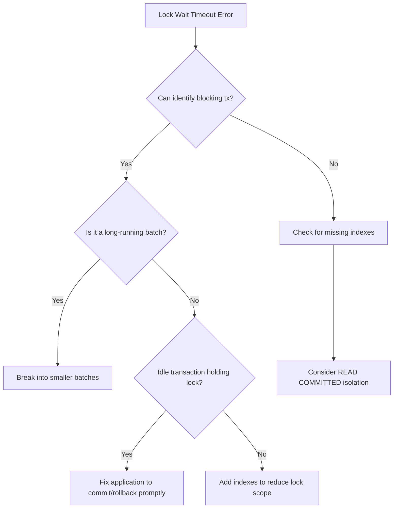

# How to Fix Cloud SQL MySQL InnoDB Lock Wait Timeout Exceeded Errors

Author: [nawazdhandala](https://www.github.com/nawazdhandala)

Tags: GCP, Cloud SQL, MySQL, InnoDB, Locking, Deadlocks, Troubleshooting

Description: How to diagnose and resolve InnoDB lock wait timeout exceeded errors on Cloud SQL MySQL instances, including finding blocking transactions and preventing lock contention.

---

If you have seen "Lock wait timeout exceeded; try restarting transaction" in your MySQL logs, you know it is a frustrating error. It means a transaction has been waiting too long to acquire a lock on a row that another transaction is holding. The default timeout is 50 seconds, and once it is reached, your transaction is rolled back. Let me show you how to track down the blocking transaction and fix the root cause.

## Understanding InnoDB Locks

InnoDB uses row-level locking for transactional operations. When a transaction modifies a row, it acquires an exclusive lock on that row. Other transactions that try to modify or read (with FOR UPDATE) the same row must wait until the lock is released.

The lock wait timeout error occurs when the waiting transaction exceeds `innodb_lock_wait_timeout` seconds without getting the lock.

## Step 1: Find the Current Lock Situation

When the error is happening right now, connect to your Cloud SQL instance and run:

```sql
-- Show all current InnoDB lock waits
SELECT
  r.trx_id AS waiting_trx_id,
  r.trx_mysql_thread_id AS waiting_thread,
  r.trx_query AS waiting_query,
  b.trx_id AS blocking_trx_id,
  b.trx_mysql_thread_id AS blocking_thread,
  b.trx_query AS blocking_query,
  b.trx_started AS blocking_started,
  TIMESTAMPDIFF(SECOND, b.trx_started, NOW()) AS blocking_duration_sec
FROM information_schema.innodb_lock_waits w
JOIN information_schema.innodb_trx b ON w.blocking_trx_id = b.trx_id
JOIN information_schema.innodb_trx r ON w.requesting_trx_id = r.trx_id;
```

For MySQL 8.0 on Cloud SQL, the syntax changed slightly:

```sql
-- MySQL 8.0 - Use performance_schema for lock analysis
SELECT
  r.trx_id AS waiting_trx_id,
  r.trx_mysql_thread_id AS waiting_thread,
  LEFT(r.trx_query, 200) AS waiting_query,
  b.trx_id AS blocking_trx_id,
  b.trx_mysql_thread_id AS blocking_thread,
  LEFT(b.trx_query, 200) AS blocking_query,
  b.trx_started AS blocking_started,
  TIMESTAMPDIFF(SECOND, b.trx_started, NOW()) AS blocking_sec
FROM performance_schema.data_lock_waits w
JOIN information_schema.innodb_trx b ON b.trx_id = w.BLOCKING_ENGINE_TRANSACTION_ID
JOIN information_schema.innodb_trx r ON r.trx_id = w.REQUESTING_ENGINE_TRANSACTION_ID;
```

This tells you exactly which transaction is blocking which, and how long the blocking transaction has been running.

## Step 2: Identify the Blocking Transaction

Once you have the blocking thread ID, get more details:

```sql
-- Get information about the blocking connection
SELECT
  id,
  user,
  host,
  db,
  command,
  time,
  state,
  LEFT(info, 200) AS current_query
FROM information_schema.processlist
WHERE id = <blocking_thread_id>;
```

Common patterns you will find:

1. **Idle connection with open transaction** - the application opened a transaction, did some work, but never committed or rolled back
2. **Long-running UPDATE or DELETE** - a large batch operation holding locks for minutes
3. **Multiple queries in a transaction** - application logic that does too much within a single transaction

## Step 3: Kill the Blocking Transaction (Emergency)

If you need immediate relief, kill the blocking thread:

```sql
-- Kill the blocking thread to release the locks
KILL <blocking_thread_id>;
```

This rolls back the blocking transaction and releases all its locks, allowing the waiting transactions to proceed.

## Step 4: Fix the Root Cause

### Fix 1: Keep Transactions Short

The most common cause is transactions that hold locks for too long.

```python
# Bad: Transaction holds locks while doing slow operations
def process_order(order_id):
    connection.begin()
    cursor.execute("UPDATE orders SET status = 'processing' WHERE id = %s", (order_id,))
    # This external API call takes 5-10 seconds while holding the lock
    result = call_payment_api(order_id)
    cursor.execute("UPDATE orders SET payment_status = %s WHERE id = %s", (result, order_id))
    connection.commit()

# Good: Do slow operations outside the transaction
def process_order(order_id):
    # Do the slow API call first, outside any transaction
    result = call_payment_api(order_id)

    # Then do the database updates in a quick transaction
    connection.begin()
    cursor.execute(
        "UPDATE orders SET status = 'processing', payment_status = %s WHERE id = %s",
        (result, order_id)
    )
    connection.commit()
```

### Fix 2: Break Large Batch Operations Into Chunks

```sql
-- Bad: Update millions of rows in one transaction (holds locks on all of them)
UPDATE orders SET archived = 1 WHERE order_date < '2025-01-01';

-- Good: Process in small batches
-- Run this in a loop until no more rows are affected
UPDATE orders SET archived = 1
WHERE order_date < '2025-01-01' AND archived = 0
LIMIT 1000;
```

Here is a script that batches the operation:

```python
def batch_archive_orders(cutoff_date, batch_size=1000):
    """Archive old orders in small batches to avoid long lock holds."""
    total_updated = 0
    while True:
        cursor.execute(
            "UPDATE orders SET archived = 1 "
            "WHERE order_date < %s AND archived = 0 "
            "LIMIT %s",
            (cutoff_date, batch_size)
        )
        connection.commit()  # Release locks after each batch

        affected = cursor.rowcount
        total_updated += affected
        print(f"Archived {total_updated} orders so far...")

        if affected < batch_size:
            break  # No more rows to process

        # Small delay to let other transactions through
        time.sleep(0.1)
```

### Fix 3: Add Proper Indexes

Without the right index, an UPDATE statement may lock more rows than necessary because MySQL needs to scan more rows to find the ones matching the WHERE clause.

```sql
-- If your UPDATE filters on a column without an index, it may lock extra rows
-- Add an index on the filtered column
CREATE INDEX idx_orders_status ON orders(status);
CREATE INDEX idx_orders_date_archived ON orders(order_date, archived);
```

### Fix 4: Use READ COMMITTED Isolation Level

The default REPEATABLE READ isolation level holds locks longer. If your application does not require repeatable reads, switch to READ COMMITTED:

```sql
-- Set the session isolation level
SET SESSION TRANSACTION ISOLATION LEVEL READ COMMITTED;
```

Or set it globally in Cloud SQL:

```bash
# Change the default transaction isolation level
gcloud sql instances patch my-instance \
    --database-flags=transaction_isolation=READ-COMMITTED \
    --project=my-project
```

### Fix 5: Increase the Lock Wait Timeout

As a temporary measure, you can increase the timeout to give transactions more time:

```bash
# Increase lock wait timeout to 120 seconds (default is 50)
gcloud sql instances patch my-instance \
    --database-flags=innodb_lock_wait_timeout=120 \
    --project=my-project
```

This does not fix the underlying problem but gives more breathing room while you address the root cause.

## Step 5: Monitor Lock Contention

Set up ongoing monitoring to detect lock issues before they become user-facing:

```sql
-- Check the InnoDB status for lock information
SHOW ENGINE INNODB STATUS\G
```

Look for the "LATEST DETECTED DEADLOCK" section and the "TRANSACTIONS" section for lock wait details.

```sql
-- Monitor lock wait metrics
SELECT
  COUNT_STAR AS total_lock_waits,
  SUM_TIMER_WAIT / 1000000000000 AS total_wait_time_sec,
  AVG_TIMER_WAIT / 1000000000000 AS avg_wait_time_sec,
  MAX_TIMER_WAIT / 1000000000000 AS max_wait_time_sec
FROM performance_schema.events_waits_summary_global_by_event_name
WHERE event_name = 'wait/synch/mutex/innodb/lock_mutex';
```

## Decision Guide



Lock wait timeouts are always a symptom of something else - either transactions holding locks too long, missing indexes causing wider-than-necessary locking, or poor application transaction management. Fix the root cause, and the timeouts go away.
