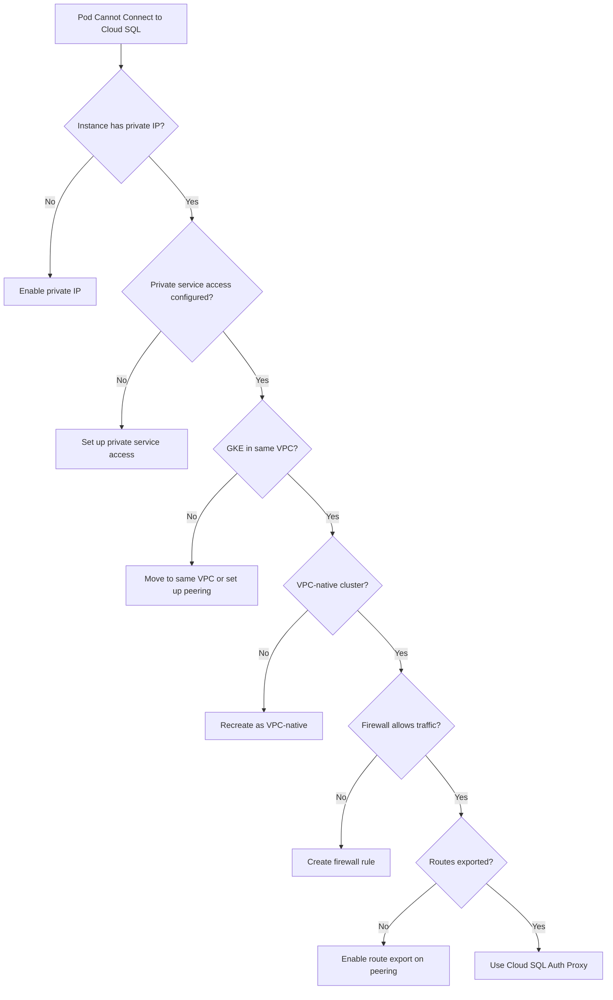

# How to Fix Cloud SQL Private IP Instance Not Accessible from GKE Pods

Author: [nawazdhandala](https://www.github.com/nawazdhandala)

Tags: GCP, Cloud SQL, GKE, Private IP, Networking, VPC, Kubernetes

Description: How to diagnose and fix connectivity issues when GKE pods cannot reach a Cloud SQL instance configured with a private IP address over VPC peering.

---

You have a Cloud SQL instance with a private IP, a GKE cluster in the same project, and your pods cannot connect to the database. The connection just times out. This is one of the most common networking issues in GCP, and it involves understanding how VPC peering, private service access, and GKE networking interact. Let me break down the debugging process.

## The Setup

A typical architecture looks like this:


For this to work, several networking components need to be configured correctly. A failure in any one of them breaks connectivity.

## Step 1: Verify the Cloud SQL Private IP Configuration

First, make sure your Cloud SQL instance actually has a private IP assigned.

```bash
# Check the instance IP addresses
gcloud sql instances describe my-instance \
    --project=my-project \
    --format="json(ipAddresses, settings.ipConfiguration)"
```

You should see an entry with `type: PRIVATE`. If you only see `type: PRIMARY` (public IP), the instance does not have private IP enabled.

To enable private IP:

```bash
# Enable private IP on the Cloud SQL instance
gcloud sql instances patch my-instance \
    --network=projects/my-project/global/networks/my-vpc \
    --project=my-project
```

## Step 2: Verify Private Service Access Is Configured

Cloud SQL private IP works through private service access, which creates a VPC peering connection between your VPC and Google's service producer VPC. This peering must exist.

```bash
# Check for private service access connections
gcloud services vpc-peerings list \
    --network=my-vpc \
    --project=my-project
```

You should see a peering with `servicenetworking.googleapis.com`. If not, set it up:

```bash
# Allocate an IP range for private service access
gcloud compute addresses create google-managed-services-range \
    --global \
    --purpose=VPC_PEERING \
    --prefix-length=16 \
    --network=my-vpc \
    --project=my-project

# Create the private connection
gcloud services vpc-peerings connect \
    --service=servicenetworking.googleapis.com \
    --ranges=google-managed-services-range \
    --network=my-vpc \
    --project=my-project
```

## Step 3: Check GKE Cluster Network Configuration

The GKE cluster must be in the same VPC as the Cloud SQL instance (or a VPC that is peered to it).

```bash
# Check GKE cluster network configuration
gcloud container clusters describe my-cluster \
    --zone=us-central1-a \
    --project=my-project \
    --format="json(network, subnetwork, privateClusterConfig, ipAllocationPolicy)"
```

Critical things to verify:

1. The cluster's `network` matches the VPC where Cloud SQL private service access is configured
2. If the cluster is a VPC-native cluster (which it should be), check the `ipAllocationPolicy`

## Step 4: Check If the GKE Cluster Uses VPC-Native Networking

VPC-native (alias IP) clusters use IP addresses from the VPC subnet for pods, which makes routing to Cloud SQL private IPs work correctly. Legacy clusters (routes-based) may have issues.

```bash
# Check if the cluster is VPC-native
gcloud container clusters describe my-cluster \
    --zone=us-central1-a \
    --format="value(ipAllocationPolicy.useIpAliases)"
```

If this returns `True`, your cluster is VPC-native. If not, you may need to create a new cluster with VPC-native networking enabled.

## Step 5: Test Connectivity from a Pod

Deploy a test pod and try to connect from inside the cluster:

```bash
# Create a debug pod
kubectl run debug-pod --image=busybox --restart=Never -- sleep 3600

# Test TCP connectivity to the Cloud SQL private IP
kubectl exec debug-pod -- nc -zv 10.x.x.x 3306 -w 5
# (replace 10.x.x.x with your Cloud SQL private IP and 3306 with your DB port)
```

If the connection times out, the issue is networking. If it connects but authentication fails, the issue is credentials.

For more detailed network diagnostics:

```bash
# Install a pod with more networking tools
kubectl run nettools --image=nicolaka/netshoot --restart=Never -- sleep 3600

# Test DNS resolution
kubectl exec nettools -- nslookup 10.x.x.x

# Test traceroute to the private IP
kubectl exec nettools -- traceroute -n 10.x.x.x

# Test TCP connection
kubectl exec nettools -- curl -v telnet://10.x.x.x:5432 --connect-timeout 5
```

## Step 6: Check for Firewall Rules Blocking Traffic

VPC firewall rules might be blocking traffic from GKE pod IP ranges to the Cloud SQL private IP.

```bash
# List firewall rules that might affect traffic
gcloud compute firewall-rules list \
    --filter="network=my-vpc" \
    --format="table(name, direction, priority, sourceRanges, destinationRanges, allowed, denied)" \
    --project=my-project
```

The pod IP ranges (secondary ranges from your subnet) need to be allowed. Check what ranges your GKE cluster uses:

```bash
# Get the pod IP range
gcloud container clusters describe my-cluster \
    --zone=us-central1-a \
    --format="value(ipAllocationPolicy.clusterIpv4CidrBlock)"
```

If there is a deny rule or no matching allow rule for this range, create one:

```bash
# Allow traffic from GKE pods to Cloud SQL private IP range
gcloud compute firewall-rules create allow-gke-to-cloudsql \
    --network=my-vpc \
    --allow=tcp:3306,tcp:5432 \
    --source-ranges=10.4.0.0/14 \
    --direction=EGRESS \
    --priority=1000 \
    --project=my-project
```

## Step 7: Check for Missing Route Export

When you use VPC peering for private service access, routes need to be exported so that GKE pod IPs can reach the Cloud SQL network. For VPC-native clusters, this should work automatically. But for private clusters, you need to make sure the peering exports custom routes.

```bash
# Check the VPC peering configuration
gcloud compute networks peerings list \
    --network=my-vpc \
    --project=my-project

# Update peering to export and import custom routes
gcloud compute networks peerings update servicenetworking-googleapis-com \
    --network=my-vpc \
    --export-custom-routes \
    --import-custom-routes \
    --project=my-project
```

## Step 8: Use Cloud SQL Auth Proxy Instead (Recommended)

The recommended approach for connecting GKE pods to Cloud SQL is using the Cloud SQL Auth Proxy as a sidecar container. This avoids many of the networking issues because the proxy handles the connection.

```yaml
# Kubernetes deployment with Cloud SQL Auth Proxy sidecar
apiVersion: apps/v1
kind: Deployment
metadata:
  name: my-app
spec:
  selector:
    matchLabels:
      app: my-app
  template:
    metadata:
      labels:
        app: my-app
    spec:
      serviceAccountName: my-app-sa
      containers:
      - name: my-app
        image: my-app:latest
        env:
        - name: DB_HOST
          # Connect to the proxy via localhost
          value: "127.0.0.1"
        - name: DB_PORT
          value: "5432"
      # Cloud SQL Auth Proxy sidecar
      - name: cloud-sql-proxy
        image: gcr.io/cloud-sql-connectors/cloud-sql-proxy:latest
        args:
          - "--private-ip"
          - "--structured-logs"
          - "my-project:us-central1:my-instance"
        securityContext:
          runAsNonRoot: true
```

The proxy handles private IP routing, authentication, and SSL encryption. It simplifies the networking requirements significantly.

## Debugging Flowchart



The most reliable solution is to use the Cloud SQL Auth Proxy as a sidecar. It handles private IP routing, provides IAM-based authentication, and encrypts connections automatically. Direct private IP connections work too, but they require getting all the networking pieces right, which is where most teams run into trouble.
