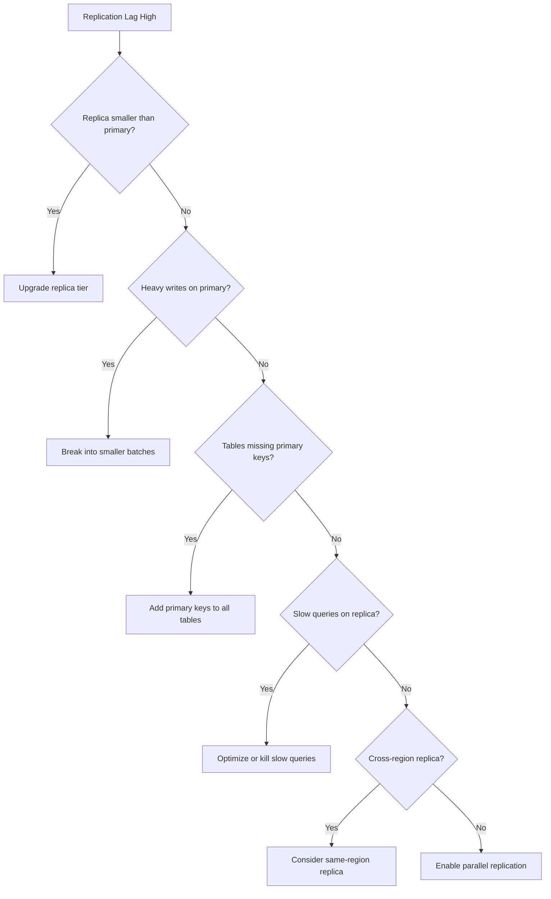

# How to Fix Cloud SQL Replica Replication Lag Exceeding Acceptable Thresholds

Author: [nawazdhandala](https://www.github.com/nawazdhandala)

Tags: GCP, Cloud SQL, Replication, Database, MySQL, PostgreSQL, Performance

Description: How to diagnose and fix Cloud SQL read replica replication lag when it exceeds acceptable thresholds, including common causes and solutions.

---

Replication lag on Cloud SQL read replicas is one of those problems that starts small and gets worse over time. A few seconds of lag might be acceptable for analytics workloads, but once it starts climbing to minutes or hours, your application is reading stale data and you need to act. Here is how to track down the cause and fix it.

## Understanding Replication Lag

Replication lag is the delay between when a write happens on the primary instance and when that write is applied on the read replica. In Cloud SQL, replicas use asynchronous replication by default, which means some lag is expected. The question is how much lag is acceptable for your use case.

## Checking Current Replication Lag

Start by measuring the actual lag.

```bash
# Check replica status and lag using gcloud
gcloud sql instances describe my-replica \
    --project=my-project \
    --format="json(replicaConfiguration, state, settings.databaseFlags)"
```

For MySQL replicas, connect and check directly:

```sql
-- Check replication status on a MySQL replica
SHOW SLAVE STATUS\G

-- Key fields to look at:
-- Seconds_Behind_Master: current lag in seconds
-- Slave_IO_Running: should be Yes
-- Slave_SQL_Running: should be Yes
-- Last_Error: any replication errors
```

For PostgreSQL replicas:

```sql
-- Check replication lag on a PostgreSQL replica
SELECT
  now() - pg_last_xact_replay_timestamp() AS replication_lag,
  pg_is_in_recovery() AS is_replica,
  pg_last_wal_receive_lsn() AS last_received,
  pg_last_wal_replay_lsn() AS last_replayed;
```

## Common Causes of Replication Lag

### 1. Replica Instance Too Small

The most common cause is that the replica does not have enough CPU or memory to keep up with the write volume on the primary.

```bash
# Compare primary and replica instance sizes
gcloud sql instances describe my-primary --format="value(settings.tier)"
gcloud sql instances describe my-replica --format="value(settings.tier)"
```

If the replica is on a smaller tier than the primary, it may not be able to apply changes as fast as they come in.

Fix: upgrade the replica to match or exceed the primary's tier.

```bash
# Upgrade the replica instance tier
gcloud sql instances patch my-replica \
    --tier=db-custom-8-32768 \
    --project=my-project
```

### 2. Heavy Write Workload on Primary

Large batch operations, bulk inserts, or schema changes on the primary generate a flood of changes that the replica has to apply sequentially.

Check for long-running transactions on the primary:

```sql
-- MySQL: Find long-running transactions
SELECT * FROM information_schema.innodb_trx
WHERE trx_started < NOW() - INTERVAL 60 SECOND
ORDER BY trx_started;

-- PostgreSQL: Find long-running transactions
SELECT pid, now() - xact_start AS duration, query, state
FROM pg_stat_activity
WHERE state != 'idle'
  AND xact_start < now() - interval '60 seconds'
ORDER BY duration DESC;
```

### 3. Missing Indexes on Replica

For row-based replication (MySQL default), the replica needs to find and update individual rows. Without proper indexes, every update requires a full table scan on the replica.

```sql
-- MySQL: Check for tables without primary keys (major performance problem for replication)
SELECT t.table_schema, t.table_name
FROM information_schema.tables t
LEFT JOIN information_schema.table_constraints c
  ON t.table_schema = c.table_schema
  AND t.table_name = c.table_name
  AND c.constraint_type = 'PRIMARY KEY'
WHERE t.table_schema NOT IN ('mysql', 'information_schema', 'performance_schema', 'sys')
  AND c.constraint_name IS NULL
  AND t.table_type = 'BASE TABLE';
```

Every table should have a primary key. Tables without primary keys cause the replica to do full table scans for every single UPDATE or DELETE operation.

### 4. Slow Queries Running on the Replica

Read queries running on the replica compete for CPU and I/O resources with the replication process.

```sql
-- MySQL: Check for slow queries on the replica
SELECT * FROM information_schema.processlist
WHERE command != 'Sleep'
  AND time > 30
ORDER BY time DESC;
```

### 5. Network Latency Between Primary and Replica

Cross-region replicas inherently have more latency than same-region replicas.

```bash
# Check the locations of primary and replica
gcloud sql instances describe my-primary --format="value(region)"
gcloud sql instances describe my-replica --format="value(region)"
```

## Fixing the Lag

### Solution 1: Resize the Replica

```bash
# Increase CPU and memory
gcloud sql instances patch my-replica \
    --tier=db-custom-16-65536 \
    --project=my-project

# Increase storage IOPS by switching to SSD if not already
gcloud sql instances patch my-replica \
    --storage-type=SSD \
    --project=my-project
```

### Solution 2: Optimize the Primary Write Patterns

Break large transactions into smaller batches:

```sql
-- Instead of one massive INSERT
-- INSERT INTO events SELECT ... FROM staging_table;

-- Break it into chunks of 10000 rows
INSERT INTO events
SELECT * FROM staging_table
WHERE id BETWEEN 1 AND 10000;

INSERT INTO events
SELECT * FROM staging_table
WHERE id BETWEEN 10001 AND 20000;

-- Continue for each batch...
```

### Solution 3: Add Parallel Replication (MySQL)

MySQL supports parallel replication where multiple threads apply changes concurrently.

```bash
# Enable parallel replication on the replica
gcloud sql instances patch my-replica \
    --database-flags=slave_parallel_workers=8,slave_parallel_type=LOGICAL_CLOCK \
    --project=my-project
```

### Solution 4: Tune PostgreSQL Replication Settings

For PostgreSQL replicas, adjust WAL-related settings:

```bash
# Increase WAL receiver and replay performance
gcloud sql instances patch my-replica \
    --database-flags=max_standby_streaming_delay=30s,wal_receiver_timeout=60s \
    --project=my-project
```

## Setting Up Monitoring and Alerts

Use Cloud Monitoring to alert when replication lag exceeds your threshold.

```bash
# Create an alert for replication lag exceeding 60 seconds
gcloud alpha monitoring policies create \
    --display-name="Cloud SQL Replication Lag Alert" \
    --condition-display-name="Replication lag > 60s" \
    --condition-filter='resource.type="cloudsql_database" AND metric.type="cloudsql.googleapis.com/database/replication/replica_lag"' \
    --condition-threshold-value=60 \
    --condition-threshold-comparison=COMPARISON_GT \
    --duration="300s" \
    --notification-channels=projects/my-project/notificationChannels/12345
```

## Diagnostic Flowchart



Replication lag is almost always caused by the replica not being able to keep up with the primary's write rate. Start by making sure the replica has adequate resources, then look at optimizing the write patterns and replication configuration. With the right setup, you should be able to keep lag under a few seconds even under heavy write loads.
