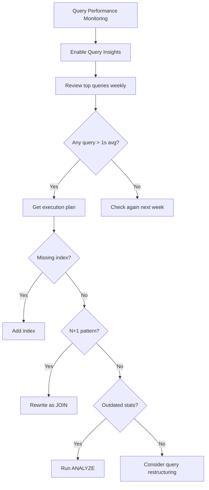

# How to Fix Cloud SQL Slow Queries by Analyzing and Optimizing with Query Insights

Author: [nawazdhandala](https://www.github.com/nawazdhandala)

Tags: GCP, Cloud SQL, Query Insights, Performance, Database Optimization, Monitoring

Description: Learn how to use Cloud SQL Query Insights to identify slow queries, understand their execution patterns, and optimize them for better database performance.

---

Slow database queries are the silent killer of application performance. Users notice, but you might not know which queries are the problem until you start digging. Cloud SQL Query Insights is a built-in tool that makes this investigation much easier by collecting and analyzing query performance data without requiring any changes to your application. Here is how to use it effectively.

## Enabling Query Insights

Query Insights is not enabled by default. Turn it on for your instance:

```bash
# Enable Query Insights with full configuration
gcloud sql instances patch my-instance \
    --insights-config-query-insights-enabled \
    --insights-config-query-string-length=4096 \
    --insights-config-record-application-tags \
    --insights-config-record-client-address \
    --insights-config-query-plans-per-minute=20 \
    --project=my-project
```

The configuration options:
- `query-string-length`: How much of the query text to capture (up to 4500)
- `record-application-tags`: Track which part of your application is generating queries
- `record-client-address`: Track which clients are sending queries
- `query-plans-per-minute`: How many query execution plans to capture per minute

After enabling, wait about 10-15 minutes for data to start appearing.

## Reading the Query Insights Dashboard

Open the Cloud Console, navigate to your Cloud SQL instance, and click on "Query Insights" in the sidebar. The dashboard shows:

1. **Database load by query** - which queries consume the most resources over time
2. **Top queries** - sorted by total execution time, calls, or average latency
3. **Query details** - execution plan, wait events, and performance trends

The most important view is "Database load over time", which shows your total query load broken down by individual queries. Spikes in this graph correspond to performance problems.

## Identifying the Worst Offenders

You can also query the insights data programmatically:

### For PostgreSQL

```sql
-- Enable pg_stat_statements if not already enabled (requires restart)
-- This is typically enabled by default on Cloud SQL

-- Find the top 20 slowest queries by total execution time
SELECT
  LEFT(query, 100) AS query_preview,
  calls,
  ROUND(total_exec_time::numeric, 2) AS total_time_ms,
  ROUND(mean_exec_time::numeric, 2) AS avg_time_ms,
  ROUND(max_exec_time::numeric, 2) AS max_time_ms,
  ROUND(stddev_exec_time::numeric, 2) AS stddev_ms,
  rows
FROM pg_stat_statements
ORDER BY total_exec_time DESC
LIMIT 20;
```

```sql
-- Find queries with the highest average execution time
SELECT
  LEFT(query, 100) AS query_preview,
  calls,
  ROUND(mean_exec_time::numeric, 2) AS avg_time_ms,
  rows / GREATEST(calls, 1) AS avg_rows_per_call,
  ROUND((shared_blks_hit::float / GREATEST(shared_blks_hit + shared_blks_read, 1) * 100)::numeric, 2) AS cache_hit_pct
FROM pg_stat_statements
WHERE calls > 10
ORDER BY mean_exec_time DESC
LIMIT 20;
```

### For MySQL

```sql
-- Use the performance_schema to find slow queries
SELECT
  DIGEST_TEXT AS query_pattern,
  COUNT_STAR AS call_count,
  ROUND(SUM_TIMER_WAIT / 1000000000000, 3) AS total_time_sec,
  ROUND(AVG_TIMER_WAIT / 1000000000000, 3) AS avg_time_sec,
  ROUND(MAX_TIMER_WAIT / 1000000000000, 3) AS max_time_sec,
  SUM_ROWS_EXAMINED AS total_rows_examined,
  SUM_ROWS_SENT AS total_rows_returned
FROM performance_schema.events_statements_summary_by_digest
WHERE DIGEST_TEXT IS NOT NULL
ORDER BY SUM_TIMER_WAIT DESC
LIMIT 20;
```

## Analyzing a Slow Query

Once you have identified a slow query, get its execution plan.

### PostgreSQL Execution Plan

```sql
-- Use EXPLAIN ANALYZE to get the actual execution plan with timing
EXPLAIN (ANALYZE, BUFFERS, FORMAT TEXT)
SELECT
  o.order_id,
  o.order_date,
  c.customer_name,
  SUM(oi.quantity * oi.unit_price) AS total_amount
FROM orders o
JOIN customers c ON o.customer_id = c.id
JOIN order_items oi ON o.order_id = oi.order_id
WHERE o.order_date > '2026-01-01'
  AND c.region = 'US'
GROUP BY o.order_id, o.order_date, c.customer_name
ORDER BY total_amount DESC
LIMIT 100;
```

What to look for in the plan:
- **Seq Scan** on large tables - needs an index
- **Nested Loop** with high row counts - might need a hash join
- **Sort** operations using disk - needs more work_mem or a better index
- Large difference between **estimated rows** and **actual rows** - outdated statistics

### MySQL Execution Plan

```sql
-- Get the execution plan with additional details
EXPLAIN FORMAT=JSON
SELECT
  o.order_id,
  o.order_date,
  c.customer_name,
  SUM(oi.quantity * oi.unit_price) AS total_amount
FROM orders o
JOIN customers c ON o.customer_id = c.id
JOIN order_items oi ON o.order_id = oi.order_id
WHERE o.order_date > '2026-01-01'
  AND c.region = 'US'
GROUP BY o.order_id, o.order_date, c.customer_name
ORDER BY total_amount DESC
LIMIT 100;
```

Red flags in MySQL plans:
- `type: ALL` - full table scan
- `Using filesort` - sorting without index
- `Using temporary` - creating temporary tables
- `rows` much larger than expected

## Common Optimization Patterns

### Pattern 1: Add Missing Indexes

The most common fix for slow queries is adding the right indexes.

```sql
-- PostgreSQL: Create an index for the WHERE clause columns
CREATE INDEX CONCURRENTLY idx_orders_date ON orders(order_date);
CREATE INDEX CONCURRENTLY idx_customers_region ON customers(region);

-- Composite index for queries that filter on multiple columns
CREATE INDEX CONCURRENTLY idx_orders_date_customer
  ON orders(order_date, customer_id);
```

```sql
-- MySQL: Same approach
CREATE INDEX idx_orders_date ON orders(order_date);
CREATE INDEX idx_customers_region ON customers(region);
CREATE INDEX idx_orders_date_customer ON orders(order_date, customer_id);
```

### Pattern 2: Fix N+1 Query Problems

Query Insights often reveals N+1 patterns - a query that runs once for every row in a parent query.

```sql
-- Bad: The application runs this query once per order (N+1 pattern)
-- SELECT * FROM order_items WHERE order_id = ?
-- (executed 1000 times)

-- Good: Fetch all order items in one query with a JOIN
SELECT o.order_id, oi.*
FROM orders o
JOIN order_items oi ON o.order_id = oi.order_id
WHERE o.order_date > '2026-01-01';
```

### Pattern 3: Reduce Rows Scanned

If a query examines millions of rows but returns only a few, it needs better filtering.

```sql
-- Bad: Scans entire table to find a handful of rows
SELECT * FROM events WHERE YEAR(created_at) = 2026 AND MONTH(created_at) = 2;

-- Good: Use range comparison that can use an index
SELECT * FROM events
WHERE created_at >= '2026-02-01' AND created_at < '2026-03-01';
```

### Pattern 4: Update Statistics

Outdated statistics cause the query planner to make bad decisions.

```sql
-- PostgreSQL: Update statistics for a specific table
ANALYZE orders;

-- Update statistics for all tables
ANALYZE;
```

```sql
-- MySQL: Update statistics
ANALYZE TABLE orders;
ANALYZE TABLE customers;
ANALYZE TABLE order_items;
```

## Setting Up Application Tags

Application tags let you trace which part of your code generates each query, making it much easier to find and fix problems.

For PostgreSQL with SQLAlchemy:

```python
from sqlalchemy import event

@event.listens_for(engine, "before_cursor_execute")
def add_application_tag(conn, cursor, statement, parameters, context, executemany):
    # Add a SQL comment that Query Insights will capture as an application tag
    cursor.execute(f"/* application=order_service,action=get_orders */ {statement}", parameters)
```

## Continuous Monitoring



Query Insights gives you visibility that you used to need third-party tools for. Make it a habit to review the top queries at least weekly, and fix the worst offenders before they become user-facing problems. A single well-placed index can turn a 30-second query into a 50-millisecond query.
