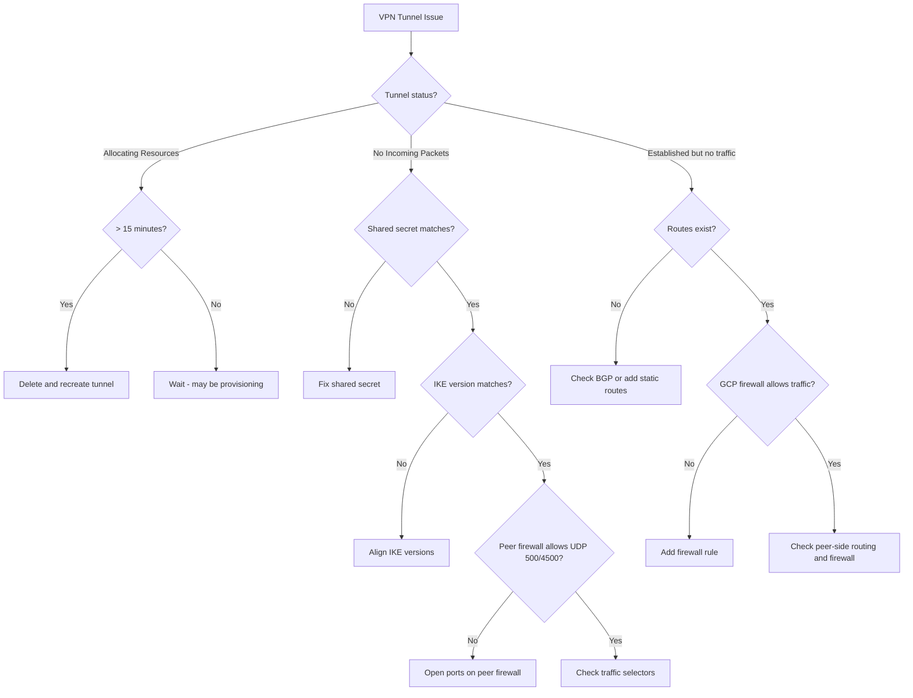

# How to Fix Cloud VPN Tunnel Status Stuck in Allocating Resources or No Incoming Packets

Author: [nawazdhandala](https://www.github.com/nawazdhandala)

Tags: GCP, Cloud VPN, VPN Tunnel, IPsec, Networking, Troubleshooting

Description: How to diagnose and fix Cloud VPN tunnel issues when the tunnel is stuck in allocating resources state or shows no incoming packets despite being established.

---

Setting up a Cloud VPN tunnel should be straightforward, but sometimes the tunnel gets stuck in an intermediate state. Either it sits at "Allocating Resources" forever, or it shows as "Established" but no traffic flows. Both situations leave you without connectivity. Let me walk through how to diagnose and fix each scenario.

## Understanding VPN Tunnel States

A Cloud VPN tunnel goes through these states:

1. **PROVISIONING** - GCP is setting up the tunnel resources
2. **WAITING_FOR_FULL_CONFIG** - waiting for the peer to be configured
3. **FIRST_HANDSHAKE** - attempting the initial IKE handshake
4. **ESTABLISHED** - tunnel is up and running
5. **NO_INCOMING_PACKETS** - tunnel configuration exists but no traffic from the peer

The problem states are when the tunnel is stuck in PROVISIONING (allocating resources) for more than 10 minutes, or when it shows ESTABLISHED/NO_INCOMING_PACKETS but traffic does not flow.

## Step 1: Check the Tunnel Status

```bash
# Check VPN tunnel status
gcloud compute vpn-tunnels describe my-vpn-tunnel \
    --region=us-central1 \
    --project=my-project \
    --format="json(status, detailedStatus, peerIp, sharedSecret, ikeVersion, localTrafficSelector, remoteTrafficSelector)"
```

```bash
# List all VPN tunnels and their statuses
gcloud compute vpn-tunnels list \
    --project=my-project \
    --format="table(name, region, status, detailedStatus, peerIp)"
```

The `detailedStatus` field often contains the actual error message.

## Fixing "Allocating Resources" (Stuck Provisioning)

If the tunnel has been in provisioning for more than 15 minutes:

### Check 1: VPN Gateway Is Ready

```bash
# For HA VPN, check the gateway status
gcloud compute vpn-gateways describe my-vpn-gateway \
    --region=us-central1 \
    --project=my-project \
    --format="json(vpnInterfaces)"
```

Each VPN interface should have an IP address assigned. If the interfaces are empty, the gateway is not ready.

### Check 2: Peer IP Is Reachable

The peer IP must be a public IP that Google can reach:

```bash
# From Cloud Shell, try to reach the peer IP
# Note: ICMP might be blocked, so a timeout does not necessarily mean unreachable
ping -c 3 <peer-public-ip>

# Check if the peer IP is configured correctly
gcloud compute vpn-tunnels describe my-vpn-tunnel \
    --region=us-central1 \
    --format="value(peerIp)" \
    --project=my-project
```

### Check 3: Delete and Recreate the Tunnel

Sometimes the tunnel gets stuck during creation due to transient issues. Delete it and try again.

```bash
# Delete the stuck tunnel
gcloud compute vpn-tunnels delete my-vpn-tunnel \
    --region=us-central1 \
    --project=my-project

# Recreate it
gcloud compute vpn-tunnels create my-vpn-tunnel \
    --region=us-central1 \
    --vpn-gateway=my-vpn-gateway \
    --interface=0 \
    --peer-gcp-gateway=peer-vpn-gateway \
    --shared-secret=my-shared-secret \
    --ike-version=2 \
    --project=my-project
```

## Fixing "No Incoming Packets"

This means the tunnel exists but the peer is not sending any IKE packets. This is almost always a configuration mismatch between the two sides.

### Check 1: Shared Secret Matches

The most common cause is a mismatched pre-shared key.

```bash
# View the shared secret (you will need to compare with the peer config)
gcloud compute vpn-tunnels describe my-vpn-tunnel \
    --region=us-central1 \
    --format="value(sharedSecret)" \
    --project=my-project
```

Make sure this exact value (case-sensitive) is configured on the peer device.

### Check 2: IKE Version Matches

Both sides must use the same IKE version.

```bash
# Check which IKE version is configured
gcloud compute vpn-tunnels describe my-vpn-tunnel \
    --region=us-central1 \
    --format="value(ikeVersion)" \
    --project=my-project
```

If the peer uses IKE v1 and your tunnel is configured for IKE v2 (or vice versa), the handshake will fail.

```bash
# Update the IKE version
gcloud compute vpn-tunnels delete my-vpn-tunnel \
    --region=us-central1 \
    --project=my-project

gcloud compute vpn-tunnels create my-vpn-tunnel \
    --region=us-central1 \
    --vpn-gateway=my-vpn-gateway \
    --interface=0 \
    --peer-gcp-gateway=peer-vpn-gateway \
    --shared-secret=my-shared-secret \
    --ike-version=1 \
    --project=my-project
```

### Check 3: Peer Firewall Allows IKE and ESP

The peer firewall (not GCP firewall) must allow:
- UDP port 500 (IKE)
- UDP port 4500 (NAT-T)
- IP protocol 50 (ESP)

These must be allowed both inbound and outbound on the peer device.

### Check 4: Traffic Selectors Match

For Classic VPN (policy-based), the local and remote traffic selectors must match.

```bash
# Check traffic selectors on the GCP side
gcloud compute vpn-tunnels describe my-vpn-tunnel \
    --region=us-central1 \
    --format="json(localTrafficSelector, remoteTrafficSelector)" \
    --project=my-project
```

The GCP `localTrafficSelector` must match the peer's `remoteTrafficSelector`, and vice versa. A mismatch causes Phase 2 negotiation to fail.

### Check 5: NAT Is Not Interfering

If the peer VPN device is behind a NAT, it can cause issues with IKE negotiation. Make sure NAT-T (NAT Traversal) is enabled on the peer device.

## Fixing "Established But No Traffic"

The tunnel shows ESTABLISHED but pings and traffic between the networks fail.

### Check 1: Routes Exist

```bash
# Check if routes to the remote network exist
gcloud compute routes list \
    --filter="network=my-vpc" \
    --format="table(name, destRange, nextHopVpnTunnel, priority)" \
    --project=my-project
```

For HA VPN with Cloud Router (BGP), check if routes are being learned:

```bash
# Check BGP session status
gcloud compute routers get-status my-cloud-router \
    --region=us-central1 \
    --project=my-project \
    --format="json(result.bgpPeerStatus)"
```

If BGP sessions are not established:

```bash
# Check the Cloud Router BGP configuration
gcloud compute routers describe my-cloud-router \
    --region=us-central1 \
    --project=my-project \
    --format="json(bgp, bgpPeers)"
```

Verify:
- The BGP ASN on both sides is correct
- The BGP peer IP addresses match
- The link-local IP ranges (/30 subnets) are correct

### Check 2: Firewall Rules Allow VPN Traffic

GCP firewall rules must allow traffic from the remote network:

```bash
# Check for firewall rules allowing traffic from the remote subnet
gcloud compute firewall-rules list \
    --filter="network=my-vpc" \
    --format="table(name, sourceRanges, allowed)" \
    --project=my-project | grep "10.1.0.0"
```

If no rule allows the remote subnet:

```bash
# Create a firewall rule to allow traffic from the VPN peer network
gcloud compute firewall-rules create allow-vpn-traffic \
    --network=my-vpc \
    --direction=INGRESS \
    --action=ALLOW \
    --rules=all \
    --source-ranges=10.1.0.0/24 \
    --project=my-project
```

### Check 3: Test Connectivity

```bash
# From a GCP instance, ping an instance on the remote side
ping -c 5 10.1.0.10

# If ICMP is blocked, try a TCP test
nc -zv 10.1.0.10 22 -w 5
```

## Monitoring VPN Tunnels

```bash
# Set up monitoring for tunnel status changes
gcloud monitoring time-series list \
    --filter='resource.type="vpn_gateway" AND metric.type="compute.googleapis.com/vpn/tunnel_established"' \
    --interval-start-time=$(date -u -v-1H +%Y-%m-%dT%H:%M:%SZ) \
    --project=my-project

# Check packets sent and received
gcloud monitoring time-series list \
    --filter='resource.type="vpn_gateway" AND metric.type="compute.googleapis.com/vpn/received_bytes_count"' \
    --interval-start-time=$(date -u -v-1H +%Y-%m-%dT%H:%M:%SZ) \
    --project=my-project
```

## Debugging Flowchart



## Key Takeaways

- If stuck in allocating resources for more than 15 minutes, delete and recreate
- "No incoming packets" is almost always a configuration mismatch (shared secret, IKE version, or peer firewall)
- "Established but no traffic" is usually missing routes or firewall rules
- For HA VPN with BGP, verify the BGP session is established and routes are being advertised
- Always test connectivity from both sides when troubleshooting
- Use Cloud VPN logs in Cloud Logging for detailed handshake failure messages

VPN troubleshooting is methodical - check the shared secret, IKE version, peer firewall, traffic selectors, routes, and GCP firewall rules. One of those six things is almost always the problem.
