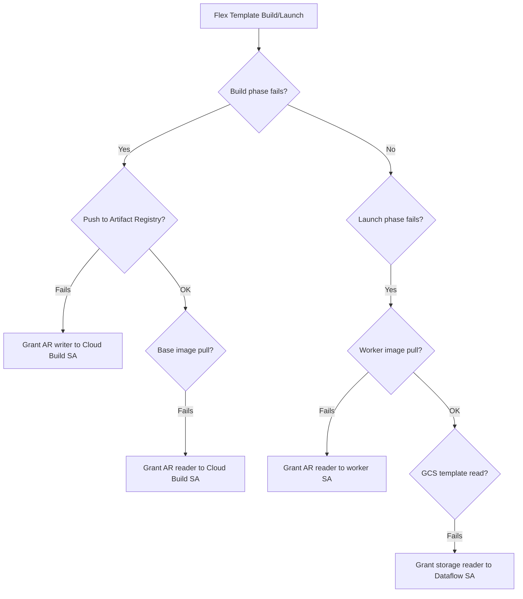

# How to Fix Dataflow Flex Template Build Failing with Container Image Permission Errors

Author: [nawazdhandala](https://www.github.com/nawazdhandala)

Tags: GCP, Dataflow, Flex Template, Container Registry, Google Cloud

Description: Resolve container image permission errors when building and launching Google Cloud Dataflow Flex Templates that fail to pull or push images.

---

Dataflow Flex Templates package your pipeline code into a Docker container, giving you full control over the runtime environment. But the build and launch process involves several container image operations (building, pushing, pulling) across different services, and permission errors at any step can block the whole thing. The error messages are not always clear about which step failed or which service account needs which permission.

## How Flex Template Builds Work

When you build a Flex Template, these steps happen:

1. Cloud Build builds a Docker image from your code
2. The image is pushed to Artifact Registry (or Container Registry)
3. A template spec file is written to GCS
4. When you launch the template, Dataflow pulls the image to run on workers

Different service accounts are involved at each step, and each needs specific permissions.

## Step 1: Identify Which Step Is Failing

Check the build logs to find the exact failure point:

```bash
# List recent Cloud Build builds
gcloud builds list --limit=5 --format="table(id, status, createTime)"

# Check the logs of a specific build
gcloud builds log BUILD_ID
```

The error will be in one of these categories:
- Permission to push to Artifact Registry
- Permission to pull base images
- Permission to read from or write to GCS
- Permission for Dataflow workers to pull the template image

## Step 2: Fix Cloud Build Service Account Permissions

Cloud Build uses a service account to execute builds. By default, it uses `PROJECT_NUMBER@cloudbuild.gserviceaccount.com`. This account needs permission to push images to Artifact Registry.

```bash
# Check the Cloud Build service account's permissions
gcloud projects get-iam-policy YOUR_PROJECT \
    --flatten="bindings[].members" \
    --filter="bindings.members:cloudbuild.gserviceaccount.com" \
    --format="table(bindings.role)"
```

If the `roles/artifactregistry.writer` role is missing, grant it:

```bash
# Grant Artifact Registry Writer to Cloud Build SA
gcloud projects add-iam-policy-binding YOUR_PROJECT \
    --member="serviceAccount:PROJECT_NUMBER@cloudbuild.gserviceaccount.com" \
    --role="roles/artifactregistry.writer"
```

Also make sure the Cloud Build SA has storage permissions for the GCS bucket where the template spec is stored:

```bash
# Grant Storage Object Creator for the template bucket
gcloud projects add-iam-policy-binding YOUR_PROJECT \
    --member="serviceAccount:PROJECT_NUMBER@cloudbuild.gserviceaccount.com" \
    --role="roles/storage.objectCreator"
```

## Step 3: Fix Artifact Registry Repository Permissions

If you are using a specific Artifact Registry repository (not just the project-level default), the service account needs permissions on that repository:

```bash
# Check the repository's IAM policy
gcloud artifacts repositories get-iam-policy your-repo \
    --location=us-central1 \
    --format="json(bindings)"

# Grant writer access on the specific repository
gcloud artifacts repositories add-iam-policy-binding your-repo \
    --location=us-central1 \
    --member="serviceAccount:PROJECT_NUMBER@cloudbuild.gserviceaccount.com" \
    --role="roles/artifactregistry.writer"
```

## Step 4: Fix Dataflow Worker Image Pull Permissions

When you launch the Flex Template, Dataflow workers need to pull the container image. The Dataflow service account needs read access to the Artifact Registry repository.

The Dataflow service agent is `service-PROJECT_NUMBER@dataflow-service-producer-prod.iam.gserviceaccount.com`. The Compute Engine default SA (used by workers) is `PROJECT_NUMBER-compute@developer.gserviceaccount.com`.

```bash
# Grant Artifact Registry Reader to the Compute Engine default SA
gcloud projects add-iam-policy-binding YOUR_PROJECT \
    --member="serviceAccount:PROJECT_NUMBER-compute@developer.gserviceaccount.com" \
    --role="roles/artifactregistry.reader"

# If using a custom worker service account, grant it too
gcloud projects add-iam-policy-binding YOUR_PROJECT \
    --member="serviceAccount:your-custom-worker-sa@YOUR_PROJECT.iam.gserviceaccount.com" \
    --role="roles/artifactregistry.reader"
```

## Step 5: Handle Cross-Project Image References

If your Flex Template image is in a different project than where you are running the Dataflow job, you need cross-project permissions:

```bash
# Grant read access on the image project to the worker SA from the job project
gcloud projects add-iam-policy-binding IMAGE_PROJECT \
    --member="serviceAccount:JOB_PROJECT_NUMBER-compute@developer.gserviceaccount.com" \
    --role="roles/artifactregistry.reader"
```

Similarly, if Cloud Build runs in a different project than the Artifact Registry, grant cross-project write access.

## Step 6: Verify the Image Path

A surprisingly common issue is an incorrect image path in the template spec. The path must match exactly:

```bash
# Check the template spec file
gsutil cat gs://your-bucket/templates/your-template.json
```

The `image` field should look like:

```json
{
    "image": "us-central1-docker.pkg.dev/your-project/your-repo/your-image:latest",
    "sdkInfo": {
        "language": "PYTHON"
    }
}
```

Make sure:
- The region in the image path matches the Artifact Registry location
- The repository name is correct
- The image tag exists

Verify the image exists:

```bash
# List images in the repository
gcloud artifacts docker images list \
    us-central1-docker.pkg.dev/your-project/your-repo \
    --format="table(package, version, createTime)"

# Check if a specific tag exists
gcloud artifacts docker tags list \
    us-central1-docker.pkg.dev/your-project/your-repo/your-image
```

## Step 7: Fix Dockerfile Issues

If the build fails during the Docker build step (not the push step), check your Dockerfile for issues:

```dockerfile
# Example Flex Template Dockerfile for Python
FROM gcr.io/dataflow-templates-base/python311-template-launcher-base:latest

# Set environment variables
ENV FLEX_TEMPLATE_PYTHON_PY_FILE="/template/pipeline.py"
ENV FLEX_TEMPLATE_PYTHON_REQUIREMENTS_FILE="/template/requirements.txt"

# Copy the pipeline code and requirements
COPY requirements.txt /template/
COPY pipeline.py /template/

# Install dependencies
RUN pip install --no-cache-dir -r /template/requirements.txt
```

Common Dockerfile issues:
- Using an incorrect base image
- Missing the `FLEX_TEMPLATE_PYTHON_PY_FILE` environment variable
- Dependencies that fail to install

For Java Flex Templates:

```dockerfile
# Example Flex Template Dockerfile for Java
FROM gcr.io/dataflow-templates-base/java11-template-launcher-base:latest

# Set the main class
ENV FLEX_TEMPLATE_JAVA_MAIN_CLASS="com.example.MyPipeline"
ENV FLEX_TEMPLATE_JAVA_CLASSPATH="/template/pipeline.jar"

# Copy the pipeline JAR
COPY target/pipeline-bundled.jar /template/pipeline.jar
```

## Step 8: Build and Launch with Correct Flags

Here is the complete build and launch sequence with the correct permissions:

```bash
# Step 1: Build the Flex Template
gcloud dataflow flex-template build \
    gs://your-bucket/templates/your-template.json \
    --image-gcr-path=us-central1-docker.pkg.dev/your-project/your-repo/your-image:latest \
    --sdk-language=PYTHON \
    --flex-template-base-image=PYTHON3 \
    --py-path=pipeline.py \
    --env=FLEX_TEMPLATE_PYTHON_PY_FILE=pipeline.py \
    --metadata-file=metadata.json

# Step 2: Launch the Flex Template
gcloud dataflow flex-template run your-job \
    --template-file-gcs-location=gs://your-bucket/templates/your-template.json \
    --region=us-central1 \
    --service-account-email=your-worker-sa@your-project.iam.gserviceaccount.com \
    --parameters input_topic=projects/your-project/topics/your-topic \
    --parameters output_table=your-project:dataset.table
```

## Permission Checklist



## Monitoring Flex Template Builds

Use [OneUptime](https://oneuptime.com) to monitor Cloud Build status and Dataflow job launches. Getting alerted on build failures helps you fix permission issues quickly, especially in CI/CD pipelines where Flex Templates are built and deployed automatically.

The core issue with Flex Template permissions is that multiple service accounts are involved at different stages. Map out which service account does what, grant the minimum necessary permissions to each, and you will avoid most of these errors.
