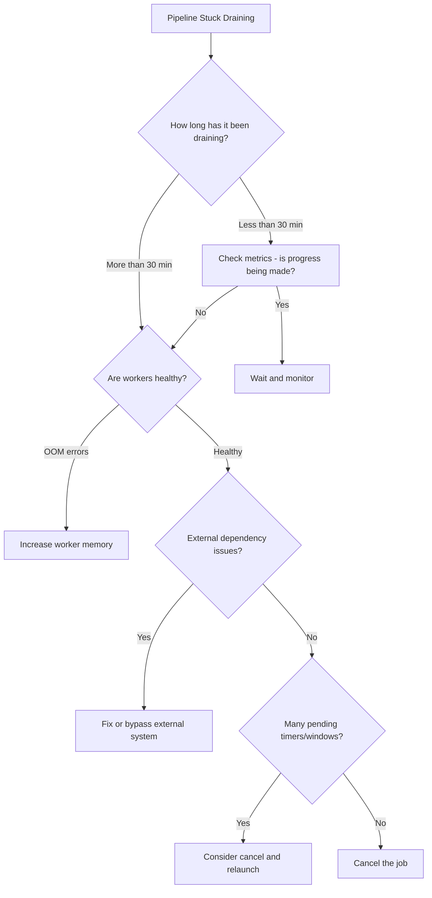

# How to Fix Dataflow Pipeline Stuck at Draining State and Not Processing Elements

Author: [nawazdhandala](https://www.github.com/nawazdhandala)

Tags: GCP, Dataflow, Apache Beam, Data Pipeline, Google Cloud

Description: Troubleshoot and resolve Google Cloud Dataflow pipelines that get stuck in the draining state and stop processing elements during shutdown.

---

When you drain a Dataflow pipeline, you expect it to finish processing in-flight elements, write results, and shut down gracefully. But sometimes the pipeline gets stuck in the "Draining" state for hours or even indefinitely. Workers stop processing, the watermark does not advance, and the job just sits there consuming resources without making progress. This is a common problem, especially with streaming pipelines that have complex windowing or external dependencies.

## What Happens During Draining

When you issue a drain command, Dataflow does the following:

1. Stops reading from input sources (Pub/Sub, Kafka, etc.)
2. Processes all elements currently in the pipeline
3. Fires all pending timers and windows
4. Writes results to sinks
5. Shuts down workers

The pipeline transitions from RUNNING to DRAINING and finally to DRAINED. If step 2, 3, or 4 gets stuck, the pipeline stays in DRAINING forever.

## Step 1: Check the Job Status and Diagnostics

Start by looking at the job details:

```bash
# Get the current job status and any diagnostic messages
gcloud dataflow jobs describe JOB_ID \
    --region=us-central1 \
    --format="json(currentState, currentStateTime, stageStates)"
```

Check the Dataflow monitoring UI for stuck stages. Look at the "Wall Time" column - stages with high wall time relative to their element count might be the bottleneck.

## Step 2: Look for Stuck Timers

In streaming pipelines, timers fire when windows close. If you have sessions or custom windows with very long timeouts, draining triggers all pending timers at once. This can overwhelm the workers.

For example, if you have session windows with a 24-hour gap duration, draining fires every active session timer immediately. With millions of active sessions, this creates a massive burst of work.

Check your pipeline code for timer usage:

```java
// Example: Session window with long gap duration - can cause drain issues
PCollection<KV<String, Event>> windowed = events
    .apply(Window.<KV<String, Event>>into(
        Sessions.withGapDuration(Duration.standardHours(24)))  // Long sessions!
    .triggering(AfterWatermark.pastEndOfWindow())
    .withAllowedLateness(Duration.standardHours(1))
    .discardingFiredPanes());
```

If this is the issue, consider reducing the session gap duration or using a different windowing strategy that does not accumulate as many pending timers.

## Step 3: Check for External Dependency Blocks

If your pipeline writes to an external system (Cloud SQL, BigQuery, external API) during the drain phase, and that system is slow or unresponsive, the pipeline will stall.

Check the logs for timeout or connection errors:

```bash
# Search Dataflow worker logs for errors during drain
gcloud logging read 'resource.type="dataflow_step" AND resource.labels.job_id="JOB_ID" AND severity>=WARNING AND timestamp>="2026-02-17T00:00:00Z"' \
    --limit=50 \
    --format="table(timestamp, textPayload)"
```

Common external blocks:
- BigQuery streaming insert buffering
- Cloud SQL connection pool exhaustion
- External API rate limiting
- Pub/Sub acknowledgment delays

## Step 4: Check Worker Health

Sometimes workers themselves are unhealthy during drain:

```bash
# Check worker logs for OOM or other critical errors
gcloud logging read 'resource.type="dataflow_step" AND resource.labels.job_id="JOB_ID" AND (textPayload:"OutOfMemoryError" OR textPayload:"SIGKILL" OR textPayload:"worker failed")' \
    --limit=20 \
    --format="table(timestamp, textPayload)"
```

If workers are running out of memory during drain, the increased load from processing pending timers and windows can push them over the limit. The workers crash, Dataflow restarts them, they crash again, and the drain never completes.

## Step 5: Force Cancel if Drain is Truly Stuck

If the drain has been stuck for an unreasonable amount of time and you have verified it is not making progress, you can cancel the job instead:

```bash
# Cancel the stuck draining job
gcloud dataflow jobs cancel JOB_ID \
    --region=us-central1
```

Canceling is a hard stop. Unlike drain, it does not wait for in-flight elements to complete. You may lose some data, so use this as a last resort.

If even cancel does not work (which is rare), you might need to contact Google Cloud support.

## Step 6: Prevent Drain Issues in Future Pipelines

There are several design patterns that help avoid drain getting stuck.

Use bounded side inputs carefully. If your pipeline has a side input that refreshes periodically, make sure the refresh mechanism completes quickly during drain:

```python
# Python Beam example: Use a flag to skip heavy operations during drain
class MyDoFn(beam.DoFn):
    def setup(self):
        self.is_healthy = True

    def process(self, element):
        # Process the element
        try:
            result = self.call_external_service(element)
            yield result
        except TimeoutError:
            # Log and skip rather than blocking during drain
            logging.warning("External service timeout, skipping element")
            yield element  # Pass through or handle gracefully

    def call_external_service(self, element):
        # Use reasonable timeouts to prevent blocking
        response = requests.post(
            "https://api.example.com/process",
            json=element,
            timeout=10  # 10-second timeout prevents indefinite blocking
        )
        return response.json()
```

Set reasonable watermark idle timeouts. If your sources can be idle, configure the watermark to advance even without input:

```java
// Set watermark idle to prevent watermark from getting stuck
PipelineOptions options = PipelineOptionsFactory.create();
options.as(DataflowPipelineOptions.class)
    .setWatermarkIdleTimeout(Duration.standardMinutes(2));
```

## Step 7: Monitor Drain Progress

During a drain, watch these metrics to gauge progress:

```bash
# Monitor the job's element count during drain
gcloud dataflow metrics list JOB_ID \
    --region=us-central1 \
    --source=user \
    --format="table(name.name, scalar.integerValue)"
```

Key indicators:
- Elements processed should be increasing (even slowly)
- Watermark should be advancing toward the end of time
- System lag should be decreasing

If none of these metrics are changing, the drain is stuck.

## Step 8: Use Update Instead of Drain When Possible

If you are replacing a pipeline with an updated version, consider using the update command instead of drain and then launch. Update preserves the pipeline state and is often smoother:

```bash
# Update a running pipeline with a new version
gcloud dataflow jobs run updated-pipeline \
    --gcs-location=gs://your-bucket/templates/your-template \
    --region=us-central1 \
    --update \
    --transform-name-mapping='{"OldTransform":"NewTransform"}'
```

This skips the drain phase entirely by migrating state from the old pipeline to the new one.

## Debugging Flowchart



## Monitoring Pipeline Health

Use [OneUptime](https://oneuptime.com) to monitor your Dataflow pipelines continuously. Set up alerts for pipeline state changes, stuck watermarks, and increasing system lag. Catching drain issues early gives you more options for resolution before they become critical.

The best way to handle drain issues is to design your pipeline with graceful shutdown in mind from the start. Use reasonable timeouts, avoid unbounded external calls, and keep your windowing strategy manageable.
