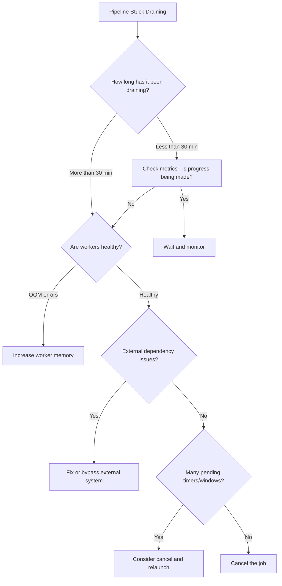

# How to Fix Dataflow Pipeline Stuck at Draining State and Not Processing Elements

Author: [nawazdhandala](https://www.github.com/nawazdhandala)

Tags: GCP, Dataflow, Apache Beam, Data Pipeline, Google Cloud

Description: Troubleshoot and resolve Google Cloud Dataflow pipelines that get stuck in the draining state and stop processing elements during shutdown.

---

When you drain a Dataflow pipeline, you expect it to finish processing in-flight elements, write results, and shut down gracefully. But sometimes the pipeline gets stuck in the "Draining" state for hours or even indefinitely. Workers stop processing, the watermark does not advance, and the job just sits there consuming resources without making progress. This is a common problem, especially with streaming pipelines that have complex windowing or external dependencies.

## What Happens During Draining

When you issue a drain command, Dataflow does the following:

1. Stops reading from input sources (Pub/Sub, Kafka, etc.)
2. Processes all elements currently in the pipeline
3. Advances the data watermark to infinity, which closes in-process windows and fires triggers
4. Writes results to sinks
5. Shuts down workers

The pipeline transitions from RUNNING to DRAINING and finally to DRAINED. If step 2, 3, or 4 gets stuck, the pipeline stays in DRAINING forever.

## Step 1: Check the Job Status and Diagnostics

Start by looking at the job details:

```bash
# Get the current job status and any diagnostic messages

gcloud dataflow jobs describe JOB_ID \
    --region=us-central1 \
    --full \
    --format="json(currentState, currentStateTime, stageStates)"
```

Check the Dataflow monitoring UI for stuck stages. Look at the "Wall Time" column - stages with high wall time relative to their element count might be the bottleneck.

## Step 2: Look for Stuck Timers

In streaming pipelines, event-time triggers fire when windows close. Dataflow advances the data watermark to infinity during drain, so open windows close immediately. Processing-time timers are different: Dataflow waits until all processing-time timers complete instead of firing them immediately. Looping timers can make a drain slow or prevent it from finishing.

For example, if you have session windows with a 24-hour gap duration, draining can close many active sessions and fire their triggers at once. With millions of active sessions, this creates a massive burst of work.

Check your pipeline code for timer usage:

```java
// Example: Session window with long gap duration - can cause drain issues
PCollection<KV<String, Event>> windowed = events
    .apply(Window.<KV<String, Event>>into(
        Sessions.withGapDuration(Duration.standardHours(24)))  // Long sessions!
    .triggering(AfterWatermark.pastEndOfWindow())
    .withAllowedLateness(Duration.standardHours(1))
    .discardingFiredPanes());
```

If this is the issue, consider reducing the session gap duration or using a different windowing strategy that does not accumulate as many pending timers.

## Step 3: Check for External Dependency Blocks

If your pipeline writes to an external system (Cloud SQL, BigQuery, external API) during the drain phase, and that system is slow or unresponsive, the pipeline will stall.

Check the logs for timeout or connection errors:

```bash
# Search Dataflow worker logs for errors during drain
gcloud logging read 'resource.type="dataflow_step" AND resource.labels.job_id="JOB_ID" AND severity>=WARNING AND timestamp>="2026-02-17T00:00:00Z"' \
    --limit=50 \
    --format="table(timestamp, textPayload)"
```

Common external blocks:
- BigQuery streaming insert buffering
- Cloud SQL connection pool exhaustion
- External API rate limiting
- Pub/Sub acknowledgment delays

## Step 4: Check Worker Health

Sometimes workers themselves are unhealthy during drain:

```bash
# Check worker logs for OOM or other critical errors
gcloud logging read 'resource.type="dataflow_step" AND resource.labels.job_id="JOB_ID" AND (textPayload:"OutOfMemoryError" OR textPayload:"SIGKILL" OR textPayload:"worker failed")' \
    --limit=20 \
    --format="table(timestamp, textPayload)"
```

If workers are running out of memory during drain, the increased load from processing pending timers and windows can push them over the limit. The workers crash, Dataflow restarts them, they crash again, and the drain never completes.

## Step 5: Cancel if Drain is Truly Stuck

If the drain has been stuck for an unreasonable amount of time and you have verified it is not making progress, you can cancel the job instead:

```bash
# Cancel the stuck draining job
gcloud dataflow jobs cancel JOB_ID \
    --region=us-central1
```

Canceling is a hard stop. Unlike drain, it does not wait for in-flight elements to complete. You may lose some data, so use this as a last resort.

If even a regular cancel does not work, Dataflow also supports force cancel:

```bash
# Force cancel a job that is stuck canceling
gcloud dataflow jobs cancel JOB_ID \
    --region=us-central1 \
    --force
```

Force cancel is intended only for jobs that are stuck in the regular canceling process. Google Cloud recommends attempting a regular cancel at least 30 minutes before force canceling because force cancel can leave worker resources behind. If force cancel does not resolve the job, contact Google Cloud support.

## Step 6: Prevent Drain Issues in Future Pipelines

There are several design patterns that help avoid drain getting stuck.

Use bounded side inputs carefully. If your pipeline has a side input that refreshes periodically, make sure the refresh mechanism completes quickly during drain:

```python
# Python Beam example: Use a flag to skip heavy operations during drain
class MyDoFn(beam.DoFn):
    def setup(self):
        self.is_healthy = True

    def process(self, element):
        # Process the element
        try:
            result = self.call_external_service(element)
            yield result
        except TimeoutError:
            # Log and skip rather than blocking during drain
            logging.warning("External service timeout, skipping element")
            yield element  # Pass through or handle gracefully

    def call_external_service(self, element):
        # Use reasonable timeouts to prevent blocking
        response = requests.post(
            "https://api.example.com/process",
            json=element,
            timeout=10  # 10-second timeout prevents indefinite blocking
        )
        return response.json()
```

Review idle sources that can hold back watermarks. Dataflow advances the watermark to infinity during drain, but a pipeline that is already stuck before the drain request can remain stuck if data movement is blocked. Look for idle or blocked sources, slow transforms, looping timers, or unbounded external calls and fix those conditions in the pipeline code.

There is no general `DataflowPipelineOptions.setWatermarkIdleTimeout(...)` option in the Beam Dataflow runner. Watermark behavior is controlled by the source, event timestamps, windows, triggers, timers, and whether downstream processing can make progress.

## Step 7: Monitor Drain Progress

During a drain, watch these metrics to gauge progress:

```bash
# Monitor the job's element count during drain
gcloud dataflow metrics list JOB_ID \
    --region=us-central1 \
    --source=service \
    --format="table(name.name, scalar)"
```

Key indicators:
- Elements processed should be increasing (even slowly)
- Watermark should be advancing toward the end of time
- System lag should be decreasing

If none of these metrics are changing, the drain is stuck.

## Step 8: Use Update Instead of Drain When Possible

If you are replacing a pipeline with an updated version, consider using the update command instead of drain and then launch. Update preserves the pipeline state and is often smoother:

```bash
# Update a running pipeline with a new version
gcloud dataflow jobs run updated-pipeline \
    --gcs-location=gs://your-bucket/templates/your-template \
    --region=us-central1 \
    --update \
    --transform-name-mappings='{"OldTransform":"NewTransform"}'
```

This replaces the running job with a new job and preserves compatible state and buffered in-flight records from the prior job.

## Debugging Flowchart


```mermaid
flowchart TD
    A[Pipeline Stuck Draining] --> B{How long has it been draining?}
    B -->|Less than 30 min| C[Check metrics - is progress being made?]
    B -->|More than 30 min| D{Are workers healthy?}
    C -->|Yes| E[Wait and monitor]
    C -->|No| D
    D -->|OOM errors| F[Increase worker memory]
    D -->|Healthy| G{External dependency issues?}
    G -->|Yes| H[Fix or bypass external system]
    G -->|No| I{Many pending timers/windows?}
    I -->|Yes| J[Consider cancel and relaunch]
    I -->|No| K[Cancel the job]
```

## Monitoring Pipeline Health

Use [OneUptime](https://oneuptime.com) to monitor your Dataflow pipelines continuously. Set up alerts for pipeline state changes, stuck watermarks, and increasing system lag. Catching drain issues early gives you more options for resolution before they become critical.

The best way to handle drain issues is to design your pipeline with graceful shutdown in mind from the start. Use reasonable timeouts, avoid unbounded external calls, and keep your windowing strategy manageable.
