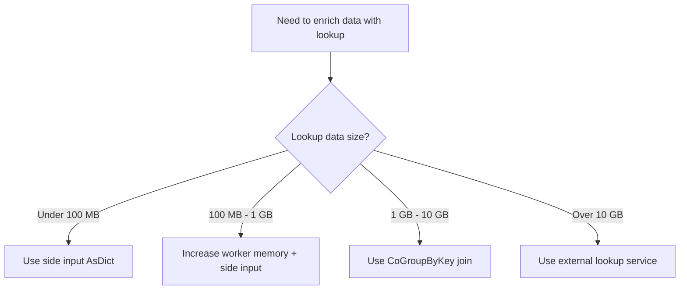

# How to Fix Dataflow Side Input Too Large to Fit in Memory Error

Author: [nawazdhandala](https://www.github.com/nawazdhandala)

Tags: GCP, Dataflow, Apache Beam, Side Input, Performance

Description: Resolve the side input too large to fit in memory error in Google Cloud Dataflow pipelines and learn alternative approaches for large lookup datasets.

---

Side inputs in Apache Beam let you pass additional data to a ParDo that the main processing function can reference. They are commonly used for lookup tables, configuration data, and enrichment. But side inputs are loaded entirely into memory on each worker, and when the side input grows too large, workers crash with OutOfMemoryError. This post covers why this happens, how to work around it, and alternative patterns for large reference datasets.

## How Side Inputs Work in Dataflow

When you use a PCollectionView as a side input, Dataflow materializes the entire contents and makes it available to every worker. For a singleton or small list side input, this is fine. But if the side input is a large map or list with millions of entries, every worker loads it into memory.

The memory required is not just the raw data size. Java object overhead, hash map structure, and serialization buffers can multiply the actual memory usage by 3-5x compared to the on-disk size.

## The Error

You will see errors like:

```
java.lang.OutOfMemoryError: Java heap space
    at org.apache.beam.runners.dataflow.worker.SideInputCache.readSideInput
```

Or in Python:

```
MemoryError: Unable to allocate X GiB for side input
```

## Step 1: Measure the Side Input Size

Before optimizing, know how big the side input actually is:

```python
# Measure the side input before using it
class MeasureSize(beam.DoFn):
    def process(self, element):
        import sys
        size_bytes = sys.getsizeof(element)
        logging.info("Side input element size: %d bytes", size_bytes)
        yield element

side_data = (
    pipeline
    | 'ReadSideInput' >> beam.io.ReadFromBigQuery(
        query='SELECT * FROM dataset.lookup_table')
    | 'MeasureSize' >> beam.ParDo(MeasureSize())
)

# Check total count
count = side_data | beam.combiners.Count.Globally()
```

Also estimate the in-memory size. For Python dictionaries, each entry takes roughly 100-200 bytes of overhead beyond the key and value sizes. For a side input with 10 million entries, that is 1-2 GB of overhead alone.

## Step 2: Increase Worker Memory

The simplest (but not always sufficient) fix:

```bash
# Launch with high-memory workers
gcloud dataflow jobs run your-job \
    --gcs-location=gs://your-bucket/templates/your-template \
    --region=us-central1 \
    --worker-machine-type=n2-highmem-8 \
    --max-workers=10
```

The `n2-highmem-8` machine type provides 64 GB of RAM, which can hold large side inputs. But this gets expensive quickly, especially when most of that memory is just holding lookup data.

## Step 3: Reduce the Side Input Size

Often the side input contains more data than needed. Filter it before creating the view:

```python
# Filter the side input to only include relevant data
filtered_side_data = (
    pipeline
    | 'ReadLookup' >> beam.io.ReadFromBigQuery(
        query="""
        SELECT key, value FROM dataset.lookup_table
        WHERE last_updated > TIMESTAMP_SUB(CURRENT_TIMESTAMP(), INTERVAL 7 DAY)
        AND category IN ('active', 'pending')
        """)  # Only load recent, relevant records
    | 'ToDict' >> beam.Map(lambda row: (row['key'], row['value']))
)

side_view = beam.pvalue.AsDict(filtered_side_data)
```

Also consider whether you need all columns. Select only the fields your processing function actually uses:

```python
# Only select the columns you need
minimal_side_data = (
    pipeline
    | 'ReadMinimal' >> beam.io.ReadFromBigQuery(
        query='SELECT id, status FROM dataset.lookup_table')
    # Much smaller than SELECT * which includes large text fields
)
```

## Step 4: Use a Map Side Input Instead of a List

If you are using `AsList()` and then searching through it, switch to `AsDict()` which is more memory-efficient for lookups:

```python
# Bad: Loading as a list and searching linearly
side_list = beam.pvalue.AsList(side_data)

class LookupFromList(beam.DoFn):
    def process(self, element, lookup_list=beam.DoFn.SideInputParam):
        # O(n) search through the list for each element - slow and wasteful
        for item in lookup_list:
            if item['key'] == element['lookup_key']:
                yield {**element, 'enriched': item['value']}
                break

# Good: Loading as a dictionary for O(1) lookups
side_dict = beam.pvalue.AsDict(
    side_data | beam.Map(lambda x: (x['key'], x['value']))
)

class LookupFromDict(beam.DoFn):
    def process(self, element, lookup_dict=beam.DoFn.SideInputParam):
        # O(1) lookup - much faster
        key = element['lookup_key']
        if key in lookup_dict:
            yield {**element, 'enriched': lookup_dict[key]}
```

## Step 5: Replace Side Input with a CoGroupByKey

For large datasets, replace the side input pattern with a join using CoGroupByKey:

```python
# Instead of using a large side input for enrichment,
# join the main data with the lookup data using CoGroupByKey

# Tag the main data
main_tagged = (
    main_data
    | 'TagMain' >> beam.Map(lambda x: (x['lookup_key'], ('main', x)))
)

# Tag the lookup data
lookup_tagged = (
    lookup_data
    | 'TagLookup' >> beam.Map(lambda x: (x['key'], ('lookup', x)))
)

# CoGroupByKey distributes the join across workers
joined = (
    {'main': main_data | beam.Map(lambda x: (x['lookup_key'], x)),
     'lookup': lookup_data | beam.Map(lambda x: (x['key'], x))}
    | 'Join' >> beam.CoGroupByKey()
    | 'Enrich' >> beam.FlatMap(enrich_records)
)

def enrich_records(element):
    key, groups = element
    main_records = groups['main']
    lookup_records = groups['lookup']

    # Each main record gets enriched with lookup data
    lookup_value = lookup_records[0] if lookup_records else None
    for record in main_records:
        if lookup_value:
            record['enriched'] = lookup_value['value']
        yield record
```

CoGroupByKey distributes the join across all workers, so no single worker needs to hold the entire lookup dataset. The tradeoff is that it requires a shuffle, which adds latency.

## Step 6: Use an External Lookup Service

For very large datasets (hundreds of millions of records), consider using an external key-value store instead of any in-memory approach:

```python
# Use Cloud Bigtable or Memorystore as an external lookup
class ExternalLookupDoFn(beam.DoFn):
    def setup(self):
        """Initialize the connection once per worker."""
        from google.cloud import bigtable

        self.client = bigtable.Client(project='your-project', admin=False)
        self.table = self.client.instance('your-instance').table('lookup-table')

    def process(self, element):
        # Look up the key in Bigtable
        row_key = element['lookup_key'].encode('utf-8')
        row = self.table.read_row(row_key)

        if row:
            cell = row.cells['cf']['value'][0]
            element['enriched'] = cell.value.decode('utf-8')

        yield element

    def teardown(self):
        """Clean up the connection."""
        self.client.close()
```

This approach uses virtually no memory per worker because data is fetched on demand. The tradeoff is network latency for each lookup. Batch your lookups to reduce the overhead:

```python
# Batch lookups for better throughput
class BatchedLookupDoFn(beam.DoFn):
    def setup(self):
        from google.cloud import bigtable
        self.client = bigtable.Client(project='your-project', admin=False)
        self.table = self.client.instance('your-instance').table('lookup-table')
        self.batch = []
        self.batch_size = 100

    def process(self, element):
        self.batch.append(element)
        if len(self.batch) >= self.batch_size:
            yield from self.flush_batch()

    def finish_bundle(self):
        if self.batch:
            yield from self.flush_batch()

    def flush_batch(self):
        # Read all keys in one batch request
        keys = [e['lookup_key'].encode('utf-8') for e in self.batch]
        rows = self.table.read_rows(row_set=RowSet(row_keys=keys))

        lookup_map = {}
        for row in rows:
            lookup_map[row.row_key.decode('utf-8')] = row.cells['cf']['value'][0].value.decode('utf-8')

        for element in self.batch:
            if element['lookup_key'] in lookup_map:
                element['enriched'] = lookup_map[element['lookup_key']]
            yield beam.utils.windowed_value.WindowedValue(
                element, beam.utils.timestamp.Timestamp.of(time.time()),
                [beam.transforms.window.GlobalWindow()])

        self.batch = []
```

## Decision Guide



## Monitoring Memory Usage

Use [OneUptime](https://oneuptime.com) to track worker memory utilization and get alerted when workers approach OOM conditions. For pipelines with side inputs, monitoring memory trends helps you anticipate when a growing lookup table will exceed worker capacity.

The fundamental issue is that side inputs trade memory for simplicity. When the dataset outgrows the available memory, you need to switch to a distributed pattern. Choose the approach based on your data size, latency requirements, and complexity budget.
