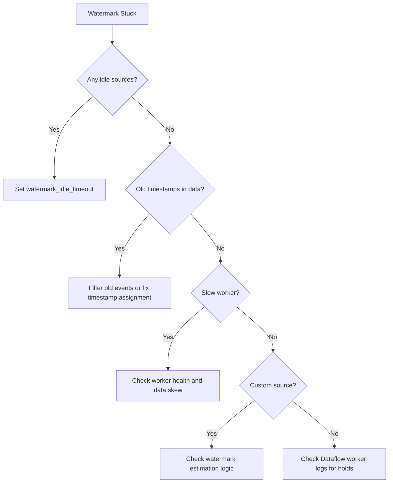

# How to Fix Dataflow Streaming Pipeline Watermark Stuck and Late Data Not Processing

Author: [nawazdhandala](https://www.github.com/nawazdhandala)

Tags: GCP, Dataflow, Streaming, Watermark, Apache Beam

Description: Troubleshoot stuck watermarks in Google Cloud Dataflow streaming pipelines and fix issues where late data is not being processed correctly.

---

Watermarks are the mechanism Dataflow uses to track progress in event time for streaming pipelines. When the watermark gets stuck, your pipeline stops making progress on windowed operations. Windows never close, triggers never fire, and late data handling breaks down. Understanding why watermarks get stuck and how to unstick them is essential for running reliable streaming pipelines.

## What Is a Watermark

A watermark is Dataflow's estimate of how far along in event time the pipeline has progressed. It answers the question: "Have we seen all data with event timestamps up to time T?"

When the watermark advances past the end of a window, that window closes and fires. If the watermark stops advancing, no windows close, and no results are emitted. Late data (data with event timestamps behind the watermark) is handled separately based on your allowed lateness configuration.

## Step 1: Check the Current Watermark Position

View the watermark in the Dataflow monitoring UI or via the command line:

```bash
# Get the watermark and other timing info for the job
gcloud dataflow metrics list JOB_ID \
    --region=us-central1 \
    --source=service \
    --format="table(name.name, scalar)" | grep -i watermark
```

In the Dataflow monitoring UI, look at the "Data Watermark" graph for each stage. A flat line means the watermark is stuck.

Also check the system lag metric:

```bash
# Check system lag
gcloud dataflow metrics list JOB_ID \
    --region=us-central1 \
    --source=service \
    --format="table(name.name, scalar)" | grep -i lag
```

Growing system lag alongside a stuck watermark confirms the pipeline is falling behind.

## Step 2: Identify the Source of the Stuck Watermark

The watermark advances based on the oldest unprocessed element across all input sources. If one source has an element with an old timestamp that is not being processed, it holds back the watermark for the entire pipeline.

Common causes of stuck watermarks:

1. An idle input source (a Pub/Sub subscription or Kafka partition with no new messages)
2. A slow or stuck worker that is not processing elements
3. Incorrect event timestamp assignment
4. A source that produces elements with very old timestamps

## Step 3: Handle Idle Sources

This is the most common cause. If your pipeline reads from multiple sources (or a single source with multiple partitions) and one of them goes idle (no new messages), its watermark stays at the timestamp of the last message received. This holds back the global watermark.

In Apache Beam, you can configure the source to advance the watermark even when idle:

```java
// Java: Configure Pub/Sub source to advance watermark when idle
PCollection<PubsubMessage> messages = pipeline
    .apply(PubsubIO.readMessages()
        .fromSubscription("projects/my-project/subscriptions/my-sub")
        .withIdleTimeout(Duration.standardMinutes(2)));  // Advance watermark after 2 min idle
```

For Python pipelines:

```python
# Python: Handle idle sources with a watermark estimator
from apache_beam.io import ReadFromPubSub

messages = (
    pipeline
    | 'ReadPubSub' >> ReadFromPubSub(
        subscription='projects/my-project/subscriptions/my-sub',
        with_attributes=True
    )
)
```

If the built-in idle timeout is not available for your source, you can use the Dataflow pipeline option:

```bash
# Set watermark idle timeout at the pipeline level
gcloud dataflow jobs run your-job \
    --gcs-location=gs://your-bucket/templates/your-template \
    --region=us-central1 \
    --additional-experiments=watermark_idle_timeout_ms=120000
```

This tells Dataflow to advance the watermark after 2 minutes of idleness on any source.

## Step 4: Check Timestamp Assignment

If your elements have incorrect event timestamps, the watermark will behave unexpectedly. A common mistake is assigning wall-clock time instead of the actual event time from the data:

```python
# Bad: Using processing time as event time
class BadTimestampDoFn(beam.DoFn):
    def process(self, element):
        # This assigns the current time, not the event time
        yield beam.window.TimestampedValue(element, time.time())

# Good: Extract event time from the data
class GoodTimestampDoFn(beam.DoFn):
    def process(self, element):
        # Use the timestamp from the event payload
        event_time = element['event_timestamp']
        yield beam.window.TimestampedValue(element, event_time)
```

Another issue is elements with timestamps far in the past. A single element with a timestamp from days ago can hold back the watermark:

```python
# Add a filter to drop elements with unreasonably old timestamps
class FilterOldEvents(beam.DoFn):
    def process(self, element, timestamp=beam.DoFn.TimestampParam):
        # Drop events older than 24 hours
        cutoff = time.time() - (24 * 3600)
        if timestamp.micros / 1e6 > cutoff:
            yield element
        else:
            # Log and count dropped elements for monitoring
            Metrics.counter('pipeline', 'dropped_old_events').inc()
```

## Step 5: Configure Allowed Lateness

Even if the watermark advances correctly, late data (data arriving after the watermark has passed its window) is dropped by default. Configure allowed lateness to handle late data:

```python
# Configure windowing with allowed lateness
windowed = (
    events
    | 'Window' >> beam.WindowInto(
        beam.window.FixedWindows(300),  # 5-minute windows
        trigger=beam.trigger.AfterWatermark(
            early=beam.trigger.AfterProcessingTime(60),  # Early results every minute
            late=beam.trigger.AfterCount(1)               # Re-fire for each late element
        ),
        allowed_lateness=beam.utils.timestamp.Duration.of(3600),  # 1-hour lateness
        accumulation_mode=beam.trigger.AccumulationMode.ACCUMULATING
    )
)
```

This configuration:
- Emits early results every minute before the window closes
- Re-fires the window for each late element up to 1 hour after the window closes
- Uses ACCUMULATING mode so late results include all data seen so far

## Step 6: Debug with Watermark Hold Details

Check the Dataflow worker logs for watermark hold information:

```bash
# Search for watermark-related log messages
gcloud logging read 'resource.type="dataflow_step" AND resource.labels.job_id="JOB_ID" AND (textPayload:"watermark" OR textPayload:"hold")' \
    --limit=30 \
    --format="table(timestamp, textPayload)"
```

Look for "watermark hold" messages that indicate which transform is preventing the watermark from advancing.

In the Dataflow monitoring UI, hover over a stage in the pipeline graph. The "Output Watermark" for each stage shows you exactly where the watermark is held.

## Step 7: Handle Multiple Input Sources

If your pipeline reads from multiple sources and combines them, the global watermark is the minimum watermark across all sources:

```python
# Pipeline with multiple sources - watermark is the minimum of all
source_a = pipeline | 'ReadA' >> ReadFromPubSub(subscription=sub_a)
source_b = pipeline | 'ReadB' >> ReadFromPubSub(subscription=sub_b)

combined = (source_a, source_b) | 'Flatten' >> beam.Flatten()
```

If source B goes idle or falls behind, it drags down the watermark for the entire pipeline, including data from source A. Make sure all sources have idle timeout configured.

## Step 8: Use Watermark Estimation in Custom Sources

If you have a custom source, you need to implement watermark estimation correctly:

```java
// Java: Custom unbounded source with watermark estimation
public class MySource extends UnboundedSource<MyRecord, MyCheckpoint> {

    @Override
    public UnboundedReader<MyRecord> createReader(
            PipelineOptions options, MyCheckpoint checkpoint) {
        return new MyReader(this, checkpoint);
    }

    private class MyReader extends UnboundedReader<MyRecord> {
        private Instant currentWatermark = BoundedWindow.TIMESTAMP_MIN_VALUE;

        @Override
        public Instant getWatermark() {
            // Watermark should be the oldest unprocessed event time
            // minus some slack for out-of-order data
            return currentWatermark.minus(Duration.standardSeconds(30));
        }

        @Override
        public boolean advance() {
            // Process next record and update watermark
            MyRecord record = fetchNextRecord();
            if (record != null) {
                currentWatermark = Instant.ofEpochMilli(record.getTimestamp());
                return true;
            }
            return false;
        }
    }
}
```

## Watermark Troubleshooting Summary



## Monitoring Watermarks

Use [OneUptime](https://oneuptime.com) to monitor watermark lag and system lag for your streaming pipelines. An alert on watermark stalls lets you investigate and fix issues before they cascade into significant data processing delays.

Watermark management is one of the trickier aspects of stream processing. The key principles are: make sure all sources advance their watermarks (even when idle), assign accurate event timestamps, and configure appropriate lateness to handle out-of-order data.
