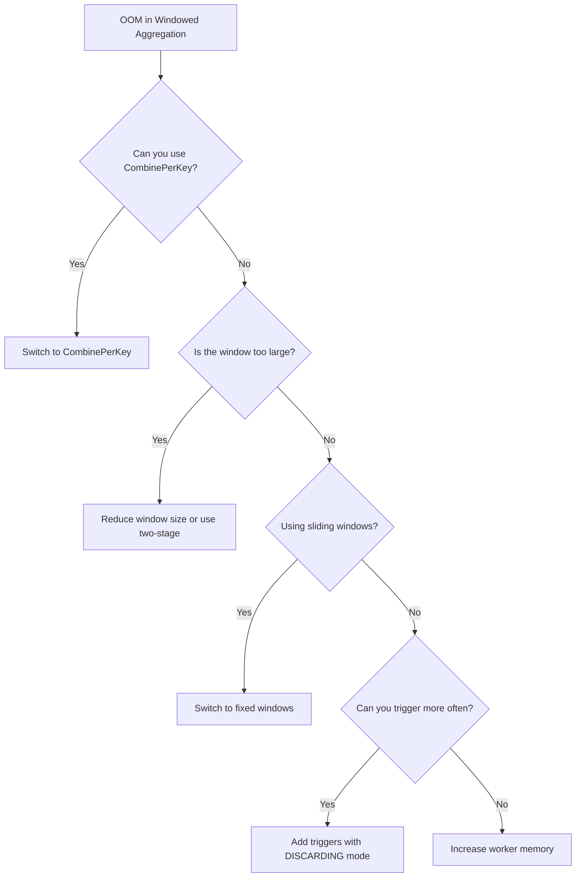

# How to Fix Dataflow Worker Out of Memory Error for Large Windowed Aggregations

Author: [nawazdhandala](https://www.github.com/nawazdhandala)

Tags: GCP, Dataflow, Apache Beam, Memory, Performance

Description: Resolve out of memory errors on Google Cloud Dataflow workers when running large windowed aggregations that accumulate too much data per window.

---

Your Dataflow streaming pipeline crashes with an OutOfMemoryError during windowed aggregations. Workers get killed, restart, process more data, and crash again in a cycle. This typically happens when a window accumulates more data than a single worker's memory can hold. Large windows (hourly, daily) combined with high-volume keys create situations where millions of elements pile up before the window fires. This post walks through the causes and practical solutions.

## Why Windowed Aggregations Cause OOM

In a windowed aggregation, Dataflow collects all elements for a key within a window before processing them. For a 1-hour fixed window with 10,000 events per second for a single key, that is 36 million elements sitting in memory before the window closes and the aggregation runs.

The problem is compounded by:
- Large element sizes (each element has significant payload)
- Many active windows (especially with sliding windows that overlap)
- Accumulation mode set to ACCUMULATING instead of DISCARDING
- Session windows that merge and grow unbounded

## Step 1: Check Worker Memory Configuration

First, verify your worker memory and see if the OOM is a simple resource constraint:

```bash
# Check the current worker configuration
gcloud dataflow jobs describe JOB_ID \
    --region=us-central1 \
    --format="json(environment.workerPools)"
```

If you are using the default `n1-standard-1` workers (3.75 GB RAM), that might not be enough. Upgrade to a larger machine type:

```bash
# Launch with larger workers
gcloud dataflow jobs run your-job \
    --gcs-location=gs://your-bucket/templates/your-template \
    --region=us-central1 \
    --worker-machine-type=n2-highmem-4 \
    --max-workers=10
```

The `n2-highmem` family provides more memory per CPU, which is ideal for memory-intensive aggregations.

## Step 2: Switch from GroupByKey to CombinePerKey

The most impactful fix. If your aggregation can be expressed as a combiner, it uses far less memory because it maintains a single accumulator per key instead of storing all elements:

```python
# Bad: GroupByKey stores all elements in memory
results = (
    events
    | 'Window' >> beam.WindowInto(beam.window.FixedWindows(3600))
    | 'KeyByUser' >> beam.Map(lambda e: (e['user_id'], e))
    | 'Group' >> beam.GroupByKey()  # Stores ALL elements per key per window
    | 'Aggregate' >> beam.Map(lambda kv: (kv[0], compute_stats(kv[1])))
)

# Good: CombinePerKey maintains one small accumulator per key
class StatsAccumulator(beam.CombineFn):
    """Memory-efficient aggregation using a fixed-size accumulator."""

    def create_accumulator(self):
        return {'count': 0, 'sum': 0.0, 'min': float('inf'), 'max': float('-inf')}

    def add_input(self, acc, element):
        acc['count'] += 1
        acc['sum'] += element['value']
        acc['min'] = min(acc['min'], element['value'])
        acc['max'] = max(acc['max'], element['value'])
        return acc

    def merge_accumulators(self, accumulators):
        merged = self.create_accumulator()
        for acc in accumulators:
            merged['count'] += acc['count']
            merged['sum'] += acc['sum']
            merged['min'] = min(merged['min'], acc['min'])
            merged['max'] = max(merged['max'], acc['max'])
        return merged

    def extract_output(self, acc):
        return {
            'count': acc['count'],
            'avg': acc['sum'] / acc['count'] if acc['count'] > 0 else 0,
            'min': acc['min'],
            'max': acc['max']
        }

results = (
    events
    | 'Window' >> beam.WindowInto(beam.window.FixedWindows(3600))
    | 'KeyByUser' >> beam.Map(lambda e: (e['user_id'], e))
    | 'CombineStats' >> beam.CombinePerKey(StatsAccumulator())
)
```

The combiner accumulator stays constant size regardless of how many elements are in the window. For a window with 36 million elements, instead of storing 36 million objects, you store one small dictionary.

## Step 3: Use Triggering to Emit Partial Results

Instead of waiting for the entire window to close, use triggers to emit partial results throughout the window:

```python
# Trigger every 1000 elements or every 60 seconds, whichever comes first
windowed = (
    events
    | 'Window' >> beam.WindowInto(
        beam.window.FixedWindows(3600),  # 1-hour windows
        trigger=beam.trigger.Repeatedly(
            beam.trigger.AfterAny(
                beam.trigger.AfterCount(1000),          # Every 1000 elements
                beam.trigger.AfterProcessingTime(60)    # Or every 60 seconds
            )
        ),
        accumulation_mode=beam.trigger.AccumulationMode.DISCARDING  # Drop after emit
    )
)
```

The `DISCARDING` accumulation mode is critical here. It tells Dataflow to discard elements after they have been emitted in a pane, freeing memory. With `ACCUMULATING` mode, elements are kept and re-emitted with each trigger firing, which uses even more memory.

## Step 4: Reduce Window Size

If you do not strictly need hourly or daily aggregations, use smaller windows:

```python
# Use 5-minute windows instead of 1-hour windows
windowed = (
    events
    | 'SmallWindows' >> beam.WindowInto(beam.window.FixedWindows(300))
    | 'KeyAndCombine' >> beam.CombinePerKey(StatsAccumulator())
)

# If you need hourly results, re-window and combine the 5-minute results
hourly = (
    windowed
    | 'HourlyWindow' >> beam.WindowInto(beam.window.FixedWindows(3600))
    | 'HourlyCombine' >> beam.CombinePerKey(MergeStatsAccumulator())
)
```

This two-stage approach keeps each individual window small, preventing memory issues, while still producing the hourly results you need.

## Step 5: Handle Sliding Windows Carefully

Sliding windows are particularly memory-hungry because each element belongs to multiple windows. A 1-hour window sliding every 5 minutes means each element exists in 12 windows simultaneously:

```python
# This creates 12 copies of each element in memory
sliding = beam.WindowInto(
    beam.window.SlidingWindows(3600, 300)  # 1-hour window, 5-minute slide
)
```

If memory is an issue, consider replacing sliding windows with fixed windows plus a custom post-processing step:

```python
# Use fixed windows and compute sliding aggregations in post-processing
fixed_results = (
    events
    | 'FixedWindows' >> beam.WindowInto(beam.window.FixedWindows(300))
    | 'Aggregate' >> beam.CombinePerKey(StatsAccumulator())
)

# Write fixed window results and compute sliding aggregations downstream
# (in BigQuery, for example, using window functions)
```

## Step 6: Limit Session Window Growth

Session windows can grow unbounded if events keep arriving within the gap duration. A session that lasts all day for a single key accumulates an enormous amount of data:

```python
# Dangerous: Sessions with no size limit
sessions = beam.WindowInto(
    beam.window.Sessions(600)  # 10-minute gap
    # A constantly active key creates a single session for the whole day
)
```

Add a maximum session duration using a custom window function or use triggers to limit how much data accumulates:

```python
# Use triggers to cap memory usage in sessions
capped_sessions = beam.WindowInto(
    beam.window.Sessions(600),
    trigger=beam.trigger.Repeatedly(
        beam.trigger.AfterCount(10000)  # Emit and discard every 10000 elements
    ),
    accumulation_mode=beam.trigger.AccumulationMode.DISCARDING
)
```

## Step 7: Profile Memory Usage

Enable Dataflow profiling to understand where memory is being consumed:

```bash
# Enable profiling when launching the job
gcloud dataflow jobs run your-job \
    --gcs-location=gs://your-bucket/templates/your-template \
    --region=us-central1 \
    --additional-experiments=enable_google_cloud_profiler
```

Then check the profiler in the Google Cloud Console under Profiler. Look at heap usage broken down by class to identify which objects are consuming the most memory.

## Step 8: Tune JVM Settings (Java Pipelines)

For Java pipelines, the default JVM heap might not be optimally sized:

```java
// Set JVM flags for better memory handling
PipelineOptions options = PipelineOptionsFactory.create();
options.as(DataflowPipelineWorkerPoolOptions.class)
    .setWorkerCacheMb(128);  // Reduce cache to free heap for data

// Launch with custom JVM flags
// --jdkAddOpenModules and heap settings
options.as(DataflowPipelineOptions.class)
    .setJdkAddOpenModules(Arrays.asList(
        "java.base/java.lang=ALL-UNNAMED"
    ));
```

You can also pass JVM arguments when launching:

```bash
# Set JVM heap explicitly
gcloud dataflow jobs run your-job \
    --gcs-location=gs://your-bucket/templates/your-template \
    --region=us-central1 \
    --worker-machine-type=n2-highmem-4 \
    --additional-experiments=use_runner_v2 \
    --worker-harness-container-image=gcr.io/your-project/custom-worker:latest
```

## Quick Decision Guide



## Monitoring Memory Usage

Set up alerts for worker memory usage with [OneUptime](https://oneuptime.com). Tracking memory consumption trends over time helps you anticipate OOM issues before they cause pipeline failures, especially as data volumes grow.

The fundamental principle is to avoid storing all elements in memory at once. Use combiners for constant-memory aggregations, triggers for early emission, and smaller windows to limit accumulation.
