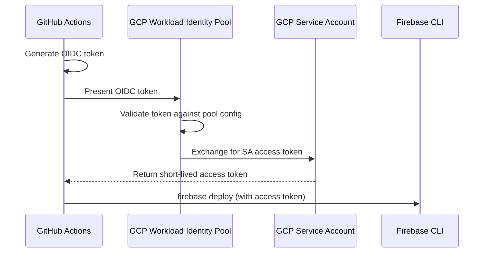

# How to Fix Firebase Deploy Failures Caused by Workload Identity Federation Issues

Author: [nawazdhandala](https://www.github.com/nawazdhandala)

Tags: Firebase, GCP, Workload Identity Federation, CI/CD, Troubleshooting

Description: Troubleshoot and resolve Firebase deployment failures related to Workload Identity Federation configuration in CI/CD pipelines on Google Cloud Platform.

---

Workload Identity Federation lets your CI/CD pipelines authenticate with GCP without long-lived service account keys. It is the recommended approach for GitHub Actions, GitLab CI, and other external providers. But when it comes to Firebase deployments specifically, the integration can be finicky. I have seen deployments work perfectly with regular service account keys, then break in subtle ways when switching to Workload Identity Federation.

## How Workload Identity Federation Works

Instead of storing a JSON key file, Workload Identity Federation uses short-lived tokens. Your CI provider (like GitHub Actions) presents an OIDC token to GCP. GCP verifies the token against a configured identity pool, maps it to a service account, and issues a temporary access token.

The flow looks like this:



## Common Failure Symptoms

Here are the error messages you will likely encounter:

### Error 1: Token Exchange Failure

```
Error: Unable to acquire credentials.
Error while generating access token:
  Error: 401 Unauthorized: Request had invalid authentication credentials.
```

### Error 2: Missing Permissions After Token Exchange

```
Error: HTTP Error: 403, The caller does not have permission
Error: Failed to deploy hosting resources.
```

### Error 3: Audience Mismatch

```
Error: The audience in the identity token does not match the expected audience.
```

### Error 4: Firebase-Specific Permission Issues

```
Error: HTTP Error: 403, The caller does not have permission to access the
Firebase Hosting API for project YOUR_PROJECT_ID.
```

## Step 1 - Verify the Workload Identity Pool Configuration

Start by checking your pool and provider configuration.

These commands show your current Workload Identity setup:

```bash
# List workload identity pools
gcloud iam workload-identity-pools list \
  --location="global" \
  --project YOUR_PROJECT_ID

# Describe the specific pool
gcloud iam workload-identity-pools describe "github-pool" \
  --location="global" \
  --project YOUR_PROJECT_ID

# List providers in the pool
gcloud iam workload-identity-pools providers list \
  --workload-identity-pool="github-pool" \
  --location="global" \
  --project YOUR_PROJECT_ID

# Describe the provider
gcloud iam workload-identity-pools providers describe "github-provider" \
  --workload-identity-pool="github-pool" \
  --location="global" \
  --project YOUR_PROJECT_ID
```

Pay attention to the attribute mapping and conditions. A typical GitHub Actions setup should look like:

```bash
# Create or update the provider with correct settings for GitHub
gcloud iam workload-identity-pools providers create-oidc "github-provider" \
  --workload-identity-pool="github-pool" \
  --location="global" \
  --issuer-uri="https://token.actions.githubusercontent.com" \
  --attribute-mapping="google.subject=assertion.sub,attribute.repository=assertion.repository" \
  --attribute-condition="assertion.repository=='YOUR_ORG/YOUR_REPO'" \
  --project YOUR_PROJECT_ID
```

The `attribute-condition` is critical for security. It restricts which repositories can authenticate.

## Step 2 - Check Service Account Bindings

The service account used for Firebase deployments needs to be bound to the Workload Identity Pool, and it needs the right Firebase/GCP roles.

Verify the binding:

```bash
# Check the IAM policy on the service account
gcloud iam service-accounts get-iam-policy \
  firebase-deployer@YOUR_PROJECT_ID.iam.gserviceaccount.com \
  --project YOUR_PROJECT_ID
```

If the binding is missing, create it:

```bash
# Allow the workload identity pool to impersonate the service account
gcloud iam service-accounts add-iam-policy-binding \
  firebase-deployer@YOUR_PROJECT_ID.iam.gserviceaccount.com \
  --role="roles/iam.workloadIdentityUser" \
  --member="principalSet://iam.googleapis.com/projects/PROJECT_NUMBER/locations/global/workloadIdentityPools/github-pool/attribute.repository/YOUR_ORG/YOUR_REPO" \
  --project YOUR_PROJECT_ID
```

Note the `PROJECT_NUMBER` (not project ID). Find it with:

```bash
gcloud projects describe YOUR_PROJECT_ID --format="value(projectNumber)"
```

## Step 3 - Ensure Firebase-Specific IAM Roles

This is where most Firebase-specific failures originate. The service account needs roles beyond what a generic GCP deployment needs.

Grant the required Firebase roles:

```bash
SA="firebase-deployer@YOUR_PROJECT_ID.iam.gserviceaccount.com"

# Firebase-specific roles
gcloud projects add-iam-binding YOUR_PROJECT_ID \
  --member="serviceAccount:$SA" \
  --role="roles/firebase.admin"

# Hosting deployment
gcloud projects add-iam-binding YOUR_PROJECT_ID \
  --member="serviceAccount:$SA" \
  --role="roles/firebasehosting.admin"

# Cloud Functions deployment (if deploying functions)
gcloud projects add-iam-binding YOUR_PROJECT_ID \
  --member="serviceAccount:$SA" \
  --role="roles/cloudfunctions.developer"

# Act as the default Cloud Functions service account
gcloud iam service-accounts add-iam-policy-binding \
  YOUR_PROJECT_ID@appspot.gserviceaccount.com \
  --member="serviceAccount:$SA" \
  --role="roles/iam.serviceAccountUser"

# Cloud Build (needed for functions deployment)
gcloud projects add-iam-binding YOUR_PROJECT_ID \
  --member="serviceAccount:$SA" \
  --role="roles/cloudbuild.builds.builder"

# Storage (for hosting assets)
gcloud projects add-iam-binding YOUR_PROJECT_ID \
  --member="serviceAccount:$SA" \
  --role="roles/storage.admin"

# API Keys access (Firebase CLI needs this)
gcloud projects add-iam-binding YOUR_PROJECT_ID \
  --member="serviceAccount:$SA" \
  --role="roles/serviceusage.apiKeysViewer"
```

## Step 4 - Fix the GitHub Actions Workflow

A working GitHub Actions workflow with Workload Identity Federation for Firebase deployment looks like this:

```yaml
# .github/workflows/deploy.yml
name: Deploy to Firebase

on:
  push:
    branches: [main]

permissions:
  contents: read
  id-token: write  # Required for Workload Identity Federation

jobs:
  deploy:
    runs-on: ubuntu-latest

    steps:
      - name: Checkout code
        uses: actions/checkout@v4

      - name: Setup Node.js
        uses: actions/setup-node@v4
        with:
          node-version: 20

      - name: Install dependencies
        run: npm ci

      - name: Build
        run: npm run build

      # Authenticate using Workload Identity Federation
      - name: Authenticate to Google Cloud
        id: auth
        uses: google-github-actions/auth@v2
        with:
          workload_identity_provider: "projects/PROJECT_NUMBER/locations/global/workloadIdentityPools/github-pool/providers/github-provider"
          service_account: "firebase-deployer@YOUR_PROJECT_ID.iam.gserviceaccount.com"
          # This creates a credentials file that Firebase CLI can use
          create_credentials_file: true
          export_environment_variables: true

      - name: Deploy to Firebase
        run: npx firebase-tools deploy --project YOUR_PROJECT_ID
        env:
          GOOGLE_APPLICATION_CREDENTIALS: ${{ steps.auth.outputs.credentials_file_path }}
```

The key points in this workflow:

- `id-token: write` permission must be set at the job or workflow level
- The `create_credentials_file: true` and `export_environment_variables: true` options make the credentials available to the Firebase CLI
- Pass `GOOGLE_APPLICATION_CREDENTIALS` to the deploy step

## Step 5 - Debug Token Issues

If the token exchange is failing, add debug output to your workflow:

```yaml
      - name: Debug Auth
        run: |
          echo "Credentials file: $GOOGLE_APPLICATION_CREDENTIALS"
          echo "Access token present: $(test -n "$GOOGLE_APPLICATION_CREDENTIALS" && echo yes || echo no)"
          # Verify the token works with a simple GCP API call
          gcloud projects describe YOUR_PROJECT_ID 2>&1 || echo "gcloud auth failed"
```

## Step 6 - Handle Token Expiration

Workload Identity Federation tokens are short-lived (typically 1 hour). If your Firebase deployment takes longer than this (large apps with many functions), the token can expire mid-deployment.

For long deployments, deploy in stages:

```yaml
      - name: Deploy Hosting
        run: npx firebase-tools deploy --only hosting --project YOUR_PROJECT_ID

      # Re-authenticate before functions deployment
      - name: Re-authenticate
        uses: google-github-actions/auth@v2
        with:
          workload_identity_provider: "projects/PROJECT_NUMBER/locations/global/workloadIdentityPools/github-pool/providers/github-provider"
          service_account: "firebase-deployer@YOUR_PROJECT_ID.iam.gserviceaccount.com"
          create_credentials_file: true
          export_environment_variables: true

      - name: Deploy Functions
        run: npx firebase-tools deploy --only functions --project YOUR_PROJECT_ID
```

## Step 7 - Verify End to End

After making changes, run a test deployment:

```bash
# Test authentication from your local machine (if using gcloud)
gcloud auth print-access-token --impersonate-service-account=firebase-deployer@YOUR_PROJECT_ID.iam.gserviceaccount.com

# Test Firebase CLI access
npx firebase-tools projects:list
```

## Prevention Checklist

Before setting up Workload Identity Federation for Firebase:

1. Create a dedicated service account for deployments
2. Grant all required Firebase and GCP roles upfront
3. Use the correct project number (not ID) in the provider path
4. Set `id-token: write` permissions in your workflow
5. Test with a simple hosting-only deployment before adding functions
6. Set up monitoring alerts for deployment failures

## Summary

Firebase deployment failures with Workload Identity Federation typically come from three places: incorrect pool/provider configuration, missing IAM role bindings on the service account, or workflow configuration errors. Work through each layer systematically - verify the identity pool accepts your CI provider's token, confirm the service account has all Firebase-specific roles, and make sure your workflow passes credentials correctly to the Firebase CLI. Once set up properly, it is more secure than service account keys and requires no key rotation.
