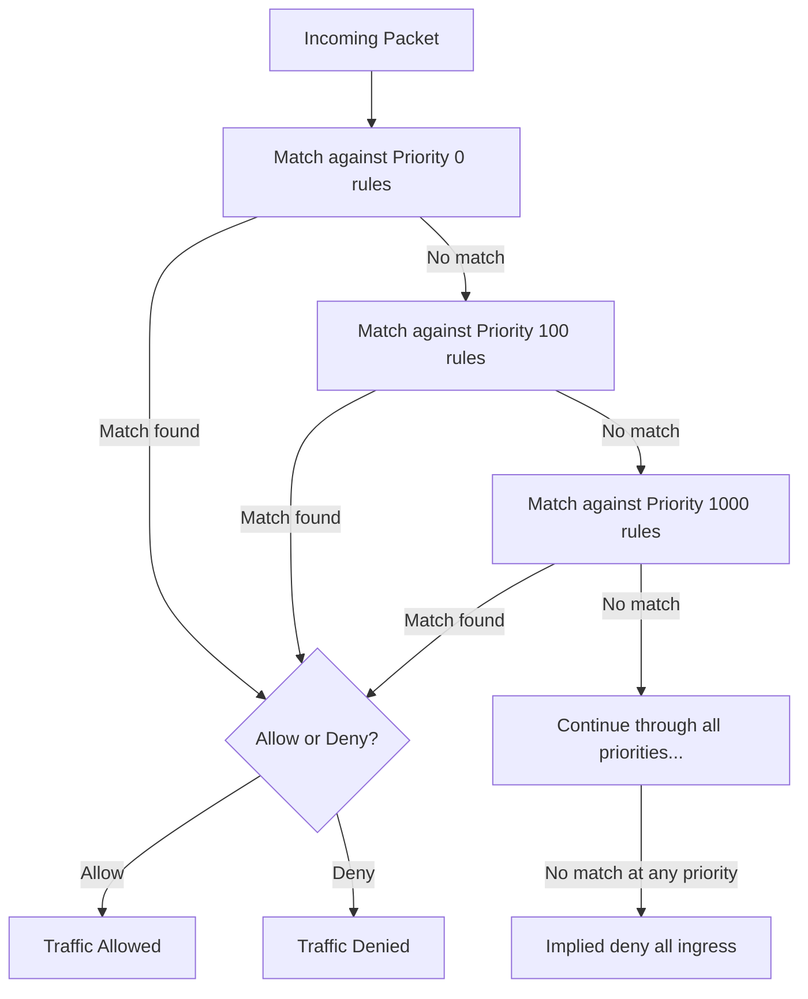
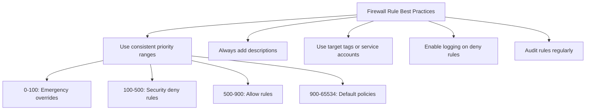

# How to Fix Firewall Rule Conflicts Causing Unexpected Traffic Blocking in VPC

Author: [nawazdhandala](https://www.github.com/nawazdhandala)

Tags: GCP, VPC, Firewall, Networking, Security, Troubleshooting

Description: How to identify and resolve conflicting VPC firewall rules that cause unexpected traffic blocking in Google Cloud, including priority analysis and testing techniques.

---

You added a firewall rule to allow traffic, but it is still being blocked. Or worse, you removed a block rule and traffic is still being denied. VPC firewall rule conflicts are one of the most common networking issues in Google Cloud, and they happen because of how firewall rule priority and evaluation works. Let me show you how to untangle the mess.

## How GCP Firewall Rules Are Evaluated

Understanding the evaluation order is critical:

1. Rules are evaluated from lowest priority number (highest priority) to highest priority number (lowest priority)
2. The first matching rule wins - no further rules are evaluated
3. If no rule matches, the implied deny-all ingress and allow-all egress rules apply
4. Both allow and deny rules can exist at any priority level
5. Rules are stateful - if traffic is allowed in one direction, the return traffic is automatically allowed



## Step 1: List All Firewall Rules Sorted by Priority

```bash
# List all firewall rules sorted by priority (lowest number = highest priority)
gcloud compute firewall-rules list \
    --filter="network=my-vpc" \
    --sort-by=priority \
    --format="table(name, direction, priority, sourceRanges.list(), destinationRanges.list(), allowed[].map().firewall_rule().list(), denied[].map().firewall_rule().list(), targetTags.list(), targetServiceAccounts.list())" \
    --project=my-project
```

This gives you the full picture of all rules, their priorities, and what they match.

## Step 2: Identify Which Rule Is Matching Your Traffic

The Firewall Rules Logging feature tells you exactly which rule matched each connection.

First, enable logging on all your firewall rules (or at least the ones you suspect):

```bash
# Enable logging on a specific firewall rule
gcloud compute firewall-rules update my-allow-http \
    --enable-logging \
    --project=my-project

# Enable logging on all rules in the VPC
for RULE in $(gcloud compute firewall-rules list --filter="network=my-vpc" --format="value(name)" --project=my-project); do
    gcloud compute firewall-rules update $RULE --enable-logging --project=my-project 2>/dev/null
done
```

Then check the logs to see which rule is being matched:

```bash
# Query firewall logs for a specific destination IP
gcloud logging read \
    'resource.type="gce_subnetwork" AND jsonPayload.connection.dest_ip="10.0.1.50" AND logName:"compute.googleapis.com%2Ffirewall"' \
    --project=my-project \
    --limit=10 \
    --format=json
```

The log entry includes `jsonPayload.rule_details.reference` which tells you exactly which firewall rule was applied.

## Step 3: Use the Connectivity Test Tool

Google Cloud's Connectivity Tests can simulate traffic and tell you exactly what firewall rules would apply.

```bash
# Create a connectivity test
gcloud network-management connectivity-tests create test-http \
    --source-instance=projects/my-project/zones/us-central1-a/instances/source-vm \
    --destination-instance=projects/my-project/zones/us-central1-a/instances/dest-vm \
    --protocol=TCP \
    --destination-port=80 \
    --project=my-project

# Get the test results
gcloud network-management connectivity-tests describe test-http \
    --project=my-project \
    --format=json
```

The results show you the entire path the packet would take, including which firewall rule it would hit and whether it would be allowed or denied.

## Step 4: Common Conflict Patterns and Fixes

### Pattern 1: Deny Rule Has Higher Priority Than Allow Rule

This is the most common issue. You added an allow rule but there is an existing deny rule with a lower priority number.

```bash
# Example: This deny rule at priority 900 blocks your allow rule at priority 1000
# Deny rule: priority=900, deny tcp:80, source=0.0.0.0/0
# Allow rule: priority=1000, allow tcp:80, source=10.0.0.0/8

# Fix: Lower the priority number of your allow rule
gcloud compute firewall-rules update my-allow-http \
    --priority=800 \
    --project=my-project
```

### Pattern 2: Overly Broad Deny Rule

A deny rule with a wide source range that catches traffic you intended to allow.

```bash
# Check if a broad deny rule exists
gcloud compute firewall-rules list \
    --filter="network=my-vpc AND direction=INGRESS AND denied" \
    --format="table(name, priority, sourceRanges, denied)" \
    --project=my-project
```

Fix by either narrowing the deny rule or giving your allow rule a higher priority:

```bash
# Narrow the deny rule to exclude your allowed sources
gcloud compute firewall-rules update broad-deny-rule \
    --source-ranges="192.168.0.0/16,172.16.0.0/12" \
    --project=my-project

# Or create a higher-priority allow rule for your specific traffic
gcloud compute firewall-rules create allow-internal-http \
    --network=my-vpc \
    --direction=INGRESS \
    --priority=500 \
    --action=ALLOW \
    --rules=tcp:80,tcp:443 \
    --source-ranges=10.0.0.0/8 \
    --project=my-project
```

### Pattern 3: Target Tags Not Matching

Your allow rule has a target tag, but the instance does not have that tag.

```bash
# Check what tags the target instance has
gcloud compute instances describe my-instance \
    --zone=us-central1-a \
    --format="value(tags.items)" \
    --project=my-project

# Check what target tags the firewall rule requires
gcloud compute firewall-rules describe my-allow-rule \
    --format="value(targetTags)" \
    --project=my-project
```

Fix by adding the missing tag to the instance:

```bash
# Add the required tag to the instance
gcloud compute instances add-tags my-instance \
    --zone=us-central1-a \
    --tags=web-server \
    --project=my-project
```

### Pattern 4: Egress Rules Blocking Outbound Traffic

Egress deny rules can block traffic leaving your instances. This is less common but can be confusing.

```bash
# Check for egress deny rules
gcloud compute firewall-rules list \
    --filter="network=my-vpc AND direction=EGRESS AND denied" \
    --format="table(name, priority, destinationRanges, denied)" \
    --project=my-project
```

### Pattern 5: Implied Deny Is Not Visible

Remember that GCP has an implied deny-all ingress rule at the lowest priority. If none of your explicit rules match the traffic, it gets denied by this invisible rule.

```bash
# There is no way to see the implied rules - they just exist
# Make sure you have an explicit allow rule for the traffic you want

# Create an allow rule for the traffic that is being denied
gcloud compute firewall-rules create allow-my-traffic \
    --network=my-vpc \
    --direction=INGRESS \
    --priority=1000 \
    --action=ALLOW \
    --rules=tcp:8080 \
    --source-ranges=10.0.0.0/8 \
    --target-tags=app-server \
    --project=my-project
```

## Step 5: Audit Your Firewall Rules

After fixing the immediate issue, audit all your rules to prevent future conflicts.

```bash
# Export all firewall rules for review
gcloud compute firewall-rules list \
    --filter="network=my-vpc" \
    --sort-by=priority \
    --format=json \
    --project=my-project > /tmp/firewall_audit.json
```

Look for:
- Overlapping rules at the same priority
- Deny rules with broad source ranges
- Rules with no target tags (apply to all instances)
- Unused rules that can be cleaned up
- Rules without descriptions (hard to understand intent)

```bash
# Find rules without descriptions
gcloud compute firewall-rules list \
    --filter="network=my-vpc AND description=''" \
    --format="table(name, priority)" \
    --project=my-project
```

## Firewall Rule Best Practices



The key to avoiding firewall conflicts is maintaining a consistent priority scheme and always checking what rules already exist before adding new ones. When in doubt, use the Connectivity Test tool to simulate traffic before making changes. It is much safer than trial and error with production traffic.
