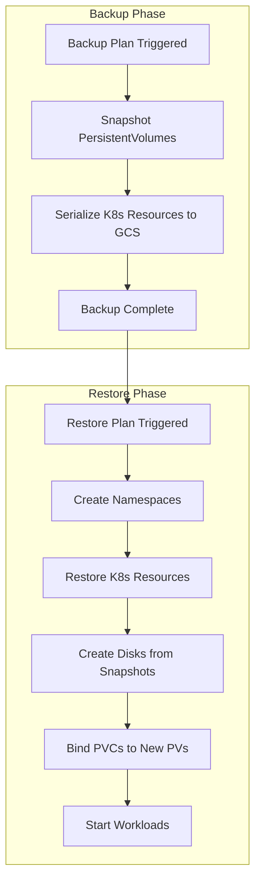

# How to Fix GKE Backup for GKE Restore Failures and Volume Snapshot Errors

Author: [nawazdhandala](https://www.github.com/nawazdhandala)

Tags: GKE, Kubernetes, Backup, Restore, Volume Snapshots, Disaster Recovery, GCP

Description: Troubleshoot and fix restore failures and volume snapshot errors when using Backup for GKE, covering common failure modes, permission issues, and snapshot compatibility problems.

---

You set up Backup for GKE, your backups completed successfully, but when you try to restore, things fall apart. The restore gets stuck, volume snapshots fail to create disks, or resources come back in a broken state. Backup for GKE handles a lot of complexity under the hood - snapshotting volumes, serializing Kubernetes resources, managing namespaces - and failures at any of these layers produce different error patterns.

Let's work through the most common restore failures and how to fix them.

## How Backup for GKE Works

The backup and restore flow involves several steps:



Failures can happen at any step in the restore phase.

## Step 1 - Check Restore Status

Start by checking the detailed restore status:

```bash
# List recent restores
gcloud beta container backup-restore restores list \
  --restore-plan=your-restore-plan \
  --location=us-central1 \
  --project=your-project-id

# Get detailed status of a specific restore
gcloud beta container backup-restore restores describe your-restore-name \
  --restore-plan=your-restore-plan \
  --location=us-central1 \
  --project=your-project-id \
  --format=yaml
```

Look at the `state` field and `stateReason`. Common states:
- `IN_PROGRESS` - still running
- `SUCCEEDED` - completed successfully
- `FAILED` - failed with an error
- `DELETING` - being cleaned up

## Step 2 - Fix Volume Snapshot Restore Failures

Volume snapshot errors are the most common restore failure. The backup creates disk snapshots, and during restore, new disks must be created from those snapshots.

**Snapshot not found:**

If the snapshot was deleted or is in a different project:

```bash
# List available volume snapshots from the backup
gcloud beta container backup-restore volume-restores list \
  --restore=your-restore-name \
  --restore-plan=your-restore-plan \
  --location=us-central1

# Check the underlying disk snapshot
gcloud compute snapshots list --filter="name~backup"
```

If snapshots were deleted, you cannot restore volumes. Ensure your backup retention policy keeps snapshots long enough.

**Quota exceeded:**

Creating disks from snapshots consumes disk quota:

```bash
# Check disk quota
gcloud compute regions describe us-central1 \
  --format="table(quotas[].metric, quotas[].limit, quotas[].usage)" \
  --filter="quotas.metric:DISKS_TOTAL_GB OR quotas.metric:SSD_TOTAL_GB"
```

If you are near quota limits, clean up unused disks or request a quota increase.

**Zone mismatch:**

Snapshots are global, but disks are zonal. The restore creates disks in the target cluster's zone. If the target cluster is in a different zone than the source, this should still work, but check for zone-specific errors:

```bash
# Check the target cluster zone
gcloud container clusters describe target-cluster \
  --zone us-east1-b \
  --format="value(zone)"
```

## Step 3 - Fix Permission Errors

The Backup for GKE service agent needs specific permissions. Check and fix IAM bindings:

```bash
# Find the Backup for GKE service agent
PROJECT_NUMBER=$(gcloud projects describe your-project-id --format="value(projectNumber)")
AGENT_EMAIL="service-${PROJECT_NUMBER}@gcp-sa-gkebackup.iam.gserviceaccount.com"

# Check its permissions
gcloud projects get-iam-policy your-project-id \
  --flatten="bindings[].members" \
  --filter="bindings.members:${AGENT_EMAIL}" \
  --format="table(bindings.role)"
```

The service agent needs these roles:
- `roles/gkebackup.agent` on the project
- `roles/compute.storageAdmin` for creating disks from snapshots
- `roles/container.developer` for creating Kubernetes resources

If permissions are missing:

```bash
# Grant the required roles to the service agent
gcloud projects add-iam-policy-binding your-project-id \
  --member="serviceAccount:${AGENT_EMAIL}" \
  --role="roles/compute.storageAdmin"
```

For cross-project restores (backup from project A, restore to project B), the service agent from project B needs access to project A's snapshots.

## Step 4 - Fix Resource Conflicts

When restoring to a cluster that already has some resources, you might hit naming conflicts. The restore plan's conflict policy determines what happens:

```bash
# Check the restore plan's conflict policy
gcloud beta container backup-restore restore-plans describe your-restore-plan \
  --location=us-central1 \
  --format="value(restoreConfig.clusterResourceConflictPolicy, restoreConfig.namespacedResourceRestoreMode)"
```

Options:
- `USE_EXISTING_VERSION` - keep the existing resource
- `USE_BACKUP_VERSION` - overwrite with the backup version

If you are restoring to a fresh cluster, conflicts should not be an issue. For restoring to an existing cluster:

```yaml
# Restore plan that overwrites existing resources
restoreConfig:
  namespacedResourceRestoreMode: DELETE_AND_RESTORE
  clusterResourceConflictPolicy: USE_BACKUP_VERSION
  allNamespaces: true
  volumeDataRestorePolicy: RESTORE_VOLUME_DATA_FROM_BACKUP
```

## Step 5 - Fix Namespace Restoration Issues

Backup for GKE restores namespaces and their resources. If the target namespace already exists with conflicting resources:

```bash
# Check if the target namespace already exists
kubectl get namespace your-namespace

# Check for existing resources that might conflict
kubectl get all -n your-namespace
```

For a clean restore, delete the existing namespace first (if it is safe to do so):

```bash
# Delete the namespace before restoring (destructive - all resources in the namespace are deleted)
kubectl delete namespace your-namespace
```

Then run the restore. The namespace will be recreated with the backed-up resources.

## Step 6 - Fix StorageClass Compatibility

If the target cluster does not have the same StorageClass as the source cluster, PVCs will fail to bind:

```bash
# Check StorageClasses in the target cluster
kubectl get storageclass

# Compare with the StorageClass referenced in the backup
# You can find this in the PVC definitions from the backup
```

Create the missing StorageClass or configure the restore plan to map StorageClasses:

```yaml
# Restore plan with StorageClass substitution
restoreConfig:
  substitutionRules:
  - targetJsonPath: ".spec.storageClassName"
    originalValuePattern: "premium-rw"
    newValue: "standard-rw"
```

This replaces `premium-rw` with `standard-rw` in all restored PVCs, which is useful when restoring to a cluster with different storage options.

## Step 7 - Handle CRD Dependencies

If the backup includes Custom Resources but the target cluster does not have the CRDs installed, restoration of those resources will fail:

```bash
# List CRDs in the target cluster
kubectl get crd

# Compare with CRDs from the source cluster
# Install missing CRDs before restoring
kubectl apply -f your-crd-definitions.yaml
```

Common CRDs that need to be pre-installed:
- Service mesh CRDs (Istio VirtualService, DestinationRule)
- Certificate manager CRDs
- Custom operator CRDs

Install these before initiating the restore.

## Step 8 - Monitor Restore Progress

Track the restore operation in real-time:

```bash
# Watch restore status
watch -n 15 "gcloud beta container backup-restore restores describe your-restore-name \
  --restore-plan=your-restore-plan \
  --location=us-central1 \
  --format='value(state, stateReason, resourcesRestoredCount, resourcesFailedCount)'"
```

Check for individual volume restore status:

```bash
# List volume restores and their status
gcloud beta container backup-restore volume-restores list \
  --restore=your-restore-name \
  --restore-plan=your-restore-plan \
  --location=us-central1 \
  --format="table(name, state, stateReason, volumeType)"
```

## Step 9 - Validate After Restore

After the restore completes, verify everything is working:

```bash
# Check that all expected pods are running
kubectl get pods -n your-namespace

# Verify PVCs are bound
kubectl get pvc -n your-namespace

# Check that services have endpoints
kubectl get endpoints -n your-namespace

# Verify data in persistent volumes
kubectl exec -it your-pod -n your-namespace -- ls -la /data
```

Run your application's health checks and smoke tests. Some things to watch for after a restore:

- Database connections might need to be re-established
- External integrations might have stale configurations
- Certificates might be expired if the backup is old
- Service accounts and secrets should be verified

## Step 10 - Set Up Backup Validation

To catch restore issues before they become emergencies, set up regular restore testing:

```bash
# Create a dedicated restore test cluster
gcloud container clusters create restore-test \
  --zone us-central1-a \
  --num-nodes 3

# Run a test restore to this cluster
gcloud beta container backup-restore restores create test-restore \
  --restore-plan=test-restore-plan \
  --backup="projects/your-project/locations/us-central1/backupPlans/your-plan/backups/latest" \
  --location=us-central1
```

Automate this with a Cloud Scheduler job that triggers a monthly restore test. This ensures your backups are actually restorable when you need them.

## Diagnostic Summary

When Backup for GKE restore fails:

1. Check the restore status and `stateReason` for the specific error
2. Verify volume snapshots exist and are accessible
3. Check IAM permissions for the backup service agent
4. Resolve resource naming conflicts with the right conflict policy
5. Ensure StorageClasses match or configure substitution rules
6. Pre-install required CRDs in the target cluster
7. Monitor volume restore progress individually
8. Validate the restored workloads after completion

The most common failures are permission issues, quota limits, and StorageClass mismatches. Address those proactively and your restores will be much more reliable.
