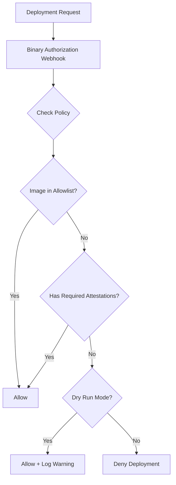

# How to Fix GKE Binary Authorization Attestation Denied Deployment Errors

Author: [nawazdhandala](https://www.github.com/nawazdhandala)

Tags: GKE, Kubernetes, Binary Authorization, Security, Container Security, Attestation, GCP

Description: Troubleshoot and resolve GKE deployment failures caused by Binary Authorization denying images that lack required attestations or violate the admission policy.

---

You try to deploy a container image to your GKE cluster and get "Denied by Binary Authorization admission webhook." The deployment is blocked because the image does not meet the cluster's Binary Authorization policy. This is the security feature doing its job, but when legitimate images get blocked, you need to figure out which attestation is missing and how to fix it.

## How Binary Authorization Works

Binary Authorization is a deploy-time security control. Before a container image runs in your cluster, it checks the image against a policy:



The policy specifies which attestations an image must have. Attestations are cryptographic signatures that prove the image passed certain checks (vulnerability scanning, code review, CI/CD pipeline completion).

## Step 1 - Read the Denial Error

Get the full error message from the failed deployment:

```bash
# Try to deploy and capture the error
kubectl apply -f your-deployment.yaml 2>&1

# Or check pod events if the deployment was created but pods are blocked
kubectl describe replicaset -n your-namespace -l app=your-app
```

The error typically looks like:

```
admission webhook "imagepolicywebhook.image-policy.k8s.io" denied the request:
Image gcr.io/your-project/your-image@sha256:abc123... denied by Binary Authorization
default admission rule. Denied by always_deny admission rule.
```

Or with attestation requirements:

```
Image gcr.io/your-project/your-image@sha256:abc123... denied by attestor
projects/your-project/attestors/your-attestor: missing required attestation
```

## Step 2 - Check the Current Policy

View your Binary Authorization policy:

```bash
# Export the current Binary Authorization policy
gcloud container binauthz policy export
```

The policy YAML looks something like:

```yaml
admissionWhitelistPatterns:
- namePattern: gcr.io/google_containers/*
- namePattern: gcr.io/google-containers/*
- namePattern: gke.gcr.io/*
clusterAdmissionRules:
  us-central1-a.your-cluster:
    enforcementMode: ENFORCED_BLOCK_AND_AUDIT_LOG
    evaluationMode: REQUIRE_ATTESTATION
    requireAttestationsBy:
    - projects/your-project/attestors/build-attestor
    - projects/your-project/attestors/vulnerability-attestor
defaultAdmissionRule:
  enforcementMode: ENFORCED_BLOCK_AND_AUDIT_LOG
  evaluationMode: ALWAYS_DENY
```

This policy says:
- Allowlisted Google images are always allowed
- Images deployed to this specific cluster must have two attestations
- Everything else is denied by default

## Step 3 - Check If the Image Has Required Attestations

List the attestations for your image:

```bash
# List attestations for a specific image digest
gcloud container binauthz attestations list \
  --attestor=projects/your-project/attestors/build-attestor \
  --artifact-url="gcr.io/your-project/your-image@sha256:abc123def456"
```

If the output is empty, the image has no attestations from that attestor. That is why it is being denied.

Important: Binary Authorization works with image digests, not tags. If your deployment references an image by tag (like `:latest` or `:v1.0`), Binary Authorization resolves it to a digest and checks attestations for that digest.

## Step 4 - Create the Missing Attestation

To attest an image, you need a signing key pair. If you already have an attestor set up:

```bash
# Sign the image with the attestor's key
# First, get the image digest
IMAGE_DIGEST=$(gcloud container images describe \
  gcr.io/your-project/your-image:v1.0 \
  --format='value(image_summary.digest)')

echo "Image digest: $IMAGE_DIGEST"

# Create the attestation using a KMS key
gcloud container binauthz attestations sign-and-create \
  --artifact-url="gcr.io/your-project/your-image@${IMAGE_DIGEST}" \
  --attestor="projects/your-project/attestors/build-attestor" \
  --attestor-project="your-project" \
  --keyversion-project="your-project" \
  --keyversion-location="global" \
  --keyversion-keyring="binauthz-keyring" \
  --keyversion-key="attestor-key" \
  --keyversion="1"
```

If you need to set up the attestor and key from scratch:

```bash
# Create a KMS keyring and key for signing
gcloud kms keyrings create binauthz-keyring --location global
gcloud kms keys create attestor-key \
  --keyring binauthz-keyring \
  --location global \
  --purpose asymmetric-signing \
  --default-algorithm ec-sign-p256-sha256

# Create the attestor
gcloud container binauthz attestors create build-attestor \
  --attestation-authority-note=build-note \
  --attestation-authority-note-project=your-project

# Add the KMS key to the attestor
gcloud container binauthz attestors public-keys add \
  --attestor=build-attestor \
  --keyversion-project=your-project \
  --keyversion-location=global \
  --keyversion-keyring=binauthz-keyring \
  --keyversion-key=attestor-key \
  --keyversion=1
```

## Step 5 - Add the Image to the Allowlist

If you need to quickly unblock a specific image without creating attestations (for emergency deployments), add it to the policy allowlist:

```bash
# Export the current policy
gcloud container binauthz policy export > /tmp/policy.yaml
```

Edit the policy to add the image pattern:

```yaml
# Add the image to the allowlist
admissionWhitelistPatterns:
- namePattern: gcr.io/google_containers/*
- namePattern: gcr.io/your-project/your-image*  # add this line
```

Import the updated policy:

```bash
# Import the updated policy
gcloud container binauthz policy import /tmp/policy.yaml
```

Use this sparingly. Allowlisting bypasses all attestation checks for matching images.

## Step 6 - Use Dry Run Mode for Testing

If you are rolling out Binary Authorization for the first time, use dry run mode. Images that would be denied are logged but still allowed to deploy:

```yaml
# Policy in dry run mode - logs violations but does not block
defaultAdmissionRule:
  enforcementMode: DRYRUN_AUDIT_LOG_ONLY
  evaluationMode: REQUIRE_ATTESTATION
  requireAttestationsBy:
  - projects/your-project/attestors/build-attestor
```

Check the audit logs to see what would have been blocked:

```bash
# Query Binary Authorization audit logs
gcloud logging read 'resource.type="k8s_cluster" AND protoPayload.serviceName="binaryauthorization.googleapis.com"' \
  --limit 20 \
  --format json
```

This lets you identify all images that need attestations before switching to enforcement mode.

## Step 7 - Use Break-Glass for Emergencies

GKE supports a break-glass annotation that bypasses Binary Authorization for emergency deployments:

```yaml
# Emergency deployment with break-glass annotation
apiVersion: apps/v1
kind: Deployment
metadata:
  name: emergency-fix
  annotations:
    alpha.image-policy.k8s.io/break-glass: "true"
spec:
  template:
    spec:
      containers:
      - name: app
        image: gcr.io/your-project/your-image:hotfix
```

Break-glass events are logged in Cloud Audit Logs. Make sure your team has a policy for when break-glass is acceptable and reviews the logs regularly.

## Step 8 - Automate Attestations in CI/CD

The right long-term fix is to integrate attestation into your CI/CD pipeline. After building and scanning an image, automatically create the attestation:

```bash
# Example: CI/CD pipeline step that creates an attestation after successful build
# This would be in your cloudbuild.yaml or equivalent

# Step 1: Build the image
# docker build -t gcr.io/$PROJECT_ID/my-app:$COMMIT_SHA .
# docker push gcr.io/$PROJECT_ID/my-app:$COMMIT_SHA

# Step 2: Get the digest
IMAGE_DIGEST=$(gcloud container images describe \
  gcr.io/$PROJECT_ID/my-app:$COMMIT_SHA \
  --format='value(image_summary.digest)')

# Step 3: Create attestation
gcloud container binauthz attestations sign-and-create \
  --artifact-url="gcr.io/$PROJECT_ID/my-app@${IMAGE_DIGEST}" \
  --attestor="projects/$PROJECT_ID/attestors/build-attestor" \
  --attestor-project="$PROJECT_ID" \
  --keyversion-project="$PROJECT_ID" \
  --keyversion-location="global" \
  --keyversion-keyring="binauthz-keyring" \
  --keyversion-key="attestor-key" \
  --keyversion="1"
```

For Cloud Build, you can use the built-in Binary Authorization integration that automatically attests images built by Cloud Build.

## Step 9 - Handle Third-Party Images

Third-party images (from Docker Hub, Quay, etc.) will not have your attestations. You have three options:

1. **Mirror and attest**: Copy the image to your registry, scan it, and create an attestation
2. **Allowlist specific images**: Add them to the policy's allowlist patterns
3. **Use a dedicated attestor**: Create a "third-party-reviewed" attestor for manually verified external images

```bash
# Mirror a third-party image to your registry
docker pull nginx:1.25
docker tag nginx:1.25 gcr.io/your-project/nginx:1.25
docker push gcr.io/your-project/nginx:1.25

# Then scan and attest the mirrored image
```

## Troubleshooting Checklist

When Binary Authorization blocks a deployment:

1. Read the full error message to identify which attestor is missing
2. Check if the image reference uses a digest (required for attestation)
3. List existing attestations for the image
4. Create the missing attestation or add to allowlist
5. Verify attestor keys are valid and not expired
6. Check if the correct cluster-specific rule applies
7. Use dry run mode when testing policy changes
8. Use break-glass only for genuine emergencies

Binary Authorization is a critical security control. The goal is to fix your CI/CD pipeline to produce attestations automatically, so deployments flow smoothly while maintaining the security posture.
