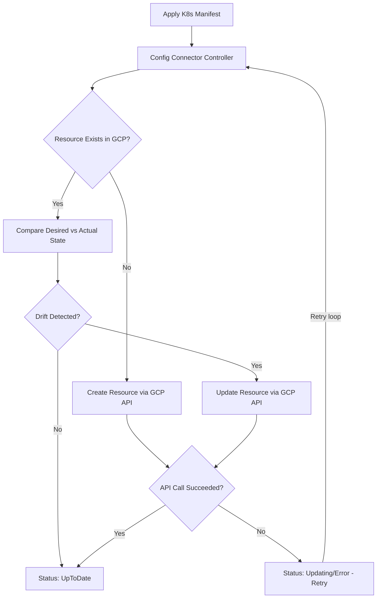

# How to Fix GKE Config Connector Resource Reconciliation Stuck in Updating State

Author: [nawazdhandala](https://www.github.com/nawazdhandala)

Tags: GKE, Kubernetes, Config Connector, Infrastructure as Code, Resource Management, Troubleshooting, GCP

Description: Troubleshoot and fix GKE Config Connector resources stuck in Updating or UpToDate reconciliation loops, covering IAM permissions, API enablement, and conflict resolution.

---

Config Connector lets you manage GCP resources using Kubernetes manifests. You apply a YAML file, and Config Connector creates or updates the corresponding GCP resource. But sometimes the resource gets stuck in "Updating" status and never reaches "UpToDate." The reconciliation loop keeps trying and failing, and your GCP resource is in an indeterminate state.

Let's figure out why reconciliation is stuck and how to fix it.

## How Config Connector Reconciliation Works

Config Connector runs a controller that watches for custom resources (like `ComputeInstance`, `SQLInstance`, `StorageBucket`) and reconciles them with the actual GCP state:



When the GCP API call keeps failing, the resource stays in "Updating" and retries indefinitely.

## Step 1 - Check the Resource Status

Get the detailed status of the stuck resource:

```bash
# Check the resource status
kubectl get [RESOURCE_KIND] [RESOURCE_NAME] -n your-namespace

# Get detailed conditions
kubectl describe [RESOURCE_KIND] [RESOURCE_NAME] -n your-namespace
```

For example, for a Cloud SQL instance:

```bash
# Check SQLInstance status
kubectl get sqlinstance my-database -n your-namespace -o yaml
```

Look at the `status.conditions` field. The condition with type `Ready` tells you the current state:

```yaml
status:
  conditions:
  - lastTransitionTime: "2026-02-17T10:00:00Z"
    message: "Update call failed: googleapi: Error 403: Required 'compute.instances.update' permission"
    reason: UpdateFailed
    status: "False"
    type: Ready
```

The `message` field is the key - it tells you exactly what API error Config Connector encountered.

## Step 2 - Fix Permission Errors

The most common cause of stuck reconciliation is missing IAM permissions. The Config Connector service account needs permissions to manage the GCP resource.

Check which service account Config Connector uses:

```bash
# For namespace-scoped Config Connector, check the namespace annotation
kubectl get namespace your-namespace -o jsonpath='{.metadata.annotations.cnrm\.cloud\.google\.com/project-id}'

# Check the Config Connector controller's service account
kubectl get configconnectorcontext -n your-namespace -o yaml
```

For cluster-mode Config Connector:

```bash
# Check the controller's identity
kubectl get configconnector -o yaml
```

Grant the missing permissions:

```bash
# Grant the Config Connector service account the necessary role
gcloud projects add-iam-policy-binding your-project-id \
  --member="serviceAccount:config-connector-sa@your-project-id.iam.gserviceaccount.com" \
  --role="roles/editor"
```

For more granular permissions (recommended over Editor):

```bash
# Grant specific roles based on the resource type
# For Compute resources:
gcloud projects add-iam-policy-binding your-project-id \
  --member="serviceAccount:config-connector-sa@your-project-id.iam.gserviceaccount.com" \
  --role="roles/compute.admin"

# For SQL resources:
gcloud projects add-iam-policy-binding your-project-id \
  --member="serviceAccount:config-connector-sa@your-project-id.iam.gserviceaccount.com" \
  --role="roles/cloudsql.admin"

# For Storage resources:
gcloud projects add-iam-policy-binding your-project-id \
  --member="serviceAccount:config-connector-sa@your-project-id.iam.gserviceaccount.com" \
  --role="roles/storage.admin"
```

## Step 3 - Fix API Not Enabled Errors

If the error mentions "API not enabled," the required GCP API is not active in your project:

```bash
# Common error: "Cloud SQL Admin API has not been used in project..."

# Enable the required API
gcloud services enable sqladmin.googleapis.com --project your-project-id

# For Compute Engine
gcloud services enable compute.googleapis.com --project your-project-id

# For multiple APIs at once
gcloud services enable \
  sqladmin.googleapis.com \
  compute.googleapis.com \
  container.googleapis.com \
  --project your-project-id
```

After enabling the API, Config Connector will automatically retry on its next reconciliation cycle (usually within a few minutes).

## Step 4 - Fix Resource Conflict Errors

If someone modified the GCP resource outside of Config Connector (through the Console, gcloud, or Terraform), there might be a conflict:

```yaml
# Error message example
message: "Update call failed: googleapi: Error 409: Resource already exists"
```

Or the resource's actual state does not match what Config Connector expects. You have a few options:

**Option A - Adopt the existing resource:**

Add the `cnrm.cloud.google.com/management-conflict-prevention-policy: none` annotation and the `cnrm.cloud.google.com/state-into-spec: merge` annotation:

```yaml
# Adopt an existing GCP resource into Config Connector management
apiVersion: compute.cnrm.cloud.google.com/v1beta1
kind: ComputeInstance
metadata:
  name: existing-vm
  namespace: your-namespace
  annotations:
    cnrm.cloud.google.com/state-into-spec: merge
spec:
  # ... your desired spec
```

**Option B - Delete and recreate:**

If the resource can be recreated:

```bash
# Delete the Config Connector resource (this may delete the GCP resource too)
kubectl delete computeinstance existing-vm -n your-namespace
```

Check the deletion policy first. If the annotation `cnrm.cloud.google.com/deletion-policy: abandon` is set, deleting the K8s resource will not delete the GCP resource.

## Step 5 - Fix Immutable Field Errors

Some GCP resource fields cannot be changed after creation. If your Config Connector manifest tries to update an immutable field, the reconciliation will fail repeatedly:

```yaml
# Error example
message: "Update call failed: googleapi: Error 400: Invalid value for field 'resource.machineType': Cannot change machine type of a running instance"
```

For immutable field changes, you need to delete and recreate the resource:

```bash
# Delete the resource (check deletion policy first!)
kubectl delete [RESOURCE_KIND] [RESOURCE_NAME] -n your-namespace

# Wait for deletion to complete
kubectl get [RESOURCE_KIND] [RESOURCE_NAME] -n your-namespace

# Recreate with the new spec
kubectl apply -f your-resource.yaml
```

Or for fields that can be changed with a stop/start (like machine type), do it through the GCP API first, then update the manifest.

## Step 6 - Check Config Connector Controller Health

If multiple resources are stuck, the controller itself might be unhealthy:

```bash
# Check Config Connector controller pods
kubectl get pods -n cnrm-system

# Check controller logs
kubectl logs -n cnrm-system -l cnrm.cloud.google.com/component=cnrm-controller-manager --tail=100

# Check webhook logs
kubectl logs -n cnrm-system -l cnrm.cloud.google.com/component=cnrm-webhook-manager --tail=100
```

Common controller issues:
- OOM - controller running out of memory with many resources
- Rate limiting - too many GCP API calls being throttled
- Credential issues - Workload Identity token exchange failing

If the controller is unhealthy, restart it:

```bash
# Restart the Config Connector controller
kubectl rollout restart statefulset cnrm-controller-manager -n cnrm-system
```

## Step 7 - Fix Rate Limiting Issues

If you are managing hundreds of GCP resources, you might hit GCP API rate limits:

```yaml
# Error message
message: "Update call failed: googleapi: Error 429: Rate Limit Exceeded"
```

Config Connector has exponential backoff, so it will eventually succeed. But if rate limiting is persistent:

```bash
# Check how many Config Connector resources you have
kubectl get gcp --all-namespaces | wc -l
```

For large-scale Config Connector deployments, consider:
- Spreading resources across multiple namespaces with separate service accounts
- Staggering resource creation over time
- Requesting quota increases for the specific API

## Step 8 - Force a Reconciliation

If the resource seems stuck and you want to trigger an immediate retry:

```bash
# Add a harmless annotation to trigger reconciliation
kubectl annotate [RESOURCE_KIND] [RESOURCE_NAME] -n your-namespace \
  cnrm.cloud.google.com/reconcile-trigger=$(date +%s) --overwrite
```

This changes the annotation, which triggers the controller to re-process the resource.

## Step 9 - Handle Dependency Issues

Some GCP resources depend on others. For example, a Cloud SQL database depends on the SQL instance being ready. If the dependency is not ready, the dependent resource stays in Updating:

```yaml
# SQLInstance must be ready before SQLDatabase can be created
apiVersion: sql.cnrm.cloud.google.com/v1beta1
kind: SQLInstance
metadata:
  name: my-instance
spec:
  databaseVersion: POSTGRES_15
  region: us-central1
  settings:
    tier: db-f1-micro
---
apiVersion: sql.cnrm.cloud.google.com/v1beta1
kind: SQLDatabase
metadata:
  name: my-database
spec:
  instanceRef:
    name: my-instance  # depends on the SQLInstance above
```

Check the dependency chain:

```bash
# Check if the referenced resources are ready
kubectl get sqlinstance my-instance -n your-namespace -o jsonpath='{.status.conditions[?(@.type=="Ready")].status}'
```

If dependencies are not ready, fix those first and the dependent resources will resolve automatically.

## Step 10 - Monitor Reconciliation

Set up monitoring for Config Connector reconciliation health:

```bash
# Check the reconciliation metrics
kubectl get --raw /metrics | grep cnrm

# Look for resources that have been in non-ready state for a long time
kubectl get gcp --all-namespaces -o custom-columns=\
KIND:.kind,\
NAME:.metadata.name,\
NAMESPACE:.metadata.namespace,\
READY:.status.conditions[?@.type=='Ready'].status,\
MESSAGE:.status.conditions[?@.type=='Ready'].message
```

## Diagnostic Checklist

When Config Connector resources are stuck in Updating:

1. Read the status conditions message for the specific API error
2. Check IAM permissions for the Config Connector service account
3. Verify required GCP APIs are enabled
4. Look for resource conflicts from out-of-band changes
5. Check if the update touches immutable fields
6. Verify controller pods are healthy and not OOM
7. Check for GCP API rate limiting
8. Resolve dependency resources first
9. Force reconciliation with an annotation change if needed

The status condition message is your best starting point. It contains the exact GCP API error, which tells you precisely what needs to be fixed.
