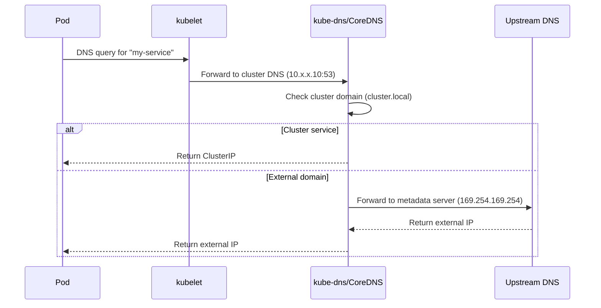

# How to Fix GKE DNS Resolution Failures with kube-dns and CoreDNS

Author: [nawazdhandala](https://www.github.com/nawazdhandala)

Tags: GKE, Kubernetes, DNS, CoreDNS, kube-dns, Networking, Troubleshooting, GCP

Description: A practical guide to diagnosing and fixing DNS resolution failures in GKE clusters, covering both kube-dns and CoreDNS configurations and common failure modes.

---

DNS issues in Kubernetes are sneaky. Everything looks fine until a pod cannot resolve a service name, an external domain, or both. The symptoms vary - timeouts, connection refused, NXDOMAIN responses - but the root cause usually lives in the cluster DNS system. In GKE, that means kube-dns (the default) or CoreDNS if you have migrated.

Let's walk through the most common DNS failures and how to fix each one.

## How DNS Works in GKE

Before debugging, you need to understand the flow. When a pod makes a DNS query:



The kubelet configures each pod's `/etc/resolv.conf` to point at the cluster DNS service IP (usually 10.x.0.10). All DNS queries go through that service.

## Step 1 - Test DNS from Inside a Pod

Start by verifying DNS is actually broken and identifying what type of resolution fails:

```bash
# Launch a debug pod with DNS tools
kubectl run dns-debug --image=busybox:1.36 --rm -it --restart=Never -- sh
```

Inside the debug pod:

```bash
# Test cluster DNS resolution for a service
nslookup kubernetes.default.svc.cluster.local

# Test external DNS resolution
nslookup google.com

# Check the DNS configuration
cat /etc/resolv.conf
```

The resolv.conf should look something like:

```
nameserver 10.48.0.10
search default.svc.cluster.local svc.cluster.local cluster.local
options ndots:5
```

If nslookup hangs or returns errors, you have confirmed a DNS problem.

## Step 2 - Check the DNS Pods

Make sure kube-dns pods are actually running:

```bash
# Check DNS pod status in the kube-system namespace
kubectl get pods -n kube-system -l k8s-app=kube-dns
```

You should see pods in Running state. If they are in CrashLoopBackOff or not present, that is your problem right there.

Check the logs for errors:

```bash
# View kube-dns logs for errors
kubectl logs -n kube-system -l k8s-app=kube-dns --tail=50
```

Common log errors include:
- Connection refused to upstream DNS
- Timeout reaching metadata server
- Resource exhaustion (OOM or CPU throttling)

## Step 3 - Fix DNS Pod Resource Issues

One of the most common causes of DNS failures in busy clusters is kube-dns running out of resources. The default resource allocation is often too small for clusters with many pods or high query rates.

Check if the DNS pods are being CPU-throttled:

```bash
# Check resource usage of DNS pods
kubectl top pods -n kube-system -l k8s-app=kube-dns
```

If the DNS pods are consistently at their CPU limit, increase the resources:

```bash
# Scale up kube-dns resources by editing the deployment
kubectl edit deployment kube-dns -n kube-system
```

Or use kubectl patch:

```bash
# Increase CPU and memory limits for kube-dns
kubectl patch deployment kube-dns -n kube-system --type='json' -p='[
  {
    "op": "replace",
    "path": "/spec/template/spec/containers/0/resources/limits/cpu",
    "value": "200m"
  },
  {
    "op": "replace",
    "path": "/spec/template/spec/containers/0/resources/limits/memory",
    "value": "300Mi"
  }
]'
```

## Step 4 - Scale DNS Pods

In larger clusters, two DNS pods might not be enough. You can scale kube-dns manually or enable DNS autoscaling:

```bash
# Scale kube-dns to more replicas
kubectl scale deployment kube-dns -n kube-system --replicas=4
```

For automatic scaling, check if the dns-autoscaler ConfigMap exists:

```bash
# Check DNS autoscaler configuration
kubectl get configmap dns-autoscaler -n kube-system -o yaml
```

If it exists, you can adjust the scaling parameters:

```yaml
# DNS autoscaler config - adjusts replicas based on cluster size
apiVersion: v1
kind: ConfigMap
metadata:
  name: dns-autoscaler
  namespace: kube-system
data:
  linear: |-
    {
      "coresPerReplica": 128,
      "nodesPerReplica": 4,
      "min": 2,
      "max": 10,
      "preventSinglePointFailure": true
    }
```

This configuration creates one DNS replica per 4 nodes, with a minimum of 2.

## Step 5 - Fix ndots Issues

The `ndots:5` setting in resolv.conf means that any domain with fewer than 5 dots gets the search domains appended first. So a query for `google.com` actually triggers queries for `google.com.default.svc.cluster.local`, `google.com.svc.cluster.local`, `google.com.cluster.local`, and then finally `google.com`.

This multiplies DNS traffic by 4-5x for external domains. For applications that make many external DNS queries, this is a performance killer and can overwhelm your DNS pods.

Fix it per-pod by setting a custom DNS config:

```yaml
# Reduce ndots to 2 for pods that mainly call external services
apiVersion: apps/v1
kind: Deployment
metadata:
  name: external-api-caller
spec:
  template:
    spec:
      dnsConfig:
        options:
        - name: ndots
          value: "2"
        - name: single-request-reopen
          value: ""
      containers:
      - name: app
        image: your-app:latest
```

The `single-request-reopen` option also helps avoid a race condition where A and AAAA queries sent on the same socket interfere with each other.

## Step 6 - Fix External DNS Resolution Failures

If cluster DNS works (services resolve) but external domains do not, the issue is usually with the upstream DNS path.

In GKE, kube-dns forwards external queries to the GCE metadata server at 169.254.169.254. If the metadata server is unreachable, external resolution fails.

Test from the DNS pod directly:

```bash
# Check if the metadata server is reachable from the DNS pod
kubectl exec -n kube-system $(kubectl get pods -n kube-system -l k8s-app=kube-dns -o jsonpath='{.items[0].metadata.name}') -c kubedns -- nslookup google.com 169.254.169.254
```

If that fails, check network policies. A common mistake is deploying a NetworkPolicy that blocks egress from kube-system:

```yaml
# Network policy that accidentally blocks DNS egress
# Check if you have something like this
apiVersion: networking.k8s.io/v1
kind: NetworkPolicy
metadata:
  name: default-deny-egress
  namespace: kube-system  # this will break DNS!
spec:
  podSelector: {}
  policyTypes:
  - Egress
```

If you need network policies in kube-system, make sure DNS pods can reach the metadata server:

```yaml
# Allow kube-dns to reach the metadata server and receive queries
apiVersion: networking.k8s.io/v1
kind: NetworkPolicy
metadata:
  name: allow-dns-egress
  namespace: kube-system
spec:
  podSelector:
    matchLabels:
      k8s-app: kube-dns
  policyTypes:
  - Egress
  egress:
  - to: []  # allow all egress for DNS pods
```

## Step 7 - Debug Intermittent DNS Failures

Intermittent failures are the worst. They work most of the time but randomly fail. In GKE, the most common causes are:

**Conntrack table full**: On busy nodes, the conntrack table (which tracks UDP connections) can fill up, causing DNS packets to be dropped.

```bash
# Check conntrack table usage on a node (SSH first)
cat /proc/sys/net/netfilter/nf_conntrack_count
cat /proc/sys/net/netfilter/nf_conntrack_max
```

**UDP packet loss**: DNS uses UDP by default. Under high load, UDP packets can be silently dropped.

**Race condition with search domains**: The Linux DNS resolver has a known issue where concurrent A and AAAA queries on the same socket can interfere. The fix is the `single-request-reopen` option mentioned earlier.

For persistent intermittent failures, consider enabling NodeLocal DNSCache:

```bash
# Enable NodeLocal DNSCache addon in GKE
gcloud container clusters update your-cluster \
  --update-addons=NodeLocalDNS=ENABLED \
  --zone us-central1-a
```

NodeLocal DNSCache runs a DNS cache on every node, which dramatically reduces the load on kube-dns and eliminates many intermittent failures by avoiding cross-node UDP traffic for cached queries.

## Step 8 - Verify After Fixes

After making changes, run a comprehensive test:

```bash
# Run a thorough DNS test from a debug pod
kubectl run dns-test --image=busybox:1.36 --rm -it --restart=Never -- sh -c '
  echo "=== Cluster DNS ==="
  nslookup kubernetes.default.svc.cluster.local
  echo "=== External DNS ==="
  nslookup google.com
  echo "=== Headless service ==="
  nslookup kube-dns.kube-system.svc.cluster.local
  echo "=== Response time ==="
  time nslookup google.com
'
```

Good DNS response times should be under 10ms for cluster queries and under 50ms for external queries. If you are seeing hundreds of milliseconds, there is still a bottleneck somewhere.

## Summary

DNS failures in GKE usually fall into a few categories: DNS pods overwhelmed, network policies blocking traffic, ndots causing query multiplication, or upstream resolution broken. Start by testing from a debug pod to narrow down the failure type, then work through the specific fix. NodeLocal DNSCache is the single most impactful improvement you can make for DNS reliability in busy clusters.
