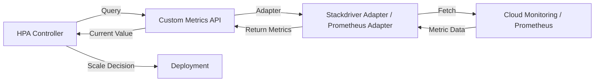

# How to Fix GKE HorizontalPodAutoscaler Not Scaling Based on Custom Metrics

Author: [nawazdhandala](https://www.github.com/nawazdhandala)

Tags: GKE, Kubernetes, HPA, Autoscaling, Custom Metrics, Cloud Monitoring, GCP

Description: Troubleshoot and fix GKE HorizontalPodAutoscaler that fails to scale based on custom metrics, covering metrics adapter setup, metric availability, and HPA configuration.

---

You set up a HorizontalPodAutoscaler with custom metrics - maybe queue depth, request latency, or a business metric - but the HPA is not scaling. It either stays at the minimum replica count or shows "unable to fetch metrics" in its status. Scaling on CPU and memory is straightforward, but custom metrics require extra plumbing that is easy to get wrong.

Let's trace through the entire pipeline and fix it.

## How Custom Metrics HPA Works

The HPA controller periodically queries a metrics API. For custom metrics, the flow involves several components:



For GKE specifically, there are two common approaches:
1. **Custom Metrics Stackdriver Adapter** - reads metrics from Cloud Monitoring
2. **Prometheus Adapter** - reads metrics from Prometheus

Both act as a bridge between the HPA controller and your metrics source.

## Step 1 - Check HPA Status

Start by looking at what the HPA is reporting:

```bash
# Get HPA status with conditions
kubectl get hpa your-hpa -n your-namespace

# Get detailed status including targets and conditions
kubectl describe hpa your-hpa -n your-namespace
```

Look at the TARGETS column and the Conditions section. Common problems:

- `<unknown>/50` - HPA cannot fetch the metric
- `unable to fetch metrics from custom metrics API` - adapter not working
- Metric value is 0 - metric exists but has no data
- Conditions show "FailedGetExternalMetric" or "FailedGetObjectMetric"

## Step 2 - Verify the Metrics Adapter Is Running

Check if the custom metrics adapter is deployed and healthy:

```bash
# Check for the Stackdriver custom metrics adapter
kubectl get pods -n custom-metrics -l app=custom-metrics-stackdriver-adapter

# Or check the kube-system namespace
kubectl get pods -n kube-system -l app=custom-metrics-stackdriver-adapter

# Check adapter logs for errors
kubectl logs -n custom-metrics -l app=custom-metrics-stackdriver-adapter --tail=50
```

If the adapter is not deployed, install it:

```bash
# Deploy the Stackdriver custom metrics adapter
kubectl apply -f https://raw.githubusercontent.com/GoogleCloudPlatform/k8s-stackdriver/master/custom-metrics-stackdriver-adapter/deploy/production/adapter_new_resource_model.yaml
```

Verify the custom metrics API is registered:

```bash
# Check if the custom metrics API is available
kubectl get apiservices | grep custom.metrics
```

You should see `v1beta1.custom.metrics.k8s.io` or `v1beta2.custom.metrics.k8s.io` with `AVAILABLE: True`.

## Step 3 - Verify the Metric Exists in Cloud Monitoring

If you are using the Stackdriver adapter, the metric must exist in Cloud Monitoring. Check it:

```bash
# List available custom metrics
gcloud monitoring metrics list --filter='metric.type=starts_with("custom.googleapis.com")'

# Check specific metric data points
gcloud monitoring time-series list \
  --filter='metric.type="custom.googleapis.com/your_metric_name"' \
  --interval-start-time=$(date -u -v-10M '+%Y-%m-%dT%H:%M:%SZ') \
  --format json
```

If the metric does not appear, your application is not pushing it correctly. Here is an example of pushing a custom metric from a Python application:

```python
# Push a custom metric to Cloud Monitoring
from google.cloud import monitoring_v3
import time

def push_custom_metric(project_id, metric_value):
    client = monitoring_v3.MetricServiceClient()
    project_name = f"projects/{project_id}"

    # Define the custom metric time series
    series = monitoring_v3.TimeSeries()
    series.metric.type = "custom.googleapis.com/queue/depth"
    series.resource.type = "k8s_pod"
    series.resource.labels["project_id"] = project_id
    series.resource.labels["location"] = "us-central1-a"
    series.resource.labels["cluster_name"] = "your-cluster"
    series.resource.labels["namespace_name"] = "your-namespace"
    series.resource.labels["pod_name"] = "your-pod-name"

    # Write the data point
    point = monitoring_v3.Point()
    point.value.double_value = metric_value
    now = time.time()
    point.interval.end_time.seconds = int(now)
    series.points = [point]

    client.create_time_series(name=project_name, time_series=[series])
```

## Step 4 - Test the Metrics API Directly

Verify that the HPA can actually read the metric through the API:

```bash
# Query the custom metrics API for your metric
kubectl get --raw "/apis/custom.metrics.k8s.io/v1beta1/namespaces/your-namespace/pods/*/queue_depth" | python3 -m json.tool
```

For external metrics (metrics not tied to a Kubernetes object):

```bash
# Query the external metrics API
kubectl get --raw "/apis/external.metrics.k8s.io/v1beta1/namespaces/your-namespace/your_metric_name" | python3 -m json.tool
```

If these return errors or empty results, the adapter cannot find the metric. Double-check the metric name, namespace, and labels.

## Step 5 - Fix the HPA Configuration

Make sure the HPA spec correctly references the metric. There are three types of metrics in HPA:

**Pod metrics** - metrics associated with pods (like requests per second per pod):

```yaml
# HPA scaling on a custom pod metric
apiVersion: autoscaling/v2
kind: HorizontalPodAutoscaler
metadata:
  name: queue-worker-hpa
  namespace: your-namespace
spec:
  scaleTargetRef:
    apiVersion: apps/v1
    kind: Deployment
    name: queue-worker
  minReplicas: 2
  maxReplicas: 20
  metrics:
  - type: Pods
    pods:
      metric:
        name: queue_depth   # metric name as it appears in the metrics API
      target:
        type: AverageValue
        averageValue: "100"  # scale up when average per-pod metric exceeds 100
```

**Object metrics** - metrics tied to a specific Kubernetes object:

```yaml
# HPA scaling on an object metric (like Ingress requests per second)
metrics:
- type: Object
  object:
    describedObject:
      apiVersion: networking.k8s.io/v1
      kind: Ingress
      name: your-ingress
    metric:
      name: requests_per_second
    target:
      type: Value
      value: "1000"
```

**External metrics** - metrics from outside Kubernetes (like Pub/Sub queue depth):

```yaml
# HPA scaling on an external metric from Cloud Monitoring
apiVersion: autoscaling/v2
kind: HorizontalPodAutoscaler
metadata:
  name: pubsub-worker-hpa
spec:
  scaleTargetRef:
    apiVersion: apps/v1
    kind: Deployment
    name: pubsub-worker
  minReplicas: 1
  maxReplicas: 50
  metrics:
  - type: External
    external:
      metric:
        name: pubsub.googleapis.com|subscription|num_undelivered_messages
        selector:
          matchLabels:
            resource.labels.subscription_id: your-subscription
      target:
        type: AverageValue
        averageValue: "10"  # target 10 undelivered messages per replica
```

Note: for Stackdriver metrics, the metric name uses `|` as a separator instead of `/`.

## Step 6 - Fix Metric Naming for Stackdriver

The metric name in the HPA must match the format the Stackdriver adapter expects. This is a common source of errors:

- Cloud Monitoring metric: `custom.googleapis.com/queue/depth`
- HPA metric name: `custom.googleapis.com|queue|depth` (replace `/` with `|`)

For built-in GCP metrics like Pub/Sub:
- Cloud Monitoring: `pubsub.googleapis.com/subscription/num_undelivered_messages`
- HPA metric name: `pubsub.googleapis.com|subscription|num_undelivered_messages`

## Step 7 - Check Adapter Permissions

The Stackdriver adapter needs permissions to read metrics from Cloud Monitoring. If you are using Workload Identity:

```bash
# Check the adapter's service account
kubectl get serviceaccount custom-metrics-stackdriver-adapter -n custom-metrics -o yaml

# Verify the GCP service account has monitoring.viewer role
gcloud projects get-iam-policy your-project-id \
  --flatten="bindings[].members" \
  --filter="bindings.role:roles/monitoring.viewer"
```

Grant the necessary permissions:

```bash
# Grant monitoring viewer to the adapter's GCP service account
gcloud projects add-iam-policy-binding your-project-id \
  --member="serviceAccount:adapter-sa@your-project-id.iam.gserviceaccount.com" \
  --role="roles/monitoring.viewer"
```

## Step 8 - Debug Scaling Behavior

If the HPA fetches the metric but does not scale as expected, check the scaling algorithm. The HPA uses this formula:

```
desiredReplicas = ceil(currentReplicas * (currentMetricValue / desiredMetricValue))
```

The HPA will not scale if the ratio is within a tolerance of 0.1 (10%) by default. So if your target is 100 and the current value is 105, the HPA will not scale because it is within tolerance.

Check the current metric values and target:

```bash
# See the current vs target values
kubectl get hpa your-hpa -n your-namespace -o yaml | grep -A 10 currentMetrics
```

Also check the HPA events for scaling decisions:

```bash
# Check HPA scaling events
kubectl get events -n your-namespace --field-selector involvedObject.name=your-hpa
```

## Step 9 - Set Scaling Behavior

Fine-tune how quickly the HPA scales up and down:

```yaml
# Configure scaling behavior for faster scale-up and slower scale-down
apiVersion: autoscaling/v2
kind: HorizontalPodAutoscaler
metadata:
  name: your-hpa
spec:
  scaleTargetRef:
    apiVersion: apps/v1
    kind: Deployment
    name: your-app
  minReplicas: 2
  maxReplicas: 50
  behavior:
    scaleUp:
      stabilizationWindowSeconds: 30   # react quickly to load spikes
      policies:
      - type: Percent
        value: 100                      # can double replicas in one step
        periodSeconds: 60
    scaleDown:
      stabilizationWindowSeconds: 300  # wait 5 min before scaling down
      policies:
      - type: Percent
        value: 10                       # scale down at most 10% at a time
        periodSeconds: 60
  metrics:
  - type: External
    external:
      metric:
        name: custom.googleapis.com|queue|depth
      target:
        type: AverageValue
        averageValue: "50"
```

## Summary

Custom metrics HPA in GKE requires the full pipeline to work: your application pushes metrics, the metrics adapter reads them, and the HPA queries the adapter. When scaling is not working, check each layer - adapter deployment, metric availability, API accessibility, HPA configuration, and metric naming. The metric name format with `|` separators for Stackdriver is the most common gotcha.
