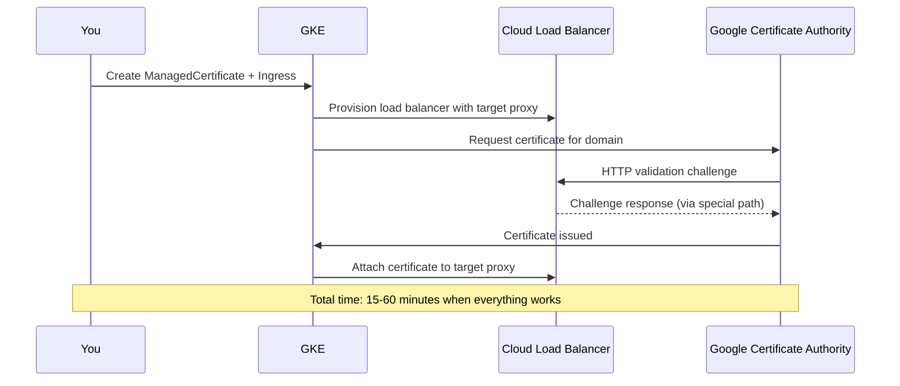

# How to Fix GKE Managed Certificate Stuck in Provisioning State

Author: [nawazdhandala](https://www.github.com/nawazdhandala)

Tags: GKE, Kubernetes, SSL, Managed Certificates, HTTPS, Troubleshooting, GCP

Description: Step-by-step troubleshooting guide for GKE managed certificates that are stuck in Provisioning status, covering DNS configuration, load balancer setup, and common pitfalls.

---

You created a ManagedCertificate resource in GKE, attached it to your Ingress, and waited. And waited some more. The certificate status says "Provisioning" and it has been that way for 30 minutes, an hour, maybe even days. Meanwhile your application is only accessible over HTTP.

Google-managed certificates in GKE use Let's Encrypt-style domain validation under the hood. Several things need to be correctly configured for the validation to succeed. Let's go through each one.

## How Managed Certificate Provisioning Works

When you create a ManagedCertificate and attach it to an Ingress, here is what happens behind the scenes:



The critical step is the HTTP validation. Google's CA makes an HTTP request to your domain to verify you control it. If anything blocks that request, provisioning stalls.

## Step 1 - Check Certificate Status

First, get the current status of your ManagedCertificate:

```bash
# Check the status of managed certificates
kubectl get managedcertificate -n your-namespace

# Get detailed status including domain status
kubectl describe managedcertificate your-cert-name -n your-namespace
```

Look at the Status section. You will see one of these:
- **Provisioning** - still waiting for validation
- **Active** - successfully provisioned
- **FailedNotVisible** - validation failed because the domain is not reachable
- **FailedCAAForbidden** - CAA DNS record blocks Google's CA

## Step 2 - Verify DNS Points to the Load Balancer IP

The most common cause of stuck provisioning is that your domain does not point to the load balancer's IP address. The validation request comes to your domain, and if DNS does not resolve to the load balancer, it fails silently.

Get the Ingress IP:

```bash
# Get the external IP of the Ingress
kubectl get ingress your-ingress -n your-namespace -o jsonpath='{.status.loadBalancer.ingress[0].ip}'
```

Then verify your DNS record matches:

```bash
# Check what IP your domain currently resolves to
dig +short your-domain.com
nslookup your-domain.com
```

If they do not match, update your DNS A record. If you just changed DNS, remember that propagation can take up to 48 hours depending on the TTL of the old record. Use a low TTL (300 seconds) when setting up new records.

## Step 3 - Ensure the Ingress References the Certificate

The ManagedCertificate must be linked to the Ingress via an annotation. Check that the annotation is correct:

```bash
# Check the Ingress annotations for certificate reference
kubectl get ingress your-ingress -n your-namespace -o jsonpath='{.metadata.annotations.networking\.gke\.io/managed-certificates}'
```

The annotation should look like:

```yaml
# Correct Ingress configuration with managed certificate
apiVersion: networking.k8s.io/v1
kind: Ingress
metadata:
  name: your-ingress
  annotations:
    # This must match the ManagedCertificate resource name exactly
    networking.gke.io/managed-certificates: "your-cert-name"
    # Optional: redirect HTTP to HTTPS after cert is active
    kubernetes.io/ingress.allow-http: "true"
spec:
  rules:
  - host: your-domain.com
    http:
      paths:
      - path: /
        pathType: Prefix
        backend:
          service:
            name: your-service
            port:
              number: 80
```

Important: the ManagedCertificate domain must match the host in the Ingress rules. If your cert is for `www.example.com` but your Ingress rule has `example.com`, provisioning will fail.

## Step 4 - Check That HTTP Port 80 Is Open

Google's CA validates the domain over HTTP (port 80). If you have a firewall rule blocking port 80 or if you deleted the HTTP forwarding rule, validation cannot succeed.

```bash
# Check that the load balancer has both HTTP and HTTPS forwarding rules
gcloud compute forwarding-rules list --filter="description~your-ingress"
```

You should see two forwarding rules - one for port 80 and one for port 443. If the port 80 rule is missing, make sure your Ingress has this annotation:

```yaml
# Keep HTTP open during certificate provisioning
annotations:
  kubernetes.io/ingress.allow-http: "true"
```

Do not set `kubernetes.io/ingress.allow-http: "false"` until the certificate is Active. Blocking port 80 during provisioning will prevent validation.

## Step 5 - Check CAA DNS Records

Certificate Authority Authorization (CAA) records specify which CAs are allowed to issue certificates for your domain. If you have CAA records that do not include Google's CA, provisioning will fail.

```bash
# Check CAA records for your domain
dig CAA your-domain.com
```

If you have CAA records, make sure `pki.goog` is included:

```
your-domain.com.  300  IN  CAA  0 issue "pki.goog"
```

If you do not have any CAA records, that is fine - the absence of CAA records means any CA can issue certificates.

## Step 6 - Verify the Load Balancer Is Healthy

The certificate provisioning process requires the load balancer to be able to serve the validation challenge. If all backends are unhealthy, the load balancer returns 502, and the validation fails.

Check backend health:

```bash
# Check health of all backend services
gcloud compute backend-services list --global
gcloud compute backend-services get-health BACKEND_SERVICE_NAME --global
```

If backends are unhealthy, fix the health check issues first (see the health check section from GKE Ingress troubleshooting). The certificate will not provision until the load balancer can serve traffic.

## Step 7 - Handle Multiple Domains

If your ManagedCertificate covers multiple domains, all of them must pass validation. One failing domain blocks the entire certificate.

```yaml
# ManagedCertificate with multiple domains
apiVersion: networking.gke.io/v1
kind: ManagedCertificate
metadata:
  name: multi-domain-cert
spec:
  domains:
  - example.com
  - www.example.com
  - api.example.com
```

All three domains must have DNS A records pointing to the load balancer IP. Check each one individually:

```bash
# Verify each domain resolves to the load balancer IP
for domain in example.com www.example.com api.example.com; do
  echo "$domain -> $(dig +short $domain)"
done
```

If one domain is problematic, consider splitting into separate ManagedCertificates so one failure does not block the others.

## Step 8 - The Nuclear Option - Recreate

Sometimes the certificate gets stuck in a bad state and the fastest fix is to delete and recreate it:

```bash
# Delete the stuck certificate
kubectl delete managedcertificate your-cert-name -n your-namespace

# Wait a moment for cleanup
sleep 30

# Recreate it
kubectl apply -f your-managed-certificate.yaml
```

After recreation, verify the Ingress annotation still references it and give it 15-30 minutes to provision.

## Step 9 - Use Static IP for Stability

If you are recreating Ingresses frequently, reserve a static IP so your DNS records do not need to change:

```bash
# Reserve a static external IP
gcloud compute addresses create your-static-ip --global

# Get the reserved IP
gcloud compute addresses describe your-static-ip --global --format='value(address)'
```

Reference it in your Ingress:

```yaml
# Use a static IP to avoid DNS changes during Ingress recreation
apiVersion: networking.k8s.io/v1
kind: Ingress
metadata:
  name: your-ingress
  annotations:
    kubernetes.io/ingress.global-static-ip-name: "your-static-ip"
    networking.gke.io/managed-certificates: "your-cert-name"
spec:
  rules:
  - host: your-domain.com
    http:
      paths:
      - path: /
        pathType: Prefix
        backend:
          service:
            name: your-service
            port:
              number: 80
```

## Timing Expectations

Normal provisioning takes 15-60 minutes. If it has been more than 2 hours, something is definitely wrong. Here is a timeline:

- **0-5 minutes**: Load balancer resources being created
- **5-15 minutes**: Health checks stabilizing, backends becoming healthy
- **15-30 minutes**: Certificate validation attempt
- **30-60 minutes**: Certificate issued and attached

If you are past 60 minutes, go back through steps 2-6 and check each one carefully. The status will usually give you a hint - FailedNotVisible means DNS or reachability, FailedCAAForbidden means CAA records.

## Summary

GKE managed certificate provisioning is mostly automatic, but it needs a few things to be right: DNS pointing to the load balancer IP, port 80 open for validation, healthy backends, correct Ingress annotations, and no restrictive CAA records. Work through these systematically and you will get your certificate to Active status.
