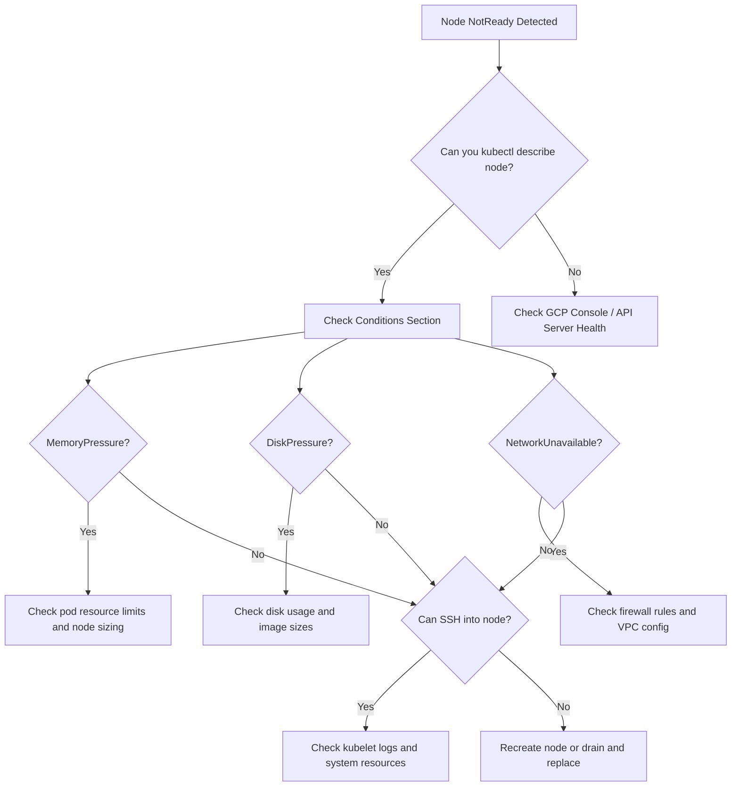

# How to Fix GKE Node NotReady Status and Kubelet Failures

Author: [nawazdhandala](https://www.github.com/nawazdhandala)

Tags: GCP, GKE, Kubernetes, Kubelet, Node Management, Troubleshooting

Description: Learn how to diagnose and fix GKE node NotReady status and kubelet failures, including common causes like resource exhaustion, network issues, and disk pressure.

---

If you have spent any time running workloads on Google Kubernetes Engine (GKE), you have probably encountered the dreaded "NotReady" status on one or more of your nodes. It is one of those problems that can cascade quickly - pods get evicted, workloads get disrupted, and suddenly your on-call engineer is having a rough night. In this post, I will walk through the common causes, diagnostic steps, and fixes for GKE node NotReady status and kubelet failures.

## What Does NotReady Actually Mean?

When a node shows as NotReady, it means the Kubernetes control plane has lost communication with the kubelet running on that node. The kubelet is the agent that runs on every node and is responsible for managing pods, reporting node status, and communicating with the API server. When the kubelet stops sending heartbeats, the control plane marks the node as NotReady after a configurable timeout (default is 40 seconds).

You can check node status with a simple kubectl command.

```bash
# Check the status of all nodes in the cluster
kubectl get nodes

# Get detailed information about a specific node
kubectl describe node <node-name>
```

The `describe` output is where the real information lives. Look at the Conditions section carefully - it will tell you whether the issue is related to memory pressure, disk pressure, PID pressure, or network unavailability.

## Common Causes of NotReady Status

### 1. Resource Exhaustion

This is by far the most common cause I have seen. When a node runs out of memory, CPU, or disk space, the kubelet can become unresponsive. GKE nodes running workloads without proper resource limits are especially vulnerable.

Check for resource pressure conditions on the node.

```bash
# Check node conditions for resource pressure
kubectl get node <node-name> -o jsonpath='{.status.conditions[*]}' | python3 -m json.tool

# Check actual resource usage on the node
kubectl top node <node-name>
```

If you see MemoryPressure or DiskPressure set to True, that is your culprit. The fix is to either scale up your node pool or set proper resource requests and limits on your workloads.

### 2. Disk Pressure from Container Images and Logs

GKE nodes use ephemeral storage for container images, writable layers, and logs. If you are running many containers with large images, or your applications are writing excessive logs, the disk can fill up fast.

```bash
# SSH into the node to check disk usage (using gcloud)
gcloud compute ssh <node-name> --zone <zone> --project <project-id>

# Once on the node, check disk usage
df -h

# Check for large log files
du -sh /var/log/containers/*
```

To prevent this, consider increasing the boot disk size when creating your node pool.

```bash
# Create a node pool with larger boot disk
gcloud container node-pools create high-disk-pool \
    --cluster=my-cluster \
    --zone=us-central1-a \
    --disk-size=200GB \
    --disk-type=pd-ssd \
    --num-nodes=3
```

### 3. Kubelet Process Crashes

Sometimes the kubelet process itself crashes or gets OOM-killed by the operating system. This is different from Kubernetes-level memory pressure - the host OS is actually killing the kubelet process because the node is critically low on memory.

If you can SSH into the node, check the kubelet logs.

```bash
# Check kubelet service status
sudo systemctl status kubelet

# View recent kubelet logs
sudo journalctl -u kubelet --since "30 minutes ago" --no-pager

# Check for OOM kills in kernel logs
sudo dmesg | grep -i "oom\|killed"
```

If you see OOM kill messages targeting the kubelet, you need to reserve more resources for system components. GKE handles this automatically through system-reserved and kube-reserved settings, but workloads with no resource limits can still consume everything.

### 4. Network Connectivity Issues

The kubelet needs to communicate with the GKE control plane. If there is a network partition, firewall rule change, or VPC misconfiguration, the node will appear as NotReady even though it is perfectly healthy otherwise.

```bash
# Check firewall rules for GKE
gcloud compute firewall-rules list --filter="network:<your-vpc>"

# Verify the node can reach the API server
# (from the node itself)
curl -k https://<api-server-ip>/healthz
```

Common networking culprits include accidentally deleting the default GKE firewall rules, VPC peering issues with private clusters, and Cloud NAT misconfigurations for nodes without external IPs.

### 5. Node Auto-Repair in Progress

GKE has a built-in node auto-repair feature. If a node is unhealthy for an extended period, GKE will automatically try to repair it by draining and recreating the node. During this process, the node may show as NotReady.

```bash
# Check if auto-repair is enabled
gcloud container node-pools describe default-pool \
    --cluster=my-cluster \
    --zone=us-central1-a \
    --format="value(management.autoRepair)"

# Check node pool operations for repair activity
gcloud container operations list \
    --filter="operationType=REPAIR_CLUSTER" \
    --zone=us-central1-a
```

## Step-by-Step Diagnosis Workflow

Here is the workflow I follow whenever I encounter a NotReady node.



## Preventive Measures

### Set Resource Requests and Limits

This is the single most impactful thing you can do. Every container should have resource requests and limits defined.

```yaml
# Example pod spec with proper resource management
apiVersion: v1
kind: Pod
metadata:
  name: my-app
spec:
  containers:
  - name: my-app
    image: my-app:latest
    resources:
      requests:
        memory: "256Mi"
        cpu: "250m"
      limits:
        memory: "512Mi"
        cpu: "500m"
```

### Use Pod Disruption Budgets

PDBs will not prevent NotReady status, but they will protect your workloads during node disruptions.

```yaml
# Ensure at least 2 replicas are always available during disruptions
apiVersion: policy/v1
kind: PodDisruptionBudget
metadata:
  name: my-app-pdb
spec:
  minAvailable: 2
  selector:
    matchLabels:
      app: my-app
```

### Enable Node Auto-Repair and Auto-Upgrade

GKE can automatically detect and repair unhealthy nodes. Make sure these features are enabled.

```bash
# Enable auto-repair and auto-upgrade on a node pool
gcloud container node-pools update default-pool \
    --cluster=my-cluster \
    --zone=us-central1-a \
    --enable-autorepair \
    --enable-autoupgrade
```

### Monitor with Cloud Monitoring

Set up alerts for node conditions so you catch issues before they become outages.

```bash
# Create an alerting policy for node NotReady conditions
gcloud alpha monitoring policies create \
    --notification-channels=<channel-id> \
    --display-name="GKE Node NotReady Alert" \
    --condition-display-name="Node is NotReady" \
    --condition-filter='resource.type="k8s_node" AND metric.type="kubernetes.io/node/status_condition" AND metric.labels.condition="Ready" AND metric.labels.status="false"'
```

## When All Else Fails - Cordon, Drain, and Replace

If you cannot fix the underlying issue quickly, the safest approach is to cordon the node (prevent new pods from being scheduled), drain it (move existing pods to healthy nodes), and then delete it so the node pool can create a fresh replacement.

```bash
# Cordon the node to prevent new scheduling
kubectl cordon <node-name>

# Drain the node gracefully (move pods to other nodes)
kubectl drain <node-name> --ignore-daemonsets --delete-emptydir-data --timeout=300s

# Delete the node instance so the node pool creates a replacement
gcloud compute instances delete <node-name> --zone=<zone> --quiet
```

The managed instance group backing your GKE node pool will automatically create a new node to maintain the desired count.

## Wrapping Up

GKE node NotReady issues are almost always caused by resource exhaustion, network problems, or kubelet process failures. The key is having good monitoring in place so you catch these issues early, and having proper resource limits on your workloads so a single misbehaving pod cannot take down an entire node. With the diagnostic steps and preventive measures outlined here, you should be well equipped to handle these situations when they arise.
