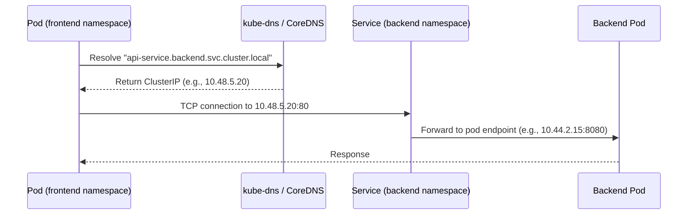

# How to Fix GKE Pod-to-Service Communication Failures Across Namespaces

Author: [nawazdhandala](https://www.github.com/nawazdhandala)

Tags: GKE, Kubernetes, Networking, DNS, Cross-Namespace, Services, Troubleshooting, GCP

Description: Diagnose and fix pod-to-service communication failures across Kubernetes namespaces in GKE, covering DNS resolution, network policies, and service configuration issues.

---

Your pods in namespace A cannot reach a service in namespace B. The requests either time out, get DNS errors, or return connection refused. Cross-namespace communication in Kubernetes should just work out of the box, but several things can interfere - DNS misconfiguration, network policies, service type mismatches, or even typos in the service address.

Let's trace the problem from start to finish.

## How Cross-Namespace Service Communication Works

When a pod in namespace `frontend` calls a service in namespace `backend`, the DNS resolution path is:



The fully qualified service address for cross-namespace calls is:

```
<service-name>.<namespace>.svc.cluster.local
```

If you are just using the short service name (like `api-service`) without the namespace, DNS will only search the pod's own namespace. That is the most common mistake.

## Step 1 - Verify the DNS Name

First, make sure you are using the correct fully-qualified name:

```bash
# Start a debug pod to test DNS resolution
kubectl run dns-test --image=busybox:1.36 --rm -it --restart=Never -n frontend -- sh
```

Inside the pod, test resolution:

```bash
# This will FAIL if the service is in a different namespace
nslookup api-service

# This should work for cross-namespace resolution
nslookup api-service.backend.svc.cluster.local

# Also test with just the namespace suffix
nslookup api-service.backend
```

If `api-service.backend.svc.cluster.local` resolves but `api-service` does not, your application code needs to use the full name. The short name only works within the same namespace.

## Step 2 - Verify the Service Exists and Has Endpoints

Check that the target service exists in the right namespace and has healthy endpoints:

```bash
# Verify the service exists in the target namespace
kubectl get svc api-service -n backend

# Check if the service has endpoints (pods backing it)
kubectl get endpoints api-service -n backend
```

If the endpoints list is empty, the service selector does not match any running pods. Compare the selector with pod labels:

```bash
# Check the service selector
kubectl get svc api-service -n backend -o jsonpath='{.spec.selector}'

# List pods in the namespace with their labels
kubectl get pods -n backend --show-labels
```

A common issue is that the service was created in the wrong namespace or the pod labels changed during a deployment update.

## Step 3 - Test Connectivity Directly

If DNS resolves correctly, test the actual TCP connection:

```bash
# From the debug pod, test TCP connectivity to the service ClusterIP
wget -T 5 -O- http://api-service.backend.svc.cluster.local:80/healthz

# Test with the ClusterIP directly to rule out DNS issues
wget -T 5 -O- http://10.48.5.20:80/healthz

# Test TCP connection with netcat
nc -zv api-service.backend.svc.cluster.local 80
```

Different failure modes mean different things:
- **DNS timeout** - DNS problem (see DNS troubleshooting)
- **Connection timeout** - Network policy or routing issue
- **Connection refused** - Service exists but no pods are listening on that port
- **HTTP error** - Connection works but application returns an error

## Step 4 - Check Network Policies

Network policies are the most common cause of cross-namespace communication failures. Check both the source and target namespaces:

```bash
# Check network policies in the target namespace
kubectl get networkpolicy -n backend

# Check network policies in the source namespace (for egress rules)
kubectl get networkpolicy -n frontend
```

If you find policies, check if they allow cross-namespace traffic. A default-deny ingress policy in the backend namespace will block all traffic unless an explicit allow rule exists:

```yaml
# Allow ingress from the frontend namespace to backend pods
apiVersion: networking.k8s.io/v1
kind: NetworkPolicy
metadata:
  name: allow-frontend-to-backend
  namespace: backend
spec:
  podSelector:
    matchLabels:
      app: api-service
  policyTypes:
  - Ingress
  ingress:
  - from:
    - namespaceSelector:
        matchLabels:
          kubernetes.io/metadata.name: frontend
    ports:
    - protocol: TCP
      port: 8080
```

And if the source namespace has egress restrictions, allow egress to the backend:

```yaml
# Allow egress from frontend pods to the backend namespace
apiVersion: networking.k8s.io/v1
kind: NetworkPolicy
metadata:
  name: allow-egress-to-backend
  namespace: frontend
spec:
  podSelector:
    matchLabels:
      app: web-frontend
  policyTypes:
  - Egress
  egress:
  - to:
    - namespaceSelector:
        matchLabels:
          kubernetes.io/metadata.name: backend
    ports:
    - protocol: TCP
      port: 8080
  # Do not forget DNS egress
  - to:
    - namespaceSelector:
        matchLabels:
          kubernetes.io/metadata.name: kube-system
    ports:
    - protocol: UDP
      port: 53
```

## Step 5 - Fix Service Port Configuration

Port mismatches are another frequent cause. There are three port values to get right:

```yaml
# Service with clear port mapping
apiVersion: v1
kind: Service
metadata:
  name: api-service
  namespace: backend
spec:
  selector:
    app: api-service
  ports:
  - name: http
    port: 80            # port exposed by the service (what callers use)
    targetPort: 8080    # port on the pod (where the app listens)
    protocol: TCP
```

When a pod calls `api-service.backend:80`, the service forwards to port 8080 on the backend pods. If your application listens on 8080 but the service's targetPort is 80, you get connection refused.

Verify the application port:

```bash
# Check what port the container is configured with
kubectl get pods -n backend -l app=api-service -o jsonpath='{.items[0].spec.containers[0].ports[*].containerPort}'

# Test the pod directly (bypassing the service)
POD_IP=$(kubectl get pod -n backend -l app=api-service -o jsonpath='{.items[0].status.podIP}')
kubectl run curl-test --image=curlimages/curl --rm -it --restart=Never -- curl -v http://$POD_IP:8080/healthz
```

## Step 6 - Check for Headless Service Issues

If the target service is headless (`clusterIP: None`), DNS resolution behaves differently. Instead of returning a single ClusterIP, it returns the IPs of all pods:

```bash
# Check if the service is headless
kubectl get svc api-service -n backend -o jsonpath='{.spec.clusterIP}'
```

If it returns "None," DNS resolution returns pod IPs directly. This is fine for clients that handle multiple IPs, but some applications expect a single IP and break with headless services.

For cross-namespace calls to headless services, you might need to handle multiple DNS records:

```bash
# DNS lookup returns multiple pod IPs for headless services
nslookup api-service.backend.svc.cluster.local
```

If you need a single stable IP, consider switching to a regular ClusterIP service.

## Step 7 - Debug with Service Mesh

If you are running Istio or another service mesh, cross-namespace traffic routing can be affected by mesh configuration:

```bash
# Check if Istio sidecar injection is enabled for both namespaces
kubectl get namespace frontend -o jsonpath='{.metadata.labels.istio-injection}'
kubectl get namespace backend -o jsonpath='{.metadata.labels.istio-injection}'
```

If one namespace has sidecar injection and the other does not, traffic between them might have mTLS issues. Either enable injection in both or configure a PeerAuthentication policy that allows plaintext:

```yaml
# Allow plaintext traffic from non-mesh namespaces
apiVersion: security.istio.io/v1beta1
kind: PeerAuthentication
metadata:
  name: allow-plaintext
  namespace: backend
spec:
  mtls:
    mode: PERMISSIVE
```

## Step 8 - Use ExternalName for Clarity

If you want pods in one namespace to reference a service in another namespace using a short name, you can create an ExternalName service:

```yaml
# Create a local alias for a service in another namespace
apiVersion: v1
kind: Service
metadata:
  name: api-service
  namespace: frontend
spec:
  type: ExternalName
  externalName: api-service.backend.svc.cluster.local
```

Now pods in the `frontend` namespace can call `api-service` without specifying the full namespace path. The DNS resolution will redirect to the actual service in the `backend` namespace.

## Diagnostic Checklist

When cross-namespace service communication fails:

1. Use the fully-qualified service name: `service.namespace.svc.cluster.local`
2. Verify the service exists in the target namespace with endpoints
3. Test DNS resolution from a debug pod
4. Test TCP connectivity directly
5. Check network policies in both source and target namespaces
6. Verify port mapping (service port vs targetPort vs containerPort)
7. Check for service mesh interference
8. Review namespace labels if using namespaceSelector in policies

Most cross-namespace failures are either missing namespace in the DNS name, network policies blocking traffic, or port mismatches. Start with DNS and work your way down.
