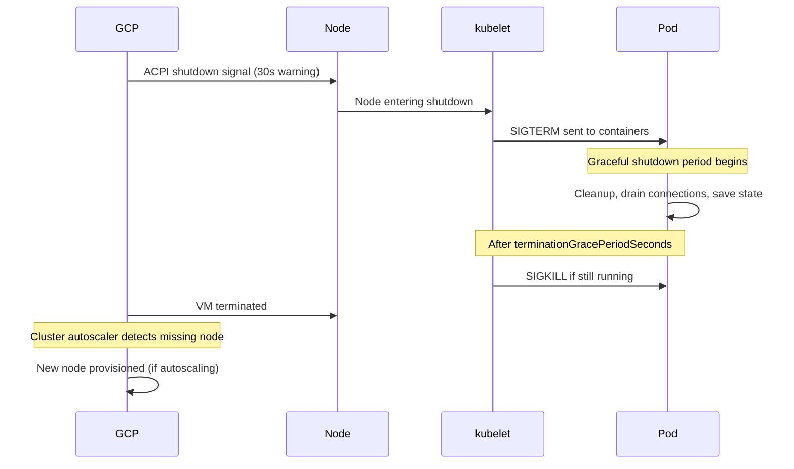

# How to Fix GKE Preemptible Node Unexpected Termination Causing Workload Disruption

Author: [nawazdhandala](https://www.github.com/nawazdhandala)

Tags: GKE, Kubernetes, Preemptible VMs, Spot VMs, Workload Disruption, High Availability, GCP

Description: Learn how to handle GKE preemptible and spot node terminations gracefully by configuring pod disruption budgets, graceful shutdown, and workload placement strategies.

---

Preemptible (and Spot) VMs in GKE are great for reducing costs - up to 60-91% cheaper than regular instances. But they come with a catch: Google can terminate them at any time with only 30 seconds of notice. When that happens, all pods on the node are killed, and if your workloads are not prepared for sudden termination, you get service outages.

Let's set up your GKE workloads to handle preemptible node terminations without disruption.

## How Preemptible Node Termination Works

When Google reclaims a preemptible node, here is the sequence of events:



The 30-second warning is not guaranteed to reach your pods in full. Between the kubelet draining and SIGTERM propagation, your containers might only get 15-20 seconds of actual graceful shutdown time.

## Step 1 - Handle SIGTERM in Your Application

The most important thing is that your application handles SIGTERM properly. When the node is preempted, the kubelet sends SIGTERM to your container process. Your application should:

1. Stop accepting new requests
2. Finish processing in-flight requests
3. Close database connections cleanly
4. Exit with code 0

Here is an example for a Node.js application:

```javascript
// Handle graceful shutdown on SIGTERM from kubelet
const server = app.listen(8080);

process.on('SIGTERM', () => {
  console.log('SIGTERM received, starting graceful shutdown');

  // Stop accepting new connections
  server.close(() => {
    console.log('All connections closed, exiting');
    process.exit(0);
  });

  // Force exit after 25 seconds if connections are not drained
  setTimeout(() => {
    console.log('Forceful shutdown after timeout');
    process.exit(1);
  }, 25000);
});
```

And for a Go application:

```go
// Graceful shutdown handler for SIGTERM in Go
func main() {
    srv := &http.Server{Addr: ":8080"}

    // Start server in a goroutine
    go func() {
        if err := srv.ListenAndServe(); err != http.ErrServerClosed {
            log.Fatalf("Server error: %v", err)
        }
    }()

    // Wait for SIGTERM
    quit := make(chan os.Signal, 1)
    signal.Notify(quit, syscall.SIGTERM, syscall.SIGINT)
    <-quit

    log.Println("Shutting down gracefully...")
    ctx, cancel := context.WithTimeout(context.Background(), 25*time.Second)
    defer cancel()

    if err := srv.Shutdown(ctx); err != nil {
        log.Fatalf("Forced shutdown: %v", err)
    }
    log.Println("Server stopped")
}
```

## Step 2 - Configure terminationGracePeriodSeconds

Set the termination grace period in your pod spec. This controls how long the kubelet waits between sending SIGTERM and SIGKILL:

```yaml
# Set a grace period that fits within the preemption window
apiVersion: apps/v1
kind: Deployment
metadata:
  name: your-app
spec:
  template:
    spec:
      terminationGracePeriodSeconds: 25  # must be less than 30s preemption window
      containers:
      - name: app
        image: your-app:latest
        lifecycle:
          preStop:
            exec:
              # Give the load balancer time to remove this pod from rotation
              command: ["/bin/sh", "-c", "sleep 5"]
```

The `preStop` hook runs before SIGTERM is sent. The 5-second sleep gives the load balancer and service mesh time to remove the pod from its endpoint list, preventing traffic from being routed to a pod that is shutting down.

## Step 3 - Set Up Pod Disruption Budgets

Pod Disruption Budgets (PDBs) do not prevent preemptible terminations (those are involuntary disruptions), but they protect your workloads during voluntary disruptions like node upgrades and cluster autoscaler scale-downs:

```yaml
# PDB ensures at least 2 replicas are always available
apiVersion: policy/v1
kind: PodDisruptionBudget
metadata:
  name: your-app-pdb
  namespace: production
spec:
  minAvailable: 2
  selector:
    matchLabels:
      app: your-app
```

For preemptible-specific protection, you need enough replicas spread across multiple nodes so that losing one node does not take down the entire service.

## Step 4 - Spread Pods Across Nodes

Use pod anti-affinity to ensure replicas are not all on the same preemptible node:

```yaml
# Spread replicas across different nodes to survive node preemption
apiVersion: apps/v1
kind: Deployment
metadata:
  name: your-app
spec:
  replicas: 3
  template:
    spec:
      topologySpreadConstraints:
      - maxSkew: 1
        topologyKey: kubernetes.io/hostname
        whenUnsatisfiable: DoNotSchedule
        labelSelector:
          matchLabels:
            app: your-app
      containers:
      - name: app
        image: your-app:latest
```

This ensures pods are distributed evenly across nodes. If one node gets preempted, only one replica goes down.

For even better resilience, spread across zones:

```yaml
# Spread across both nodes and zones
topologySpreadConstraints:
- maxSkew: 1
  topologyKey: topology.kubernetes.io/zone
  whenUnsatisfiable: DoNotSchedule
  labelSelector:
    matchLabels:
      app: your-app
- maxSkew: 1
  topologyKey: kubernetes.io/hostname
  whenUnsatisfiable: ScheduleAnyway
  labelSelector:
    matchLabels:
      app: your-app
```

## Step 5 - Mix Preemptible and Regular Nodes

For critical workloads, use a mix of preemptible and regular node pools. Schedule the minimum required replicas on regular nodes and additional replicas on preemptible nodes for cost savings:

```bash
# Create a regular node pool for critical workloads
gcloud container node-pools create stable-pool \
  --cluster your-cluster \
  --machine-type e2-standard-4 \
  --num-nodes 2 \
  --zone us-central1-a

# Create a preemptible pool for burst capacity
gcloud container node-pools create preemptible-pool \
  --cluster your-cluster \
  --machine-type e2-standard-4 \
  --preemptible \
  --num-nodes 3 \
  --enable-autoscaling \
  --min-nodes 0 \
  --max-nodes 10 \
  --zone us-central1-a
```

Then use node affinity to prefer preemptible nodes but allow scheduling on regular ones:

```yaml
# Prefer preemptible nodes but fall back to regular nodes
spec:
  affinity:
    nodeAffinity:
      preferredDuringSchedulingIgnoredDuringExecution:
      - weight: 80
        preference:
          matchExpressions:
          - key: cloud.google.com/gke-preemptible
            operator: Exists
```

For the minimum required replicas that must always be available, force them onto stable nodes:

```yaml
# Critical replicas must run on stable nodes
spec:
  affinity:
    nodeAffinity:
      requiredDuringSchedulingIgnoredDuringExecution:
        nodeSelectorTerms:
        - matchExpressions:
          - key: cloud.google.com/gke-preemptible
            operator: DoesNotExist
```

## Step 6 - Use Spot VMs Instead of Preemptible

GCP Spot VMs have replaced preemptible VMs for most use cases. They offer the same cost savings but with better availability in some cases:

```bash
# Create a Spot VM node pool
gcloud container node-pools create spot-pool \
  --cluster your-cluster \
  --machine-type e2-standard-4 \
  --spot \
  --num-nodes 3 \
  --enable-autoscaling \
  --min-nodes 0 \
  --max-nodes 10 \
  --zone us-central1-a
```

Spot VMs have the same termination behavior as preemptible VMs, so all the same resilience patterns apply.

## Step 7 - Monitor Preemption Events

Set up monitoring to track preemption frequency and impact:

```bash
# Check for node preemption events in the cluster
kubectl get events --all-namespaces --field-selector reason=Preempted
```

You can also monitor using Cloud Logging:

```bash
# Query preemption events from Cloud Logging
gcloud logging read 'resource.type="gce_instance" AND protoPayload.methodName="compute.instances.preempted"' \
  --limit 20 \
  --format json
```

Set up an alert so you know when preemptions spike:

```bash
# Create a notification for high preemption rates
gcloud alpha monitoring policies create \
  --display-name="High Preemption Rate" \
  --condition-display-name="Many nodes preempted" \
  --condition-filter='metric.type="compute.googleapis.com/instance/uptime" AND resource.type="gce_instance"' \
  --notification-channels="CHANNEL_ID"
```

## Step 8 - Handle Stateful Workloads

Stateful workloads on preemptible nodes need extra care. Use persistent volumes so data survives node termination:

```yaml
# StatefulSet with persistent storage on preemptible nodes
apiVersion: apps/v1
kind: StatefulSet
metadata:
  name: database
spec:
  replicas: 3
  template:
    spec:
      terminationGracePeriodSeconds: 25
      containers:
      - name: db
        image: postgres:15
        volumeMounts:
        - name: data
          mountPath: /var/lib/postgresql/data
  volumeClaimTemplates:
  - metadata:
      name: data
    spec:
      accessModes: ["ReadWriteOnce"]
      storageClassName: standard-rw
      resources:
        requests:
          storage: 50Gi
```

The PVC survives the node termination, and when the pod is rescheduled, it reattaches the same disk (as long as it is in the same zone).

## Summary

Preemptible nodes will terminate - that is guaranteed. The question is whether your workloads handle it gracefully. The key practices are:

1. Handle SIGTERM in your application code
2. Keep terminationGracePeriodSeconds under 30 seconds
3. Run multiple replicas spread across nodes and zones
4. Mix preemptible and regular nodes for critical services
5. Use PDBs for voluntary disruption protection
6. Monitor preemption events

With these patterns in place, preemptible node terminations become a normal operational event rather than an incident.
