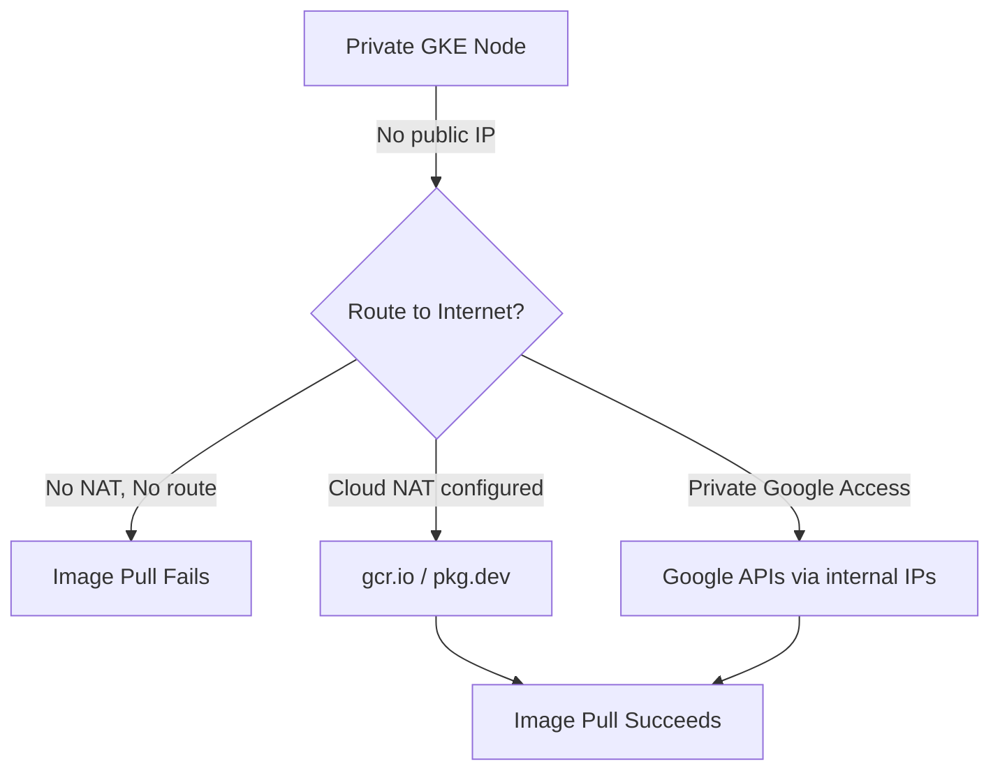

# How to Fix GKE Private Cluster Nodes Unable to Pull Images from Container Registry

Author: [nawazdhandala](https://www.github.com/nawazdhandala)

Tags: GKE, Kubernetes, Private Cluster, Container Registry, Artifact Registry, Networking, GCP

Description: Fix image pull failures in GKE private clusters where nodes cannot reach Container Registry or Artifact Registry due to missing network configuration.

---

You set up a GKE private cluster for security, and now your pods are stuck in ImagePullBackOff. The nodes cannot reach Container Registry (gcr.io) or Artifact Registry (pkg.dev) to download container images. This is a predictable consequence of private clusters - the nodes have no public IP addresses and cannot reach public endpoints without additional network configuration.

Let's fix the networking so your private cluster nodes can pull images.

## Why Private Clusters Cannot Pull Images by Default

In a GKE private cluster, nodes only have internal IP addresses. They cannot initiate connections to the public internet without explicit network configuration:



There are two main approaches to fix this: Cloud NAT and Private Google Access. Private Google Access is the better option for most cases because the traffic stays on Google's network.

## Step 1 - Verify the Problem

Confirm the pods are failing due to image pull issues:

```bash
# Check pod status for ImagePullBackOff
kubectl get pods -n your-namespace

# Get detailed error from the pod events
kubectl describe pod your-pod -n your-namespace
```

Look for events like:
- `Failed to pull image "gcr.io/...": rpc error: code = Unknown desc = Error response from daemon: Get "https://gcr.io/v2/...": dial tcp: i/o timeout`
- `ErrImagePull` or `ImagePullBackOff`

The "i/o timeout" or "context deadline exceeded" messages confirm the node cannot reach the registry endpoint.

## Step 2 - Enable Private Google Access

Private Google Access allows VMs with only internal IPs to reach Google APIs (including Container Registry and Artifact Registry) through Google's internal network. Enable it on the subnet your GKE nodes use:

```bash
# Find the subnet your cluster uses
gcloud container clusters describe your-cluster \
  --zone us-central1-a \
  --format="value(subnetwork)"

# Enable Private Google Access on that subnet
gcloud compute networks subnets update your-subnet \
  --region us-central1 \
  --enable-private-google-access
```

Verify it is enabled:

```bash
# Confirm Private Google Access is on
gcloud compute networks subnets describe your-subnet \
  --region us-central1 \
  --format="value(privateIpGoogleAccess)"
```

This should return `True`.

## Step 3 - Configure DNS for Private Google Access

For Private Google Access to work with Container Registry and Artifact Registry, DNS must resolve the API endpoints to the correct internal addresses. There are two options.

**Option A - Use the default DNS resolution** (simplest):

With Private Google Access enabled, the default DNS resolution works. Requests to `gcr.io` and `pkg.dev` are routed through Google's internal network automatically. No additional DNS configuration needed in most cases.

**Option B - Use restricted.googleapis.com or private.googleapis.com**:

For VPC Service Controls or additional security, configure DNS to resolve Google API domains to restricted IP ranges:

```bash
# Create a Cloud DNS private zone for googleapis.com
gcloud dns managed-zones create google-apis \
  --dns-name="googleapis.com." \
  --visibility=private \
  --networks=your-vpc-network \
  --description="Route Google APIs through internal IPs"

# Add records pointing to the Private Google Access IP ranges
gcloud dns record-sets create googleapis.com. \
  --zone=google-apis \
  --type=A \
  --ttl=300 \
  --rrdatas="199.36.153.8,199.36.153.9,199.36.153.10,199.36.153.11"

# Add CNAME for all subdomains
gcloud dns record-sets create "*.googleapis.com." \
  --zone=google-apis \
  --type=CNAME \
  --ttl=300 \
  --rrdatas="googleapis.com."
```

Do the same for `gcr.io`:

```bash
# Create DNS zone for gcr.io
gcloud dns managed-zones create gcr-io \
  --dns-name="gcr.io." \
  --visibility=private \
  --networks=your-vpc-network

gcloud dns record-sets create gcr.io. \
  --zone=gcr-io \
  --type=A \
  --ttl=300 \
  --rrdatas="199.36.153.8,199.36.153.9,199.36.153.10,199.36.153.11"

gcloud dns record-sets create "*.gcr.io." \
  --zone=gcr-io \
  --type=CNAME \
  --ttl=300 \
  --rrdatas="gcr.io."
```

And for Artifact Registry (`pkg.dev`):

```bash
# Create DNS zone for pkg.dev
gcloud dns managed-zones create pkg-dev \
  --dns-name="pkg.dev." \
  --visibility=private \
  --networks=your-vpc-network

gcloud dns record-sets create pkg.dev. \
  --zone=pkg-dev \
  --type=A \
  --ttl=300 \
  --rrdatas="199.36.153.8,199.36.153.9,199.36.153.10,199.36.153.11"

gcloud dns record-sets create "*.pkg.dev." \
  --zone=pkg-dev \
  --type=CNAME \
  --ttl=300 \
  --rrdatas="pkg.dev."
```

## Step 4 - Alternative - Set Up Cloud NAT

If you need your private nodes to access the public internet beyond just Google APIs (for pulling images from Docker Hub, Quay, or other third-party registries), set up Cloud NAT:

```bash
# Create a Cloud Router
gcloud compute routers create your-router \
  --network your-vpc-network \
  --region us-central1

# Create Cloud NAT configuration
gcloud compute routers nats create your-nat \
  --router your-router \
  --region us-central1 \
  --auto-allocate-nat-external-ips \
  --nat-all-subnet-ip-ranges
```

Cloud NAT gives your private nodes outbound internet access through a NAT gateway. This is simpler to set up but has cost implications (NAT gateway charges plus data processing fees).

## Step 5 - Check Firewall Rules

Verify that firewall rules are not blocking the required traffic. For Private Google Access, you need to allow egress to the Google API IP ranges:

```bash
# Check existing firewall rules
gcloud compute firewall-rules list --filter="network=your-vpc-network"

# Ensure egress to Google APIs is not blocked
# By default, GCP allows all egress. If you have custom deny rules, add an allow rule:
gcloud compute firewall-rules create allow-google-apis \
  --network your-vpc-network \
  --allow tcp:443 \
  --destination-ranges 199.36.153.8/30 \
  --direction EGRESS \
  --priority 100
```

## Step 6 - Handle Cross-Project Image Access

If your images are in a different GCP project than your GKE cluster, the node service account needs read access to that project's registry:

```bash
# Grant the GKE node service account access to the other project's Artifact Registry
gcloud artifacts repositories add-iam-policy-binding your-repo \
  --project other-project-id \
  --location us-central1 \
  --member="serviceAccount:your-node-sa@your-project-id.iam.gserviceaccount.com" \
  --role="roles/artifactregistry.reader"
```

For Container Registry (gcr.io), the images are stored in Cloud Storage:

```bash
# Grant access to the GCR storage bucket in the other project
gsutil iam ch \
  serviceAccount:your-node-sa@your-project-id.iam.gserviceaccount.com:objectViewer \
  gs://artifacts.other-project-id.appspot.com
```

## Step 7 - Use Artifact Registry Instead of Container Registry

If you are still using Container Registry (gcr.io), consider migrating to Artifact Registry (pkg.dev). Artifact Registry is the newer service with better performance and more features:

```bash
# Create an Artifact Registry repository
gcloud artifacts repositories create your-repo \
  --repository-format=docker \
  --location=us-central1 \
  --description="Container images"

# Configure Docker to authenticate with Artifact Registry
gcloud auth configure-docker us-central1-docker.pkg.dev

# Push an image
docker tag your-image us-central1-docker.pkg.dev/your-project-id/your-repo/your-image:tag
docker push us-central1-docker.pkg.dev/your-project-id/your-repo/your-image:tag
```

Update your deployments to use the new image path:

```yaml
# Use Artifact Registry instead of gcr.io
spec:
  containers:
  - name: app
    image: us-central1-docker.pkg.dev/your-project-id/your-repo/your-image:tag
```

## Step 8 - Verify the Fix

After making network changes, test that image pulling works:

```bash
# Delete the stuck pod so it recreates with fresh image pull
kubectl delete pod your-pod -n your-namespace

# Watch the new pod come up
kubectl get pods -n your-namespace -w

# Or deploy a quick test
kubectl run test-pull --image=gcr.io/your-project-id/your-image:tag --rm -it --restart=Never -- echo "Image pull successful"
```

If the pod starts successfully, your network configuration is working.

## Troubleshooting Checklist

When private cluster nodes cannot pull images:

1. Verify Private Google Access is enabled on the subnet
2. Check DNS resolution for gcr.io and pkg.dev
3. Verify firewall rules allow egress to Google APIs
4. If using third-party registries, set up Cloud NAT
5. Check IAM permissions for cross-project access
6. Confirm the node service account has registry read access
7. Test with a simple pod deployment

Private Google Access is almost always the right solution for pulling images from GCR and Artifact Registry. Cloud NAT is needed only when you also pull from external registries like Docker Hub. Both approaches work, but Private Google Access is cheaper and keeps traffic on Google's network.
