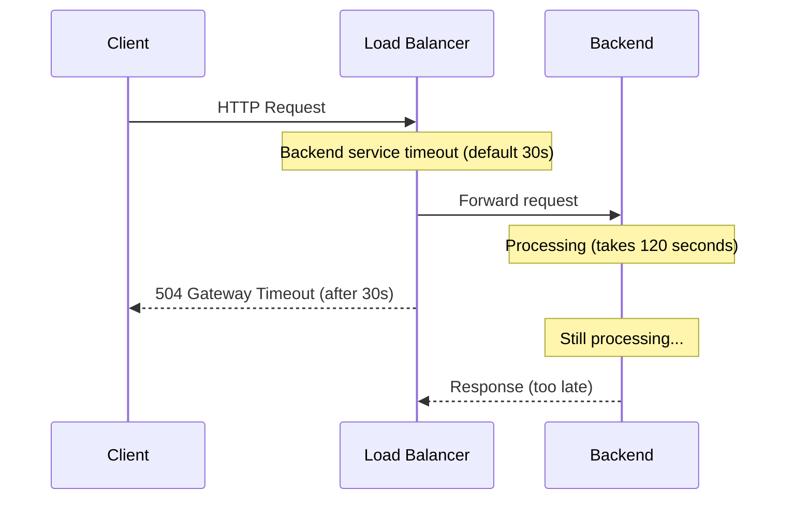
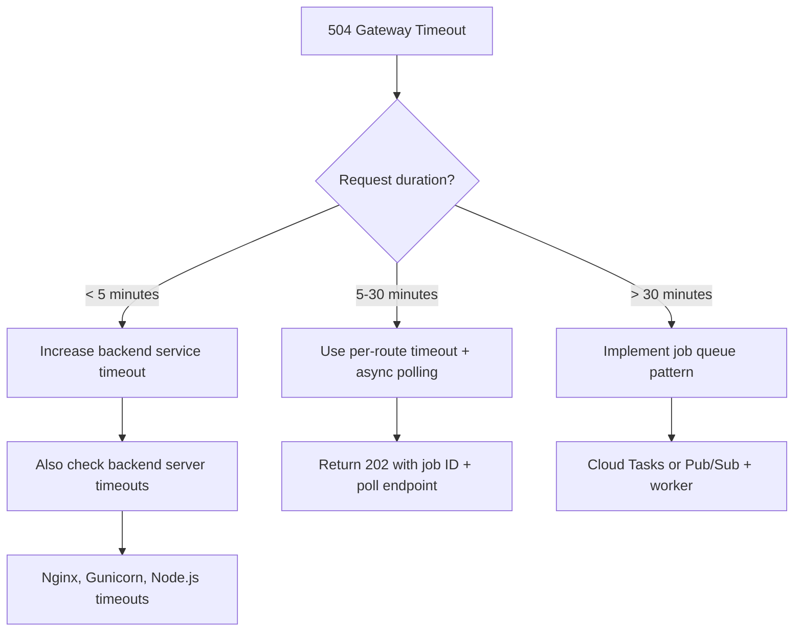

# How to Fix Google Cloud Load Balancer 504 Gateway Timeout on Long-Running Requests

Author: [nawazdhandala](https://www.github.com/nawazdhandala)

Tags: GCP, Load Balancer, 504, Timeout, Long-Running Requests, Troubleshooting

Description: How to diagnose and fix 504 Gateway Timeout errors on Google Cloud Load Balancers for long-running requests, including timeout configuration and architecture alternatives.

---

Your API endpoint works fine for quick requests, but anything that takes more than 30 seconds gets a 504 Gateway Timeout from the load balancer. The backend is still processing the request, but the load balancer has already given up and returned an error to the client. This is a timeout configuration issue, and there are several timeouts you need to get right.

## Understanding the Timeout Chain

A request passes through multiple timeout checkpoints between the client and the backend. Any one of them can trigger a 504.



The timeouts involved:
- **Backend service timeout** (default 30s) - how long the LB waits for the backend to respond
- **Client idle timeout** (varies) - how long the LB keeps the client connection open
- **Backend keep-alive timeout** - how long the backend keeps idle connections open
- **URL map route timeout** - per-route timeout overrides

## Step 1: Check Current Timeout Configuration

```bash
# Check the backend service timeout
gcloud compute backend-services describe my-backend-service \
    --global \
    --format="value(timeoutSec)" \
    --project=my-project
```

If this returns 30 (the default) and your requests take longer than 30 seconds, you have found the problem.

## Step 2: Increase the Backend Service Timeout

```bash
# Increase the backend service timeout to 5 minutes
gcloud compute backend-services update my-backend-service \
    --global \
    --timeout=300 \
    --project=my-project
```

The maximum value depends on the load balancer type:
- Global external Application Load Balancer: up to 86400 seconds (24 hours)
- Regional external Application Load Balancer: up to 86400 seconds
- Internal Application Load Balancer: up to 86400 seconds

For most long-running APIs, 300 seconds (5 minutes) is a reasonable starting point.

## Step 3: Set Per-Route Timeouts (For Specific Endpoints)

If only certain endpoints need longer timeouts, use URL map route rules instead of increasing the timeout for the entire backend service.

```bash
# Export the current URL map configuration
gcloud compute url-maps export my-url-map \
    --global \
    --destination=/tmp/urlmap.yaml \
    --project=my-project
```

Edit the URL map to add a per-route timeout:

```yaml
# urlmap.yaml - add timeout to specific routes
defaultService: projects/my-project/global/backendServices/my-backend-service
hostRules:
- hosts:
  - 'api.example.com'
  pathMatcher: api-paths
pathMatchers:
- name: api-paths
  defaultService: projects/my-project/global/backendServices/my-backend-service
  routeRules:
  - priority: 1
    matchRules:
    - prefixMatch: /api/reports/generate
    routeAction:
      # 10-minute timeout for report generation endpoint
      timeout:
        seconds: 600
      weightedBackendServices:
      - backendService: projects/my-project/global/backendServices/my-backend-service
        weight: 100
  - priority: 2
    matchRules:
    - prefixMatch: /api/exports
    routeAction:
      # 15-minute timeout for export endpoints
      timeout:
        seconds: 900
      weightedBackendServices:
      - backendService: projects/my-project/global/backendServices/my-backend-service
        weight: 100
```

```bash
# Import the updated URL map
gcloud compute url-maps import my-url-map \
    --global \
    --source=/tmp/urlmap.yaml \
    --project=my-project
```

## Step 4: Configure Streaming Timeout for WebSocket or SSE

If your application uses WebSockets, Server-Sent Events (SSE), or gRPC streaming, you need to configure the streaming timeout separately.

```bash
# For WebSocket support, increase the idle timeout on the backend service
gcloud compute backend-services update my-backend-service \
    --global \
    --timeout=3600 \
    --project=my-project
```

For the Global External Application Load Balancer, WebSocket connections are supported automatically. The timeout applies to the idle time on the WebSocket connection, not the total connection duration.

## Step 5: Check for Backend-Level Timeouts

Even after increasing the load balancer timeout, your backend web server or framework might have its own timeout that triggers first.

### Nginx (reverse proxy on the backend)

```nginx
# Increase proxy timeouts if Nginx is in front of your application
proxy_connect_timeout 300;
proxy_send_timeout 300;
proxy_read_timeout 300;
send_timeout 300;
```

### Gunicorn (Python)

```bash
# Start Gunicorn with a longer timeout
gunicorn --timeout 300 --workers 4 myapp:app
```

### Node.js

```javascript
const server = http.createServer(app);

// Increase the socket timeout (default is 2 minutes)
server.timeout = 300000; // 5 minutes in milliseconds

// Also increase keep-alive timeout to prevent premature connection closure
server.keepAliveTimeout = 620000;
```

## Step 6: Consider Architectural Alternatives

For truly long-running operations (minutes to hours), increasing timeouts is not the right approach. Instead, use an asynchronous pattern.

### Option A: Job Queue Pattern

```python
from flask import Flask, jsonify
import uuid

app = Flask(__name__)

@app.route('/api/reports/generate', methods=['POST'])
def generate_report():
    """Start report generation and return immediately with a job ID."""
    job_id = str(uuid.uuid4())

    # Queue the job for background processing
    publish_to_pubsub('report-jobs', {
        'job_id': job_id,
        'parameters': request.json
    })

    # Return immediately with a 202 Accepted
    return jsonify({
        'job_id': job_id,
        'status': 'queued',
        'status_url': f'/api/reports/status/{job_id}'
    }), 202


@app.route('/api/reports/status/<job_id>')
def check_status(job_id):
    """Poll for job completion."""
    status = get_job_status(job_id)  # Check Firestore, Redis, etc.
    return jsonify(status)
```

### Option B: Server-Sent Events for Progress Updates

```python
from flask import Response, stream_with_context

@app.route('/api/exports/stream')
def stream_export():
    """Stream progress updates using Server-Sent Events."""
    def generate():
        for progress in process_export():
            # Send progress updates as SSE events
            yield f"data: {json.dumps({'progress': progress})}\n\n"
        yield f"data: {json.dumps({'status': 'complete', 'download_url': '...'})}\n\n"

    return Response(
        stream_with_context(generate()),
        mimetype='text/event-stream',
        headers={
            'Cache-Control': 'no-cache',
            'X-Accel-Buffering': 'no',
        }
    )
```

### Option C: Cloud Tasks for Deferred Processing

```bash
# Create a Cloud Tasks queue for long-running operations
gcloud tasks queues create report-queue \
    --max-dispatches-per-second=10 \
    --max-concurrent-dispatches=5 \
    --max-attempts=3 \
    --max-retry-duration=3600s \
    --project=my-project
```

## Timeout Configuration Summary



## Quick Checklist

Before increasing timeouts, verify:

1. The backend service timeout is set high enough for the request
2. The backend server timeout (Nginx, Gunicorn, etc.) matches or exceeds the LB timeout
3. The client's timeout is also long enough (browser fetch, SDK timeout)
4. The backend keep-alive timeout is at least 620 seconds
5. For specific slow endpoints, use per-route timeouts instead of increasing the global timeout

The default 30-second timeout is appropriate for most API calls. Only increase it for the specific endpoints that need it, and seriously consider an asynchronous approach for anything over 5 minutes. Keeping HTTP connections open for long periods is fragile and resource-intensive.
