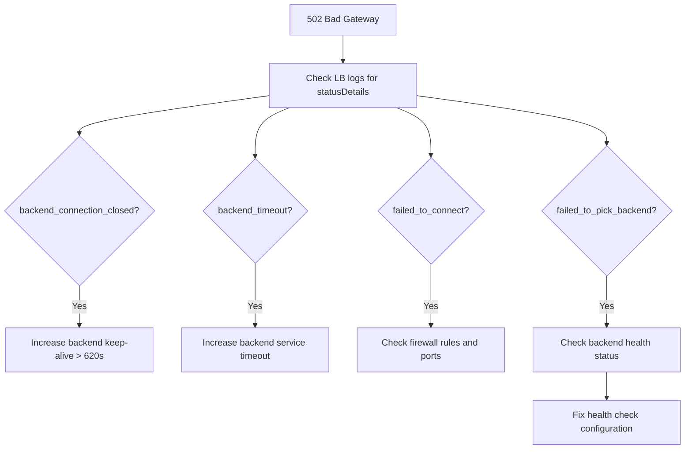

# How to Fix Google Cloud Load Balancer Returning 502 Bad Gateway Server Connection Error

Author: [nawazdhandala](https://www.github.com/nawazdhandala)

Tags: GCP, Load Balancer, 502, Networking, Backend Service, Troubleshooting

Description: A comprehensive guide to diagnosing and fixing 502 Bad Gateway errors from Google Cloud Load Balancers, covering backend health, connection issues, and timeout configuration.

---

A 502 Bad Gateway from your Google Cloud Load Balancer means the load balancer received an invalid response from the backend, or could not connect to the backend at all. This is one of the most common load balancer errors, and it can have a dozen different causes. Let me walk through the systematic approach to finding and fixing the problem.

## Understanding 502 Errors in GCP

Google Cloud Load Balancers generate 502 errors in these situations:

- The backend closed the connection before sending a response
- The backend sent a malformed HTTP response
- The backend health check is passing but the actual request fails
- All backends in the backend service are unhealthy
- Connection timeout to the backend was exceeded
- The backend is overloaded and rejecting connections

## Step 1: Check Backend Health

The first thing to check is whether your backends are actually healthy.

```bash
# Check the health status of backends in the backend service
gcloud compute backend-services get-health my-backend-service \
    --global \
    --project=my-project
```

If all backends show `UNHEALTHY`, the load balancer has nowhere to send traffic and will return 502.

```bash
# Check the health check configuration
gcloud compute health-checks describe my-health-check \
    --project=my-project \
    --format="json(type, httpHealthCheck, checkIntervalSec, timeoutSec, healthyThreshold, unhealthyThreshold)"
```

Common health check issues:
- The health check path returns a non-200 status code
- The health check port does not match the serving port
- The health check timeout is too short
- The backend takes too long to start (fails initial health checks)

Test the health check endpoint directly from a backend instance:

```bash
# SSH into a backend instance and test the health check endpoint
curl -v http://localhost:8080/health

# Check if the service is listening on the expected port
ss -tlnp | grep 8080
```

## Step 2: Check Load Balancer Logs

Enable logging on the backend service if it is not already enabled, then check the logs.

```bash
# Enable logging on the backend service
gcloud compute backend-services update my-backend-service \
    --global \
    --enable-logging \
    --logging-sample-rate=1.0 \
    --project=my-project
```

Query the logs for 502 errors:

```bash
# Search for 502 errors in the load balancer logs
gcloud logging read \
    'resource.type="http_load_balancer" AND httpRequest.status=502' \
    --project=my-project \
    --limit=20 \
    --format="json(httpRequest, jsonPayload.statusDetails, jsonPayload.backendTargetProjectNumber)"
```

The `statusDetails` field is key - it tells you exactly why the 502 happened:

- `backend_connection_closed_before_data_sent_to_client` - backend closed the connection
- `backend_timeout` - backend did not respond within the timeout
- `failed_to_connect_to_backend` - TCP connection to backend failed
- `failed_to_pick_backend` - no healthy backends available
- `backend_early_response_with_non_error_status` - backend sent a response before reading the full request

## Step 3: Fix Based on Status Details

### Fix for "backend_connection_closed_before_data_sent_to_client"

This is the most common 502 cause. It happens when the backend's HTTP keep-alive timeout is shorter than the load balancer's. The backend closes the idle connection, but the load balancer does not know and sends a request on the dead connection.

The Google Cloud Load Balancer uses a 600-second keep-alive timeout. Your backend must have a longer keep-alive timeout.

For Nginx:

```nginx
# Set keep-alive timeout to 620 seconds (longer than the LB's 600s)
keepalive_timeout 620;
```

For Apache:

```apache
# Set keep-alive timeout higher than the load balancer
KeepAlive On
KeepAliveTimeout 620
```

For Node.js:

```javascript
const server = http.createServer(app);

// Set keep-alive timeout to 620 seconds (620000ms)
// Must be longer than the load balancer's 600s timeout
server.keepAliveTimeout = 620000;

// Also set the headers timeout slightly higher
server.headersTimeout = 625000;
```

For Go:

```go
server := &http.Server{
    Addr:    ":8080",
    Handler: mux,
    // Set idle timeout longer than the LB's 600-second keep-alive
    IdleTimeout: 620 * time.Second,
}
```

### Fix for "backend_timeout"

The backend is taking too long to respond. Increase the backend service timeout:

```bash
# Increase the backend service timeout (default is 30 seconds)
gcloud compute backend-services update my-backend-service \
    --global \
    --timeout=120 \
    --project=my-project
```

Also check if the backend is overloaded:

```bash
# Check backend CPU and request counts
gcloud monitoring time-series list \
    --filter='resource.type="gce_instance" AND metric.type="compute.googleapis.com/instance/cpu/utilization"' \
    --interval-start-time=$(date -u -v-1H +%Y-%m-%dT%H:%M:%SZ) \
    --project=my-project
```

### Fix for "failed_to_connect_to_backend"

The load balancer cannot establish a TCP connection to the backend.

```bash
# Check if the backend service port matches the instance group named port
gcloud compute instance-groups managed describe my-instance-group \
    --zone=us-central1-a \
    --format="json(namedPorts)" \
    --project=my-project

# The named port must match the port in the backend service
gcloud compute backend-services describe my-backend-service \
    --global \
    --format="value(port, portName)" \
    --project=my-project
```

Also check firewall rules:

```bash
# The load balancer health check and traffic comes from these IP ranges
# 130.211.0.0/22 and 35.191.0.0/16
# Make sure your firewall allows traffic from these ranges

gcloud compute firewall-rules create allow-lb-traffic \
    --network=my-vpc \
    --direction=INGRESS \
    --action=ALLOW \
    --rules=tcp:8080 \
    --source-ranges=130.211.0.0/22,35.191.0.0/16 \
    --target-tags=web-server \
    --project=my-project
```

### Fix for "failed_to_pick_backend"

No healthy backends available. Either all backends are unhealthy or the backend service has no backends configured.

```bash
# Check backend service configuration
gcloud compute backend-services describe my-backend-service \
    --global \
    --format="json(backends)" \
    --project=my-project

# Check instance group size
gcloud compute instance-groups managed describe my-instance-group \
    --zone=us-central1-a \
    --format="value(targetSize)" \
    --project=my-project
```

## Step 4: Test the Backend Directly

Bypass the load balancer to confirm the backend is working:

```bash
# Test directly from another instance in the same network
curl -v http://<backend-internal-ip>:8080/

# Check if the backend process is running
gcloud compute ssh my-backend-vm --zone=us-central1-a -- \
    "systemctl status my-app && curl -s localhost:8080/health"
```

## Step 5: Check for Connection Draining Issues

During deployments or instance replacements, 502 errors can spike if connection draining is not configured.

```bash
# Check connection draining setting
gcloud compute backend-services describe my-backend-service \
    --global \
    --format="value(connectionDraining.drainingTimeoutSec)" \
    --project=my-project

# Set connection draining timeout
gcloud compute backend-services update my-backend-service \
    --global \
    --connection-draining-timeout=300 \
    --project=my-project
```

## Diagnostic Flowchart



## Monitoring

```bash
# Create an alert for 502 error rate
gcloud alpha monitoring policies create \
    --display-name="LB 502 Error Rate" \
    --condition-display-name="502 rate > 1%" \
    --condition-filter='resource.type="http_load_balancer" AND metric.type="loadbalancing.googleapis.com/https/request_count" AND metric.labels.response_code="502"' \
    --duration="300s" \
    --project=my-project
```

The most common fix is adjusting the backend's keep-alive timeout to be longer than the load balancer's 600-second timeout. Start there, then check the load balancer logs for the specific statusDetails to guide your debugging.
