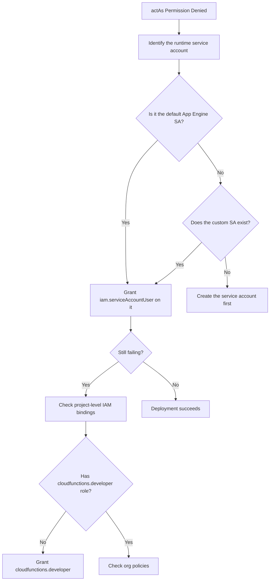

# How to Fix iam.serviceAccounts.actAs Permission Denied When Deploying Cloud Functions

Author: [nawazdhandala](https://www.github.com/nawazdhandala)

Tags: GCP, Cloud Functions, IAM, Service Accounts, Permissions

Description: Fix the iam.serviceAccounts.actAs permission denied error that occurs when deploying Google Cloud Functions, with step-by-step instructions for granting the right IAM roles.

---

You are deploying a Cloud Function and get this error:

```
ERROR: (gcloud.functions.deploy) ResponseError: status=[403], code=[Ok], message=[
Permission 'iam.serviceAccounts.actAs' denied on service account
'my-project@appspot.gserviceaccount.com' (or it may not exist).
]
```

This is one of the most frustrating errors in GCP because it does not happen when you create a Cloud Function for the first time - it often shows up after a policy change, when deploying to a new project, or when a colleague tries to deploy your function. The fix is straightforward, but understanding why it happens helps prevent it from recurring.

## Why This Error Occurs

When you deploy a Cloud Function, the function runs as a service account. By default, it uses the App Engine default service account (`PROJECT_ID@appspot.gserviceaccount.com`). The `actAs` permission is GCP's way of saying "this user is allowed to deploy code that will run as this service account."

Think of it as a safety mechanism. Without this check, any project member could deploy a function that runs with elevated privileges by specifying a highly-privileged service account. The `actAs` permission ensures you are explicitly authorized to deploy code under a given identity.

## The Quick Fix

Grant the `iam.serviceAccountUser` role to the user or service account that is doing the deployment:

```bash
# Grant the Service Account User role to a developer
# This allows them to deploy functions that run as the App Engine default SA
gcloud iam service-accounts add-iam-policy-binding \
    my-project@appspot.gserviceaccount.com \
    --member="user:developer@example.com" \
    --role="roles/iam.serviceAccountUser" \
    --project=my-project
```

If you are deploying from a CI/CD pipeline using a service account:

```bash
# Grant the Service Account User role to a CI/CD service account
gcloud iam service-accounts add-iam-policy-binding \
    my-project@appspot.gserviceaccount.com \
    --member="serviceAccount:ci-cd-sa@my-project.iam.gserviceaccount.com" \
    --role="roles/iam.serviceAccountUser" \
    --project=my-project
```

## Understanding the Permission Scope

There is an important subtlety here. You can grant `iam.serviceAccountUser` at two different levels:

### Project Level

Granting at the project level allows the user to act as ANY service account in the project:

```bash
# Project-level grant - acts as any service account in the project
# More convenient but less secure
gcloud projects add-iam-binding my-project \
    --member="user:developer@example.com" \
    --role="roles/iam.serviceAccountUser"
```

### Service Account Level

Granting at the service account level allows the user to act as only that specific service account:

```bash
# Service account-level grant - acts as only this specific service account
# More secure, follows least privilege
gcloud iam service-accounts add-iam-policy-binding \
    my-project@appspot.gserviceaccount.com \
    --member="user:developer@example.com" \
    --role="roles/iam.serviceAccountUser"
```

I recommend the service account-level grant. It follows the principle of least privilege and makes your IAM setup more auditable.

## Using a Custom Service Account for Cloud Functions

Instead of using the default App Engine service account (which often has overly broad permissions), create a dedicated service account for your Cloud Function:

```bash
# Create a dedicated service account for the Cloud Function
gcloud iam service-accounts create cloud-fn-sa \
    --display-name="Cloud Function Service Account" \
    --project=my-project

# Grant it only the permissions the function needs
# For example, if it reads from Cloud Storage and writes to Firestore
gcloud projects add-iam-binding my-project \
    --member="serviceAccount:cloud-fn-sa@my-project.iam.gserviceaccount.com" \
    --role="roles/storage.objectViewer"

gcloud projects add-iam-binding my-project \
    --member="serviceAccount:cloud-fn-sa@my-project.iam.gserviceaccount.com" \
    --role="roles/datastore.user"

# Grant the deployer permission to actAs this service account
gcloud iam service-accounts add-iam-policy-binding \
    cloud-fn-sa@my-project.iam.gserviceaccount.com \
    --member="user:developer@example.com" \
    --role="roles/iam.serviceAccountUser"

# Deploy the function with the custom service account
gcloud functions deploy my-function \
    --runtime=nodejs20 \
    --trigger-http \
    --service-account=cloud-fn-sa@my-project.iam.gserviceaccount.com \
    --source=. \
    --entry-point=handler
```

## Cloud Functions v2 (Cloud Run-based) Considerations

If you are using Cloud Functions 2nd gen (which runs on Cloud Run under the hood), you need similar permissions but the deployment flow is slightly different:

```bash
# For Cloud Functions 2nd gen, you also need Cloud Run permissions
# The deployer needs these roles:
gcloud projects add-iam-binding my-project \
    --member="user:developer@example.com" \
    --role="roles/cloudfunctions.developer"

gcloud projects add-iam-binding my-project \
    --member="user:developer@example.com" \
    --role="roles/run.admin"

# And actAs permission on the function's service account
gcloud iam service-accounts add-iam-policy-binding \
    cloud-fn-sa@my-project.iam.gserviceaccount.com \
    --member="user:developer@example.com" \
    --role="roles/iam.serviceAccountUser"
```

## CI/CD Pipeline Setup

Here is a complete example of setting up a service account for CI/CD that can deploy Cloud Functions:

```bash
# Create a CI/CD service account
gcloud iam service-accounts create cicd-deployer \
    --display-name="CI/CD Deployer" \
    --project=my-project

# Grant Cloud Functions Developer role for deployments
gcloud projects add-iam-binding my-project \
    --member="serviceAccount:cicd-deployer@my-project.iam.gserviceaccount.com" \
    --role="roles/cloudfunctions.developer"

# Grant Cloud Build permissions (functions deployment uses Cloud Build)
gcloud projects add-iam-binding my-project \
    --member="serviceAccount:cicd-deployer@my-project.iam.gserviceaccount.com" \
    --role="roles/cloudbuild.builds.editor"

# Grant actAs permission for the function's runtime service account
gcloud iam service-accounts add-iam-policy-binding \
    cloud-fn-sa@my-project.iam.gserviceaccount.com \
    --member="serviceAccount:cicd-deployer@my-project.iam.gserviceaccount.com" \
    --role="roles/iam.serviceAccountUser"
```

## Debugging Checklist

When you hit the `actAs` error, run through this checklist:



Verify the runtime service account exists:

```bash
# Check if the default App Engine SA exists
gcloud iam service-accounts describe \
    my-project@appspot.gserviceaccount.com \
    --project=my-project
```

If the App Engine default service account was deleted (it happens), you need to either restore it or use a custom service account.

## Restoring the Default Service Account

If someone deleted the App Engine default service account, you can undelete it within 30 days:

```bash
# Undelete the App Engine default service account
# This only works within 30 days of deletion
gcloud iam service-accounts undelete \
    --project=my-project \
    $(gcloud iam service-accounts list \
        --project=my-project \
        --filter="email:my-project@appspot.gserviceaccount.com" \
        --format="value(uniqueId)" \
        --include-deleted)
```

If it has been more than 30 days, you will need to use a custom service account for your Cloud Functions.

The `actAs` error is a guard rail, not a bug. It prevents privilege escalation through serverless deployments. Once you understand the pattern - the deployer needs `iam.serviceAccountUser` on the runtime service account - it becomes a quick fix every time.
