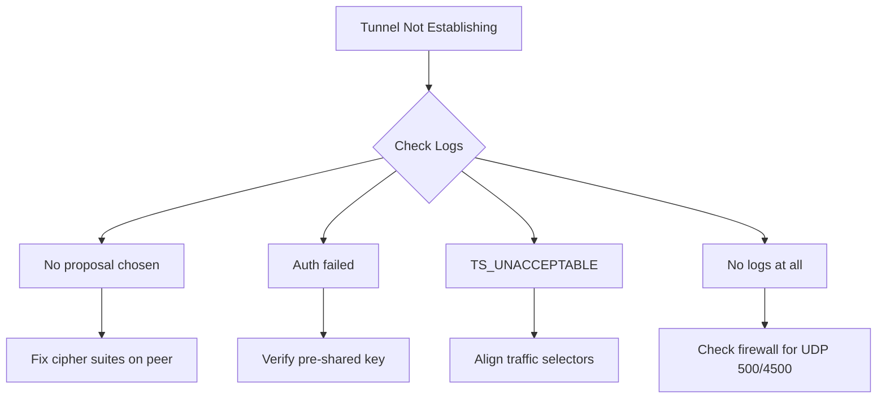

# How to Fix IKEv2 Negotiation Failures When Setting Up Cloud VPN in GCP

Author: [nawazdhandala](https://www.github.com/nawazdhandala)

Tags: GCP, Cloud VPN, IKEv2, IPsec, Troubleshooting, Networking

Description: A practical guide to diagnosing and fixing IKEv2 negotiation failures when configuring Cloud VPN tunnels in Google Cloud Platform.

---

You have configured your Cloud VPN tunnel in GCP, but the tunnel status is stuck at "Waiting for peer" or keeps cycling through negotiation states. Sound familiar? IKEv2 negotiation failures are one of the most common pain points when setting up Cloud VPN, especially when connecting to third-party or on-premises devices.

In this post, I will walk through the most common causes of IKEv2 negotiation failures and how to fix each one.

## Understanding IKEv2 Negotiation

IKEv2 (Internet Key Exchange version 2) is the protocol used to set up the Security Associations (SAs) for IPsec tunnels. The negotiation happens in two phases:

1. **IKE_SA_INIT**: The two peers agree on encryption algorithms, exchange Diffie-Hellman values, and send nonces.
2. **IKE_AUTH**: The peers authenticate each other (using pre-shared keys in most Cloud VPN setups) and establish the first Child SA for actual data traffic.

If either phase fails, the tunnel never comes up. Let us look at why this happens and what to do about it.

## Check 1: Pre-Shared Key Mismatch

This is the number one cause of IKEv2 failures with Cloud VPN. The shared secret must be exactly the same on both sides - same characters, same case, no trailing whitespace.

To verify the key on the GCP side:

```bash
# Retrieve the shared secret for your VPN tunnel
gcloud compute vpn-tunnels describe my-vpn-tunnel \
    --region=us-central1 \
    --format="value(sharedSecret)"
```

Compare this output byte-for-byte with what your on-premises device has configured. Watch out for these common gotchas:

- Copy-paste adding invisible characters or line breaks
- Different character encoding between systems
- Some devices truncate long keys silently

If there is any doubt, regenerate the key on both sides using a known-good string.

## Check 2: Cipher Suite Mismatch

GCP Cloud VPN supports specific IKEv2 cipher suites. If your peer device proposes a combination that GCP does not support, the negotiation fails immediately.

Here are the supported combinations for IKE Phase 1 (IKE_SA_INIT):

| Component | Supported Values |
|-----------|-----------------|
| Encryption | AES-CBC-128, AES-CBC-256, AES-GCM-16-128, AES-GCM-16-256 |
| Integrity | HMAC-SHA1-96, HMAC-SHA2-256-128, HMAC-SHA2-384-192, HMAC-SHA2-512-256 |
| PRF | PRF-HMAC-SHA1, PRF-HMAC-SHA2-256, PRF-HMAC-SHA2-384, PRF-HMAC-SHA2-512 |
| DH Group | 14 (2048-bit MODP), 15, 16, 19, 20, 21, 24 |

For Phase 2 (Child SA / ESP):

| Component | Supported Values |
|-----------|-----------------|
| Encryption | AES-CBC-128, AES-CBC-256, AES-GCM-16-128, AES-GCM-16-256 |
| Integrity | HMAC-SHA1-96, HMAC-SHA2-256-128, HMAC-SHA2-384-192, HMAC-SHA2-512-256 |
| PFS Group | Same as DH groups above |

A practical fix - configure your on-premises device to propose AES-256-CBC with SHA-256 and DH group 14. This combination works reliably:

```text
# Example Cisco IOS configuration for Phase 1
crypto ikev2 proposal gcp-proposal
  encryption aes-cbc-256
  integrity sha256
  group 14

# Example Phase 2 (IPsec transform set)
crypto ipsec transform-set gcp-transform esp-aes 256 esp-sha256-hmac
  mode tunnel
```

## Check 3: IKE Version Mismatch

GCP HA VPN only supports IKEv2. Classic VPN supports both IKEv1 and IKEv2, but it defaults to IKEv2. If your on-premises device is configured for IKEv1 only and you are connecting to an HA VPN gateway, the negotiation will never succeed.

Check your tunnel configuration:

```bash
# Check what IKE version your tunnel is using
gcloud compute vpn-tunnels describe my-vpn-tunnel \
    --region=us-central1 \
    --format="value(ikeVersion)"
```

If it returns `2`, make sure your peer device is also configured for IKEv2.

## Check 4: Traffic Selector (Proxy ID) Mismatch

This one catches a lot of people. The traffic selectors (sometimes called proxy IDs or encryption domains) define which traffic should go through the tunnel. Both sides must agree on these values.

For HA VPN with dynamic routing, the traffic selectors should be `0.0.0.0/0` on both sides (meaning all traffic - the actual routing is handled by BGP).

For Classic VPN with policy-based routing, the local and remote traffic selectors must mirror each other:

```bash
# Check traffic selectors on your GCP tunnel
gcloud compute vpn-tunnels describe my-vpn-tunnel \
    --region=us-central1 \
    --format="yaml(localTrafficSelector, remoteTrafficSelector)"
```

Your on-premises device must have the inverse - what GCP calls "local" should be the "remote" on your device, and vice versa.

## Check 5: NAT-T and Firewall Issues

IKEv2 uses UDP port 500 for initial negotiation and UDP port 4500 for NAT Traversal. If there is a firewall between your on-premises device and the internet, these ports must be open.

```bash
# Test connectivity to the GCP VPN gateway IP on port 500
nc -vzu <GCP_GATEWAY_IP> 500

# Test connectivity on port 4500 for NAT-T
nc -vzu <GCP_GATEWAY_IP> 4500
```

Also check that your on-premises firewall allows ESP protocol (IP protocol 50) if NAT-T is not being used.

## Check 6: Dead Peer Detection (DPD) Settings

GCP Cloud VPN sends DPD probes to check if the peer is alive. If your device does not respond to these probes or has incompatible DPD settings, the SA can get torn down.

Make sure your on-premises device has DPD enabled with these settings:

- DPD interval: 10-30 seconds
- DPD timeout: 2-5 retries
- DPD action: restart or clear

## Using Cloud Logging for Diagnosis

When all else fails, Cloud VPN logs tell you exactly what went wrong. Enable VPN tunnel logging and check the logs:

```bash
# View recent VPN tunnel logs
gcloud logging read 'resource.type="vpn_gateway" AND severity>=WARNING' \
    --limit=50 \
    --format="table(timestamp, jsonPayload.message)"
```

Common log messages and what they mean:

- **"no proposal chosen"**: Cipher suite mismatch. Your peer is proposing algorithms GCP does not support.
- **"authentication failed"**: Pre-shared key mismatch.
- **"received invalid IKE_SA_INIT"**: Malformed packet, possibly a version mismatch.
- **"TS_UNACCEPTABLE"**: Traffic selector mismatch between the two sides.

## Systematic Troubleshooting Flow

Here is a decision flow to work through the problem methodically:



## Quick Checklist

Before you spend hours debugging, run through this checklist:

1. Pre-shared key matches exactly on both sides
2. Both sides use IKEv2
3. Cipher suites overlap between GCP and your device
4. Traffic selectors are properly configured
5. UDP 500 and 4500 are open through all firewalls
6. Your device's external IP is not behind a NAT that blocks ESP
7. DPD is enabled and responsive on both sides
8. The peer IP address configured on each side is correct

## Wrapping Up

IKEv2 negotiation failures are frustrating, but they are almost always caused by a mismatch between the two endpoints. The key is to be methodical: check the logs first to narrow down which phase is failing, then verify the specific settings for that phase. GCP's Cloud Logging gives you enough detail to pinpoint most problems without needing to debug from the on-premises side alone.

If you are still stuck after going through all these checks, try creating a fresh tunnel pair with a simple configuration (AES-256, SHA-256, DH group 14) and a short pre-shared key. Once the basic tunnel works, you can iterate from there.
