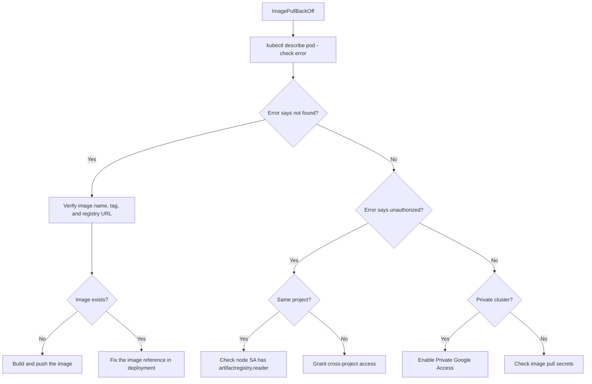

# How to Fix ImagePullBackOff Errors in Google Kubernetes Engine Deployments

Author: [nawazdhandala](https://www.github.com/nawazdhandala)

Tags: GCP, GKE, Kubernetes, Container Registry, Artifact Registry

Description: Fix ImagePullBackOff errors in Google Kubernetes Engine by troubleshooting image names, registry authentication, permissions, and network access to container registries.

---

Your GKE deployment is stuck with pods in ImagePullBackOff status. This means Kubernetes tried to pull your container image, failed, and is now backing off before retrying. The fix depends on why the pull failed - it could be a wrong image name, missing permissions, a private registry authentication issue, or a network problem.

Let me walk through each cause and how to fix it.

## Identifying the Error

First, check the pod events to see the exact error message:

```bash
# Check pod status
kubectl get pods -n my-namespace

# Get detailed error information
kubectl describe pod my-pod-abc123 -n my-namespace
```

Look in the Events section for messages like:

```
Warning  Failed   pull image "us-docker.pkg.dev/my-project/my-repo/my-app:v1.2.3":
  rpc error: code = NotFound desc = failed to pull and unpack image
Warning  Failed   Error: ImagePullBackOff
```

Or:

```
Warning  Failed   Failed to pull image "us-docker.pkg.dev/my-project/my-repo/my-app:v1.2.3":
  unauthorized: failed to authorize
```

Each error message tells you something different.

## Cause 1: Wrong Image Name or Tag

The most common cause. A single character off in the image name, tag, or registry URL will cause a pull failure.

```bash
# Verify the image exists in Artifact Registry
gcloud artifacts docker images list us-docker.pkg.dev/my-project/my-repo \
    --include-tags \
    --filter="tags:v1.2.3"

# Or for Container Registry (legacy)
gcloud container images list-tags gcr.io/my-project/my-app
```

Double-check the full image URL format:

```
# Artifact Registry format
LOCATION-docker.pkg.dev/PROJECT/REPOSITORY/IMAGE:TAG

# Container Registry format (legacy)
gcr.io/PROJECT/IMAGE:TAG
```

Common mistakes:
- Using `docker.pkg.dev` instead of `us-docker.pkg.dev` (missing the location prefix)
- Wrong project ID
- Misspelled repository or image name
- Tag that does not exist (using `latest` when no `latest` tag was pushed)

## Cause 2: Authentication and Permissions

GKE nodes need permission to pull images from your registry. By default, GKE nodes use the node's service account, which has access to registries in the same project. But cross-project access and private registries need explicit configuration.

### Same-Project Artifact Registry

If the image is in the same project, verify the node service account has the right role:

```bash
# Check the node pool's service account
gcloud container node-pools describe default-pool \
    --cluster=my-cluster \
    --region=us-central1 \
    --format="value(config.serviceAccount)"

# If it shows "default", it uses the Compute Engine default SA
# Check its permissions
gcloud projects get-iam-policy my-project \
    --flatten="bindings[].members" \
    --filter="bindings.members:serviceAccount:PROJECT_NUMBER-compute@developer.gserviceaccount.com" \
    --format="table(bindings.role)"
```

Grant Artifact Registry Reader if missing:

```bash
# Grant read access to Artifact Registry
gcloud projects add-iam-binding my-project \
    --member="serviceAccount:PROJECT_NUMBER-compute@developer.gserviceaccount.com" \
    --role="roles/artifactregistry.reader"
```

### Cross-Project Registry Access

If the image is in a different project, you need to grant the node service account access to that project's registry:

```bash
# Grant the node SA from project-a access to registry in project-b
gcloud projects add-iam-binding project-b \
    --member="serviceAccount:PROJECT_A_NUMBER-compute@developer.gserviceaccount.com" \
    --role="roles/artifactregistry.reader"
```

### External Private Registry

For images from Docker Hub, GitHub Container Registry, or other private registries, you need to create a Kubernetes image pull secret:

```bash
# Create an image pull secret for a private registry
kubectl create secret docker-registry my-registry-secret \
    --docker-server=https://index.docker.io/v1/ \
    --docker-username=my-user \
    --docker-password=my-token \
    --docker-email=me@example.com \
    -n my-namespace
```

Then reference it in your deployment:

```yaml
# Reference the pull secret in your pod spec
apiVersion: apps/v1
kind: Deployment
metadata:
  name: my-app
spec:
  template:
    spec:
      imagePullSecrets:
      - name: my-registry-secret
      containers:
      - name: my-app
        image: docker.io/my-org/my-app:v1.2.3
```

## Cause 3: GKE Scope Limitations

Older GKE clusters might have been created without the `cloud-platform` scope, which limits API access from nodes. Check the node pool scopes:

```bash
# Check node pool OAuth scopes
gcloud container node-pools describe default-pool \
    --cluster=my-cluster \
    --region=us-central1 \
    --format="yaml(config.oauthScopes)"
```

If the scope `https://www.googleapis.com/auth/devstorage.read_only` is missing (needed for gcr.io) or `https://www.googleapis.com/auth/cloud-platform` is not present, you need to create a new node pool with the right scopes:

```bash
# Create a new node pool with the correct scopes
# You cannot change scopes on an existing node pool
gcloud container node-pools create new-pool \
    --cluster=my-cluster \
    --region=us-central1 \
    --scopes=cloud-platform \
    --num-nodes=3
```

## Cause 4: Image Does Not Exist

Maybe the image was never pushed, or it was deleted:

```bash
# Check if the image and tag exist
gcloud artifacts docker images list \
    us-docker.pkg.dev/my-project/my-repo \
    --include-tags \
    --format="table(package, tags, createTime)"

# Check if a specific tag exists
gcloud artifacts docker tags list \
    us-docker.pkg.dev/my-project/my-repo/my-app
```

If the image does not exist, build and push it:

```bash
# Build and push the image to Artifact Registry
gcloud builds submit --tag us-docker.pkg.dev/my-project/my-repo/my-app:v1.2.3

# Or use docker directly
docker build -t us-docker.pkg.dev/my-project/my-repo/my-app:v1.2.3 .
docker push us-docker.pkg.dev/my-project/my-repo/my-app:v1.2.3
```

## Cause 5: Network Issues

If your GKE cluster is private (no external IPs on nodes), the nodes might not be able to reach the container registry.

```bash
# Check if the cluster is private
gcloud container clusters describe my-cluster \
    --region=us-central1 \
    --format="value(privateClusterConfig.enablePrivateNodes)"
```

For private clusters, you need either:
- Private Google Access enabled on the subnet
- A Cloud NAT gateway for external registries

```bash
# Enable Private Google Access on the subnet
gcloud compute networks subnets update my-subnet \
    --region=us-central1 \
    --enable-private-ip-google-access
```

## Debugging Flowchart



## Quick Fix Checklist

Run through this list when you hit ImagePullBackOff:

1. Verify the image name and tag are correct
2. Confirm the image exists in the registry
3. Check the node pool service account has registry read access
4. For private registries, verify imagePullSecrets are configured
5. For private clusters, ensure Private Google Access is enabled
6. Check node pool OAuth scopes include storage read access

ImagePullBackOff errors always have a clear cause once you read the event messages carefully. Start with `kubectl describe pod` and the error will point you in the right direction.
