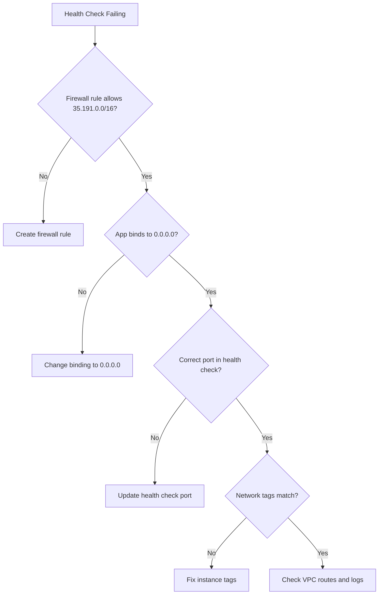

# How to Fix Internal TCP/UDP Load Balancer Health Check Failing Despite Healthy Backends

Author: [nawazdhandala](https://www.github.com/nawazdhandala)

Tags: GCP, Load Balancer, Health Check, Networking, Google Cloud

Description: Troubleshoot and resolve internal TCP/UDP load balancer health check failures in Google Cloud when your backend instances are actually healthy and serving traffic.

---

You have an internal TCP/UDP load balancer in Google Cloud. Your backend VMs are up and running, the application is responding fine when you SSH in and curl localhost, but the health check keeps marking them as unhealthy. Traffic is not flowing through the load balancer even though everything looks good from the instance side. This is one of the more frustrating networking issues on GCP, and it usually comes down to one of a few specific causes.

## How Internal Load Balancer Health Checks Work

Before diving into the fix, it helps to understand how health checks work for internal load balancers. Unlike external load balancers that probe from Google Front End (GFE) servers, internal load balancer health checks come from dedicated IP ranges within Google's infrastructure. Specifically, the probes come from the ranges `35.191.0.0/16` and `130.211.0.0/22`.

This means your firewall rules and instance-level configurations need to allow traffic from these ranges. If they do not, health checks will fail even though your application is perfectly healthy.

## Step 1: Check Firewall Rules

This is the number one cause of this issue. You need a firewall rule that allows health check probes to reach your backends.

The following command creates the necessary firewall rule:

```bash
# Create a firewall rule to allow health check probes from Google's ranges
gcloud compute firewall-rules create allow-health-check \
    --network=your-vpc-network \
    --action=allow \
    --direction=ingress \
    --source-ranges=35.191.0.0/16,130.211.0.0/22 \
    --target-tags=your-backend-tag \
    --rules=tcp:your-app-port
```

Replace `your-app-port` with the port your application listens on. If your health check uses a different port than your application, make sure to include both ports.

Check existing firewall rules to see if one already exists but might be misconfigured:

```bash
# List firewall rules that could affect health check traffic
gcloud compute firewall-rules list \
    --filter="network:your-vpc-network" \
    --format="table(name, direction, sourceRanges, allowed, targetTags)"
```

Look for any deny rules that might be taking priority over your allow rules. Firewall rules in GCP are evaluated by priority number - lower numbers take precedence.

## Step 2: Verify the Health Check Configuration

Make sure your health check is actually probing the right port and path. A common mistake is configuring the health check to probe port 80 while the application listens on port 8080.

```bash
# Describe the health check to see its configuration
gcloud compute health-checks describe your-health-check \
    --format="json(type, httpHealthCheck, tcpHealthCheck, checkIntervalSec, timeoutSec, unhealthyThreshold)"
```

For TCP health checks, the prober establishes a TCP connection. If the connection succeeds, the backend is considered healthy. For HTTP health checks, the prober sends an HTTP request and expects a 200 OK response.

Make sure:
- The port matches what your application is listening on
- For HTTP checks, the request path returns a 200 status code
- The timeout is not shorter than your application's response time

## Step 3: Check That the Application Binds to the Correct Interface

This one catches a lot of people. If your application binds to `127.0.0.1` (localhost only), it will not accept connections from the health check probes even if the firewall allows them. The probes arrive on the VM's network interface, not on the loopback interface.

SSH into the instance and check what address the application is bound to:

```bash
# Check which addresses and ports are being listened on
sudo ss -tlnp | grep your-app-port
```

If the output shows `127.0.0.1:port`, your application needs to bind to `0.0.0.0` (all interfaces) instead. This is a configuration change in your application, not in GCP.

## Step 4: Verify the Backend Service Health

Check the health status of your backends from the load balancer's perspective:

```bash
# Get health status of all backends in the backend service
gcloud compute backend-services get-health your-backend-service \
    --region=us-central1 \
    --format="json(status)"
```

This shows you what the load balancer thinks about each backend. If all backends show as unhealthy, the issue is likely one of the items above. If some are healthy and some are not, the problem might be instance-specific.

## Step 5: Check for Network Tags Mismatch

If your firewall rule uses target tags, make sure the backend instances actually have those tags applied. A missing tag means the firewall rule does not apply to the instance, so health check traffic gets blocked by the default deny rule.

```bash
# Check tags on a specific instance
gcloud compute instances describe your-instance \
    --zone=us-central1-a \
    --format="json(tags)"
```

Compare the tags on the instance with the target tags on your firewall rule. They need to match exactly.

## Step 6: Internal Load Balancer IP Forwarding

For internal TCP/UDP load balancers, the VMs receive traffic with a destination IP that is the load balancer's IP, not the VM's own IP. By default, VMs drop packets that are not addressed to them. You need to either enable IP forwarding on the instance or make sure the application handles this correctly.

If you are using a load balancer with backend instances (not managed instance groups), enable IP forwarding:

```bash
# Check if IP forwarding is enabled on the instance
gcloud compute instances describe your-instance \
    --zone=us-central1-a \
    --format="json(canIpForward)"
```

Note that you cannot change IP forwarding on a running instance. You need to stop it first, or better yet, set it when creating the instance.

## Step 7: Check Connection Draining and Session Affinity Settings

Sometimes the health check is not really failing - the backend is in a draining state. This happens when you recently modified the backend service or instance group.

```bash
# Check the backend service configuration
gcloud compute backend-services describe your-backend-service \
    --region=us-central1 \
    --format="json(connectionDraining, sessionAffinity, protocol)"
```

If connection draining timeout is set very high, backends might appear unhealthy during transitions for an extended period.

## Step 8: Test Connectivity Manually

If you have another VM in the same VPC, use it to simulate a health check probe:

```bash
# From another VM in the same network, test TCP connectivity
curl -v telnet://backend-vm-internal-ip:app-port

# For HTTP health checks, test the health check endpoint
curl -v http://backend-vm-internal-ip:app-port/health
```

If this works from another VM but health checks still fail, the issue is almost certainly a firewall rule not covering the Google health check IP ranges.

## Quick Debugging Flowchart

Here is a visual flow for diagnosing the problem:



## Monitoring Health Check Status

Once you fix the issue, set up alerting so you catch future health check failures early. Tools like [OneUptime](https://oneuptime.com) can monitor your load balancer backends and alert you when health checks start failing, giving you time to react before users notice any degradation.

The key takeaway: internal load balancer health check probes come from Google's infrastructure IPs, not from within your VPC. Your firewall rules must explicitly allow these ranges, and your application must listen on the right interface and port.
