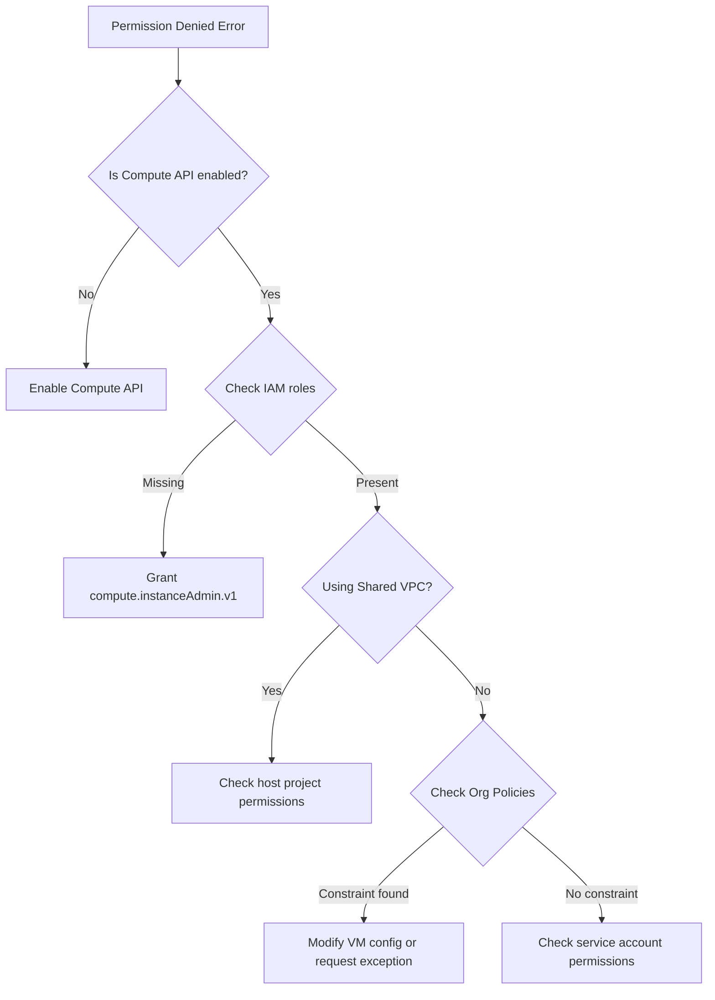

# How to Fix Permission Denied Errors When Creating VMs in Google Compute Engine

Author: [nawazdhandala](https://www.github.com/nawazdhandala)

Tags: GCP, Compute Engine, IAM, Permissions, Troubleshooting

Description: Learn how to diagnose and fix permission denied errors when creating virtual machines in Google Compute Engine, including IAM roles, service accounts, and org policies.

---

You try to create a VM in Google Compute Engine and get hit with a permission denied error. It is one of the most common stumbling blocks for teams getting started with GCP, and it is frustrating because the error messages are not always clear about what exactly is missing.

Let me walk through the different flavors of this error and how to fix each one.

## The Common Error Messages

When you try to create a VM and lack the right permissions, you will see something like one of these:

```
ERROR: (gcloud.compute.instances.create) Could not fetch resource:
 - Required 'compute.instances.create' permission for 'projects/my-project/zones/us-central1-a/instances/my-vm'
```

Or through the Console:

```
You don't have permission to create instances in project "my-project".
Required permission: compute.instances.create
```

Sometimes the error is more cryptic:

```
ERROR: (gcloud.compute.instances.create) PERMISSION_DENIED: Constraint constraints/compute.vmExternalIpAccess is enforced
```

Each of these has a different root cause.

## Cause 1: Missing IAM Role

The most straightforward cause is that your user account or service account does not have the right IAM role. To create VMs, you need at minimum the `compute.instanceAdmin.v1` role, or the broader `roles/editor` role.

First, check what roles you currently have:

```bash
# Check your current IAM roles on the project
# Replace with your actual email and project ID
gcloud projects get-iam-policy my-project \
    --flatten="bindings[].members" \
    --filter="bindings.members:user:you@example.com" \
    --format="table(bindings.role)"
```

If you do not see `roles/compute.instanceAdmin.v1` or `roles/editor` in the output, that is your problem. Have a project admin grant you the right role:

```bash
# Grant the Compute Instance Admin role to a user
# This gives permission to create, modify, and delete VMs
gcloud projects add-iam-binding my-project \
    --member="user:you@example.com" \
    --role="roles/compute.instanceAdmin.v1"
```

If you also need to attach service accounts to VMs (which is common), you will need the Service Account User role as well:

```bash
# Grant Service Account User role
# Required when creating VMs that use a specific service account
gcloud projects add-iam-binding my-project \
    --member="user:you@example.com" \
    --role="roles/iam.serviceAccountUser"
```

## Cause 2: Service Account Permissions

If you are creating VMs programmatically using a service account (from a CI/CD pipeline, Terraform, or application code), the service account itself needs the right permissions.

Check the service account permissions:

```bash
# List roles assigned to a service account
gcloud projects get-iam-policy my-project \
    --flatten="bindings[].members" \
    --filter="bindings.members:serviceAccount:my-sa@my-project.iam.gserviceaccount.com" \
    --format="table(bindings.role)"
```

Grant the required role to the service account:

```bash
# Give the service account permission to manage compute instances
gcloud projects add-iam-binding my-project \
    --member="serviceAccount:my-sa@my-project.iam.gserviceaccount.com" \
    --role="roles/compute.instanceAdmin.v1"
```

## Cause 3: Organization Policy Constraints

This one catches a lot of people by surprise. Even if you have all the right IAM permissions, organization-level policies can block VM creation. Common constraints include:

- **compute.vmExternalIpAccess** - Blocks VMs from having external IPs
- **compute.restrictSharedVpcSubnetworks** - Limits which subnets you can use
- **compute.trustedImageProjects** - Limits which images you can use for boot disks

Check what org policies apply to your project:

```bash
# List all organization policy constraints on the project
gcloud resource-manager org-policies list \
    --project=my-project \
    --format="table(constraint,listPolicy,booleanPolicy)"

# Check a specific constraint
gcloud resource-manager org-policies describe \
    compute.vmExternalIpAccess \
    --project=my-project
```

If the `compute.vmExternalIpAccess` constraint is blocking you, you have two options:

1. Create the VM without an external IP and use Cloud NAT or IAP for access
2. Ask your org admin to add an exception for your project

Creating a VM without an external IP:

```bash
# Create a VM without an external IP address
# Use this approach when org policies block external IPs
gcloud compute instances create my-vm \
    --zone=us-central1-a \
    --machine-type=e2-medium \
    --no-address \
    --subnet=my-subnet
```

## Cause 4: Shared VPC Permissions

If your project uses a Shared VPC, you need additional permissions on the host project to use its subnets. This is a common setup in enterprise environments.

The error might look like:

```
Required 'compute.subnetworks.use' permission for 'projects/host-project/regions/us-central1/subnetworks/shared-subnet'
```

The fix requires a host project admin to grant you permissions:

```bash
# Grant permission to use a specific subnet in the host project
# This must be run by a host project admin
gcloud projects add-iam-binding host-project \
    --member="user:you@example.com" \
    --role="roles/compute.networkUser" \
    --condition="expression=resource.name == 'projects/host-project/regions/us-central1/subnetworks/shared-subnet',title=subnet-access"
```

## Cause 5: Missing APIs

Sometimes the Compute Engine API itself is not enabled on the project. This is especially common on brand new projects.

```bash
# Check if the Compute Engine API is enabled
gcloud services list --enabled --filter="name:compute.googleapis.com"

# Enable it if it is not listed
gcloud services enable compute.googleapis.com --project=my-project
```

## Debugging Workflow

When you hit a permission denied error, follow this systematic approach:



## Quick Permission Check Script

Here is a script that checks all the common permission issues at once:

```bash
#!/bin/bash
# Quick diagnostic script for VM creation permission issues
# Usage: ./check-vm-permissions.sh <project-id> <user-email>

PROJECT=$1
USER=$2

echo "Checking Compute API status..."
gcloud services list --enabled --filter="name:compute.googleapis.com" \
    --project=$PROJECT --format="value(name)" || echo "API NOT ENABLED"

echo ""
echo "Checking IAM roles for $USER..."
gcloud projects get-iam-policy $PROJECT \
    --flatten="bindings[].members" \
    --filter="bindings.members:$USER" \
    --format="table(bindings.role)"

echo ""
echo "Checking org policy constraints..."
gcloud resource-manager org-policies list \
    --project=$PROJECT \
    --format="table(constraint)" 2>/dev/null || echo "Cannot read org policies"

echo ""
echo "Testing compute.instances.create permission..."
gcloud asset check-iam-policy \
    --project=$PROJECT \
    --identity=$USER \
    --permission=compute.instances.create 2>/dev/null || echo "Use Policy Troubleshooter in Console"
```

## The Policy Troubleshooter

If you are still stuck, GCP has a built-in Policy Troubleshooter that can tell you exactly why a permission is being denied. You can find it in the Console under IAM and Admin, or use the API directly. It checks IAM policies, organization policies, and VPC Service Controls all at once, and gives you a clear answer about what is blocking the request.

The bottom line: permission denied errors when creating VMs in GCP usually come down to one of five things - missing IAM roles, service account issues, org policy constraints, Shared VPC permissions, or disabled APIs. Work through them systematically and you will find the culprit.
