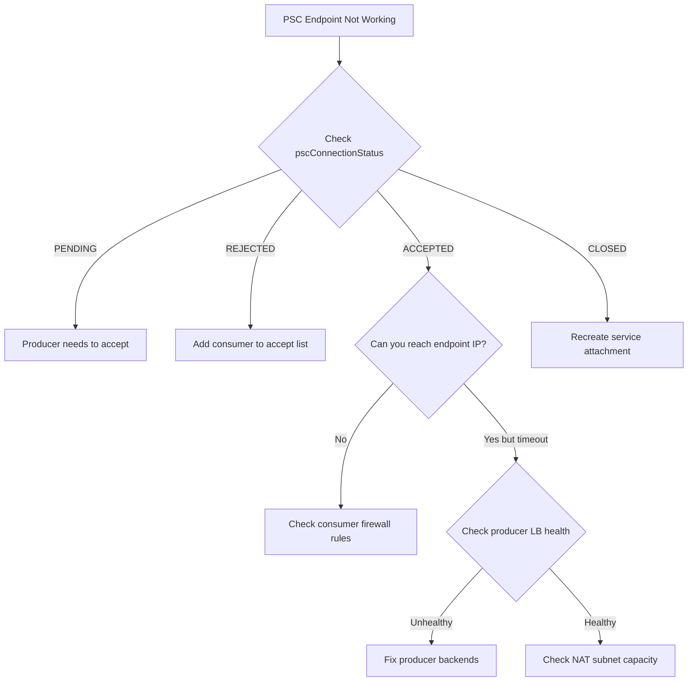

# How to Fix Private Service Connect Endpoint Not Connecting to Published Service

Author: [nawazdhandala](https://www.github.com/nawazdhandala)

Tags: GCP, Private Service Connect, Networking, VPC, Google Cloud

Description: Diagnose and fix Private Service Connect endpoint connectivity failures when the endpoint cannot reach a published service in Google Cloud.

---

Private Service Connect (PSC) lets you create private endpoints in your VPC that connect to services published by other organizations or projects. It is how you privately access Google APIs, third-party SaaS services, or your own services across project boundaries without exposing traffic to the public internet. When a PSC endpoint cannot connect to its target service, the debugging process is not straightforward because there are several moving parts on both the producer and consumer side.

## How Private Service Connect Works

There are two sides to every PSC connection. The producer publishes a service by creating a service attachment that fronts an internal load balancer. The consumer creates a forwarding rule (the endpoint) that points to the service attachment. Traffic from the consumer goes to the endpoint IP, which is privately routed to the producer's service attachment and then to the backing load balancer.

The connection between consumer and producer must be explicitly accepted. This is an important detail - PSC is not like VPC peering where both sides just enable it. The producer controls who can connect.

## Step 1: Check the Endpoint Status

Start by checking the status of the PSC endpoint (forwarding rule):

```bash
# Describe the PSC forwarding rule to see its status
gcloud compute forwarding-rules describe your-psc-endpoint \
    --region=us-central1 \
    --format="json(name, IPAddress, target, pscConnectionStatus, pscConnectionId)"
```

The `pscConnectionStatus` field tells you the state of the connection:

- `ACCEPTED` - The producer accepted the connection. It should work.
- `PENDING` - Waiting for the producer to accept or reject.
- `REJECTED` - The producer rejected the connection.
- `CLOSED` - The producer deleted the service attachment or the connection was terminated.

If the status is `PENDING`, the producer needs to accept the connection. If it is `REJECTED`, you need to work with the producer to whitelist your project.

## Step 2: Check the Service Attachment on the Producer Side

If you have access to the producer project, check the service attachment:

```bash
# Describe the service attachment
gcloud compute service-attachments describe your-service-attachment \
    --region=us-central1 \
    --project=producer-project-id \
    --format="json(name, connectionPreference, consumerAcceptLists, consumerRejectLists, connectedEndpoints)"
```

The `connectionPreference` can be:
- `ACCEPT_AUTOMATIC` - All connections are automatically accepted
- `ACCEPT_MANUAL` - Connections must be manually accepted or added to the accept list

If it is `ACCEPT_MANUAL`, make sure the consumer project is in the `consumerAcceptLists`:

```bash
# Add the consumer project to the accept list
gcloud compute service-attachments update your-service-attachment \
    --region=us-central1 \
    --project=producer-project-id \
    --consumer-accept-list=consumer-project-id=10
```

The number after the project ID is the connection limit - the maximum number of endpoints from that project.

## Step 3: Verify the NAT Subnet on the Producer Side

The producer's service attachment needs a NAT subnet (also called a PSC subnet) to translate consumer endpoint IPs to addresses that the producer's load balancer can route. If this subnet is exhausted or missing, new connections will fail.

```bash
# Check the NAT subnets associated with the service attachment
gcloud compute service-attachments describe your-service-attachment \
    --region=us-central1 \
    --project=producer-project-id \
    --format="json(natSubnets)"

# Check the IP utilization of the NAT subnet
gcloud compute networks subnets describe your-nat-subnet \
    --region=us-central1 \
    --project=producer-project-id \
    --format="json(ipCidrRange, purpose)"
```

The `purpose` should be `PRIVATE_SERVICE_CONNECT`. If the NAT subnet is running out of IPs, create an additional one and add it to the service attachment:

```bash
# Create a new NAT subnet for PSC
gcloud compute networks subnets create psc-nat-subnet-2 \
    --network=producer-vpc \
    --region=us-central1 \
    --range=10.100.1.0/24 \
    --purpose=PRIVATE_SERVICE_CONNECT \
    --project=producer-project-id

# Add it to the service attachment
gcloud compute service-attachments update your-service-attachment \
    --region=us-central1 \
    --project=producer-project-id \
    --nat-subnets=psc-nat-subnet-1,psc-nat-subnet-2
```

## Step 4: Check the Producer's Load Balancer

The service attachment points to an internal load balancer. If that load balancer is unhealthy or misconfigured, the PSC endpoint will connect successfully (status ACCEPTED) but traffic will not flow.

```bash
# Check the backend health of the producer's load balancer
gcloud compute backend-services get-health producer-backend-service \
    --region=us-central1 \
    --project=producer-project-id \
    --format="json(status)"
```

If backends are unhealthy, debug the load balancer health checks separately (firewall rules, health check configuration, application health).

## Step 5: Verify DNS Configuration on the Consumer Side

Even if the PSC endpoint is connected, you need DNS to resolve your service name to the endpoint IP. There are a few ways to handle this:

Option 1 - Create a DNS record pointing to the endpoint IP:

```bash
# Get the endpoint IP
ENDPOINT_IP=$(gcloud compute forwarding-rules describe your-psc-endpoint \
    --region=us-central1 \
    --format="value(IPAddress)")

# Create a DNS record in a private zone
gcloud dns record-sets create service.internal.example.com \
    --zone=your-private-zone \
    --type=A \
    --rrdatas=$ENDPOINT_IP \
    --ttl=300
```

Option 2 - For Google APIs PSC endpoints, use the automatic DNS setup:

```bash
# Create a PSC endpoint for Google APIs with automatic DNS
gcloud compute addresses create google-apis-endpoint \
    --global \
    --purpose=PRIVATE_SERVICE_CONNECT \
    --addresses=10.0.0.1 \
    --network=your-vpc

gcloud compute forwarding-rules create google-apis-psc \
    --global \
    --network=your-vpc \
    --address=google-apis-endpoint \
    --target-google-apis-bundle=all-apis
```

## Step 6: Check Firewall Rules on Consumer Side

Traffic from your VMs to the PSC endpoint IP must be allowed by your firewall rules. Check that there are no egress deny rules blocking traffic to the endpoint IP:

```bash
# List firewall rules that might affect PSC traffic
gcloud compute firewall-rules list \
    --filter="network:your-vpc AND direction:EGRESS" \
    --format="table(name, direction, destinationRanges, denied, priority)"
```

If you have a default egress deny rule, add an allow rule for the PSC endpoint IP.

## Step 7: Test Connectivity

From a VM in the consumer VPC, test connectivity to the endpoint:

```bash
# Test TCP connectivity to the PSC endpoint IP
curl -v http://ENDPOINT_IP:PORT/health

# If using a domain name, verify DNS resolution first
dig service.internal.example.com
curl -v http://service.internal.example.com:PORT/health
```

If DNS resolves correctly but the connection hangs or times out, the issue is likely on the producer side (load balancer health, NAT subnet exhaustion, or service attachment configuration).

## Step 8: Check for Quota and Limits

PSC has quotas that can block new connections:

```bash
# Check PSC-related quotas
gcloud compute project-info describe \
    --project=consumer-project-id \
    --format="json(quotas)" | grep -i "psc\|service_connect"
```

Key limits to be aware of:
- Maximum PSC endpoints per VPC network
- Maximum connections per service attachment
- Maximum NAT subnet IP addresses per service attachment

## Debugging Flowchart



## Monitoring PSC Connections

Use [OneUptime](https://oneuptime.com) to monitor the health of your PSC endpoints and get alerted when connection status changes or when latency through PSC endpoints increases. This is especially important for cross-organization PSC connections where you do not control the producer side.

Private Service Connect is powerful but has several configuration surfaces that all need to be correct. Work through the checklist above systematically and you will find the issue.
