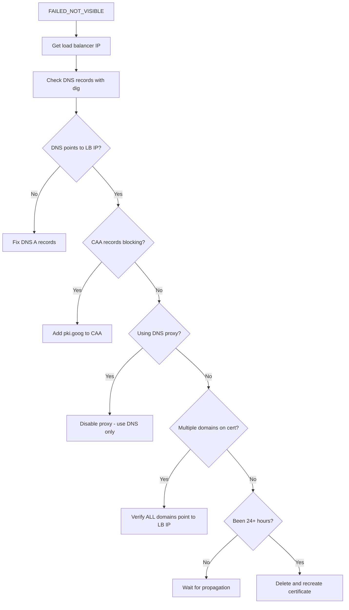

# How to Fix SSL Certificate FAILED_NOT_VISIBLE Error in GCP Load Balancer

Author: [nawazdhandala](https://www.github.com/nawazdhandala)

Tags: GCP, Load Balancer, SSL Certificate, HTTPS, Troubleshooting

Description: Fix the FAILED_NOT_VISIBLE error for Google-managed SSL certificates in GCP load balancers by resolving DNS configuration, domain verification, and certificate propagation issues.

---

You set up an HTTPS load balancer in GCP with a Google-managed SSL certificate, and the certificate status shows `FAILED_NOT_VISIBLE`. Your site is not serving over HTTPS, and the certificate refuses to provision. This error means Google tried to verify your domain ownership but could not see the expected DNS records pointing to the load balancer's IP address.

Let me walk through how to diagnose and fix this.

## Understanding the Error

When you create a Google-managed SSL certificate and attach it to a load balancer, Google's certificate authority needs to verify that you control the domain. It does this by checking that the domain's DNS records point to the load balancer's IP address.

`FAILED_NOT_VISIBLE` means the verification check failed. Google looked up your domain's DNS records and did not find them pointing to the right place.

```bash
# Check the certificate status
gcloud compute ssl-certificates describe my-cert \
    --global \
    --format="yaml(managed)"
```

The output will show something like:

```yaml
managed:
  domainStatus:
    example.com: FAILED_NOT_VISIBLE
  domains:
  - example.com
  status: PROVISIONING
```

## Step 1: Get the Load Balancer's IP Address

First, find the IP address that your domain needs to point to:

```bash
# Get the external IP of the forwarding rule
gcloud compute forwarding-rules list \
    --global \
    --format="table(name, IPAddress, target)"

# Or get the reserved static IP address
gcloud compute addresses list --global \
    --format="table(name, address, status)"
```

Note the IP address. This is what your DNS records must point to.

## Step 2: Fix DNS Records

For subdomains, create an A record (or CNAME is not supported for GCP load balancers - use A records):

```bash
# Check current DNS records for your domain
dig example.com A +short
dig www.example.com A +short

# The A record should point to the load balancer IP
# If using Cloud DNS:
gcloud dns record-sets create example.com. \
    --zone=my-dns-zone \
    --type=A \
    --ttl=300 \
    --rrdatas="34.120.xxx.xxx"  # Your load balancer IP

# For www subdomain
gcloud dns record-sets create www.example.com. \
    --zone=my-dns-zone \
    --type=A \
    --ttl=300 \
    --rrdatas="34.120.xxx.xxx"
```

If the certificate covers multiple domains, all of them must point to the load balancer IP:

```bash
# Check all domains on the certificate
gcloud compute ssl-certificates describe my-cert \
    --global \
    --format="value(managed.domains)"

# Verify each domain resolves to the LB IP
for domain in example.com www.example.com api.example.com; do
    echo "$domain: $(dig +short $domain A)"
done
```

## Step 3: Verify DNS Propagation

After updating DNS, it takes time to propagate. Check from multiple angles:

```bash
# Check from Google's public DNS
dig @8.8.8.8 example.com A +short

# Check from Cloudflare DNS
dig @1.1.1.1 example.com A +short

# Check the authoritative nameserver
dig example.com NS +short
dig @ns1.your-registrar.com example.com A +short
```

If the records are correct from Google's DNS servers, the certificate should start provisioning within 15-60 minutes.

## Step 4: Check for CAA Record Issues

Certificate Authority Authorization (CAA) records can prevent Google from issuing certificates:

```bash
# Check for CAA records
dig example.com CAA +short
```

If CAA records exist, they must include Google's CAs:

```bash
# Add CAA records allowing Google to issue certificates
gcloud dns record-sets create example.com. \
    --zone=my-dns-zone \
    --type=CAA \
    --ttl=300 \
    --rrdatas='0 issue "pki.goog"'
```

If you want to allow both Google and Let's Encrypt:

```bash
gcloud dns record-sets transaction start --zone=my-dns-zone

gcloud dns record-sets transaction add \
    --zone=my-dns-zone \
    --name=example.com. \
    --type=CAA \
    --ttl=300 \
    '0 issue "pki.goog"' '0 issue "letsencrypt.org"'

gcloud dns record-sets transaction execute --zone=my-dns-zone
```

## Step 5: Check for Proxy Interference

If you are using a DNS proxy like Cloudflare with the orange cloud (proxy) enabled, the DNS resolves to Cloudflare's IPs instead of your load balancer's IP. Google cannot see its own IP and the certificate fails.

Solution: Set the DNS record to "DNS only" (grey cloud) in Cloudflare until the certificate provisions. After provisioning, you can decide whether to keep Cloudflare's proxy disabled (recommended when using GCP load balancer) or re-enable it.

## Step 6: Wait and Monitor

Google-managed certificates can take up to 24 hours to provision after DNS is configured correctly. Monitor the status:

```bash
# Check certificate status periodically
watch -n 60 'gcloud compute ssl-certificates describe my-cert --global --format="yaml(managed.domainStatus)"'

# Or check via CLI without watch
gcloud compute ssl-certificates describe my-cert \
    --global \
    --format="table(managed.domainStatus,managed.status)"
```

The status progression is:
1. `PROVISIONING` - Initial state
2. `FAILED_NOT_VISIBLE` - DNS verification failed
3. `PROVISIONING` - After DNS fix, retries automatically
4. `ACTIVE` - Certificate issued and ready

## Step 7: Delete and Recreate If Stuck

If the certificate has been in `FAILED_NOT_VISIBLE` for more than 24 hours after fixing DNS, sometimes deleting and recreating it forces a fresh provisioning attempt:

```bash
# First, remove the certificate from the target HTTPS proxy
gcloud compute target-https-proxies update my-https-proxy \
    --ssl-certificates="" \
    --global

# Delete the stuck certificate
gcloud compute ssl-certificates delete my-cert --global

# Create a new certificate
gcloud compute ssl-certificates create my-cert-v2 \
    --domains=example.com,www.example.com \
    --global

# Reattach to the proxy
gcloud compute target-https-proxies update my-https-proxy \
    --ssl-certificates=my-cert-v2 \
    --global
```

## Using Certificate Map for Multiple Certificates

For more control, use Certificate Manager with a certificate map:

```bash
# Create a DNS authorization for your domain
gcloud certificate-manager dns-authorizations create my-auth \
    --domain=example.com

# Get the DNS record to create for verification
gcloud certificate-manager dns-authorizations describe my-auth \
    --format="value(dnsResourceRecord.name, dnsResourceRecord.type, dnsResourceRecord.data)"

# Create the CNAME record as specified in the output
# Then create the certificate
gcloud certificate-manager certificates create my-cert \
    --domains=example.com,www.example.com \
    --dns-authorizations=my-auth

# Create a certificate map and attach it to the load balancer
gcloud certificate-manager maps create my-map
gcloud certificate-manager maps entries create my-entry \
    --map=my-map \
    --certificates=my-cert \
    --hostname=example.com
```

Certificate Manager provides DNS authorization, which is more reliable than the HTTP-based verification used by standard Google-managed certificates.

## Debugging Flowchart



The `FAILED_NOT_VISIBLE` error always comes back to DNS. Make sure every domain on your certificate resolves to the load balancer's IP address, with no proxy in the way and no CAA records blocking Google's certificate authority. Once DNS is right, the certificate provisions automatically.
