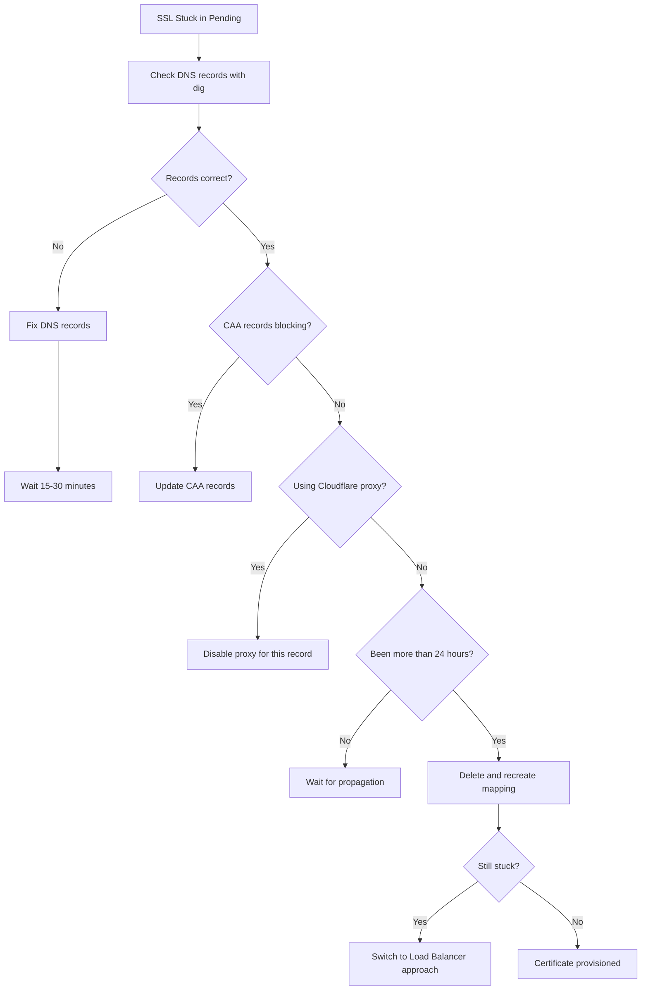

# How to Fix SSL Certificate Provisioning Stuck in Pending for Cloud Run Custom Domains

Author: [nawazdhandala](https://www.github.com/nawazdhandala)

Tags: GCP, Cloud Run, SSL, Custom Domains, Troubleshooting

Description: How to diagnose and fix SSL certificate provisioning that gets stuck in pending status when configuring custom domains for Google Cloud Run services.

---

You have mapped a custom domain to your Cloud Run service, but the SSL certificate is stuck in "Provisioning" or "Pending" status. The domain just shows a certificate error in the browser, and no matter how long you wait, it does not resolve itself. This is a common issue with several possible causes, and most of them come down to DNS configuration.

## Understanding the Problem

When you add a custom domain to Cloud Run, Google automatically provisions a managed SSL certificate using Let's Encrypt (or Google Trust Services). This process requires Google to verify that you own the domain by checking DNS records. If the DNS is not configured correctly or has not propagated, the certificate stays stuck.

The typical timeline for SSL provisioning:
- DNS records correct: 15-30 minutes
- DNS recently changed: up to 24 hours
- DNS misconfigured: stuck indefinitely

## Step 1: Verify Your DNS Records

The most common cause is incorrect DNS records. Cloud Run requires specific DNS records depending on whether you are mapping a subdomain or an apex domain.

For a subdomain (e.g., `api.example.com`):

```bash
# Check the CNAME record for your subdomain
dig api.example.com CNAME +short

# It should return: ghs.googlehosted.com.
# If it returns nothing or a different value, that is your problem
```

For an apex domain (e.g., `example.com`):

```bash
# Check A records for the apex domain
dig example.com A +short

# It should return Google's IP addresses:
# 216.239.32.21
# 216.239.34.21
# 216.239.36.21
# 216.239.38.21

# Also check AAAA records
dig example.com AAAA +short
```

## Step 2: Check Domain Mapping Status

Use gcloud to see the current state of your domain mapping:

```bash
# Check the domain mapping status
gcloud run domain-mappings describe \
    --domain=api.example.com \
    --region=us-central1 \
    --format="yaml(status)"
```

The output will show you the required DNS records and any conditions that are not met:

```yaml
status:
  conditions:
  - status: "True"
    type: DomainMappingConditionReady
  - message: "DNS records are not yet active"
    status: "False"
    type: CertificateProvisioned
  resourceRecords:
  - name: api
    rrdata: ghs.googlehosted.com.
    type: CNAME
```

The `resourceRecords` section tells you exactly what DNS records you need to create.

## Step 3: Fix DNS Configuration

Based on what the domain mapping tells you, set up the correct records at your DNS provider.

For a CNAME record (subdomains):

```
Type: CNAME
Name: api
Value: ghs.googlehosted.com.
TTL: 300
```

For A records (apex domains):

```
Type: A
Name: @
Value: 216.239.32.21

Type: A
Name: @
Value: 216.239.34.21

Type: A
Name: @
Value: 216.239.36.21

Type: A
Name: @
Value: 216.239.38.21
```

If you are using Cloud DNS, here is how to set it up:

```bash
# Add a CNAME record for a subdomain using Cloud DNS
gcloud dns record-sets create api.example.com. \
    --zone=my-dns-zone \
    --type=CNAME \
    --ttl=300 \
    --rrdatas="ghs.googlehosted.com."

# Add A records for an apex domain
gcloud dns record-sets create example.com. \
    --zone=my-dns-zone \
    --type=A \
    --ttl=300 \
    --rrdatas="216.239.32.21,216.239.34.21,216.239.36.21,216.239.38.21"
```

## Step 4: Verify DNS Propagation

After updating DNS records, verify they have propagated:

```bash
# Check DNS propagation from multiple resolvers
# Google's public DNS
dig @8.8.8.8 api.example.com CNAME +short

# Cloudflare's DNS
dig @1.1.1.1 api.example.com CNAME +short

# Check the authoritative nameserver directly
dig api.example.com CNAME +trace
```

If different resolvers return different results, DNS has not fully propagated. Give it more time - propagation can take up to 48 hours depending on the TTL of your previous records.

## Common Causes of Stuck Provisioning

### Conflicting DNS Records

If you have both an A record and a CNAME for the same subdomain, that causes problems:

```bash
# Check for conflicting records
dig api.example.com A +short
dig api.example.com CNAME +short

# If both return values, remove the A record and keep only the CNAME
```

### CAA Records Blocking Certificate Issuance

If your domain has CAA (Certificate Authority Authorization) records, they might be preventing Google from issuing a certificate:

```bash
# Check CAA records
dig example.com CAA +short
```

If you see CAA records that do not include Google's certificate authorities, add them:

```bash
# Add CAA records to allow Google to issue certificates
# You need to allow both letsencrypt.org and pki.goog
gcloud dns record-sets create example.com. \
    --zone=my-dns-zone \
    --type=CAA \
    --ttl=300 \
    --rrdatas='0 issue "letsencrypt.org",0 issue "pki.goog"'
```

### Cloudflare Proxy Interference

If your DNS is managed by Cloudflare and the proxy (orange cloud) is enabled, it intercepts traffic and prevents Google from verifying domain ownership:

The fix: Set the DNS record to "DNS only" (grey cloud) in Cloudflare. Once the certificate is provisioned, you can decide whether to use Cloudflare's proxy or Cloud Run's built-in SSL.

### Domain Verification Not Complete

For some domains, Google requires ownership verification before it will provision a certificate:

```bash
# Check if domain verification is needed
gcloud domains list-user-verified

# Verify the domain if needed
gcloud domains verify example.com
```

## Step 5: Delete and Recreate the Mapping

If the certificate has been stuck for more than 24 hours and DNS is correct, sometimes deleting and recreating the domain mapping forces a fresh provisioning attempt:

```bash
# Delete the domain mapping
gcloud run domain-mappings delete \
    --domain=api.example.com \
    --region=us-central1

# Wait a minute, then recreate it
gcloud run domain-mappings create \
    --service=my-service \
    --domain=api.example.com \
    --region=us-central1
```

## Alternative: Use a Load Balancer

If you consistently have trouble with Cloud Run's built-in domain mapping, consider using a global HTTP(S) Load Balancer with Cloud Run as a backend. This gives you more control over SSL certificates:

```bash
# Create a managed SSL certificate through the load balancer
gcloud compute ssl-certificates create my-cert \
    --domains=api.example.com \
    --global

# Check certificate provisioning status
gcloud compute ssl-certificates describe my-cert \
    --global \
    --format="value(managed.status, managed.domainStatus)"
```

The load balancer approach is more work to set up, but it gives you features like Cloud CDN, Cloud Armor, and custom SSL policies that you do not get with Cloud Run's built-in domain mapping.

## Debugging Timeline



The bottom line: SSL provisioning issues with Cloud Run are almost always DNS-related. Verify your records are correct, check for CAA conflicts, make sure no proxy is interfering, and give it time to propagate. If all else fails, the load balancer approach gives you complete control.
