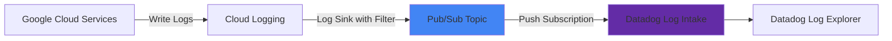
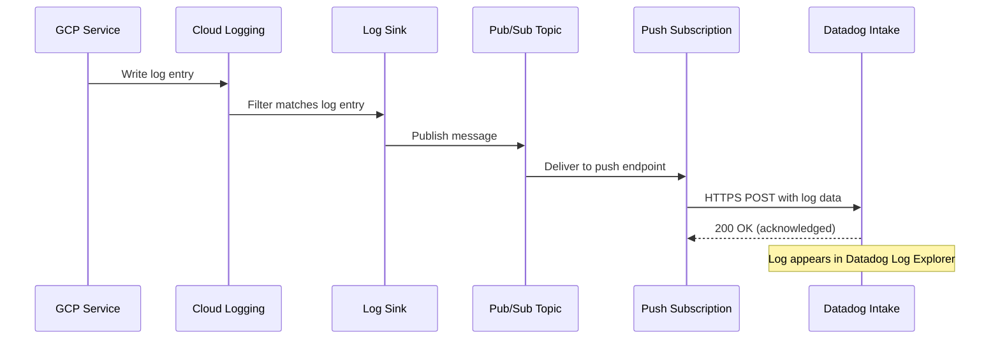

# How to Forward Google Cloud Logs to Datadog Using a Pub/Sub Export Pipeline

Author: [nawazdhandala](https://www.github.com/nawazdhandala)

Tags: GCP, Datadog, Cloud Logging, Pub/Sub, Log Forwarding, Google Cloud

Description: A detailed guide to forwarding Google Cloud logs to Datadog using a Pub/Sub export pipeline for centralized log management and analysis.

---

If your team uses Datadog for log analysis but runs infrastructure on Google Cloud, you need a reliable way to get your Cloud Logging data into Datadog. The recommended approach uses a Cloud Logging sink that exports to a Pub/Sub topic, with a push subscription that delivers logs to Datadog's intake API. This pipeline is reliable, scalable, and gives you fine-grained control over which logs get forwarded. Let me walk through the complete setup.

## Architecture

The log forwarding pipeline has four components.



## Prerequisites

- A GCP project with Cloud Logging enabled
- A Datadog account with a valid API key
- The Pub/Sub API enabled on your GCP project
- IAM permissions to create log sinks, Pub/Sub topics, and subscriptions

## Step 1: Create the Pub/Sub Topic

This topic receives logs from Cloud Logging.

```bash
# Create a Pub/Sub topic for log forwarding
gcloud pubsub topics create datadog-log-forwarding \
    --project=my-gcp-project \
    --labels=purpose=log-forwarding,destination=datadog
```

## Step 2: Create the Push Subscription

The push subscription automatically sends messages to Datadog's HTTPS intake endpoint.

```bash
# Create a push subscription that sends logs to Datadog
# Replace DD_API_KEY with your actual Datadog API key
gcloud pubsub subscriptions create datadog-log-subscription \
    --topic=datadog-log-forwarding \
    --push-endpoint="https://gcp-intake.logs.datadoghq.com/api/v2/logs?dd-api-key=YOUR_DD_API_KEY&dd-protocol=gcp" \
    --ack-deadline=60 \
    --max-delivery-attempts=5 \
    --min-retry-delay=10s \
    --max-retry-delay=600s \
    --project=my-gcp-project
```

For Datadog EU, use the EU intake endpoint.

```bash
# EU Datadog endpoint
--push-endpoint="https://gcp-intake.logs.datadoghq.eu/api/v2/logs?dd-api-key=YOUR_DD_API_KEY&dd-protocol=gcp"
```

## Step 3: Create a Dead Letter Topic

Set up a dead letter topic to catch logs that fail delivery after all retry attempts.

```bash
# Create a dead letter topic for failed deliveries
gcloud pubsub topics create datadog-log-dead-letter \
    --project=my-gcp-project

# Create a pull subscription to monitor failed messages
gcloud pubsub subscriptions create datadog-log-dead-letter-sub \
    --topic=datadog-log-dead-letter \
    --project=my-gcp-project

# Update the main subscription to use the dead letter topic
gcloud pubsub subscriptions update datadog-log-subscription \
    --dead-letter-topic=projects/my-gcp-project/topics/datadog-log-dead-letter \
    --max-delivery-attempts=5 \
    --project=my-gcp-project
```

## Step 4: Create Cloud Logging Sinks

Now create log sinks that filter and export logs to the Pub/Sub topic. You can create different sinks for different log types.

```bash
# Export all GKE container logs
gcloud logging sinks create datadog-gke-logs \
    pubsub.googleapis.com/projects/my-gcp-project/topics/datadog-log-forwarding \
    --log-filter='resource.type="k8s_container"' \
    --project=my-gcp-project

# Export all Cloud Run logs
gcloud logging sinks create datadog-cloudrun-logs \
    pubsub.googleapis.com/projects/my-gcp-project/topics/datadog-log-forwarding \
    --log-filter='resource.type="cloud_run_revision"' \
    --project=my-gcp-project

# Export Cloud SQL logs with severity WARNING and above
gcloud logging sinks create datadog-cloudsql-logs \
    pubsub.googleapis.com/projects/my-gcp-project/topics/datadog-log-forwarding \
    --log-filter='resource.type="cloudsql_database" AND severity>=WARNING' \
    --project=my-gcp-project

# Export all audit logs
gcloud logging sinks create datadog-audit-logs \
    pubsub.googleapis.com/projects/my-gcp-project/topics/datadog-log-forwarding \
    --log-filter='logName:"cloudaudit.googleapis.com"' \
    --project=my-gcp-project

# Export GCE instance logs with error severity
gcloud logging sinks create datadog-gce-error-logs \
    pubsub.googleapis.com/projects/my-gcp-project/topics/datadog-log-forwarding \
    --log-filter='resource.type="gce_instance" AND severity>=ERROR' \
    --project=my-gcp-project
```

## Step 5: Grant Pub/Sub Permissions to Sink Service Accounts

Each log sink has a unique writer identity that needs permission to publish to the Pub/Sub topic.

```bash
# Get the writer identity for each sink and grant publish permission
for SINK_NAME in datadog-gke-logs datadog-cloudrun-logs datadog-cloudsql-logs datadog-audit-logs datadog-gce-error-logs; do
    WRITER_IDENTITY=$(gcloud logging sinks describe $SINK_NAME \
        --project=my-gcp-project \
        --format="value(writerIdentity)")

    echo "Granting publish permission for $SINK_NAME ($WRITER_IDENTITY)"

    gcloud pubsub topics add-iam-policy-binding datadog-log-forwarding \
        --member="$WRITER_IDENTITY" \
        --role="roles/pubsub.publisher" \
        --project=my-gcp-project
done
```

## Step 6: Create an Inclusion/Exclusion Filter

For high-volume environments, use exclusion filters to avoid sending noisy or low-value logs.

```bash
# Create a comprehensive sink with exclusion filters
gcloud logging sinks create datadog-all-logs \
    pubsub.googleapis.com/projects/my-gcp-project/topics/datadog-log-forwarding \
    --log-filter='
        NOT logName="projects/my-gcp-project/logs/cloudaudit.googleapis.com%2Fdata_access"
        AND NOT resource.type="gcs_bucket"
        AND NOT (resource.type="k8s_container" AND resource.labels.namespace_name="kube-system" AND severity<WARNING)
        AND NOT textPayload=~"health check"
    ' \
    --project=my-gcp-project
```

This sink exports all logs except data access audit logs (which are very high volume), GCS bucket access logs, kube-system informational messages, and health check log entries.

## Step 7: Manage with Terraform

For infrastructure-as-code management, here is the complete Terraform configuration.

```hcl
# Pub/Sub topic for log forwarding
resource "google_pubsub_topic" "datadog_logs" {
  name    = "datadog-log-forwarding"
  project = var.project_id

  labels = {
    purpose     = "log-forwarding"
    destination = "datadog"
  }
}

# Dead letter topic
resource "google_pubsub_topic" "datadog_logs_dlq" {
  name    = "datadog-log-dead-letter"
  project = var.project_id
}

# Push subscription to Datadog
resource "google_pubsub_subscription" "datadog_push" {
  name    = "datadog-log-subscription"
  topic   = google_pubsub_topic.datadog_logs.id
  project = var.project_id

  push_config {
    push_endpoint = "https://gcp-intake.logs.datadoghq.com/api/v2/logs?dd-api-key=${var.datadog_api_key}&dd-protocol=gcp"
  }

  ack_deadline_seconds = 60

  dead_letter_policy {
    dead_letter_topic     = google_pubsub_topic.datadog_logs_dlq.id
    max_delivery_attempts = 5
  }

  retry_policy {
    minimum_backoff = "10s"
    maximum_backoff = "600s"
  }
}

# Log sink for GKE logs
resource "google_logging_project_sink" "gke_to_datadog" {
  name        = "datadog-gke-logs"
  project     = var.project_id
  destination = "pubsub.googleapis.com/${google_pubsub_topic.datadog_logs.id}"
  filter      = "resource.type=\"k8s_container\""

  unique_writer_identity = true
}

# Grant the sink permission to publish
resource "google_pubsub_topic_iam_member" "gke_sink_publisher" {
  topic   = google_pubsub_topic.datadog_logs.id
  role    = "roles/pubsub.publisher"
  member  = google_logging_project_sink.gke_to_datadog.writer_identity
  project = var.project_id
}

# Log sink for all error and above logs
resource "google_logging_project_sink" "errors_to_datadog" {
  name        = "datadog-error-logs"
  project     = var.project_id
  destination = "pubsub.googleapis.com/${google_pubsub_topic.datadog_logs.id}"
  filter      = "severity>=ERROR"

  unique_writer_identity = true
}

resource "google_pubsub_topic_iam_member" "error_sink_publisher" {
  topic   = google_pubsub_topic.datadog_logs.id
  role    = "roles/pubsub.publisher"
  member  = google_logging_project_sink.errors_to_datadog.writer_identity
  project = var.project_id
}
```

## Step 8: Monitor the Pipeline

Set up monitoring on the pipeline itself to catch delivery issues.

```bash
# Create an alert for Pub/Sub dead letter messages
gcloud monitoring policies create --policy-from-file=- << 'EOF'
{
  "displayName": "Datadog Log Pipeline - Dead Letter Messages",
  "conditions": [{
    "displayName": "Messages in dead letter topic",
    "conditionThreshold": {
      "filter": "metric.type=\"pubsub.googleapis.com/topic/send_message_operation_count\" AND resource.type=\"pubsub_topic\" AND resource.labels.topic_id=\"datadog-log-dead-letter\"",
      "comparison": "COMPARISON_GT",
      "thresholdValue": 0,
      "duration": "300s",
      "aggregations": [{
        "alignmentPeriod": "300s",
        "perSeriesAligner": "ALIGN_SUM"
      }]
    }
  }],
  "combiner": "OR"
}
EOF

# Create an alert for high subscription backlog
gcloud monitoring policies create --policy-from-file=- << 'EOF'
{
  "displayName": "Datadog Log Pipeline - High Backlog",
  "conditions": [{
    "displayName": "Subscription backlog exceeds 10000 messages",
    "conditionThreshold": {
      "filter": "metric.type=\"pubsub.googleapis.com/subscription/num_undelivered_messages\" AND resource.type=\"pubsub_subscription\" AND resource.labels.subscription_id=\"datadog-log-subscription\"",
      "comparison": "COMPARISON_GT",
      "thresholdValue": 10000,
      "duration": "300s"
    }
  }],
  "combiner": "OR"
}
EOF
```

## Pipeline Flow Details

Here is the detailed flow of a single log entry through the pipeline.



## Cost Optimization

Cloud Logging ingestion and Pub/Sub message delivery both cost money. Here are ways to optimize.

Use narrow log filters on your sinks. Instead of exporting everything and filtering in Datadog, filter at the sink level to reduce Pub/Sub traffic.

Exclude health check logs and other repetitive low-value entries. These can account for a large portion of log volume without providing useful information.

Consider using log-based exclusion filters in Cloud Logging itself to prevent noisy logs from being written in the first place.

```bash
# Create a Cloud Logging exclusion filter for health check logs
gcloud logging sinks create health-check-exclusion \
    --log-filter='httpRequest.requestUrl=~"/health" OR httpRequest.requestUrl=~"/readyz" OR httpRequest.requestUrl=~"/livez"' \
    --exclusion \
    --description="Exclude health check logs from ingestion" \
    --project=my-gcp-project
```

## Wrapping Up

The Pub/Sub-based pipeline for forwarding Google Cloud logs to Datadog is reliable and scalable. Log sinks give you precise control over which logs get exported, Pub/Sub handles the message delivery with retries and dead-lettering, and the push subscription takes care of getting the data to Datadog. The pipeline requires minimal maintenance once set up, but you should monitor it with alerts on dead letter messages and subscription backlog to catch any delivery issues early. With this in place, your team can use Datadog's powerful log analysis features on all your Google Cloud log data.
