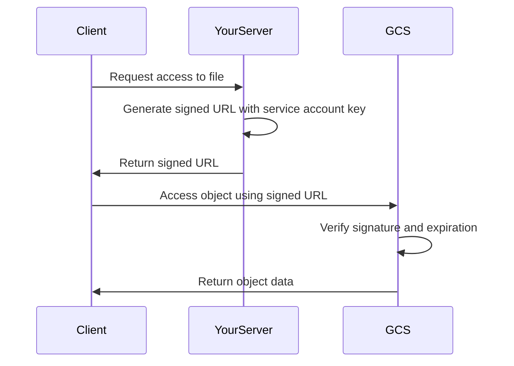

# How to Generate and Use Signed URLs for Google Cloud Storage Objects

Author: [nawazdhandala](https://www.github.com/nawazdhandala)

Tags: GCP, Google Cloud Storage, Signed URLs, Security, Cloud Authentication

Description: Learn how to generate and use signed URLs for Google Cloud Storage objects to provide time-limited access without requiring GCP authentication.

---

Signed URLs solve a common problem: how do you give someone temporary access to a private Cloud Storage object without making them authenticate with GCP? Whether you need to let users download a report, upload a file directly from their browser, or share a document with an external partner, signed URLs give you controlled, time-limited access to specific objects.

This guide covers how to generate signed URLs using different tools and languages, along with practical patterns for using them in real applications.

## How Signed URLs Work

A signed URL is a regular Cloud Storage URL with a cryptographic signature appended as query parameters. The signature encodes:

- Which object the URL grants access to
- What operation is allowed (GET, PUT, DELETE)
- When the URL expires
- Who signed it (which service account)

When someone uses the signed URL, GCS verifies the signature and checks the expiration. If everything is valid, the request goes through - no other authentication needed.



## Generating Signed URLs with gcloud

The quickest way to generate a signed URL for testing:

```bash
# Generate a signed URL valid for 1 hour for downloading an object
gcloud storage sign-url gs://my-bucket/reports/quarterly-report.pdf \
  --duration=1h
```

For a specific HTTP method:

```bash
# Generate a signed URL for uploading a file via PUT
gcloud storage sign-url gs://my-bucket/uploads/new-file.pdf \
  --duration=30m \
  --http-verb=PUT \
  --headers="Content-Type=application/pdf"
```

Note that `gcloud storage sign-url` requires that the active account has access to a service account key, or you need to specify one:

```bash
# Generate signed URL using a specific service account key file
gcloud storage sign-url gs://my-bucket/data.csv \
  --duration=2h \
  --private-key-file=service-account-key.json
```

## Generating Signed URLs in Python

For server-side URL generation, the Python client library is the most common approach.

First, install the library:

```bash
# Install the Google Cloud Storage Python client
pip install google-cloud-storage
```

Generate a download URL:

```python
from google.cloud import storage
from datetime import timedelta

def generate_download_url(bucket_name, blob_name, expiration_minutes=60):
    """Generate a signed URL for downloading an object."""

    # Initialize the client - uses default credentials or GOOGLE_APPLICATION_CREDENTIALS
    client = storage.Client()
    bucket = client.bucket(bucket_name)
    blob = bucket.blob(blob_name)

    # Generate the signed URL with the specified expiration
    url = blob.generate_signed_url(
        version="v4",
        expiration=timedelta(minutes=expiration_minutes),
        method="GET",
    )

    return url

# Usage
url = generate_download_url("my-bucket", "reports/quarterly-report.pdf")
print(f"Download URL: {url}")
```

Generate an upload URL:

```python
from google.cloud import storage
from datetime import timedelta

def generate_upload_url(bucket_name, blob_name, content_type="application/octet-stream", expiration_minutes=30):
    """Generate a signed URL for uploading an object."""

    client = storage.Client()
    bucket = client.bucket(bucket_name)
    blob = bucket.blob(blob_name)

    # Include content type in the signed URL for upload validation
    url = blob.generate_signed_url(
        version="v4",
        expiration=timedelta(minutes=expiration_minutes),
        method="PUT",
        content_type=content_type,
    )

    return url

# Usage - generate URL for uploading a PDF
url = generate_upload_url("my-bucket", "uploads/user-doc.pdf", "application/pdf")
print(f"Upload URL: {url}")
```

## Generating Signed URLs in Node.js

Install the client library:

```bash
# Install the Google Cloud Storage Node.js client
npm install @google-cloud/storage
```

Generate download and upload URLs:

```javascript
const { Storage } = require('@google-cloud/storage');

// Initialize the client
const storage = new Storage();

async function generateDownloadUrl(bucketName, fileName) {
  // Set expiration to 1 hour from now
  const options = {
    version: 'v4',
    action: 'read',
    expires: Date.now() + 60 * 60 * 1000, // 1 hour
  };

  const [url] = await storage
    .bucket(bucketName)
    .file(fileName)
    .getSignedUrl(options);

  return url;
}

async function generateUploadUrl(bucketName, fileName, contentType) {
  // Configure the signed URL for a PUT upload
  const options = {
    version: 'v4',
    action: 'write',
    expires: Date.now() + 30 * 60 * 1000, // 30 minutes
    contentType: contentType,
  };

  const [url] = await storage
    .bucket(bucketName)
    .file(fileName)
    .getSignedUrl(options);

  return url;
}

// Usage
generateDownloadUrl('my-bucket', 'reports/data.csv')
  .then(url => console.log('Download URL:', url));

generateUploadUrl('my-bucket', 'uploads/photo.jpg', 'image/jpeg')
  .then(url => console.log('Upload URL:', url));
```

## Using Signed URLs for Browser Uploads

A common pattern is generating a signed URL on your backend and having the frontend upload directly to GCS. This keeps large files off your server.

Backend (Node.js/Express example):

```javascript
const express = require('express');
const { Storage } = require('@google-cloud/storage');
const { v4: uuidv4 } = require('uuid');

const app = express();
const storage = new Storage();

app.post('/api/get-upload-url', async (req, res) => {
  const { contentType, fileName } = req.body;

  // Generate a unique path to avoid collisions
  const uniqueName = `uploads/${uuidv4()}-${fileName}`;

  const [url] = await storage
    .bucket('my-upload-bucket')
    .file(uniqueName)
    .getSignedUrl({
      version: 'v4',
      action: 'write',
      expires: Date.now() + 15 * 60 * 1000, // 15 minutes
      contentType: contentType,
    });

  // Return both the signed URL and the final object path
  res.json({ uploadUrl: url, objectPath: uniqueName });
});
```

Frontend (JavaScript):

```javascript
async function uploadFile(file) {
  // Step 1: Get a signed URL from your backend
  const response = await fetch('/api/get-upload-url', {
    method: 'POST',
    headers: { 'Content-Type': 'application/json' },
    body: JSON.stringify({
      contentType: file.type,
      fileName: file.name,
    }),
  });

  const { uploadUrl, objectPath } = await response.json();

  // Step 2: Upload the file directly to GCS using the signed URL
  const uploadResponse = await fetch(uploadUrl, {
    method: 'PUT',
    headers: { 'Content-Type': file.type },
    body: file,
  });

  if (uploadResponse.ok) {
    console.log('Upload successful:', objectPath);
    return objectPath;
  } else {
    throw new Error('Upload failed');
  }
}
```

## V2 vs V4 Signed URLs

GCS supports two signing versions:

- **V2** - older format, maximum expiration of about 10 years
- **V4** - newer format, maximum expiration of 7 days, recommended

Always use V4 unless you specifically need URLs that last longer than 7 days. V4 signed URLs are more secure and include the signing timestamp in the signature.

## Security Best Practices

**Keep expiration times short.** Only give as much time as the user realistically needs. For downloads, 15-60 minutes is usually plenty. For uploads, 5-30 minutes works well.

**Specify content types for uploads.** When generating upload signed URLs, always set the expected content type. This prevents someone from using an image upload URL to upload a script.

**Use dedicated service accounts.** Create service accounts with minimal permissions specifically for signing URLs. Do not use your application default service account for everything.

**Do not expose signed URLs in logs.** Treat them like temporary passwords. Make sure your logging infrastructure does not capture full signed URLs.

**Consider IP-based restrictions.** V4 signed URLs do not support IP restrictions directly, but you can combine them with VPC Service Controls for additional security.

## Signed URLs vs Signed Policy Documents

For browser-based uploads, you have two options:

- **Signed URLs** - simpler, good for single file uploads where you know the exact path
- **Signed Policy Documents** - more flexible, let you set constraints like max file size, allowed content types, and key prefixes

If you need to validate upload parameters beyond what signed URLs offer, look into signed policy documents instead.

## Troubleshooting

**"SignatureDoesNotMatch" errors** usually mean the request does not exactly match what was signed. Check that the HTTP method, content type, and headers match what was specified during URL generation.

**"ExpiredToken" errors** mean the URL expired. Generate a new one with a longer expiration if needed.

**CORS errors on browser uploads** mean you need to configure CORS on the bucket, not just generate a signed URL.

Signed URLs are a powerful tool for controlling access to Cloud Storage objects. They keep your private data private while giving exactly the right people exactly the right access for exactly the right amount of time.
