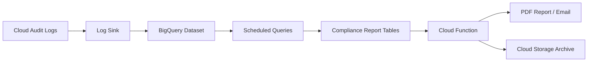

# How to Generate Compliance Reports from Google Cloud Audit Logs Automatically

Author: [nawazdhandala](https://www.github.com/nawazdhandala)

Tags: GCP, Compliance, Audit Logs, Automation, Google Cloud Security

Description: Learn how to automatically generate compliance reports from Google Cloud audit logs using BigQuery, Cloud Functions, and scheduled queries for regulatory requirements.

---

Every compliance framework - whether SOC 2, HIPAA, PCI DSS, or FedRAMP - requires evidence that your security controls are working. Manually pulling audit logs and formatting them into reports is tedious, error-prone, and does not scale. The better approach is to build an automated pipeline that continuously generates compliance reports from your Google Cloud audit logs.

This guide shows how to set up an end-to-end automated compliance reporting pipeline using Cloud Logging, BigQuery, Cloud Functions, and Cloud Scheduler.

## The Compliance Reporting Pipeline

Here is the architecture of what we are building:



Audit logs flow from all your GCP services into a BigQuery dataset through a log sink. Scheduled queries run against this data to produce compliance-specific views. A Cloud Function formats these views into reports and distributes them.

## Step 1: Export Audit Logs to BigQuery

Create a log sink that sends all audit logs to BigQuery:

```bash
# Create a BigQuery dataset for audit logs
bq mk --dataset \
    --location=US \
    --description="Audit logs for compliance reporting" \
    my-project:audit_logs

# Create a log sink that exports all audit logs to BigQuery
gcloud logging sinks create compliance-audit-sink \
    bigquery.googleapis.com/projects/my-project/datasets/audit_logs \
    --log-filter='logName:"cloudaudit.googleapis.com"' \
    --use-partitioned-tables \
    --project=my-project
```

The `--use-partitioned-tables` flag is important. It creates daily partitioned tables, which makes queries faster and cheaper when you are scanning specific date ranges.

Grant the log sink's service account write access to the BigQuery dataset:

```bash
# Get the sink's writer identity
WRITER_IDENTITY=$(gcloud logging sinks describe compliance-audit-sink \
    --project=my-project \
    --format="value(writerIdentity)")

# Grant BigQuery Data Editor role to the sink's service account
gcloud projects add-iam-policy-binding my-project \
    --role=roles/bigquery.dataEditor \
    --member="$WRITER_IDENTITY"
```

## Step 2: Create Compliance Report Queries

Now create scheduled queries that generate specific compliance reports. Here are examples for common compliance requirements.

### Access Review Report (SOC 2 / HIPAA)

This query identifies all IAM policy changes over a reporting period:

```sql
-- access_review_report.sql
-- Lists all IAM policy changes in the reporting period
-- Required for: SOC 2 CC6.1, HIPAA 164.312(a)(1)
SELECT
    timestamp,
    protopayload_auditlog.authenticationInfo.principalEmail AS actor,
    protopayload_auditlog.methodName AS action,
    protopayload_auditlog.resourceName AS resource,
    protopayload_auditlog.request.policy.bindings AS new_bindings,
    protopayload_auditlog.servicedata.policyDelta.bindingDeltas AS changes
FROM
    `audit_logs.cloudaudit_googleapis_com_activity_*`
WHERE
    _TABLE_SUFFIX BETWEEN
        FORMAT_DATE('%Y%m%d', DATE_SUB(CURRENT_DATE(), INTERVAL 30 DAY))
        AND FORMAT_DATE('%Y%m%d', CURRENT_DATE())
    AND protopayload_auditlog.methodName LIKE '%SetIamPolicy%'
ORDER BY timestamp DESC
```

### Data Access Report (HIPAA / PCI DSS)

```sql
-- data_access_report.sql
-- Lists all data access events for sensitive resources
-- Required for: HIPAA 164.312(b), PCI DSS 10.2
SELECT
    timestamp,
    protopayload_auditlog.authenticationInfo.principalEmail AS accessor,
    protopayload_auditlog.methodName AS operation,
    protopayload_auditlog.resourceName AS resource,
    protopayload_auditlog.requestMetadata.callerIp AS source_ip,
    protopayload_auditlog.requestMetadata.callerSuppliedUserAgent AS user_agent
FROM
    `audit_logs.cloudaudit_googleapis_com_data_access_*`
WHERE
    _TABLE_SUFFIX BETWEEN
        FORMAT_DATE('%Y%m%d', DATE_SUB(CURRENT_DATE(), INTERVAL 30 DAY))
        AND FORMAT_DATE('%Y%m%d', CURRENT_DATE())
    AND (
        protopayload_auditlog.resourceName LIKE '%healthcare%'
        OR protopayload_auditlog.resourceName LIKE '%sensitive-data%'
    )
ORDER BY timestamp DESC
```

### Administrative Action Report (SOC 2 / FedRAMP)

```sql
-- admin_actions_report.sql
-- Lists all administrative and destructive operations
-- Required for: SOC 2 CC7.2, FedRAMP AU-6
SELECT
    timestamp,
    protopayload_auditlog.authenticationInfo.principalEmail AS admin,
    protopayload_auditlog.methodName AS action,
    protopayload_auditlog.resourceName AS resource,
    protopayload_auditlog.status.code AS status_code,
    protopayload_auditlog.status.message AS status_message
FROM
    `audit_logs.cloudaudit_googleapis_com_activity_*`
WHERE
    _TABLE_SUFFIX BETWEEN
        FORMAT_DATE('%Y%m%d', DATE_SUB(CURRENT_DATE(), INTERVAL 30 DAY))
        AND FORMAT_DATE('%Y%m%d', CURRENT_DATE())
    AND (
        protopayload_auditlog.methodName LIKE '%delete%'
        OR protopayload_auditlog.methodName LIKE '%Delete%'
        OR protopayload_auditlog.methodName LIKE '%remove%'
        OR protopayload_auditlog.methodName LIKE '%update%'
        OR protopayload_auditlog.methodName LIKE '%create%'
    )
ORDER BY timestamp DESC
```

### Failed Authentication Report

```sql
-- failed_auth_report.sql
-- Lists authentication failures for security monitoring
-- Required for: SOC 2 CC6.1, PCI DSS 10.2.4
SELECT
    timestamp,
    protopayload_auditlog.authenticationInfo.principalEmail AS attempted_user,
    protopayload_auditlog.methodName AS attempted_action,
    protopayload_auditlog.requestMetadata.callerIp AS source_ip,
    protopayload_auditlog.status.message AS failure_reason
FROM
    `audit_logs.cloudaudit_googleapis_com_activity_*`
WHERE
    _TABLE_SUFFIX BETWEEN
        FORMAT_DATE('%Y%m%d', DATE_SUB(CURRENT_DATE(), INTERVAL 30 DAY))
        AND FORMAT_DATE('%Y%m%d', CURRENT_DATE())
    AND protopayload_auditlog.status.code != 0
    AND protopayload_auditlog.authenticationInfo.principalEmail IS NOT NULL
ORDER BY timestamp DESC
```

## Step 3: Schedule the Queries

Create scheduled queries that run these reports automatically:

```bash
# Schedule the access review report to run monthly
bq query --schedule="1 of month 02:00" \
    --display_name="Monthly Access Review Report" \
    --destination_table="my-project:compliance_reports.access_review" \
    --use_legacy_sql=false \
    --replace=true \
    @access_review_report.sql

# Schedule the data access report to run weekly
bq query --schedule="every monday 03:00" \
    --display_name="Weekly Data Access Report" \
    --destination_table="my-project:compliance_reports.data_access" \
    --use_legacy_sql=false \
    --replace=true \
    @data_access_report.sql
```

Alternatively, use the BigQuery API through Terraform:

```hcl
# Scheduled query for monthly access review report
resource "google_bigquery_data_transfer_config" "access_review" {
  display_name           = "Monthly Access Review Report"
  data_source_id         = "scheduled_query"
  schedule               = "1 of month 02:00"
  destination_dataset_id = google_bigquery_dataset.reports.dataset_id
  location               = "US"

  params = {
    destination_table_name_template = "access_review_{run_date}"
    write_disposition               = "WRITE_TRUNCATE"
    query                           = file("queries/access_review_report.sql")
  }
}
```

## Step 4: Build the Report Generator

Create a Cloud Function that generates formatted reports from the BigQuery results:

```python
# report_generator.py
# Cloud Function that generates compliance reports from BigQuery query results
# Triggered by Cloud Scheduler on a monthly basis

import functions_framework
from google.cloud import bigquery
from google.cloud import storage
from datetime import datetime, timedelta
import json
import csv
import io

bq_client = bigquery.Client()
storage_client = storage.Client()

REPORT_BUCKET = "compliance-reports-archive"

@functions_framework.http
def generate_compliance_report(request):
    """Generate and archive a compliance report."""

    report_type = request.args.get('type', 'access_review')
    report_date = datetime.utcnow().strftime('%Y-%m-%d')

    # Define report queries and metadata
    reports = {
        'access_review': {
            'title': 'Access Review Report',
            'query': 'SELECT * FROM `compliance_reports.access_review` ORDER BY timestamp DESC',
            'framework': 'SOC 2 CC6.1'
        },
        'data_access': {
            'title': 'Data Access Report',
            'query': 'SELECT * FROM `compliance_reports.data_access` ORDER BY timestamp DESC',
            'framework': 'HIPAA 164.312(b)'
        },
        'admin_actions': {
            'title': 'Administrative Actions Report',
            'query': 'SELECT * FROM `compliance_reports.admin_actions` ORDER BY timestamp DESC',
            'framework': 'SOC 2 CC7.2'
        },
        'failed_auth': {
            'title': 'Failed Authentication Report',
            'query': 'SELECT * FROM `compliance_reports.failed_auth` ORDER BY timestamp DESC',
            'framework': 'PCI DSS 10.2.4'
        }
    }

    report_config = reports.get(report_type)
    if not report_config:
        return f"Unknown report type: {report_type}", 400

    # Run the query
    query_job = bq_client.query(report_config['query'])
    results = query_job.result()

    # Generate CSV report
    csv_buffer = io.StringIO()
    writer = csv.writer(csv_buffer)

    # Write header
    writer.writerow([f.name for f in results.schema])

    # Write data rows
    row_count = 0
    for row in results:
        writer.writerow(list(row.values()))
        row_count += 1

    # Generate report metadata
    metadata = {
        'report_title': report_config['title'],
        'compliance_framework': report_config['framework'],
        'generated_at': datetime.utcnow().isoformat(),
        'reporting_period_start': (datetime.utcnow() - timedelta(days=30)).strftime('%Y-%m-%d'),
        'reporting_period_end': report_date,
        'total_records': row_count,
        'generated_by': 'automated-compliance-pipeline'
    }

    # Upload report to Cloud Storage
    bucket = storage_client.bucket(REPORT_BUCKET)

    # Upload CSV
    csv_blob = bucket.blob(f"reports/{report_date}/{report_type}.csv")
    csv_blob.upload_from_string(csv_buffer.getvalue(), content_type='text/csv')

    # Upload metadata
    meta_blob = bucket.blob(f"reports/{report_date}/{report_type}_metadata.json")
    meta_blob.upload_from_string(json.dumps(metadata, indent=2), content_type='application/json')

    return json.dumps({
        'status': 'success',
        'report': report_config['title'],
        'records': row_count,
        'archive_path': f"gs://{REPORT_BUCKET}/reports/{report_date}/{report_type}.csv"
    })
```

## Step 5: Schedule Report Generation

```bash
# Create a Cloud Scheduler job that triggers report generation monthly
gcloud scheduler jobs create http monthly-access-review \
    --schedule="0 4 1 * *" \
    --uri="https://REGION-my-project.cloudfunctions.net/generate_compliance_report?type=access_review" \
    --http-method=GET \
    --oidc-service-account-email=compliance-runner@my-project.iam.gserviceaccount.com

gcloud scheduler jobs create http weekly-data-access \
    --schedule="0 4 * * 1" \
    --uri="https://REGION-my-project.cloudfunctions.net/generate_compliance_report?type=data_access" \
    --http-method=GET \
    --oidc-service-account-email=compliance-runner@my-project.iam.gserviceaccount.com

gcloud scheduler jobs create http monthly-admin-actions \
    --schedule="0 4 1 * *" \
    --uri="https://REGION-my-project.cloudfunctions.net/generate_compliance_report?type=admin_actions" \
    --http-method=GET \
    --oidc-service-account-email=compliance-runner@my-project.iam.gserviceaccount.com
```

## Step 6: Set Up the Report Archive

```bash
# Create the compliance reports bucket with retention policy
gcloud storage buckets create gs://compliance-reports-archive \
    --project=my-project \
    --location=US \
    --retention-period=2556d \
    --uniform-bucket-level-access

# Lock the retention policy to prevent deletion
gcloud storage buckets update gs://compliance-reports-archive \
    --lock-retention-period
```

## Alerting on Compliance Events

Set up real-time alerts for events that need immediate attention:

```bash
# Alert on IAM policy changes
gcloud logging metrics create iam-policy-changes \
    --project=my-project \
    --description="Count of IAM policy changes" \
    --log-filter='protoPayload.methodName="SetIamPolicy"'

# Create an alerting policy for the metric
gcloud monitoring policies create \
    --display-name="IAM Policy Change Alert" \
    --condition-display-name="IAM policy changed" \
    --condition-filter='metric.type="logging.googleapis.com/user/iam-policy-changes"' \
    --condition-threshold-value=0 \
    --condition-threshold-comparison=COMPARISON_GT \
    --notification-channels=projects/my-project/notificationChannels/CHANNEL_ID
```

## Summary

Automated compliance reporting turns a painful manual process into a reliable pipeline that runs on its own. Export your audit logs to BigQuery, write queries that map to specific compliance controls, schedule them to run at your reporting cadence, and archive the results for auditors. The initial setup takes a few hours, but it pays for itself every time an auditor asks for evidence. Keep your queries version-controlled alongside your infrastructure code so they evolve with your compliance requirements.
