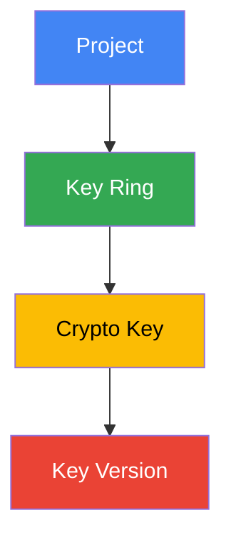

# How to Grant Granular Encrypt/Decrypt Permissions on Specific Cloud KMS Keys in GCP

Author: [nawazdhandala](https://www.github.com/nawazdhandala)

Tags: GCP, Cloud KMS, IAM, Encryption, Access Control, Security

Description: Learn how to set up fine-grained IAM permissions on individual Cloud KMS keys in GCP, separating encrypt and decrypt access for better security posture.

---

Cloud KMS in GCP gives you fine-grained control over who can do what with your encryption keys. Instead of granting broad access to all keys in a project, you can limit specific users or service accounts to encrypt-only, decrypt-only, or encrypt-and-decrypt access on individual keys. This principle of least privilege is essential for production environments where different services should only have the permissions they actually need.

In this post, I will cover the different KMS IAM roles, how to apply them at each level of the KMS hierarchy, and practical patterns for production setups.

## Understanding the Cloud KMS Resource Hierarchy

Cloud KMS resources are organized in a hierarchy. IAM policies can be applied at each level, and permissions inherit downward.



A policy set on a key ring applies to all keys in that ring. A policy on a specific crypto key applies only to that key and its versions. For the tightest control, set policies at the crypto key level.

## Cloud KMS IAM Roles

Here are the key roles relevant to encryption operations:

| Role | Permission | Use Case |
|------|-----------|----------|
| `roles/cloudkms.cryptoKeyEncrypter` | Encrypt only | Services that write encrypted data |
| `roles/cloudkms.cryptoKeyDecrypter` | Decrypt only | Services that read encrypted data |
| `roles/cloudkms.cryptoKeyEncrypterDecrypter` | Encrypt and decrypt | Services that both read and write |
| `roles/cloudkms.admin` | Full management | Key administrators |
| `roles/cloudkms.viewer` | Read metadata | Auditors and monitoring |

The separation between encrypt and decrypt is the crucial part. A service that only writes data should never need to decrypt it.

## Granting Encrypt-Only Access

Consider a logging service that writes encrypted audit logs but should never be able to read them back. Grant it only the encrypter role.

```bash
# Grant encrypt-only permission on a specific key
gcloud kms keys add-iam-policy-binding audit-log-key \
    --location=us-central1 \
    --keyring=production-keyring \
    --member="serviceAccount:log-writer@my-project.iam.gserviceaccount.com" \
    --role="roles/cloudkms.cryptoKeyEncrypter" \
    --project=my-project-id
```

If this service account tries to call the Decrypt API, it will get a permission denied error. That is exactly what you want.

## Granting Decrypt-Only Access

An audit review service that reads and processes encrypted logs, but should not be able to create new encrypted data.

```bash
# Grant decrypt-only permission on a specific key
gcloud kms keys add-iam-policy-binding audit-log-key \
    --location=us-central1 \
    --keyring=production-keyring \
    --member="serviceAccount:log-reader@my-project.iam.gserviceaccount.com" \
    --role="roles/cloudkms.cryptoKeyDecrypter" \
    --project=my-project-id
```

## Granting Encrypt and Decrypt Access

For services that need both operations, like an application that stores and retrieves encrypted user data.

```bash
# Grant both encrypt and decrypt permissions on a specific key
gcloud kms keys add-iam-policy-binding user-data-key \
    --location=us-central1 \
    --keyring=production-keyring \
    --member="serviceAccount:app-backend@my-project.iam.gserviceaccount.com" \
    --role="roles/cloudkms.cryptoKeyEncrypterDecrypter" \
    --project=my-project-id
```

## Setting Permissions at the Key Ring Level

When you have multiple keys in a ring that should share the same access policies, set the binding on the key ring.

```bash
# Grant decrypt access to all keys in a key ring
gcloud kms keyrings add-iam-policy-binding production-keyring \
    --location=us-central1 \
    --member="serviceAccount:data-pipeline@my-project.iam.gserviceaccount.com" \
    --role="roles/cloudkms.cryptoKeyDecrypter" \
    --project=my-project-id
```

Be careful with this approach. Any new key added to the ring automatically inherits these permissions.

## Using IAM Conditions for Time-Bound Access

You can add IAM conditions to grant temporary access. For example, giving a support engineer decrypt access that expires after 24 hours.

```bash
# Grant time-limited decrypt access using IAM conditions
gcloud kms keys add-iam-policy-binding sensitive-data-key \
    --location=us-central1 \
    --keyring=production-keyring \
    --member="user:support-engineer@company.com" \
    --role="roles/cloudkms.cryptoKeyDecrypter" \
    --condition="expression=request.time < timestamp('2026-02-18T00:00:00Z'),title=temporary-access,description=24hr decrypt access for incident response" \
    --project=my-project-id
```

After the specified time, the binding is automatically ineffective. The binding itself remains in the policy, but IAM evaluates the condition and denies access.

## Terraform Configuration for Granular Permissions

Here is a complete Terraform setup showing separated permissions for different service accounts.

```hcl
# Key ring for production encryption keys
resource "google_kms_key_ring" "production" {
  name     = "production-keyring"
  location = "us-central1"
}

# Encryption key for user data
resource "google_kms_crypto_key" "user_data" {
  name     = "user-data-key"
  key_ring = google_kms_key_ring.production.id
}

# Encryption key for audit logs
resource "google_kms_crypto_key" "audit_logs" {
  name     = "audit-log-key"
  key_ring = google_kms_key_ring.production.id
}

# Application backend can encrypt and decrypt user data
resource "google_kms_crypto_key_iam_member" "app_user_data" {
  crypto_key_id = google_kms_crypto_key.user_data.id
  role          = "roles/cloudkms.cryptoKeyEncrypterDecrypter"
  member        = "serviceAccount:app-backend@my-project.iam.gserviceaccount.com"
}

# Log writer can only encrypt audit logs
resource "google_kms_crypto_key_iam_member" "log_writer" {
  crypto_key_id = google_kms_crypto_key.audit_logs.id
  role          = "roles/cloudkms.cryptoKeyEncrypter"
  member        = "serviceAccount:log-writer@my-project.iam.gserviceaccount.com"
}

# Audit reviewer can only decrypt audit logs
resource "google_kms_crypto_key_iam_member" "audit_reviewer" {
  crypto_key_id = google_kms_crypto_key.audit_logs.id
  role          = "roles/cloudkms.cryptoKeyDecrypter"
  member        = "serviceAccount:audit-reader@my-project.iam.gserviceaccount.com"
}

# The app backend has NO access to audit log keys at all
# This is enforced by simply not granting any binding
```

Notice that the application backend has no access to the audit log key, and the log writer cannot decrypt anything. Each service account has exactly the permissions it needs.

## Viewing Current Permissions on a Key

To audit who has access to a specific key, retrieve its IAM policy.

```bash
# View the IAM policy for a specific key
gcloud kms keys get-iam-policy user-data-key \
    --location=us-central1 \
    --keyring=production-keyring \
    --project=my-project-id
```

This outputs all bindings on that key, including any conditions.

## Removing Permissions

When a service is decommissioned or access should be revoked, remove the specific binding.

```bash
# Remove a specific IAM binding from a key
gcloud kms keys remove-iam-policy-binding user-data-key \
    --location=us-central1 \
    --keyring=production-keyring \
    --member="serviceAccount:old-service@my-project.iam.gserviceaccount.com" \
    --role="roles/cloudkms.cryptoKeyEncrypterDecrypter" \
    --project=my-project-id
```

## Common Patterns for Production

**Separate keys per environment**: Use different keys for dev, staging, and production. Never give dev services access to production keys.

**Separate keys per data classification**: PII data should use a different key than general application data. This allows you to apply stricter access controls on PII keys.

**Admin separation**: The person who manages keys (creates, rotates, sets policies) should not be the same person who uses them for encryption. Grant `cloudkms.admin` to your platform team and `cryptoKeyEncrypterDecrypter` to application service accounts.

**Deny policies**: Use Organization Policy constraints and IAM deny policies to prevent overly broad access. For example, deny `cloudkms.cryptoKeyDecrypter` at the project level for specific principals, then grant it on specific keys.

## Auditing Key Usage

Monitor who is using your keys with Cloud Audit Logs.

```bash
# Check who has been using a specific key for decrypt operations
gcloud logging read \
    'resource.type="cloudkms_cryptokey" AND protoPayload.methodName="Decrypt" AND resource.labels.crypto_key_id="user-data-key"' \
    --limit=25 \
    --project=my-project-id \
    --format="table(timestamp, protoPayload.authenticationInfo.principalEmail)"
```

This shows you exactly which service accounts or users have been calling Decrypt on your key, along with timestamps.

## Summary

Granular KMS permissions are all about separating concerns. Not every service needs encrypt and decrypt access. By using `cryptoKeyEncrypter` and `cryptoKeyDecrypter` roles independently, you reduce the blast radius of a compromised service account. Apply permissions at the individual key level when possible, and use IAM conditions for temporary access. Combined with proper key separation across environments and data classifications, this approach gives you a robust encryption access control model.
