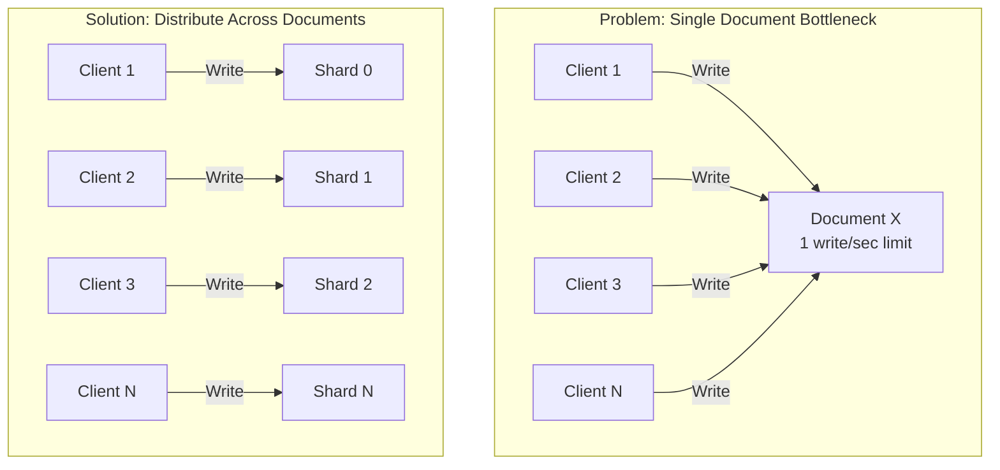

# How to Handle Firestore 10-Write-Per-Second Document Limit

Author: [nawazdhandala](https://www.github.com/nawazdhandala)

Tags: GCP, Firestore, Write Limits, Scalability, Firebase

Description: Practical strategies for working around Firestore's per-document write rate limit, including sharding, batching, and architectural patterns for high-throughput scenarios.

---

Firestore is built for scale, but it has a fundamental constraint that catches developers off guard: a single document can only sustain about one write per second on average. Push beyond that, and you will start seeing contention errors, increased latency, and failed writes. Google's documentation mentions a soft limit of 1 write per second per document, though short bursts can go higher.

This limit exists because Firestore distributes data across nodes using document paths, and a single document lives on a single node. If every write hits the same node, that node becomes a bottleneck. Let me show you how to design around this constraint.

## Understanding the Limit

The limit applies per document, not per collection. You can write to 10,000 different documents in a collection simultaneously with no problem. The issue is when many writes target the same document - a counter, a shared config, a leaderboard entry.



## Strategy 1: Distributed Counters

The most common pattern for high-write counters. Instead of one document with a count field, spread the count across multiple shard documents.

```javascript
// Distributed counter: spread writes across N shard documents
// Each shard handles 1 write/sec, so N shards handle N writes/sec
import { doc, updateDoc, increment, collection, getDocs } from 'firebase/firestore';

const NUM_SHARDS = 50;  // Supports ~50 writes/sec

async function incrementPageViews(pageId) {
  // Pick a random shard to distribute the write load
  const shardIndex = Math.floor(Math.random() * NUM_SHARDS);
  const shardRef = doc(db, `page-views/${pageId}/shards`, `${shardIndex}`);

  await updateDoc(shardRef, {
    count: increment(1)
  });
}

async function getPageViews(pageId) {
  // Sum all shards to get the total
  const shardsSnapshot = await getDocs(
    collection(db, `page-views/${pageId}/shards`)
  );

  let total = 0;
  shardsSnapshot.forEach(shard => {
    total += shard.data().count;
  });
  return total;
}
```

## Strategy 2: Client-Side Batching

Instead of writing to Firestore on every event, batch events on the client and write periodically. This reduces the number of writes hitting any single document.

```javascript
// Batch events client-side and write them in bulk
// Instead of 100 individual writes, send 1 write with 100 events
class EventBatcher {
  constructor(db, collectionPath, flushInterval = 5000) {
    this.db = db;
    this.collectionPath = collectionPath;
    this.buffer = [];
    this.maxBufferSize = 100;

    // Flush the buffer periodically
    this.flushTimer = setInterval(() => this.flush(), flushInterval);
  }

  add(event) {
    this.buffer.push({
      ...event,
      clientTimestamp: new Date().toISOString()
    });

    // Flush immediately if buffer is full
    if (this.buffer.length >= this.maxBufferSize) {
      this.flush();
    }
  }

  async flush() {
    if (this.buffer.length === 0) return;

    // Take the current buffer and reset it
    const events = [...this.buffer];
    this.buffer = [];

    // Write all events as a single document with an array field
    // This is 1 write instead of N writes
    const batchDoc = doc(collection(this.db, this.collectionPath));
    await setDoc(batchDoc, {
      events: events,
      count: events.length,
      createdAt: new Date()
    });

    console.log(`Flushed ${events.length} events`);
  }

  destroy() {
    clearInterval(this.flushTimer);
    this.flush();  // Flush remaining events
  }
}

// Usage
const batcher = new EventBatcher(db, 'analytics-events');
batcher.add({ type: 'page_view', page: '/home' });
batcher.add({ type: 'click', element: 'signup-button' });
```

## Strategy 3: Write to Different Documents

Instead of updating a single document, create new documents for each event. Collections handle high write rates much better than individual documents.

```javascript
// Instead of updating a single status document, create event documents
// Collections can handle thousands of writes per second

// BAD: All updates hit one document
// await updateDoc(doc(db, 'system', 'status'), { lastEvent: event });

// GOOD: Each event gets its own document
import { addDoc, collection, serverTimestamp } from 'firebase/firestore';

async function logEvent(event) {
  await addDoc(collection(db, 'events'), {
    ...event,
    timestamp: serverTimestamp()
  });
}
```

When you need to read the "current state," query for the most recent document instead of reading a single document:

```javascript
// Get the latest event by querying with orderBy and limit
import { collection, query, orderBy, limit, getDocs } from 'firebase/firestore';

async function getLatestEvent() {
  const q = query(
    collection(db, 'events'),
    orderBy('timestamp', 'desc'),
    limit(1)
  );

  const snapshot = await getDocs(q);
  return snapshot.docs[0]?.data() || null;
}
```

## Strategy 4: Use FieldValue.increment()

For simple counters, `FieldValue.increment()` is better than a read-then-write approach. It is an atomic operation that does not require a transaction, so it handles contention more gracefully than transactions do.

```javascript
// FieldValue.increment is atomic and handles contention better than transactions
// It still has the 1 write/sec limit, but it is more resilient to burst traffic
import { doc, updateDoc, increment } from 'firebase/firestore';

// Simple increment without reading first
await updateDoc(doc(db, 'stats', 'global'), {
  totalUsers: increment(1),
  totalPageViews: increment(1)
});
```

While this does not remove the per-document limit, it reduces contention because there is no read step that could conflict.

## Strategy 5: Aggregate with Cloud Functions

Move the aggregation work to a Cloud Function that processes events and updates summaries less frequently.

```javascript
// Cloud Function that batches analytics events into summaries
// Runs on a schedule and aggregates many small writes into few larger ones
const functions = require('firebase-functions');
const admin = require('firebase-admin');
admin.initializeApp();

const db = admin.firestore();

exports.aggregatePageViews = functions.pubsub
  .schedule('every 1 minutes')
  .onRun(async () => {
    // Read unprocessed events
    const eventsSnapshot = await db.collection('raw-page-views')
      .where('processed', '==', false)
      .limit(500)
      .get();

    if (eventsSnapshot.empty) return;

    // Aggregate by page
    const pageCounts = {};
    const batch = db.batch();

    eventsSnapshot.forEach(doc => {
      const page = doc.data().page;
      pageCounts[page] = (pageCounts[page] || 0) + 1;

      // Mark as processed
      batch.update(doc.ref, { processed: true });
    });

    // Update page view counters - one write per page instead of per event
    for (const [page, count] of Object.entries(pageCounts)) {
      const pageRef = db.collection('page-stats').doc(encodeURIComponent(page));
      batch.set(pageRef, {
        views: admin.firestore.FieldValue.increment(count)
      }, { merge: true });
    }

    await batch.commit();
    console.log(`Aggregated ${eventsSnapshot.size} events across ${Object.keys(pageCounts).length} pages`);
  });
```

## Strategy 6: Use Pub/Sub as a Buffer

For extremely high write rates, put a Pub/Sub topic in front of Firestore. Your clients publish events to Pub/Sub, and a Cloud Function subscribes and writes to Firestore at a controlled rate.

```javascript
// Publisher: send events to Pub/Sub instead of directly to Firestore
// Pub/Sub can handle millions of messages per second
const { PubSub } = require('@google-cloud/pubsub');
const pubsub = new PubSub();

async function publishEvent(event) {
  const topic = pubsub.topic('analytics-events');
  const data = Buffer.from(JSON.stringify(event));
  await topic.publishMessage({ data });
}

// Subscriber Cloud Function: write to Firestore at a controlled rate
exports.processAnalyticsEvent = functions.pubsub
  .topic('analytics-events')
  .onPublish(async (message) => {
    const event = JSON.parse(Buffer.from(message.data, 'base64').toString());

    // Write to Firestore - Cloud Functions has built-in rate limiting
    // through concurrency settings
    await db.collection('analytics').add({
      ...event,
      processedAt: admin.firestore.FieldValue.serverTimestamp()
    });
  });
```

## Choosing the Right Strategy

The best approach depends on your specific situation:

| Scenario | Best Strategy |
|----------|---------------|
| Counter that gets updated frequently | Distributed counters |
| High-frequency client events | Client-side batching |
| Status tracking or event logging | Write to new documents |
| Simple numeric fields | FieldValue.increment |
| Analytics data | Cloud Function aggregation |
| Extreme write rates (10K+ /sec) | Pub/Sub buffer |

Most real-world applications combine several of these strategies. A social media app might use distributed counters for like counts, client-side batching for analytics events, and Pub/Sub for processing notifications.

## Monitoring Write Rates

Keep an eye on your write patterns using Cloud Monitoring.

```bash
# Check for hot spots in your Firestore usage
# Look at the Key Visualizer in the Firebase Console
# Or query Cloud Monitoring for write rate metrics
gcloud monitoring metrics list --filter="metric.type=firestore.googleapis.com/document/write_count"
```

The Firestore Usage tab in the Firebase Console also shows you read/write/delete counts over time, which helps you spot documents that are getting hammered.

## Wrapping Up

The per-document write limit in Firestore is a design constraint, not a bug. It reflects how Firestore distributes data internally. Once you understand it, designing around it becomes second nature. The key principle is simple: spread your writes across multiple documents instead of concentrating them on one. Whether you use distributed counters, client-side batching, event documents, or a Pub/Sub buffer depends on your traffic patterns and latency requirements. Pick the simplest approach that meets your needs, and only add complexity when you actually hit the limit.
