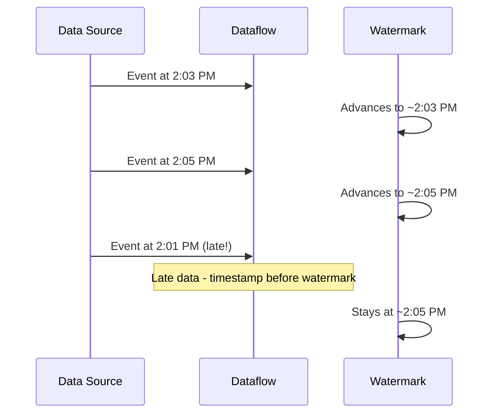

# How to Handle Late Data in Dataflow with Allowed Lateness and Watermarks

Author: [nawazdhandala](https://www.github.com/nawazdhandala)

Tags: GCP, Google Cloud Dataflow, Apache Beam, Streaming, Watermarks

Description: Understand how watermarks and allowed lateness work in Google Cloud Dataflow to handle late-arriving data in streaming pipelines without losing records.

---

In a perfect world, all streaming data would arrive in order and on time. In the real world, network delays, mobile connectivity gaps, and system backlogs mean data regularly arrives late. A sensor reading from 2:03 PM might not reach your pipeline until 2:15 PM. If your 5-minute window for 2:00-2:05 has already closed and emitted results, what happens to that late element?

By default, Dataflow drops it. And that is where most people first run into trouble with streaming pipelines. Let me walk through how watermarks and allowed lateness work together to handle late data correctly.

## What Is a Watermark?

A watermark is Dataflow's estimate of how far along in event time the pipeline has progressed. If the watermark is at 2:10 PM, Dataflow believes it has seen all data with event timestamps before 2:10 PM.

The watermark advances based on the timestamps of incoming data and the characteristics of the data source. For Pub/Sub, Dataflow tracks the oldest unacknowledged message to compute the watermark. If everything is flowing smoothly, the watermark stays close to the current wall clock time. If processing backs up or data arrives late, the watermark lags behind.



When an element arrives with a timestamp behind the watermark, it is considered late. The watermark does not move backward.

## The Default Behavior: Drop Late Data

Without any configuration, Dataflow drops elements that arrive after the watermark has passed their window's end. For a fixed window of 2:00-2:05, once the watermark passes 2:05, that window is closed and any new elements with timestamps in that range are silently discarded.

```java
// Default behavior - no allowed lateness, late data is dropped
PCollection<KV<String, Long>> counts = events
    .apply("Window", Window.<KV<String, Long>>into(
        FixedWindows.of(Duration.standardMinutes(5)))
        // Implicitly: allowedLateness = Duration.ZERO
    )
    .apply("Count", Count.perKey());
```

This might be acceptable for non-critical analytics, but for billing, fraud detection, or compliance reporting, dropping data is not an option.

## Setting Allowed Lateness

Allowed lateness tells Dataflow to keep a window open for additional time after the watermark passes it. Late-arriving elements within that grace period are still processed.

```java
// Allow up to 2 hours of late data
PCollection<KV<String, Long>> counts = events
    .apply("Window", Window.<KV<String, Long>>into(
        FixedWindows.of(Duration.standardMinutes(5)))
        .withAllowedLateness(Duration.standardHours(2))
        .triggering(AfterWatermark.pastEndOfWindow()
            .withLateFirings(
                AfterProcessingTime.pastFirstElementInPane()
                    .plusDelayOf(Duration.standardMinutes(5))))
        .accumulatingFiredPanes())
    .apply("Count", Count.perKey());
```

With this configuration, a window for 2:00-2:05 stays open until the watermark reaches 4:05 (window end + 2 hours). Any elements arriving with timestamps between 2:00 and 2:05, even if they show up at 3:30 PM processing time, are included.

The late firings trigger emits updated results every 5 minutes of processing time when late data arrives. Combined with accumulating mode, each late pane contains the complete count including all prior data.

## How Allowed Lateness Affects State

There is a cost to allowed lateness. Dataflow must maintain state for every open window. If you have a 5-minute window with 2 hours of allowed lateness, Dataflow maintains state for approximately 24 windows at any given time (2 hours divided by 5 minutes) per key.

```java
// Be careful with the combination of small windows and long lateness
// This creates a lot of state:
Window.<KV<String, Long>>into(
    FixedWindows.of(Duration.standardSeconds(10)))  // Small windows
    .withAllowedLateness(Duration.standardDays(7))   // Very long lateness
    // 7 days * 24 hours * 60 min * 6 per min = 60,480 windows per key!
```

If you have many keys and long allowed lateness with small windows, the state can grow very large. This increases memory usage on workers and slows down checkpointing. Balance your lateness requirements against the operational cost.

## Handling Data That Arrives After Allowed Lateness

Even with generous allowed lateness, some data might arrive extremely late. Data that arrives after the allowed lateness period is permanently dropped. If you cannot afford to lose any data, you need a strategy for these stragglers.

One approach is to use a side output to capture dropped elements.

```java
// Capture elements that would be dropped due to extreme lateness
final TupleTag<KV<String, Long>> mainOutput = new TupleTag<KV<String, Long>>() {};
final TupleTag<KV<String, Long>> lateOutput = new TupleTag<KV<String, Long>>() {};

PCollectionTuple results = events
    .apply("AssignTimestamps", WithTimestamps.of(event -> extractTimestamp(event)))
    .apply("Window", Window.<KV<String, Long>>into(
        FixedWindows.of(Duration.standardMinutes(5)))
        .withAllowedLateness(Duration.standardHours(2))
        .triggering(AfterWatermark.pastEndOfWindow()
            .withLateFirings(AfterPane.elementCountAtLeast(1)))
        .accumulatingFiredPanes())
    .apply("ProcessWithLateSideOutput", ParDo.of(
        new DoFn<KV<String, Long>, KV<String, Long>>() {
            @ProcessElement
            public void processElement(ProcessContext c, BoundedWindow window) {
                // All elements get processed here, including late ones
                // within allowed lateness
                c.output(c.element());
            }
        }).withOutputTags(mainOutput, TupleTagList.of(lateOutput)));
```

Another approach is to write extremely late data to a dead letter queue or a separate storage location for manual reconciliation.

## Watermark Behavior with Multiple Sources

When your pipeline reads from multiple sources, the watermark is the minimum across all sources. If one source falls behind, it holds back the watermark for the entire pipeline.

```java
// Pipeline reading from two Pub/Sub subscriptions
PCollection<String> source1 = pipeline
    .apply("ReadSource1", PubsubIO.readStrings()
        .fromSubscription("projects/my-project/subscriptions/source1"));

PCollection<String> source2 = pipeline
    .apply("ReadSource2", PubsubIO.readStrings()
        .fromSubscription("projects/my-project/subscriptions/source2"));

// Flatten combines the sources - watermark is min of both
PCollection<String> combined = PCollectionList.of(source1).and(source2)
    .apply("Flatten", Flatten.pCollections());
```

If source2 stops publishing, its watermark stalls. This stalls the combined watermark, which prevents windows from closing even for source1 data. Monitor your source watermarks independently to catch this issue early.

## Monitoring Watermark Progress

Dataflow exposes watermark metrics that you should monitor in production. The system lag metric shows the difference between the current watermark and wall clock time. A growing lag means your pipeline is falling behind.

```bash
# Check watermark lag using gcloud
gcloud dataflow metrics list JOB_ID \
  --region=us-central1 \
  --filter="name.name=system_lag"
```

You can also set up Cloud Monitoring alerts on the `dataflow.googleapis.com/job/system_lag` metric to get notified when the watermark falls too far behind.

## Practical Guidelines for Allowed Lateness

Here are guidelines I follow when configuring allowed lateness in production pipelines.

For real-time dashboards where some data loss is acceptable, I use 10-15 minutes of allowed lateness. This handles normal network jitter and minor delays without maintaining excessive state.

For financial or compliance data where accuracy matters, I set allowed lateness to match the maximum expected delay. For mobile app data, this might be 24-48 hours. For server-side data on reliable networks, 1-2 hours is usually sufficient.

For IoT data from devices with intermittent connectivity, allowed lateness might need to be days or even weeks. In these cases, consider a hybrid approach: use a streaming pipeline with moderate lateness for real-time results, and a periodic batch pipeline to reconcile with the full historical data.

Always pair allowed lateness with late firing triggers. Without a late firing trigger, late data updates the window state but never emits an updated result.

Watermarks and allowed lateness are fundamental to getting correct results from streaming pipelines. They give you explicit control over the tradeoff between timeliness and completeness, which is at the heart of every streaming system design decision.
