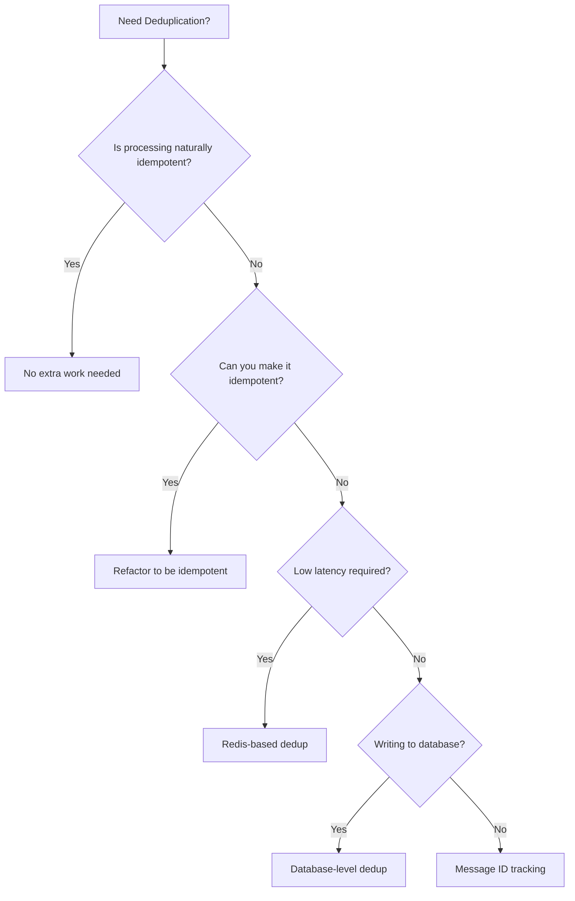

# How to Handle Pub/Sub Message Deduplication in Subscriber Applications

Author: [nawazdhandala](https://www.github.com/nawazdhandala)

Tags: GCP, Pub/Sub, Deduplication, Idempotency, Messaging

Description: Practical strategies for handling duplicate message delivery in Google Cloud Pub/Sub subscriber applications, including idempotent processing and deduplication patterns.

---

Pub/Sub delivers messages at least once. That means your subscriber might receive the same message more than once. This is not a bug - it is a fundamental design property of distributed messaging systems. The tradeoff between at-least-once and exactly-once delivery is well-understood, and Pub/Sub chooses reliability over uniqueness. If a network hiccup prevents an acknowledgement from reaching the server, Pub/Sub redelivers the message to be safe.

For some applications, processing a message twice is harmless. For others, it can cause duplicate charges, duplicate notifications, or corrupted data. If your application falls into the second category, you need a deduplication strategy.

## Why Duplicates Happen

Understanding the causes helps you design better solutions:

1. **Acknowledgement timeout**: Your subscriber processes a message but the ack does not reach Pub/Sub before the deadline. Pub/Sub redelivers.

2. **Client restarts**: Your subscriber crashes after processing a message but before acknowledging it. On restart, the message is redelivered.

3. **Network issues**: The ack is sent but lost in transit. Pub/Sub does not know the message was processed.

4. **Message replay**: If someone seeks a subscription to an earlier timestamp, previously processed messages are redelivered intentionally.

5. **Multiple subscriptions**: If a publisher accidentally publishes the same message twice (perhaps due to its own retry logic), each publish creates a distinct message with a different message ID. This is not a Pub/Sub duplicate per se, but the effect is the same.

## Strategy 1: Idempotent Processing

The cleanest approach is making your processing logic idempotent - meaning processing the same message multiple times produces the same result as processing it once.

Examples of naturally idempotent operations:
- Setting a value: `UPDATE users SET status = 'active' WHERE id = 123`
- Upserting a record with a unique key
- Writing a file with a deterministic name

Examples of non-idempotent operations:
- Incrementing a counter: `UPDATE accounts SET balance = balance + 100`
- Sending a notification
- Inserting a row without a uniqueness constraint

For non-idempotent operations, you need to add idempotency checks:

```python
# Idempotent message processing using database upsert
from google.cloud import pubsub_v1, firestore
import json

db = firestore.Client()
subscriber = pubsub_v1.SubscriberClient()

def process_payment(message):
    """Process a payment message idempotently using Firestore transactions."""
    data = json.loads(message.data.decode('utf-8'))
    payment_id = data['payment_id']

    # Use the payment_id as a natural idempotency key
    payment_ref = db.collection('payments').document(payment_id)

    @firestore.transactional
    def apply_payment(transaction):
        snapshot = payment_ref.get(transaction=transaction)

        if snapshot.exists:
            # Already processed this payment, skip
            return False

        # Process the payment
        transaction.set(payment_ref, {
            'payment_id': payment_id,
            'amount': data['amount'],
            'customer_id': data['customer_id'],
            'processed_at': firestore.SERVER_TIMESTAMP,
        })
        return True

    transaction = db.transaction()
    was_processed = apply_payment(transaction)

    if was_processed:
        print(f"Processed payment {payment_id}")
    else:
        print(f"Skipped duplicate payment {payment_id}")

    message.ack()
```

## Strategy 2: Message ID Tracking

Pub/Sub assigns a unique message ID to every message. You can track these IDs to detect redeliveries:

```python
# Deduplication using Pub/Sub message IDs with Redis
import redis
from google.cloud import pubsub_v1
import json

redis_client = redis.Redis(host='redis-host', port=6379, db=0)
subscriber = pubsub_v1.SubscriberClient()

# Time-to-live for dedup keys (should be longer than max redelivery window)
DEDUP_TTL_SECONDS = 86400  # 24 hours

def deduplicated_handler(message):
    """Process messages with Redis-based deduplication."""
    message_id = message.message_id
    dedup_key = f"pubsub:dedup:{message_id}"

    # Try to set the key - NX means only set if it does not exist
    is_new = redis_client.set(dedup_key, "1", nx=True, ex=DEDUP_TTL_SECONDS)

    if not is_new:
        # We have seen this message before
        print(f"Duplicate detected: {message_id}")
        message.ack()
        return

    try:
        # Process the message
        data = json.loads(message.data.decode('utf-8'))
        handle_event(data)
        message.ack()
    except Exception as e:
        # Processing failed, remove the dedup key so retry works
        redis_client.delete(dedup_key)
        message.nack()
        print(f"Processing failed, will retry: {e}")

def handle_event(data):
    """Your business logic here."""
    pass
```

The Redis approach is fast but requires careful handling of the failure case. If processing fails after you set the dedup key, you need to remove the key so the retry can succeed.

## Strategy 3: Database-Level Deduplication

For applications that write to a database, you can use unique constraints or conditional inserts:

```python
# Deduplication at the database level using BigQuery
from google.cloud import bigquery
import json

bq_client = bigquery.Client()

def process_with_bq_dedup(message):
    """Insert events into BigQuery with deduplication via MERGE."""
    data = json.loads(message.data.decode('utf-8'))

    # Use a MERGE statement that only inserts if the event does not exist
    query = """
    MERGE `analytics.events` AS target
    USING (SELECT @event_id AS event_id, @event_type AS event_type,
                  @payload AS payload, @timestamp AS event_timestamp) AS source
    ON target.event_id = source.event_id
    WHEN NOT MATCHED THEN
      INSERT (event_id, event_type, payload, event_timestamp)
      VALUES (source.event_id, source.event_type, source.payload, source.event_timestamp)
    """

    job_config = bigquery.QueryJobConfig(
        query_parameters=[
            bigquery.ScalarQueryParameter("event_id", "STRING", data['event_id']),
            bigquery.ScalarQueryParameter("event_type", "STRING", data['event_type']),
            bigquery.ScalarQueryParameter("payload", "STRING", json.dumps(data)),
            bigquery.ScalarQueryParameter("timestamp", "TIMESTAMP", data['timestamp']),
        ]
    )

    bq_client.query(query, job_config=job_config).result()
    message.ack()
```

For PostgreSQL or Cloud SQL:

```sql
-- Insert with conflict handling for deduplication
INSERT INTO events (event_id, event_type, payload, created_at)
VALUES ($1, $2, $3, $4)
ON CONFLICT (event_id) DO NOTHING;
```

## Strategy 4: Pub/Sub Exactly-Once Delivery

Pub/Sub offers exactly-once delivery as a subscription feature. When enabled, Pub/Sub tracks acknowledgements and does not redeliver messages that have been successfully acknowledged:

```bash
# Create a subscription with exactly-once delivery
gcloud pubsub subscriptions create order-processor-exactly-once \
  --topic=order-events \
  --enable-exactly-once-delivery
```

In Terraform:

```hcl
# Subscription with exactly-once delivery enabled
resource "google_pubsub_subscription" "order_processor_eo" {
  name  = "order-processor-exactly-once"
  topic = google_pubsub_topic.order_events.id

  enable_exactly_once_delivery = true
  ack_deadline_seconds         = 60

  expiration_policy {
    ttl = ""
  }
}
```

However, exactly-once delivery has important caveats:

- It only prevents redeliveries caused by acknowledgement issues. It does not prevent duplicate publishes.
- It requires the subscriber to use the acknowledgement IDs properly.
- It adds latency to acknowledgements because Pub/Sub needs to confirm the ack.
- It is not available for push subscriptions.

Think of it as a helpful layer, not a complete solution. You should still design your processing to be idempotent.

## Choosing the Right Strategy

Here is a decision framework:



In practice, most production systems combine multiple strategies:

1. Enable exactly-once delivery on the subscription as a first layer
2. Make processing idempotent where possible
3. Use database-level constraints as a safety net

## Handling Publisher-Side Duplicates

Sometimes the duplicate comes from the publisher, not from Pub/Sub. If a publisher retries a publish and both attempts succeed, you get two messages with different message IDs containing the same data.

To handle this, include a client-side deduplication ID in the message:

```python
# Publisher with client-side deduplication ID
import uuid
from google.cloud import pubsub_v1
import json

publisher = pubsub_v1.PublisherClient()
topic_path = publisher.topic_path("my-project", "order-events")

def publish_with_dedup_id(data, dedup_id=None):
    """Publish a message with a deduplication ID in the attributes."""
    if dedup_id is None:
        dedup_id = str(uuid.uuid4())

    future = publisher.publish(
        topic_path,
        data=json.dumps(data).encode("utf-8"),
        dedup_id=dedup_id,  # Custom attribute for subscriber-side dedup
    )
    return future.result()

# Use a deterministic dedup ID based on the event
order_data = {"order_id": "order-123", "status": "paid"}
dedup_id = f"order-123-paid-20260217"  # Deterministic, based on content

publish_with_dedup_id(order_data, dedup_id=dedup_id)
```

The subscriber then checks the `dedup_id` attribute instead of (or in addition to) the Pub/Sub message ID.

## Performance Considerations

Deduplication adds overhead. Here are some tips to minimize the impact:

- **Use in-memory caches for hot paths.** Redis or Memcached lookups are much faster than database queries.
- **Set appropriate TTLs.** You do not need to track message IDs forever. The Pub/Sub acknowledgement deadline plus some buffer is usually enough.
- **Batch dedup checks.** If you process messages in batches, check all message IDs at once rather than one at a time.
- **Shard your dedup store.** If you have very high message volume, shard your Redis instance or dedup table by message ID hash.

## Wrapping Up

Duplicate messages are a normal part of working with Pub/Sub. The best approach is to make your processing idempotent so duplicates are harmless. When that is not possible, use message ID tracking with Redis for low-latency deduplication, database constraints for durable deduplication, or Pub/Sub exactly-once delivery as an additional layer. In production, combine multiple strategies for defense in depth. The goal is not to prevent duplicates from arriving - that is impossible to guarantee in a distributed system - but to ensure your system handles them gracefully.
