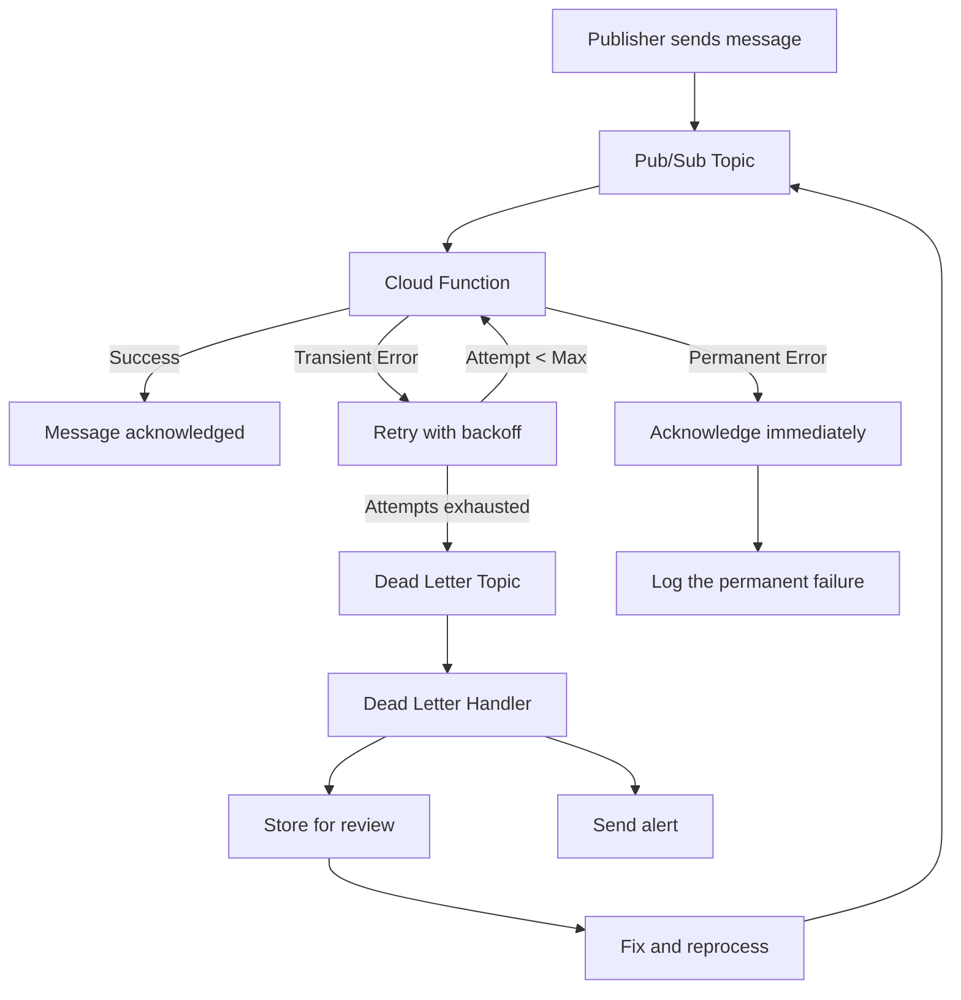

# How to Handle Retries and Dead Letter Topics in Cloud Functions for Reliable Event Processing

Author: [nawazdhandala](https://www.github.com/nawazdhandala)

Tags: GCP, Cloud Functions, Pub/Sub, Dead Letter, Reliability

Description: Learn how to configure retry policies and dead letter topics for Google Cloud Functions to build reliable event processing systems that handle failures gracefully.

---

When you build event-driven systems with Cloud Functions, things will fail. Your downstream API might be temporarily unavailable, a database connection might time out, or the incoming data might be malformed. The difference between a fragile system and a reliable one is how you handle these failures.

Google Cloud Functions has built-in retry support, and when combined with Pub/Sub dead letter topics, you get a robust failure handling pipeline. Let me show you how to set this up properly.

## Understanding Retry Behavior

The retry behavior in Cloud Functions depends on whether your function is HTTP-triggered or event-triggered.

**HTTP-triggered functions**: No automatic retries. If the function returns an error, the caller gets the error response. It is up to the caller to retry.

**Event-triggered functions (Gen 2)**: Automatic retries are handled by the underlying Pub/Sub subscription or Eventarc trigger. When your function throws an error or returns a rejected promise, the event is redelivered after a delay.

This is important: returning successfully from your function tells the system "I have processed this message, do not send it again." Throwing an error tells the system "I failed, please retry."

## Configuring Retry Behavior

### Enabling Retries

For Gen 2 functions with Pub/Sub triggers, retries are enabled by default through the Pub/Sub subscription. The subscription will keep retrying delivery until the message is acknowledged (function succeeds) or the message retention period expires (default 7 days).

For Gen 2 functions with Eventarc triggers (Cloud Storage, Firestore, etc.), retries are also handled automatically.

### Setting Retry Delay Policies

You can configure the retry delay using exponential backoff on the Pub/Sub subscription:

```bash
# First, find the subscription name created by the trigger
gcloud pubsub subscriptions list \
  --format="value(name)" \
  --filter="topic=projects/my-project/topics/my-topic"

# Configure retry policy with exponential backoff
gcloud pubsub subscriptions update my-subscription-name \
  --min-retry-delay=10s \
  --max-retry-delay=600s
```

With this configuration, retry delays will be:
- 1st retry: ~10 seconds
- 2nd retry: ~20 seconds
- 3rd retry: ~40 seconds
- 4th retry: ~80 seconds
- 5th retry: ~160 seconds
- And so on, capping at 600 seconds (10 minutes)

## Setting Up Dead Letter Topics

A dead letter topic (also called a dead letter queue) catches messages that have failed delivery too many times. Instead of retrying forever, the message is moved to a separate topic where you can inspect it, fix the issue, and reprocess it.

### Step 1: Create the Dead Letter Topic and Subscription

```bash
# Create the dead letter topic
gcloud pubsub topics create my-topic-dead-letter

# Create a subscription on the dead letter topic for monitoring
gcloud pubsub subscriptions create my-topic-dead-letter-sub \
  --topic=my-topic-dead-letter \
  --ack-deadline=120
```

### Step 2: Grant Required Permissions

The Pub/Sub service account needs permission to publish to the dead letter topic and acknowledge messages on the original subscription:

```bash
# Get the Pub/Sub service account
PROJECT_NUMBER=$(gcloud projects describe my-project --format="value(projectNumber)")
PUBSUB_SA="service-${PROJECT_NUMBER}@gcp-sa-pubsub.iam.gserviceaccount.com"

# Grant publish permission on the dead letter topic
gcloud pubsub topics add-iam-policy-binding my-topic-dead-letter \
  --member="serviceAccount:${PUBSUB_SA}" \
  --role="roles/pubsub.publisher"

# Grant subscribe permission on the original subscription
gcloud pubsub subscriptions add-iam-policy-binding my-subscription-name \
  --member="serviceAccount:${PUBSUB_SA}" \
  --role="roles/pubsub.subscriber"
```

### Step 3: Configure the Dead Letter Policy

```bash
# Update the subscription to use the dead letter topic
# Messages will be moved after 5 failed delivery attempts
gcloud pubsub subscriptions update my-subscription-name \
  --dead-letter-topic=my-topic-dead-letter \
  --max-delivery-attempts=5
```

## Writing Retry-Aware Functions

Your function code needs to distinguish between transient errors (worth retrying) and permanent errors (never going to succeed). Here is a pattern for this:

```javascript
// index.js - Retry-aware Cloud Function
const functions = require('@google-cloud/functions-framework');
const axios = require('axios');

// Custom error class for permanent failures that should NOT be retried
class PermanentError extends Error {
  constructor(message) {
    super(message);
    this.name = 'PermanentError';
  }
}

functions.cloudEvent('processEvent', async (cloudEvent) => {
  const message = cloudEvent.data.message;
  const data = Buffer.from(message.data, 'base64').toString();

  let payload;
  try {
    payload = JSON.parse(data);
  } catch (parseError) {
    // Invalid JSON will never parse successfully - do not retry
    console.error('Permanent failure: Invalid JSON in message', {
      messageId: message.messageId,
      error: parseError.message
    });
    // Return successfully to acknowledge the message (stop retries)
    return;
  }

  // Validate required fields
  if (!payload.userId || !payload.action) {
    console.error('Permanent failure: Missing required fields', {
      messageId: message.messageId,
      payload
    });
    // Return successfully to stop retries for bad data
    return;
  }

  try {
    // Call an external API - this can fail transiently
    const response = await axios.post('https://api.example.com/events', payload, {
      timeout: 10000
    });
    console.log(`Successfully processed event for user ${payload.userId}`);
  } catch (apiError) {
    if (apiError.response && apiError.response.status === 400) {
      // 400 Bad Request - the API rejected our payload permanently
      console.error('Permanent failure: API rejected the payload', {
        status: apiError.response.status,
        data: apiError.response.data
      });
      return; // Acknowledge to stop retries
    }

    // For 5xx errors, timeouts, network errors - throw to trigger retry
    console.error('Transient failure, will retry:', apiError.message);
    throw apiError; // This triggers a retry
  }
});
```

The key pattern here is: return successfully for permanent failures (to stop retries), and throw errors for transient failures (to trigger retries).

## Processing Dead Letter Messages

Create a separate function to handle dead letter messages. This function can log the failures, store them in a database for manual review, or send alerts:

```javascript
// dead-letter-handler.js - Process messages that exhausted all retries
const functions = require('@google-cloud/functions-framework');
const { Firestore } = require('@google-cloud/firestore');

const firestore = new Firestore();

functions.cloudEvent('handleDeadLetter', async (cloudEvent) => {
  const message = cloudEvent.data.message;
  const data = Buffer.from(message.data, 'base64').toString();
  const attributes = message.attributes || {};

  // Store the failed message for manual review
  const failedMessage = {
    originalMessageId: message.messageId,
    data: data,
    attributes: attributes,
    failedAt: new Date(),
    originalTopic: attributes.CloudPubSubDeadLetterSourceTopic || 'unknown',
    deliveryAttempts: parseInt(
      attributes.CloudPubSubDeadLetterSourceDeliveryCount || '0'
    ),
    status: 'pending_review'
  };

  // Save to Firestore for a review dashboard
  await firestore.collection('dead-letter-messages').add(failedMessage);

  console.error('Dead letter message stored for review:', {
    messageId: message.messageId,
    deliveryAttempts: failedMessage.deliveryAttempts
  });

  // Send an alert (webhook, email, etc.)
  // await sendAlert(failedMessage);
});
```

Deploy the dead letter handler:

```bash
# Deploy the dead letter handler function
gcloud functions deploy handle-dead-letters \
  --gen2 \
  --runtime=nodejs20 \
  --region=us-central1 \
  --source=./dead-letter-handler \
  --entry-point=handleDeadLetter \
  --trigger-topic=my-topic-dead-letter \
  --memory=256Mi
```

## Reprocessing Dead Letter Messages

Once you have fixed the issue that caused the failures, you can reprocess dead letter messages by republishing them to the original topic:

```javascript
// reprocess.js - Script to republish dead letter messages
const { Firestore } = require('@google-cloud/firestore');
const { PubSub } = require('@google-cloud/pubsub');

const firestore = new Firestore();
const pubsub = new PubSub();

async function reprocessDeadLetters() {
  // Get all pending dead letter messages
  const snapshot = await firestore
    .collection('dead-letter-messages')
    .where('status', '==', 'pending_review')
    .get();

  const topic = pubsub.topic('my-topic');
  let reprocessed = 0;

  for (const doc of snapshot.docs) {
    const message = doc.data();

    try {
      // Republish to the original topic
      await topic.publishMessage({
        data: Buffer.from(message.data),
        attributes: message.attributes
      });

      // Mark as reprocessed
      await doc.ref.update({
        status: 'reprocessed',
        reprocessedAt: new Date()
      });

      reprocessed++;
    } catch (error) {
      console.error(`Failed to reprocess message ${doc.id}:`, error);
    }
  }

  console.log(`Reprocessed ${reprocessed} of ${snapshot.size} messages`);
}

reprocessDeadLetters().catch(console.error);
```

## The Complete Flow

Here is how the entire retry and dead letter flow works:



## Best Practices

**Set a reasonable max delivery attempts**: 5-10 attempts is usually enough. If a message fails 10 times, there is likely a fundamental problem that more retries will not fix.

**Always check for idempotency**: Since messages can be delivered more than once (especially with retries), make sure processing the same message twice does not cause problems.

**Add context to error logs**: Include the message ID, delivery attempt count, and relevant payload data in your error logs. This makes debugging much easier when reviewing dead letter messages.

**Monitor your dead letter topic**: A dead letter topic that is growing means something is wrong. Set up monitoring with OneUptime to alert when messages start landing in the dead letter topic. Even a single message there deserves investigation, because it likely represents a class of failures.

**Set message retention appropriately**: Messages in Pub/Sub are retained for 7 days by default. If your retry policy means messages might be retried over several days, make sure the retention period is long enough.

Building reliable event processing is not just about writing the happy path. It is about thinking through every failure mode and building the infrastructure to handle it. Retry policies and dead letter topics give you the building blocks, but you need to wire them together thoughtfully.
