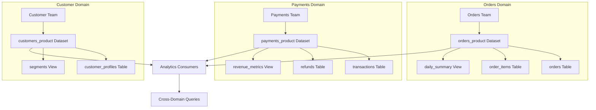

# How to Implement a Data Mesh on Google Cloud Using BigQuery Datasets as Autonomous Data Products

Author: [nawazdhandala](https://www.github.com/nawazdhandala)

Tags: GCP, Data Mesh, BigQuery, Data Products, Data Catalog, Data Engineering

Description: A practical guide to implementing data mesh principles on Google Cloud using BigQuery datasets as autonomous data products with domain ownership and self-serve infrastructure.

---

Data mesh is one of those concepts that sounds great in theory but gets confusing when you try to implement it. The core idea is simple: instead of one central data team owning all the data, individual domain teams own and publish their data as products. On GCP, BigQuery datasets map naturally to this concept. This guide shows how to build a working data mesh using BigQuery and supporting GCP services.

## Data Mesh Principles in Practice

The four principles of data mesh are domain ownership, data as a product, self-serve data platform, and federated computational governance. Let me translate these into GCP terms:

- Domain ownership means each team manages their own BigQuery datasets
- Data as a product means those datasets have SLAs, documentation, and discoverable schemas
- Self-serve platform means teams can create and manage their datasets without filing tickets with a central team
- Federated governance means consistent policies enforced across all domains through automation



## Step 1: Define the Domain Structure

Start by mapping your organizational domains to GCP projects and BigQuery datasets. Each domain gets its own project (or at minimum its own set of datasets):

```bash
# Create projects for each domain
gcloud projects create orders-domain-prod --name="Orders Domain"
gcloud projects create payments-domain-prod --name="Payments Domain"
gcloud projects create customers-domain-prod --name="Customer Domain"

# Enable BigQuery in each project
for project in orders-domain-prod payments-domain-prod customers-domain-prod; do
  gcloud services enable bigquery.googleapis.com --project=$project
  gcloud services enable datacatalog.googleapis.com --project=$project
done
```

## Step 2: Create Data Product Datasets

Each domain publishes its data through well-defined datasets. The convention is to have internal datasets (for domain-private data) and product datasets (for data shared with consumers):

```sql
-- Orders domain: Create the internal and product datasets
-- Internal dataset - not shared outside the domain
CREATE SCHEMA IF NOT EXISTS `orders-domain-prod.orders_internal`
OPTIONS (
  location = 'us-central1',
  description = 'Internal orders data - not for external consumption'
);

-- Product dataset - the published data product
CREATE SCHEMA IF NOT EXISTS `orders-domain-prod.orders_product`
OPTIONS (
  location = 'us-central1',
  description = 'Orders data product - SLA: 99.9% availability, refreshed hourly',
  labels = [('domain', 'orders'), ('product_tier', 'gold'), ('data_owner', 'orders-team')]
);
```

## Step 3: Build Data Product Tables

The product tables should have clear schemas, documentation, and quality guarantees:

```sql
-- orders_product.orders - The main orders data product table
CREATE OR REPLACE TABLE `orders-domain-prod.orders_product.orders`
(
  order_id STRING NOT NULL OPTIONS(description='Unique order identifier'),
  customer_id STRING NOT NULL OPTIONS(description='Reference to customer domain'),
  order_date DATE NOT NULL OPTIONS(description='Date the order was placed'),
  status STRING NOT NULL OPTIONS(description='Order status: pending, confirmed, shipped, delivered, cancelled'),
  total_amount NUMERIC NOT NULL OPTIONS(description='Total order amount in USD'),
  currency STRING DEFAULT 'USD' OPTIONS(description='ISO 4217 currency code'),
  created_at TIMESTAMP DEFAULT CURRENT_TIMESTAMP() OPTIONS(description='Record creation timestamp'),
  updated_at TIMESTAMP DEFAULT CURRENT_TIMESTAMP() OPTIONS(description='Last update timestamp')
)
PARTITION BY order_date
CLUSTER BY status, customer_id
OPTIONS (
  description = 'Cleaned and validated order records. Updated hourly. Partitioned by order_date.',
  labels = [('freshness_sla', 'hourly'), ('pii', 'false')]
);
```

Create a view that provides a convenient aggregation for consumers:

```sql
-- orders_product.daily_order_metrics - Pre-computed daily metrics
CREATE OR REPLACE VIEW `orders-domain-prod.orders_product.daily_order_metrics`
OPTIONS (
  description = 'Daily order metrics aggregation. Use this for dashboards and reporting.'
)
AS
SELECT
  order_date,
  COUNT(*) AS total_orders,
  SUM(total_amount) AS total_revenue,
  AVG(total_amount) AS avg_order_value,
  COUNTIF(status = 'delivered') AS delivered_orders,
  COUNTIF(status = 'cancelled') AS cancelled_orders,
  SAFE_DIVIDE(COUNTIF(status = 'cancelled'), COUNT(*)) AS cancellation_rate
FROM `orders-domain-prod.orders_product.orders`
GROUP BY order_date;
```

## Step 4: Implement Cross-Domain Access with Authorized Datasets

Instead of granting access table by table, use authorized datasets to give consuming domains access to entire product datasets:

```bash
# Grant the payments domain read access to the orders product dataset
bq update --dataset \
  --authorized_dataset="payments-domain-prod:payments_internal" \
  orders-domain-prod:orders_product

# Grant the analytics team access to all product datasets
bq update --dataset \
  --authorized_dataset="analytics-prod:cross_domain_analytics" \
  orders-domain-prod:orders_product

bq update --dataset \
  --authorized_dataset="analytics-prod:cross_domain_analytics" \
  payments-domain-prod:payments_product
```

Alternatively, use IAM for more granular control:

```bash
# Grant a specific group read access to the orders product dataset
bq add-iam-policy-binding \
  --member="group:payments-team@company.com" \
  --role="roles/bigquery.dataViewer" \
  orders-domain-prod:orders_product
```

## Step 5: Register Data Products in Data Catalog

Make your data products discoverable through Data Catalog:

```bash
# Create a tag template for data product metadata
gcloud data-catalog tag-templates create data_product_info \
  --project=company-governance \
  --location=us-central1 \
  --display-name="Data Product Information" \
  --field=id=domain,display-name="Domain",type=string,required=true \
  --field=id=owner_team,display-name="Owner Team",type=string,required=true \
  --field=id=freshness_sla,display-name="Freshness SLA",type=string,required=true \
  --field=id=quality_score,display-name="Quality Score",type=double \
  --field=id=documentation_url,display-name="Documentation URL",type=string
```

Tag your datasets with this metadata:

```python
# tag_data_product.py - Register a data product in Data Catalog
from google.cloud import datacatalog_v1

client = datacatalog_v1.DataCatalogClient()

# Look up the BigQuery dataset entry
resource_name = (
    "//bigquery.googleapis.com/projects/orders-domain-prod/"
    "datasets/orders_product"
)
entry = client.lookup_entry(
    request={"linked_resource": resource_name}
)

# Create a tag with data product metadata
tag = datacatalog_v1.Tag()
tag.template = (
    "projects/company-governance/locations/us-central1/"
    "tagTemplates/data_product_info"
)
tag.fields["domain"] = datacatalog_v1.TagField(string_value="orders")
tag.fields["owner_team"] = datacatalog_v1.TagField(string_value="orders-team")
tag.fields["freshness_sla"] = datacatalog_v1.TagField(string_value="hourly")
tag.fields["quality_score"] = datacatalog_v1.TagField(double_value=0.98)
tag.fields["documentation_url"] = datacatalog_v1.TagField(
    string_value="https://wiki.company.com/data-products/orders"
)

# Apply the tag to the dataset
created_tag = client.create_tag(parent=entry.name, tag=tag)
print(f"Tagged data product: {created_tag.name}")
```

## Step 6: Implement Data Quality Contracts

Each data product should have quality checks that run automatically:

```sql
-- data_quality_checks.sql - Quality assertions for the orders data product
-- These run as scheduled queries and alert on failures

-- Check 1: No null order_ids (should never happen)
SELECT
  'null_order_ids' AS check_name,
  COUNT(*) AS violations,
  CASE WHEN COUNT(*) > 0 THEN 'FAIL' ELSE 'PASS' END AS status
FROM `orders-domain-prod.orders_product.orders`
WHERE order_id IS NULL
  AND order_date = CURRENT_DATE()

UNION ALL

-- Check 2: Order amounts should be positive
SELECT
  'negative_amounts' AS check_name,
  COUNT(*) AS violations,
  CASE WHEN COUNT(*) > 0 THEN 'FAIL' ELSE 'PASS' END AS status
FROM `orders-domain-prod.orders_product.orders`
WHERE total_amount <= 0
  AND order_date = CURRENT_DATE()

UNION ALL

-- Check 3: Freshness check - data should be less than 2 hours old
SELECT
  'data_freshness' AS check_name,
  0 AS violations,
  CASE
    WHEN MAX(updated_at) < TIMESTAMP_SUB(CURRENT_TIMESTAMP(), INTERVAL 2 HOUR)
    THEN 'FAIL'
    ELSE 'PASS'
  END AS status
FROM `orders-domain-prod.orders_product.orders`;
```

## Step 7: Self-Serve Platform with Terraform Modules

Create reusable Terraform modules so domain teams can provision their own data products without involving a central platform team:

```hcl
# modules/data_product/main.tf - Reusable module for creating data products
variable "domain_name" {
  type        = string
  description = "Name of the domain (e.g., orders, payments)"
}

variable "project_id" {
  type        = string
  description = "GCP project ID for the domain"
}

variable "location" {
  type    = string
  default = "us-central1"
}

variable "owner_group" {
  type        = string
  description = "Google Group email for the domain team"
}

# Create the product dataset
resource "google_bigquery_dataset" "product" {
  dataset_id = "${var.domain_name}_product"
  project    = var.project_id
  location   = var.location

  description = "${var.domain_name} data product - managed by ${var.owner_group}"

  labels = {
    domain     = var.domain_name
    managed_by = "data-mesh-platform"
    type       = "data-product"
  }

  # Grant the domain team full control
  access {
    role          = "OWNER"
    group_by_email = var.owner_group
  }

  # Grant the governance team metadata access
  access {
    role          = "READER"
    group_by_email = "data-governance@company.com"
  }
}

# Create the internal dataset
resource "google_bigquery_dataset" "internal" {
  dataset_id = "${var.domain_name}_internal"
  project    = var.project_id
  location   = var.location

  description = "${var.domain_name} internal data - not for external consumption"

  labels = {
    domain     = var.domain_name
    managed_by = "data-mesh-platform"
    type       = "internal"
  }

  access {
    role          = "OWNER"
    group_by_email = var.owner_group
  }
}
```

Domain teams use the module like this:

```hcl
# domains/orders/main.tf - Orders domain data product setup
module "orders_data_product" {
  source      = "../../modules/data_product"
  domain_name = "orders"
  project_id  = "orders-domain-prod"
  owner_group = "orders-team@company.com"
}
```

## Federated Governance

The key to making data mesh work is balancing autonomy with consistency. Use organization policies and automated checks to enforce standards without bottlenecking domain teams:

1. Every product dataset must have a description and owner label
2. Every table must have column descriptions
3. PII columns must be tagged and protected with column-level security
4. Data quality checks must run on a schedule
5. All product datasets must be registered in Data Catalog

These rules can be enforced through CI/CD checks that run when domain teams make changes to their Terraform configurations.

Data mesh on GCP is not about buying a product - it is about organizing your existing BigQuery and Cloud Storage resources around domain boundaries and adding the right governance layer. The tooling is already there; the challenge is the organizational change needed to make domain teams truly own their data products.
