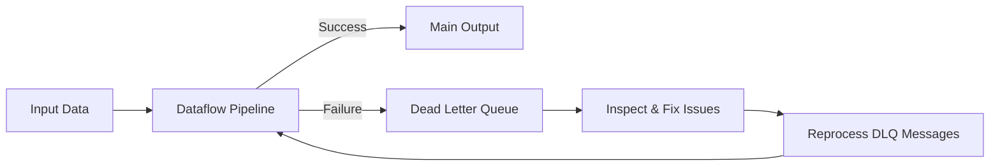

# How to Implement a Dead Letter Queue Pattern in Dataflow Pipelines

Author: [nawazdhandala](https://www.github.com/nawazdhandala)

Tags: GCP, Google Cloud Dataflow, Apache Beam, Error Handling, Pub/Sub

Description: Learn how to implement the dead letter queue pattern in Google Cloud Dataflow pipelines to gracefully handle failed records without stopping your pipeline.

---

Every data pipeline encounters bad records. Malformed JSON, missing required fields, unexpected data types, encoding issues - the list goes on. The question is not whether you will encounter bad data, but how you handle it when it shows up.

The dead letter queue (DLQ) pattern is the answer. Instead of failing the entire pipeline or silently dropping bad records, you route them to a separate output for later inspection and reprocessing. I have used this pattern in every production Dataflow pipeline I have built, and it has saved me from many late-night incidents.

## The Basic Pattern

The core idea is simple: your processing logic outputs successful records to the main output and failed records to a side output. The side output goes to a "dead letter" destination like a Pub/Sub topic, BigQuery table, or GCS bucket.

```java
// Define output tags for main and dead letter outputs
final TupleTag<TableRow> successTag = new TupleTag<TableRow>() {};
final TupleTag<String> deadLetterTag = new TupleTag<String>() {};

// Process elements and route failures to the dead letter output
PCollectionTuple results = rawMessages
    .apply("ParseAndValidate", ParDo.of(
        new DoFn<String, TableRow>() {
            @ProcessElement
            public void processElement(ProcessContext c) {
                String rawMessage = c.element();
                try {
                    // Attempt to parse and validate the record
                    TableRow row = parseAndValidate(rawMessage);
                    c.output(row);  // Success - main output
                } catch (Exception e) {
                    // Failed - send to dead letter with error context
                    String deadLetter = buildDeadLetterRecord(
                        rawMessage, e.getMessage(), Instant.now());
                    c.output(deadLetterTag, deadLetter);
                }
            }
        }).withOutputTags(successTag, TupleTagList.of(deadLetterTag)));

// Route successful records to BigQuery
results.get(successTag)
    .apply("WriteToMainTable", BigQueryIO.writeTableRows()
        .to("project:dataset.main_table")
        .withWriteDisposition(WriteDisposition.WRITE_APPEND));

// Route failed records to the dead letter destination
results.get(deadLetterTag)
    .apply("WriteToDeadLetter", PubsubIO.writeStrings()
        .to("projects/my-project/topics/dead-letter"));
```

## Building Rich Dead Letter Records

A bare error message is not very helpful when you are debugging at 3 AM. Include as much context as possible in your dead letter records.

```java
// Build a dead letter record with full context for debugging
private static String buildDeadLetterRecord(
        String originalMessage, String errorMessage, Instant timestamp) {

    JsonObject deadLetter = new JsonObject();

    // The original message that failed processing
    deadLetter.addProperty("original_payload", originalMessage);

    // What went wrong
    deadLetter.addProperty("error_message", errorMessage);

    // When the failure occurred
    deadLetter.addProperty("failure_timestamp", timestamp.toString());

    // Which pipeline and step produced the failure
    deadLetter.addProperty("pipeline_name", "user-events-etl");
    deadLetter.addProperty("failed_step", "ParseAndValidate");

    // Include a retry count if this is a reprocessed message
    deadLetter.addProperty("retry_count", 0);

    return deadLetter.toString();
}
```

When you inspect the dead letter queue later, you can see the exact input, the error, and where it happened. This makes troubleshooting much faster.

## Dead Letter Queue to BigQuery

For many teams, writing dead letters to BigQuery works well because you can query and analyze failure patterns with SQL.

```java
// Write dead letter records to a BigQuery table for analysis
TableSchema deadLetterSchema = new TableSchema().setFields(Arrays.asList(
    new TableFieldSchema().setName("original_payload").setType("STRING"),
    new TableFieldSchema().setName("error_message").setType("STRING"),
    new TableFieldSchema().setName("failure_timestamp").setType("TIMESTAMP"),
    new TableFieldSchema().setName("pipeline_name").setType("STRING"),
    new TableFieldSchema().setName("failed_step").setType("STRING"),
    new TableFieldSchema().setName("retry_count").setType("INTEGER")
));

results.get(deadLetterTag)
    .apply("ConvertToTableRow", ParDo.of(new DoFn<String, TableRow>() {
        @ProcessElement
        public void processElement(ProcessContext c) {
            // Convert JSON string to TableRow for BigQuery
            JsonObject json = JsonParser.parseString(c.element()).getAsJsonObject();
            TableRow row = new TableRow()
                .set("original_payload", json.get("original_payload").getAsString())
                .set("error_message", json.get("error_message").getAsString())
                .set("failure_timestamp", json.get("failure_timestamp").getAsString())
                .set("pipeline_name", json.get("pipeline_name").getAsString())
                .set("failed_step", json.get("failed_step").getAsString())
                .set("retry_count", json.get("retry_count").getAsInt());
            c.output(row);
        }
    }))
    .apply("WriteDeadLetterBQ", BigQueryIO.writeTableRows()
        .to("project:dataset.dead_letter_events")
        .withSchema(deadLetterSchema)
        .withWriteDisposition(WriteDisposition.WRITE_APPEND)
        .withCreateDisposition(CreateDisposition.CREATE_IF_NEEDED));
```

Once the data is in BigQuery, you can run queries to find patterns.

```sql
-- Find the most common error messages in the last 24 hours
SELECT
  error_message,
  COUNT(*) as failure_count,
  MIN(failure_timestamp) as first_seen,
  MAX(failure_timestamp) as last_seen
FROM `project.dataset.dead_letter_events`
WHERE failure_timestamp > TIMESTAMP_SUB(CURRENT_TIMESTAMP(), INTERVAL 24 HOUR)
GROUP BY error_message
ORDER BY failure_count DESC
LIMIT 20;
```

## Multi-Stage Dead Letter Handling

In complex pipelines with multiple processing stages, each stage might produce its own failures. You can implement DLQ at each stage or funnel everything to a central dead letter destination.

```java
// Stage 1: Parse raw messages
PCollectionTuple parsed = rawMessages
    .apply("Parse", ParDo.of(new ParseFn())
        .withOutputTags(parsedTag, TupleTagList.of(dlqTag)));

// Stage 2: Enrich with lookup data
PCollectionTuple enriched = parsed.get(parsedTag)
    .apply("Enrich", ParDo.of(new EnrichFn())
        .withOutputTags(enrichedTag, TupleTagList.of(dlqTag)));

// Stage 3: Transform to output format
PCollectionTuple transformed = enriched.get(enrichedTag)
    .apply("Transform", ParDo.of(new TransformFn())
        .withOutputTags(transformedTag, TupleTagList.of(dlqTag)));

// Collect all dead letters from all stages into one stream
PCollection<String> allDeadLetters = PCollectionList
    .of(parsed.get(dlqTag))
    .and(enriched.get(dlqTag))
    .and(transformed.get(dlqTag))
    .apply("FlattenDeadLetters", Flatten.pCollections());

// Write all dead letters to a single destination
allDeadLetters
    .apply("WriteAllDLQ", PubsubIO.writeStrings()
        .to("projects/my-project/topics/dead-letter"));
```

## The Reprocessing Loop

A dead letter queue is only half the solution. You also need a way to reprocess failed records after fixing the underlying issue.



Here is a simple Cloud Function that can reprocess dead letter messages from a Pub/Sub DLQ topic back into the main input topic.

```python
# Cloud Function to reprocess dead letter messages
import json
from google.cloud import pubsub_v1

publisher = pubsub_v1.PublisherClient()
INPUT_TOPIC = "projects/my-project/topics/input-events"

def reprocess_dead_letter(event, context):
    """Triggered by a message on the dead letter subscription."""
    import base64

    # Decode the dead letter message
    dead_letter = json.loads(base64.b64decode(event['data']).decode('utf-8'))

    # Extract the original payload
    original_payload = dead_letter['original_payload']

    # Republish the original message to the input topic
    future = publisher.publish(
        INPUT_TOPIC,
        original_payload.encode('utf-8'),
        reprocessed="true",
        original_error=dead_letter['error_message']
    )

    print(f"Reprocessed message: {future.result()}")
```

## Monitoring Dead Letter Volume

You should absolutely monitor the rate of dead letter messages. A sudden spike usually indicates a schema change, a data quality issue upstream, or a bug in your processing logic.

Set up alerting on the dead letter Pub/Sub topic or BigQuery table.

```bash
# Create a Cloud Monitoring alert for dead letter message rate
gcloud alpha monitoring policies create \
  --notification-channels=CHANNEL_ID \
  --display-name="High Dead Letter Rate" \
  --condition-display-name="DLQ messages above threshold" \
  --condition-filter='resource.type="pubsub_topic" AND resource.label.topic_id="dead-letter" AND metric.type="pubsub.googleapis.com/topic/send_message_operation_count"' \
  --condition-threshold-value=100 \
  --condition-threshold-duration=300s
```

## Error Classification

Not all errors deserve the same treatment. I typically classify dead letter records into categories.

Transient errors like network timeouts or temporary service unavailability should be retried automatically. You can build retry logic directly into your DoFn before sending to the DLQ.

Permanent errors like schema validation failures or corrupt data need human intervention. These go straight to the DLQ.

```java
// Retry transient errors before routing to dead letter
@ProcessElement
public void processElement(ProcessContext c) {
    String message = c.element();
    int maxRetries = 3;

    for (int attempt = 0; attempt < maxRetries; attempt++) {
        try {
            TableRow row = processMessage(message);
            c.output(row);
            return;  // Success, exit the retry loop
        } catch (TransientException e) {
            // Transient error - retry after backoff
            if (attempt < maxRetries - 1) {
                try { Thread.sleep((long) Math.pow(2, attempt) * 1000); }
                catch (InterruptedException ie) { Thread.currentThread().interrupt(); }
            }
        } catch (PermanentException e) {
            // Permanent error - go directly to dead letter
            c.output(deadLetterTag, buildDeadLetterRecord(message, e.getMessage()));
            return;
        }
    }
    // All retries exhausted - send to dead letter
    c.output(deadLetterTag, buildDeadLetterRecord(message, "Max retries exceeded"));
}
```

The dead letter queue pattern is essential for building resilient data pipelines. It lets your pipeline keep processing good data while preserving bad records for later analysis. Every production pipeline should have one.
