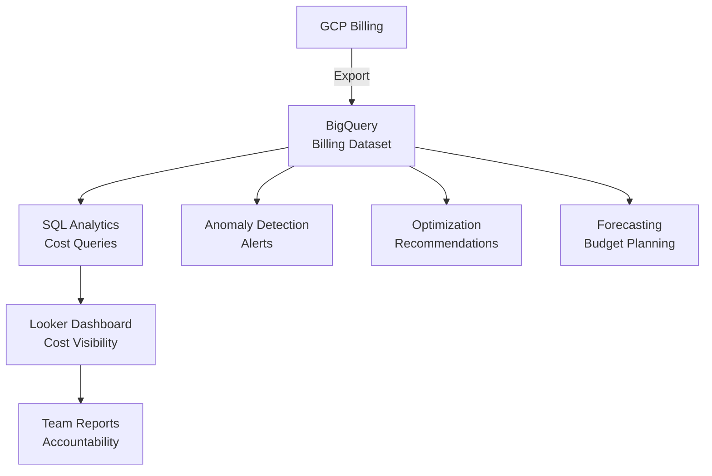

# How to Implement a FinOps Practice on GCP Using Billing Export BigQuery and Looker Dashboards

Author: [nawazdhandala](https://www.github.com/nawazdhandala)

Tags: GCP, FinOps, Billing Export, BigQuery, Looker, Cost Management, Cloud Optimization

Description: A practical guide to implementing FinOps on GCP by exporting billing data to BigQuery, building cost analytics with SQL, and creating Looker dashboards for visibility and accountability.

---

Cloud costs have a way of creeping up. What starts as a few hundred dollars a month becomes tens of thousands before anyone notices. FinOps - the practice of making cloud spending visible, accountable, and optimized - starts with data. On GCP, the billing export to BigQuery gives you detailed cost data that you can analyze with SQL and visualize with Looker. This guide walks through setting up a complete FinOps practice from scratch.

## What FinOps Looks Like in Practice

FinOps is not about cutting costs blindly. It is about making informed decisions: understanding what you spend, who spends it, and whether you are getting good value. The three pillars are:

1. Inform - make costs visible to everyone who creates them
2. Optimize - find and eliminate waste
3. Operate - build cost awareness into engineering culture



## Step 1: Enable Billing Export to BigQuery

Set up the billing export from the GCP Console or using the CLI:

```bash
# Create a BigQuery dataset for billing data
bq mk --dataset \
  --location=us \
  --description="GCP billing export data" \
  my-billing-project:billing_export

# Enable detailed billing export (must be done through Console)
# Go to Billing > Billing Export > BigQuery Export
# Select the dataset and enable both Standard and Detailed exports
```

GCP exports three types of billing data:

- Standard export: Daily cost summaries by service and SKU
- Detailed export: Resource-level costs with labels and project breakdown
- Pricing export: The rate card for all GCP services

The detailed export is what you want for FinOps - it includes labels, project IDs, and resource-level cost attribution.

## Step 2: Understand the Billing Data Schema

The billing export table has a rich schema. Here are the key columns:

```sql
-- Explore the billing export schema
SELECT
  column_name,
  data_type,
  description
FROM `my-billing-project.billing_export.INFORMATION_SCHEMA.COLUMNS`
WHERE table_name = 'gcp_billing_export_resource_v1_BILLING_ACCOUNT_ID'
ORDER BY ordinal_position;
```

The most important fields for FinOps analysis:

```sql
-- Key fields in the billing export
SELECT
  billing_account_id,
  project.id AS project_id,
  project.name AS project_name,
  service.description AS service_name,
  sku.description AS sku_name,
  usage_start_time,
  usage_end_time,
  location.region,
  labels,  -- User-applied labels for cost attribution
  cost,
  currency,
  credits,  -- Committed use discounts, sustained use discounts, etc.
  usage.amount AS usage_amount,
  usage.unit AS usage_unit,
  cost + IFNULL((SELECT SUM(c.amount) FROM UNNEST(credits) c), 0) AS net_cost
FROM `my-billing-project.billing_export.gcp_billing_export_resource_v1_BILLING_ACCOUNT_ID`
WHERE DATE(usage_start_time) = CURRENT_DATE()
LIMIT 100;
```

## Step 3: Build Core Cost Analytics Queries

Create views that answer the most common FinOps questions.

Daily cost by project:

```sql
-- Daily cost breakdown by project
CREATE OR REPLACE VIEW `my-billing-project.finops.daily_cost_by_project` AS
SELECT
  DATE(usage_start_time) AS cost_date,
  project.id AS project_id,
  project.name AS project_name,
  SUM(cost) AS gross_cost,
  SUM(IFNULL((SELECT SUM(c.amount) FROM UNNEST(credits) c), 0)) AS total_credits,
  SUM(cost + IFNULL((SELECT SUM(c.amount) FROM UNNEST(credits) c), 0)) AS net_cost
FROM `my-billing-project.billing_export.gcp_billing_export_resource_v1_BILLING_ACCOUNT_ID`
WHERE DATE(usage_start_time) >= DATE_SUB(CURRENT_DATE(), INTERVAL 90 DAY)
GROUP BY 1, 2, 3
ORDER BY cost_date DESC, net_cost DESC;
```

Cost by service and SKU:

```sql
-- Monthly cost breakdown by service
CREATE OR REPLACE VIEW `my-billing-project.finops.monthly_cost_by_service` AS
SELECT
  DATE_TRUNC(DATE(usage_start_time), MONTH) AS month,
  service.description AS service_name,
  SUM(cost + IFNULL((SELECT SUM(c.amount) FROM UNNEST(credits) c), 0)) AS net_cost,
  -- Month-over-month change
  LAG(SUM(cost + IFNULL((SELECT SUM(c.amount) FROM UNNEST(credits) c), 0)))
    OVER (PARTITION BY service.description ORDER BY DATE_TRUNC(DATE(usage_start_time), MONTH))
    AS previous_month_cost
FROM `my-billing-project.billing_export.gcp_billing_export_resource_v1_BILLING_ACCOUNT_ID`
WHERE DATE(usage_start_time) >= DATE_SUB(CURRENT_DATE(), INTERVAL 365 DAY)
GROUP BY 1, 2
ORDER BY month DESC, net_cost DESC;
```

Cost attribution by team labels:

```sql
-- Cost by team (using labels for attribution)
CREATE OR REPLACE VIEW `my-billing-project.finops.cost_by_team` AS
SELECT
  DATE_TRUNC(DATE(usage_start_time), WEEK) AS week,
  (SELECT value FROM UNNEST(labels) WHERE key = 'team') AS team,
  (SELECT value FROM UNNEST(labels) WHERE key = 'environment') AS environment,
  service.description AS service_name,
  SUM(cost + IFNULL((SELECT SUM(c.amount) FROM UNNEST(credits) c), 0)) AS net_cost
FROM `my-billing-project.billing_export.gcp_billing_export_resource_v1_BILLING_ACCOUNT_ID`
WHERE DATE(usage_start_time) >= DATE_SUB(CURRENT_DATE(), INTERVAL 90 DAY)
GROUP BY 1, 2, 3, 4
HAVING net_cost > 1  -- Filter out noise
ORDER BY week DESC, net_cost DESC;
```

## Step 4: Identify Optimization Opportunities

Find wasted spend with targeted queries:

```sql
-- Find idle Compute Engine instances (high cost, low CPU utilization)
-- Cross-reference billing with monitoring data
CREATE OR REPLACE VIEW `my-billing-project.finops.idle_compute_instances` AS
SELECT
  resource.name AS instance_name,
  project.id AS project_id,
  location.region,
  SUM(cost + IFNULL((SELECT SUM(c.amount) FROM UNNEST(credits) c), 0)) AS monthly_cost,
  (SELECT value FROM UNNEST(labels) WHERE key = 'team') AS team
FROM `my-billing-project.billing_export.gcp_billing_export_resource_v1_BILLING_ACCOUNT_ID`
WHERE service.description = 'Compute Engine'
  AND sku.description LIKE '%Instance%'
  AND DATE(usage_start_time) >= DATE_SUB(CURRENT_DATE(), INTERVAL 30 DAY)
GROUP BY 1, 2, 3, 5
HAVING monthly_cost > 100
ORDER BY monthly_cost DESC;
```

Find unattached persistent disks:

```sql
-- Identify potentially unattached disks (storage cost with no compute)
SELECT
  resource.name AS disk_name,
  project.id AS project_id,
  SUM(cost + IFNULL((SELECT SUM(c.amount) FROM UNNEST(credits) c), 0)) AS monthly_cost
FROM `my-billing-project.billing_export.gcp_billing_export_resource_v1_BILLING_ACCOUNT_ID`
WHERE service.description = 'Compute Engine'
  AND sku.description LIKE '%Storage%PD%'
  AND DATE(usage_start_time) >= DATE_SUB(CURRENT_DATE(), INTERVAL 30 DAY)
GROUP BY 1, 2
HAVING monthly_cost > 10
ORDER BY monthly_cost DESC;
```

Analyze committed use discount coverage:

```sql
-- Check CUD and SUD coverage
SELECT
  DATE_TRUNC(DATE(usage_start_time), MONTH) AS month,
  service.description AS service_name,
  SUM(cost) AS gross_cost,
  SUM(IFNULL((SELECT SUM(c.amount) FROM UNNEST(credits) c WHERE c.type = 'COMMITTED_USE_DISCOUNT'), 0)) AS cud_credits,
  SUM(IFNULL((SELECT SUM(c.amount) FROM UNNEST(credits) c WHERE c.type = 'SUSTAINED_USE_DISCOUNT'), 0)) AS sud_credits,
  SAFE_DIVIDE(
    ABS(SUM(IFNULL((SELECT SUM(c.amount) FROM UNNEST(credits) c WHERE c.type IN ('COMMITTED_USE_DISCOUNT', 'SUSTAINED_USE_DISCOUNT')), 0))),
    SUM(cost)
  ) * 100 AS discount_coverage_pct
FROM `my-billing-project.billing_export.gcp_billing_export_resource_v1_BILLING_ACCOUNT_ID`
WHERE DATE(usage_start_time) >= DATE_SUB(CURRENT_DATE(), INTERVAL 6 MONTH)
GROUP BY 1, 2
HAVING gross_cost > 100
ORDER BY month DESC, gross_cost DESC;
```

## Step 5: Build Cost Anomaly Detection

Detect unexpected cost spikes automatically:

```sql
-- Detect daily cost anomalies (spending more than 2x the 7-day average)
CREATE OR REPLACE VIEW `my-billing-project.finops.cost_anomalies` AS
WITH daily_costs AS (
  SELECT
    DATE(usage_start_time) AS cost_date,
    project.id AS project_id,
    service.description AS service_name,
    SUM(cost + IFNULL((SELECT SUM(c.amount) FROM UNNEST(credits) c), 0)) AS daily_cost
  FROM `my-billing-project.billing_export.gcp_billing_export_resource_v1_BILLING_ACCOUNT_ID`
  WHERE DATE(usage_start_time) >= DATE_SUB(CURRENT_DATE(), INTERVAL 30 DAY)
  GROUP BY 1, 2, 3
),
with_averages AS (
  SELECT
    *,
    AVG(daily_cost) OVER (
      PARTITION BY project_id, service_name
      ORDER BY cost_date
      ROWS BETWEEN 7 PRECEDING AND 1 PRECEDING
    ) AS avg_7day_cost
  FROM daily_costs
)
SELECT
  cost_date,
  project_id,
  service_name,
  daily_cost,
  avg_7day_cost,
  SAFE_DIVIDE(daily_cost, avg_7day_cost) AS cost_ratio,
  daily_cost - avg_7day_cost AS cost_increase
FROM with_averages
WHERE daily_cost > avg_7day_cost * 2  -- More than 2x the average
  AND avg_7day_cost > 10  -- Ignore small baseline costs
ORDER BY cost_increase DESC;
```

Set up automated alerts using Cloud Scheduler and Cloud Functions:

```python
# cost_alert.py - Cloud Function that checks for cost anomalies
import functions_framework
from google.cloud import bigquery
import requests

@functions_framework.http
def check_cost_anomalies(request):
    """Query for cost anomalies and send Slack alerts."""
    client = bigquery.Client()

    query = """
    SELECT * FROM `my-billing-project.finops.cost_anomalies`
    WHERE cost_date = DATE_SUB(CURRENT_DATE(), INTERVAL 1 DAY)
      AND cost_increase > 50
    ORDER BY cost_increase DESC
    LIMIT 10
    """

    results = list(client.query(query).result())

    if results:
        message = "*Cost Anomaly Alert*\n\n"
        for row in results:
            message += (
                f"- *{row.project_id}* / {row.service_name}: "
                f"${row.daily_cost:.2f} (avg: ${row.avg_7day_cost:.2f}, "
                f"{row.cost_ratio:.1f}x increase)\n"
            )

        requests.post(SLACK_WEBHOOK, json={"text": message})
        return f"Alerted on {len(results)} anomalies", 200

    return "No anomalies detected", 200
```

## Step 6: Create Looker Dashboards

Build LookML models for the billing data:

```lookml
# views/billing.view.lkml
view: billing {
  sql_table_name: `my-billing-project.finops.daily_cost_by_project` ;;

  dimension: cost_date {
    type: date
    sql: ${TABLE}.cost_date ;;
  }

  dimension: project_id {
    type: string
    sql: ${TABLE}.project_id ;;
  }

  dimension: project_name {
    type: string
    sql: ${TABLE}.project_name ;;
  }

  measure: total_net_cost {
    type: sum
    value_format_name: usd
    sql: ${TABLE}.net_cost ;;
  }

  measure: total_gross_cost {
    type: sum
    value_format_name: usd
    sql: ${TABLE}.gross_cost ;;
  }

  measure: total_credits {
    type: sum
    value_format_name: usd
    sql: ${TABLE}.total_credits ;;
  }
}
```

## Step 7: Implement Cost Allocation with Labels

Labels are the key to cost attribution. Establish a labeling policy:

```bash
# Enforce required labels using Organization Policy constraints
# (implemented through Terraform or manually)

# Label standards:
# team: engineering, data, platform, security
# environment: dev, staging, prod
# service: api, web, worker, database
# cost-center: CC-1001, CC-1002, etc.

# Apply labels to existing resources
gcloud compute instances update my-instance \
  --update-labels=team=engineering,environment=prod,service=api,cost-center=CC-1001

# Apply labels to GKE clusters
gcloud container clusters update my-cluster \
  --update-labels=team=platform,environment=prod
```

Monitor labeling coverage:

```sql
-- Check what percentage of costs are properly labeled
SELECT
  DATE_TRUNC(DATE(usage_start_time), MONTH) AS month,
  COUNTIF((SELECT value FROM UNNEST(labels) WHERE key = 'team') IS NOT NULL) AS labeled_rows,
  COUNT(*) AS total_rows,
  SAFE_DIVIDE(
    COUNTIF((SELECT value FROM UNNEST(labels) WHERE key = 'team') IS NOT NULL),
    COUNT(*)
  ) * 100 AS label_coverage_pct,
  SUM(CASE
    WHEN (SELECT value FROM UNNEST(labels) WHERE key = 'team') IS NULL
    THEN cost + IFNULL((SELECT SUM(c.amount) FROM UNNEST(credits) c), 0)
    ELSE 0
  END) AS unlabeled_cost
FROM `my-billing-project.billing_export.gcp_billing_export_resource_v1_BILLING_ACCOUNT_ID`
WHERE DATE(usage_start_time) >= DATE_SUB(CURRENT_DATE(), INTERVAL 6 MONTH)
GROUP BY 1
ORDER BY month DESC;
```

## Making FinOps Stick

The technical setup is the easy part. Making FinOps a practice requires cultural change:

1. Send weekly cost reports to team leads. When engineers see what their services cost, they start caring about efficiency.

2. Set budgets per project and alert at 80% and 100% thresholds. Nobody likes surprises at the end of the month.

3. Include cost metrics in architecture reviews. A design that is 3x more expensive should have a good justification.

4. Celebrate optimization wins. When a team reduces their spend by 40% through right-sizing, make it visible to the organization.

5. Review committed use discount opportunities quarterly. CUDs can save 30-50% on stable workloads, but over-committing wastes money too.

FinOps is an ongoing practice, not a one-time project. The billing export, analytics queries, and dashboards give you the data foundation. The culture of cost awareness is what turns that data into actual savings.
