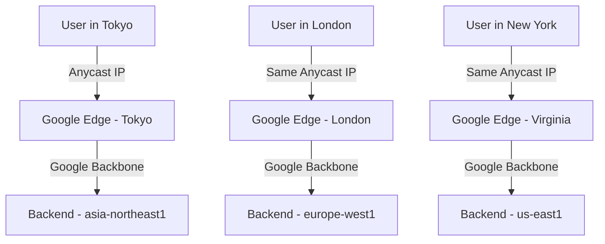

# How to Implement a Global Anycast Architecture for Low-Latency Applications on GCP

Author: [nawazdhandala](https://www.github.com/nawazdhandala)

Tags: GCP, Anycast, Global Load Balancing, Low Latency, Network Architecture

Description: Implement a global anycast architecture on Google Cloud Platform to serve users from the nearest point of presence with minimal latency.

---

When your users are spread across the globe, every millisecond of network latency matters. A user in Tokyo hitting a server in Virginia adds 150-200ms of round-trip time before your application even starts processing. Anycast routing solves this by giving you a single IP address that routes users to the nearest point of presence automatically.

Google Cloud's global load balancing is built on anycast. When you create an external HTTP(S) load balancer, you get a single anycast IP that is advertised from every Google edge location worldwide. Traffic enters Google's network at the closest edge and travels over Google's private backbone to reach your backend - which could be in any region you choose.

## How Anycast Works on GCP

Traditional unicast routing sends traffic to a single destination. Anycast advertises the same IP address from multiple locations and lets the network routing layer decide the shortest path. On GCP, this happens at Google's edge, which spans over 140 network edge locations globally.



The key advantage is that users always connect to the same IP address, but their traffic automatically takes the shortest path to your backends.

## Setting Up the Global Architecture

The architecture uses a global external HTTP(S) load balancer with backend services in multiple regions. Let's set this up step by step.

### Step 1: Deploy Regional Backends

Deploy your application in multiple regions using Managed Instance Groups or Cloud Run.

```bash
# Create instance templates in each target region
gcloud compute instance-templates create app-template-us \
  --machine-type=e2-medium \
  --image-family=debian-11 \
  --image-project=debian-cloud \
  --tags=http-server \
  --metadata=startup-script='#!/bin/bash
    apt-get update && apt-get install -y nginx
    echo "Region: us-central1" > /var/www/html/index.html
    systemctl start nginx'

# Create managed instance groups in multiple regions
gcloud compute instance-groups managed create app-mig-us \
  --template=app-template-us \
  --size=3 \
  --region=us-central1

gcloud compute instance-groups managed create app-mig-eu \
  --template=app-template-us \
  --size=3 \
  --region=europe-west1

gcloud compute instance-groups managed create app-mig-asia \
  --template=app-template-us \
  --size=3 \
  --region=asia-northeast1
```

Configure autoscaling for each instance group.

```bash
# Set up autoscaling based on CPU utilization
gcloud compute instance-groups managed set-autoscaling app-mig-us \
  --region=us-central1 \
  --max-num-replicas=10 \
  --min-num-replicas=2 \
  --target-cpu-utilization=0.7

gcloud compute instance-groups managed set-autoscaling app-mig-eu \
  --region=europe-west1 \
  --max-num-replicas=10 \
  --min-num-replicas=2 \
  --target-cpu-utilization=0.7

gcloud compute instance-groups managed set-autoscaling app-mig-asia \
  --region=asia-northeast1 \
  --max-num-replicas=10 \
  --min-num-replicas=2 \
  --target-cpu-utilization=0.7
```

### Step 2: Create Health Checks

Health checks determine which backends can receive traffic.

```bash
# Create a health check that verifies the application is responding
gcloud compute health-checks create http app-health-check \
  --port=80 \
  --request-path=/health \
  --check-interval=10s \
  --timeout=5s \
  --healthy-threshold=2 \
  --unhealthy-threshold=3
```

### Step 3: Configure the Backend Service

The backend service ties together your regional backends with health checking and load balancing policies.

```bash
# Create the backend service with locality-based load balancing
gcloud compute backend-services create app-backend-service \
  --protocol=HTTP \
  --port-name=http \
  --health-checks=app-health-check \
  --global \
  --load-balancing-scheme=EXTERNAL_MANAGED \
  --locality-lb-policy=ROUND_ROBIN

# Add each regional backend
gcloud compute backend-services add-backend app-backend-service \
  --instance-group=app-mig-us \
  --instance-group-region=us-central1 \
  --global \
  --balancing-mode=UTILIZATION \
  --max-utilization=0.8

gcloud compute backend-services add-backend app-backend-service \
  --instance-group=app-mig-eu \
  --instance-group-region=europe-west1 \
  --global \
  --balancing-mode=UTILIZATION \
  --max-utilization=0.8

gcloud compute backend-services add-backend app-backend-service \
  --instance-group=app-mig-asia \
  --instance-group-region=asia-northeast1 \
  --global \
  --balancing-mode=UTILIZATION \
  --max-utilization=0.8
```

### Step 4: Create the Global Load Balancer

Now create the frontend that exposes the anycast IP.

```bash
# Create a URL map that routes all traffic to the backend service
gcloud compute url-maps create app-url-map \
  --default-service=app-backend-service

# Create the HTTPS proxy with an SSL certificate
gcloud compute ssl-certificates create app-ssl-cert \
  --domains=app.example.com \
  --global

gcloud compute target-https-proxies create app-https-proxy \
  --url-map=app-url-map \
  --ssl-certificates=app-ssl-cert

# Reserve a global static IP - this becomes the anycast address
gcloud compute addresses create app-anycast-ip \
  --ip-version=IPV4 \
  --global

# Create the forwarding rule that ties it all together
gcloud compute forwarding-rules create app-forwarding-rule \
  --address=app-anycast-ip \
  --target-https-proxy=app-https-proxy \
  --ports=443 \
  --global
```

Get your anycast IP address.

```bash
# Retrieve the allocated anycast IP to configure DNS
gcloud compute addresses describe app-anycast-ip --global --format="get(address)"
```

## Enabling Cloud CDN

For static content and cacheable API responses, enable Cloud CDN on the backend service. This caches content at Google's edge locations, further reducing latency.

```bash
# Enable Cloud CDN on the backend service
gcloud compute backend-services update app-backend-service \
  --global \
  --enable-cdn \
  --cache-mode=CACHE_ALL_STATIC \
  --default-ttl=3600
```

## Cloud Armor for Edge Security

With a global anycast setup, you want security at the edge too. Cloud Armor lets you apply WAF rules and DDoS protection at Google's edge before traffic reaches your backends.

```bash
# Create a security policy
gcloud compute security-policies create app-security-policy

# Add rate limiting rule
gcloud compute security-policies rules create 1000 \
  --security-policy=app-security-policy \
  --action=throttle \
  --rate-limit-threshold-count=100 \
  --rate-limit-threshold-interval-sec=60 \
  --conform-action=allow \
  --exceed-action=deny-429

# Apply the policy to the backend service
gcloud compute backend-services update app-backend-service \
  --global \
  --security-policy=app-security-policy
```

## Monitoring Latency by Region

Track the latency your users experience from each region using Cloud Monitoring.

```bash
# Create a dashboard to monitor latency by region
gcloud monitoring dashboards create --config-from-file=latency-dashboard.json
```

You can also use uptime checks from multiple global locations to measure real-world latency.

```bash
# Create uptime checks from multiple regions
gcloud monitoring uptime create app-global-uptime \
  --display-name="Global App Uptime" \
  --uri="https://app.example.com/health" \
  --period=60 \
  --timeout=10
```

## Failover Behavior

One of the biggest benefits of this architecture is automatic failover. If an entire region goes down, the global load balancer detects backend failures through health checks and reroutes traffic to the next closest healthy region. Users might see a small increase in latency but no downtime.

The failover happens at two levels. First, within a region, unhealthy instances are removed from rotation. Second, if all instances in a region are unhealthy, traffic spills over to other regions based on proximity.

## Cost Considerations

Global load balancing on GCP uses Premium Tier networking, which routes traffic over Google's private backbone. This provides better latency and reliability compared to Standard Tier, which uses the public internet. The cost difference is meaningful, so consider which regions truly need Premium Tier routing and which can use Standard.

Running backends in multiple regions multiplies your compute costs. Start with your highest-traffic regions and expand based on user demand and latency requirements.

## Wrapping Up

GCP's anycast-based global load balancing gives you a single IP address that serves users worldwide from the nearest edge location. Combined with Cloud CDN for caching and Cloud Armor for security, you get a complete global delivery architecture. The automatic failover across regions means your application stays available even during regional outages, and the latency improvements from edge routing are significant for user experience. For any application with a global user base, this architecture should be one of the first things you set up on GCP.
