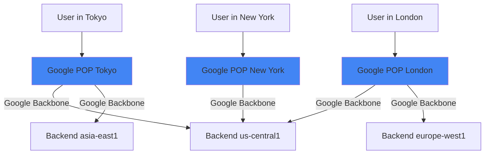

# How to Implement a Global Anycast Architecture for Low-Latency High Availability on GCP

Author: [nawazdhandala](https://www.github.com/nawazdhandala)

Tags: GCP, Anycast, Global Load Balancing, Low Latency, High Availability

Description: Learn how to implement a global anycast architecture on Google Cloud Platform to achieve low-latency, high-availability services using Google's global network infrastructure.

---

When a user in Singapore hits your API endpoint and gets routed to a server in Virginia, that is 200+ milliseconds of network latency before your application even starts processing the request. Anycast fixes this by advertising the same IP address from multiple locations globally, so the network itself routes each user to the closest point of presence.

Google Cloud's global load balancer uses anycast natively, and in this post I will show you how to build an architecture that takes full advantage of it.

## What Is Anycast and Why Does It Matter?

In traditional unicast routing, one IP address maps to one server location. With anycast, the same IP address is announced from multiple locations. When a user sends a request to that IP, BGP routing delivers it to the nearest announcement point.

Google operates one of the largest anycast networks in the world. When you create a global external IP address on GCP, that IP is advertised from every Google edge point of presence - over 200 locations worldwide. Your users' requests enter Google's network at the nearest edge, then travel over Google's private backbone to your backend, bypassing the public internet for most of the journey.



The request from Tokyo enters at the Tokyo POP and is routed to the asia-east1 backend over Google's private network. The London user goes to europe-west1. Both use the same anycast IP.

## Step 1: Reserve a Global Anycast IP

Every global anycast setup starts with a global static IP address:

```bash
# Reserve a global anycast IP address
gcloud compute addresses create my-global-ip \
  --global \
  --ip-version=IPV4

# View the assigned IP
gcloud compute addresses describe my-global-ip \
  --global \
  --format="value(address)"
```

This single IP will be reachable from every Google edge location around the world. You point your DNS A record at this IP, and you are done with the DNS side of things.

## Step 2: Deploy Backend Services Across Regions

For the anycast architecture to deliver low latency, you need backends distributed globally. Here is an example using managed instance groups across three regions:

```bash
# Create an instance template
gcloud compute instance-templates create my-app-template \
  --machine-type=e2-medium \
  --image-family=debian-11 \
  --image-project=debian-cloud \
  --metadata-from-file=startup-script=startup.sh \
  --tags=http-server

# Create managed instance groups in each region
gcloud compute instance-groups managed create my-app-mig-us \
  --template=my-app-template \
  --size=3 \
  --zone=us-central1-a

gcloud compute instance-groups managed create my-app-mig-eu \
  --template=my-app-template \
  --size=3 \
  --zone=europe-west1-b

gcloud compute instance-groups managed create my-app-mig-asia \
  --template=my-app-template \
  --size=3 \
  --zone=asia-east1-a

# Set up autoscaling for each MIG
gcloud compute instance-groups managed set-autoscaling my-app-mig-us \
  --zone=us-central1-a \
  --min-num-replicas=2 \
  --max-num-replicas=20 \
  --target-cpu-utilization=0.7

gcloud compute instance-groups managed set-autoscaling my-app-mig-eu \
  --zone=europe-west1-b \
  --min-num-replicas=2 \
  --max-num-replicas=20 \
  --target-cpu-utilization=0.7

gcloud compute instance-groups managed set-autoscaling my-app-mig-asia \
  --zone=asia-east1-a \
  --min-num-replicas=2 \
  --max-num-replicas=20 \
  --target-cpu-utilization=0.7
```

## Step 3: Configure the Global Load Balancer

Wire everything together with a global HTTP(S) load balancer. This is where the anycast magic happens - the load balancer uses your global IP and routes to the nearest healthy backend:

```bash
# Create a health check
gcloud compute health-checks create http my-app-health \
  --port=8080 \
  --request-path=/health \
  --check-interval=5s \
  --timeout=3s \
  --healthy-threshold=2 \
  --unhealthy-threshold=3

# Create a backend service with all regional backends
gcloud compute backend-services create my-app-backend \
  --protocol=HTTP \
  --port-name=http \
  --health-checks=my-app-health \
  --global

# Add each regional instance group to the backend
gcloud compute backend-services add-backend my-app-backend \
  --global \
  --instance-group=my-app-mig-us \
  --instance-group-zone=us-central1-a \
  --balancing-mode=UTILIZATION \
  --max-utilization=0.8

gcloud compute backend-services add-backend my-app-backend \
  --global \
  --instance-group=my-app-mig-eu \
  --instance-group-zone=europe-west1-b \
  --balancing-mode=UTILIZATION \
  --max-utilization=0.8

gcloud compute backend-services add-backend my-app-backend \
  --global \
  --instance-group=my-app-mig-asia \
  --instance-group-zone=asia-east1-a \
  --balancing-mode=UTILIZATION \
  --max-utilization=0.8

# Create the URL map and proxy
gcloud compute url-maps create my-app-urlmap \
  --default-service=my-app-backend

gcloud compute ssl-certificates create my-app-ssl \
  --domains=api.example.com \
  --global

gcloud compute target-https-proxies create my-app-https-proxy \
  --url-map=my-app-urlmap \
  --ssl-certificates=my-app-ssl

# Create the forwarding rule with the global anycast IP
gcloud compute forwarding-rules create my-app-rule \
  --global \
  --address=my-global-ip \
  --target-https-proxy=my-app-https-proxy \
  --ports=443
```

## Step 4: Enable Cloud CDN for Static Content

If your API serves any cacheable content, enabling Cloud CDN on your backend service adds another layer of edge caching:

```bash
# Enable Cloud CDN on the backend service
gcloud compute backend-services update my-app-backend \
  --global \
  --enable-cdn \
  --cache-mode=CACHE_ALL_STATIC \
  --default-ttl=3600 \
  --max-ttl=86400
```

This caches static responses at Google's edge POPs. A user requesting the same resource from the same edge will get it served directly from cache without the request ever reaching your backend.

## Step 5: Configure Cloud Armor for Global DDoS Protection

Your anycast IP is publicly accessible from everywhere, so DDoS protection is essential. Cloud Armor integrates directly with the global load balancer:

```bash
# Create a Cloud Armor security policy
gcloud compute security-policies create my-app-security \
  --description="Global DDoS and WAF protection"

# Add rate limiting rule
gcloud compute security-policies rules create 1000 \
  --security-policy=my-app-security \
  --action=rate-based-ban \
  --rate-limit-threshold-count=1000 \
  --rate-limit-threshold-interval-sec=60 \
  --ban-duration-sec=600 \
  --conform-action=allow \
  --exceed-action=deny-429 \
  --enforce-on-key=IP \
  --description="Rate limit per IP"

# Block known bad IPs or regions if needed
gcloud compute security-policies rules create 2000 \
  --security-policy=my-app-security \
  --action=deny-403 \
  --expression="origin.region_code == 'XX'" \
  --description="Block traffic from specific region"

# Attach the policy to the backend service
gcloud compute backend-services update my-app-backend \
  --global \
  --security-policy=my-app-security
```

## Step 6: Implement Premium Network Tier

GCP offers two network tiers: Premium and Standard. For anycast to work properly, you need Premium tier, which is the default:

```bash
# Verify you are using Premium tier (this should be the default)
gcloud compute project-info describe --format="value(defaultNetworkTier)"

# If needed, set to Premium
gcloud compute project-info update --default-network-tier=PREMIUM
```

With Premium tier, traffic enters Google's network at the edge POP closest to the user and travels over Google's private backbone. With Standard tier, traffic would use the public internet for most of the journey, negating the benefits of anycast.

## Measuring Latency Improvements

After deploying your anycast architecture, measure the actual latency improvements. Set up Cloud Monitoring uptime checks from multiple regions:

```bash
# Create uptime checks from different global regions
gcloud monitoring uptime create \
  --display-name="Global Latency Check" \
  --uri="https://api.example.com/health" \
  --http-method=GET \
  --period=60 \
  --timeout=10 \
  --regions=USA,EUROPE,SOUTH_AMERICA,ASIA_PACIFIC
```

You should also add latency reporting in your application:

```python
# middleware to log serving region and latency
import time
import os
from flask import Flask, g, request

app = Flask(__name__)

@app.before_request
def start_timer():
    """Record request start time for latency measurement."""
    g.start_time = time.time()

@app.after_request
def log_latency(response):
    """Log response latency and serving region in headers."""
    latency = time.time() - g.start_time
    region = os.environ.get('GCP_REGION', 'unknown')

    # Add headers so clients can see which region served them
    response.headers['X-Served-By-Region'] = region
    response.headers['X-Server-Latency-Ms'] = str(int(latency * 1000))

    return response
```

## Failover Behavior

One of the best things about GCP's anycast architecture is automatic failover. If a regional backend becomes unhealthy (fails health checks), the global load balancer automatically shifts traffic to the next nearest healthy region. There is no DNS propagation delay because the anycast IP stays the same - only the backend routing changes.

This means failover happens in seconds, not minutes. The user might notice a slight increase in latency as they get routed to a region farther away, but the service stays available.

## Wrapping Up

GCP's global anycast architecture gives you three major wins: low latency through nearest-edge routing, high availability through automatic failover, and DDoS protection through Cloud Armor at the edge. The key components are a global anycast IP, regional backends distributed near your users, and a global HTTP(S) load balancer tying it all together.

The setup is more involved than a single-region deployment, but for any service that needs global reach with low latency, it is the right approach. Once in place, your users get routed to the nearest healthy backend automatically, and you get a single IP address that works everywhere.
