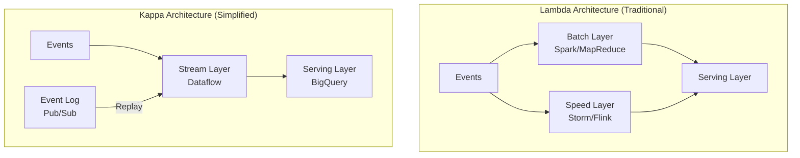

# How to Implement a Kappa Architecture for Real-Time Event Processing Using Dataflow and BigQuery

Author: [nawazdhandala](https://www.github.com/nawazdhandala)

Tags: GCP, Kappa Architecture, Dataflow, BigQuery, Pub/Sub, Stream Processing, Event-Driven

Description: Learn how to implement a Kappa architecture on Google Cloud using Dataflow for unified stream processing and BigQuery as the serving layer for real-time analytics.

---

The Lambda architecture was the standard for big data processing for years: a batch layer for accuracy and a speed layer for timeliness. It works, but maintaining two separate codepaths - one for batch and one for streaming - is painful. Bugs get fixed in one layer and not the other. Schema changes require coordinated deployments. Testing is twice the work.

The Kappa architecture simplifies this by eliminating the batch layer entirely. Everything is a stream. If you need to reprocess historical data, you replay the stream from the beginning. On GCP, Dataflow and BigQuery make this practical.

## What Is the Kappa Architecture?

The Kappa architecture, proposed by Jay Kreps (co-creator of Apache Kafka), has a simple premise: treat all data as a stream of events. There is only one processing pipeline, and it handles both real-time and historical data.



The key components are:

- **Immutable event log**: Pub/Sub retains all events. For longer retention, events are also archived to Cloud Storage.
- **Stream processing**: A single Dataflow pipeline processes all events, whether they are arriving in real time or being replayed.
- **Serving layer**: BigQuery stores the processed results and serves queries.

## Why Kappa Works Well on GCP

Several GCP features make the Kappa architecture practical:

- **Pub/Sub** supports seeking (replaying) to a timestamp, so you can reprocess events without a separate batch system
- **Dataflow** handles both streaming and batch with the same Apache Beam code
- **BigQuery** supports both streaming inserts and batch loads, and its MERGE operation handles upserts cleanly
- **Cloud Storage** provides durable long-term event archival

## Step 1: Set Up the Event Log

The event log is the source of truth in a Kappa architecture. Every event that enters the system gets written here and never modified.

```bash
# Create the event log topic with a long retention period
gcloud pubsub topics create event-log

# Create the processing subscription
gcloud pubsub subscriptions create event-processing-sub \
  --topic=event-log \
  --ack-deadline=120 \
  --retain-acked-messages \
  --message-retention-duration=7d

# Archive events to Cloud Storage for long-term retention
gcloud pubsub subscriptions create event-archive-sub \
  --topic=event-log \
  --push-endpoint=https://storage.googleapis.com/... \
  --ack-deadline=60
```

For longer retention, set up a simple pipeline that writes raw events to Cloud Storage as newline-delimited JSON files, partitioned by date:

```bash
# Create a GCS bucket for event archival
gsutil mb -l us-central1 gs://MY_PROJECT-event-archive/
```

## Step 2: Design the Event Schema

In a Kappa architecture, the event schema is critical. Events should be immutable facts about something that happened.

```json
{
  "event_id": "evt_20260217_abc123",
  "event_type": "order.placed",
  "entity_type": "order",
  "entity_id": "ord_456",
  "timestamp": "2026-02-17T14:30:00.123Z",
  "data": {
    "customer_id": "cust_789",
    "items": [
      {"product_id": "prod_001", "quantity": 2, "price": 29.99},
      {"product_id": "prod_005", "quantity": 1, "price": 49.99}
    ],
    "total": 109.97,
    "currency": "USD"
  },
  "metadata": {
    "source": "web-checkout",
    "version": "1.2"
  }
}
```

## Step 3: Build the Stream Processing Pipeline

The single pipeline handles all processing logic. It reads from Pub/Sub, transforms events, and writes to BigQuery.

```python
# kappa_pipeline.py - Unified stream processing pipeline
import apache_beam as beam
from apache_beam.options.pipeline_options import PipelineOptions, StandardOptions
from apache_beam.transforms.window import FixedWindows
import json
from datetime import datetime

class ParseEvent(beam.DoFn):
    """Parse and validate incoming events."""
    def process(self, element):
        try:
            event = json.loads(element.decode('utf-8'))

            # Every event must have these fields
            required = ['event_id', 'event_type', 'timestamp']
            if not all(f in event for f in required):
                yield beam.pvalue.TaggedOutput('invalid', element)
                return

            yield event
        except json.JSONDecodeError:
            yield beam.pvalue.TaggedOutput('invalid', element)

class RouteByEventType(beam.DoFn):
    """Route events to different processing paths based on type."""
    def process(self, event):
        event_type = event.get('event_type', '')

        if event_type.startswith('order.'):
            yield beam.pvalue.TaggedOutput('orders', event)
        elif event_type.startswith('user.'):
            yield beam.pvalue.TaggedOutput('users', event)
        elif event_type.startswith('product.'):
            yield beam.pvalue.TaggedOutput('products', event)
        else:
            # Unknown event types still get stored
            yield beam.pvalue.TaggedOutput('other', event)

class ProcessOrderEvent(beam.DoFn):
    """Transform order events into analytics-ready rows."""
    def process(self, event):
        data = event.get('data', {})
        items = data.get('items', [])

        # Create one row per order
        row = {
            'event_id': event['event_id'],
            'event_type': event['event_type'],
            'order_id': event.get('entity_id', ''),
            'customer_id': data.get('customer_id', ''),
            'total_amount': data.get('total', 0),
            'item_count': len(items),
            'currency': data.get('currency', 'USD'),
            'source': event.get('metadata', {}).get('source', ''),
            'event_timestamp': event['timestamp'],
            'processed_at': datetime.utcnow().isoformat() + 'Z',
        }
        yield row

class ArchiveToGCS(beam.DoFn):
    """Format events for Cloud Storage archival."""
    def process(self, event):
        # Each event becomes a line of newline-delimited JSON
        yield json.dumps(event)

def run():
    options = PipelineOptions()
    options.view_as(StandardOptions).streaming = True

    with beam.Pipeline(options=options) as p:
        # Read from the event log
        raw_events = (
            p
            | "ReadEventLog" >> beam.io.ReadFromPubSub(
                subscription="projects/MY_PROJECT/subscriptions/event-processing-sub"
            )
        )

        # Parse and validate
        parsed = (
            raw_events
            | "ParseEvents" >> beam.ParDo(ParseEvent())
                .with_outputs('invalid', main='valid')
        )

        # Route events by type
        routed = (
            parsed.valid
            | "RouteEvents" >> beam.ParDo(RouteByEventType())
                .with_outputs('orders', 'users', 'products', 'other')
        )

        # Process order events and write to BigQuery
        (
            routed.orders
            | "ProcessOrders" >> beam.ParDo(ProcessOrderEvent())
            | "WriteOrders" >> beam.io.WriteToBigQuery(
                table='MY_PROJECT:events.orders',
                write_disposition=beam.io.BigQueryDisposition.WRITE_APPEND,
                create_disposition=beam.io.BigQueryDisposition.CREATE_IF_NEEDED,
                schema=(
                    'event_id:STRING,event_type:STRING,order_id:STRING,'
                    'customer_id:STRING,total_amount:FLOAT,item_count:INTEGER,'
                    'currency:STRING,source:STRING,event_timestamp:TIMESTAMP,'
                    'processed_at:TIMESTAMP'
                ),
            )
        )

        # Archive all valid events to GCS for long-term storage
        (
            parsed.valid
            | "WindowForArchive" >> beam.WindowInto(FixedWindows(300))
            | "FormatForArchive" >> beam.ParDo(ArchiveToGCS())
            | "WriteArchive" >> beam.io.WriteToText(
                file_path_prefix='gs://MY_PROJECT-event-archive/events',
                file_name_suffix='.jsonl',
                shard_name_template='-SSSSS-of-NNNNN',
            )
        )

if __name__ == '__main__':
    run()
```

## Step 4: Deploy the Pipeline

```bash
# Deploy the Kappa pipeline
python kappa_pipeline.py \
  --runner=DataflowRunner \
  --project=MY_PROJECT \
  --region=us-central1 \
  --temp_location=gs://MY_BUCKET/temp/ \
  --staging_location=gs://MY_BUCKET/staging/ \
  --job_name=kappa-event-processor \
  --streaming \
  --num_workers=3 \
  --max_num_workers=15 \
  --autoscaling_algorithm=THROUGHPUT_BASED \
  --experiments=enable_streaming_engine
```

## Step 5: Handle Reprocessing

The killer feature of Kappa is reprocessing. When you update your processing logic (new business rules, bug fixes, schema changes), you replay the event log through the new pipeline version.

```bash
# Seek the subscription back to a specific timestamp to replay events
gcloud pubsub subscriptions seek event-processing-sub \
  --time=2026-02-10T00:00:00Z

# The pipeline will automatically reprocess all events from that point forward
```

For reprocessing that goes beyond Pub/Sub's retention window, read from the Cloud Storage archive:

```python
# Replay from Cloud Storage archive using batch mode
archived_events = (
    p
    | "ReadArchive" >> beam.io.ReadFromText(
        'gs://MY_PROJECT-event-archive/events-2026-01-*.jsonl'
    )
    | "ParseArchived" >> beam.Map(lambda line: json.loads(line))
)
```

The same processing DoFns work for both streaming and batch replay. That is the whole point.

## Step 6: Manage State in BigQuery

When reprocessing, you need to handle the fact that you are re-computing results that already exist. BigQuery MERGE handles this:

```sql
-- Upsert reprocessed order events
MERGE `events.orders` AS target
USING `events.orders_reprocessed` AS source
ON target.event_id = source.event_id
WHEN MATCHED THEN
  UPDATE SET
    total_amount = source.total_amount,
    item_count = source.item_count,
    processed_at = source.processed_at
WHEN NOT MATCHED THEN
  INSERT ROW
```

## When to Use Kappa vs Lambda

Kappa is not always the right choice. Consider Lambda if:

- Your batch and streaming logic are fundamentally different
- You need exact-once guarantees that streaming cannot provide
- Your event log is too large to replay in a reasonable time

Kappa works best when:

- Your processing logic is the same for batch and streaming
- You can tolerate brief inconsistencies during reprocessing
- Simplicity and maintainability are priorities

## Wrapping Up

The Kappa architecture on GCP is surprisingly practical. Pub/Sub gives you a replayable event log, Dataflow gives you unified stream/batch processing with the same code, and BigQuery serves as a flexible serving layer. The single pipeline approach means less code to maintain, fewer bugs to track down, and simpler deployments. The tradeoff is that reprocessing can be slower than a dedicated batch system, but for most use cases, that is an acceptable price for operational simplicity.
