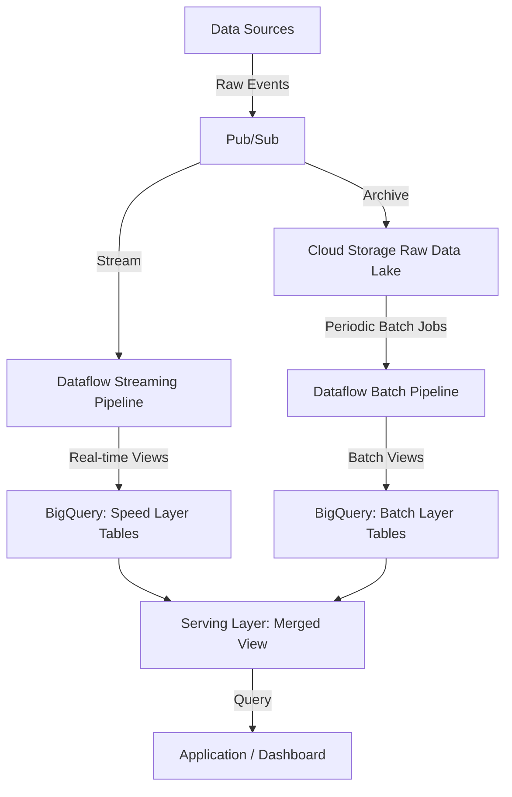

# How to Implement a Lambda Architecture on GCP Combining Batch and Streaming Layers

Author: [nawazdhandala](https://www.github.com/nawazdhandala)

Tags: GCP, Lambda Architecture, BigQuery, Dataflow, Pub/Sub, Data Engineering

Description: Implement a Lambda Architecture on Google Cloud Platform combining batch and streaming data layers for real-time and historical analytics.

---

The Lambda Architecture is a data processing pattern that combines batch and real-time streaming to provide comprehensive analytics. The core idea is simple: your batch layer gives you accurate, complete results on historical data, while your speed layer gives you approximate but immediate results on recent data. A serving layer merges both views so your application always has the freshest data available.

On GCP, this maps naturally to BigQuery for the batch layer, Dataflow for the streaming layer, and Pub/Sub as the message backbone. Let's build it out.

## Architecture Overview

The Lambda Architecture has three layers. The batch layer processes the complete dataset periodically to produce accurate views. The speed layer processes data as it arrives to produce approximate real-time views. The serving layer combines both to serve queries.



## Setting Up the Message Backbone

Pub/Sub acts as the entry point for all incoming data. Every event goes through Pub/Sub, which feeds both the streaming pipeline and the raw data archive.

```bash
# Create the main event topic
gcloud pubsub topics create raw-events

# Create subscriptions for the streaming pipeline and the archiver
gcloud pubsub subscriptions create streaming-pipeline-sub \
  --topic=raw-events \
  --ack-deadline=120

gcloud pubsub subscriptions create archive-sub \
  --topic=raw-events \
  --ack-deadline=60
```

## Archiving Raw Data to Cloud Storage

Every event needs to be persisted in its raw form. This is the foundation of the batch layer - you can always reprocess the complete history.

```python
# archive_function.py - Archive raw events to Cloud Storage
import functions_framework
import base64
import json
from google.cloud import storage
from datetime import datetime

client = storage.Client()
ARCHIVE_BUCKET = "raw-data-lake"


@functions_framework.cloud_event
def archive_event(cloud_event):
    """Archive each raw event to Cloud Storage partitioned by date and hour."""
    message_data = base64.b64decode(cloud_event.data["message"]["data"])
    event = json.loads(message_data)

    # Partition by date and hour for efficient batch processing
    now = datetime.utcnow()
    path = f"events/year={now.year}/month={now.month:02d}/day={now.day:02d}/hour={now.hour:02d}"

    # Use a unique filename to avoid collisions
    message_id = cloud_event.data["message"]["messageId"]
    blob_name = f"{path}/{message_id}.json"

    bucket = client.bucket(ARCHIVE_BUCKET)
    blob = bucket.blob(blob_name)
    blob.upload_from_string(json.dumps(event), content_type="application/json")
```

For higher throughput, use the Pub/Sub to Cloud Storage subscription feature instead of a Cloud Function.

```bash
# Create a Cloud Storage subscription for automatic archiving
gcloud pubsub subscriptions create archive-gcs-sub \
  --topic=raw-events \
  --cloud-storage-bucket=raw-data-lake \
  --cloud-storage-file-prefix=events/ \
  --cloud-storage-file-suffix=.json \
  --cloud-storage-max-duration=5m \
  --cloud-storage-max-bytes=1000000000
```

## Building the Streaming Layer with Dataflow

The streaming pipeline processes events in real-time and writes aggregated results to BigQuery's speed layer tables.

```python
# streaming_pipeline.py - Dataflow streaming pipeline
import apache_beam as beam
from apache_beam.options.pipeline_options import PipelineOptions, StandardOptions
from apache_beam.transforms.window import FixedWindows, SlidingWindows
from apache_beam.transforms.trigger import AfterWatermark, AccumulationMode
import json
import logging

logger = logging.getLogger(__name__)


class ParseEvent(beam.DoFn):
    """Parse raw JSON events from Pub/Sub."""
    def process(self, element):
        try:
            event = json.loads(element.decode("utf-8"))
            # Validate required fields
            if "event_type" in event and "timestamp" in event:
                yield event
        except json.JSONDecodeError:
            logger.warning(f"Failed to parse event: {element[:100]}")


class ComputeMetrics(beam.DoFn):
    """Compute per-window metrics from events."""
    def process(self, element):
        # element is a tuple of (key, list of events)
        key, events = element
        event_list = list(events)

        yield {
            "metric_key": key,
            "event_count": len(event_list),
            "window_start": min(e.get("timestamp", "") for e in event_list),
            "window_end": max(e.get("timestamp", "") for e in event_list),
            "unique_users": len(set(e.get("user_id", "") for e in event_list)),
        }


def run_streaming_pipeline():
    """Run the streaming pipeline that populates the speed layer."""
    options = PipelineOptions([
        "--project=YOUR_PROJECT",
        "--region=us-central1",
        "--runner=DataflowRunner",
        "--streaming",
        "--temp_location=gs://dataflow-temp-bucket/temp",
        "--staging_location=gs://dataflow-temp-bucket/staging",
    ])
    options.view_as(StandardOptions).streaming = True

    with beam.Pipeline(options=options) as p:
        # Read from Pub/Sub
        events = (
            p
            | "ReadPubSub" >> beam.io.ReadFromPubSub(
                subscription="projects/YOUR_PROJECT/subscriptions/streaming-pipeline-sub"
            )
            | "ParseEvents" >> beam.ParDo(ParseEvent())
        )

        # Window events into 5-minute fixed windows
        windowed = (
            events
            | "AddTimestamps" >> beam.Map(
                lambda e: beam.window.TimestampedValue(e, e.get("timestamp", 0))
            )
            | "Window" >> beam.WindowInto(
                FixedWindows(300),  # 5-minute windows
                trigger=AfterWatermark(),
                accumulation_mode=AccumulationMode.DISCARDING,
            )
        )

        # Aggregate by event type
        metrics = (
            windowed
            | "KeyByType" >> beam.Map(lambda e: (e.get("event_type", "unknown"), e))
            | "GroupByType" >> beam.GroupByKey()
            | "ComputeMetrics" >> beam.ParDo(ComputeMetrics())
        )

        # Write to BigQuery speed layer table
        metrics | "WriteToBQ" >> beam.io.WriteToBigQuery(
            table="YOUR_PROJECT:analytics.speed_layer_metrics",
            schema="metric_key:STRING,event_count:INTEGER,window_start:TIMESTAMP,"
                   "window_end:TIMESTAMP,unique_users:INTEGER",
            write_disposition=beam.io.BigQueryDisposition.WRITE_APPEND,
            create_disposition=beam.io.BigQueryDisposition.CREATE_IF_NEEDED,
        )


if __name__ == "__main__":
    run_streaming_pipeline()
```

## Building the Batch Layer

The batch layer runs periodically to produce accurate, complete views from the raw data archive.

```python
# batch_pipeline.py - Dataflow batch pipeline
import apache_beam as beam
from apache_beam.options.pipeline_options import PipelineOptions
import json
from datetime import datetime, timedelta


def run_batch_pipeline(process_date=None):
    """Run the batch pipeline on the complete dataset."""
    if process_date is None:
        process_date = (datetime.utcnow() - timedelta(days=1)).strftime("%Y/%m/%d")

    year, month, day = process_date.split("/")
    input_pattern = f"gs://raw-data-lake/events/year={year}/month={month}/day={day}/**/*.json"

    options = PipelineOptions([
        "--project=YOUR_PROJECT",
        "--region=us-central1",
        "--runner=DataflowRunner",
        "--temp_location=gs://dataflow-temp-bucket/temp",
    ])

    with beam.Pipeline(options=options) as p:
        events = (
            p
            | "ReadRawData" >> beam.io.ReadFromText(input_pattern)
            | "ParseJSON" >> beam.Map(json.loads)
        )

        # Compute daily aggregations with full accuracy
        daily_metrics = (
            events
            | "KeyByEventType" >> beam.Map(lambda e: (e.get("event_type"), e))
            | "GroupAll" >> beam.GroupByKey()
            | "ComputeDailyMetrics" >> beam.Map(compute_daily_metrics)
        )

        # Write to the batch layer table, replacing previous results for this date
        daily_metrics | "WriteBatchLayer" >> beam.io.WriteToBigQuery(
            table="YOUR_PROJECT:analytics.batch_layer_metrics",
            schema="date:DATE,metric_key:STRING,total_events:INTEGER,"
                   "unique_users:INTEGER,computed_at:TIMESTAMP",
            write_disposition=beam.io.BigQueryDisposition.WRITE_APPEND,
            create_disposition=beam.io.BigQueryDisposition.CREATE_IF_NEEDED,
        )


def compute_daily_metrics(element):
    """Compute accurate daily metrics from all events."""
    key, events = element
    event_list = list(events)

    return {
        "date": datetime.utcnow().strftime("%Y-%m-%d"),
        "metric_key": key,
        "total_events": len(event_list),
        "unique_users": len(set(e.get("user_id", "") for e in event_list)),
        "computed_at": datetime.utcnow().isoformat(),
    }
```

Schedule the batch pipeline to run daily.

```bash
# Schedule the batch pipeline to run daily at 6 AM
gcloud scheduler jobs create http daily-batch-pipeline \
  --location=us-central1 \
  --schedule="0 6 * * *" \
  --uri="https://dataflow.googleapis.com/v1b3/projects/YOUR_PROJECT/locations/us-central1/templates:launch" \
  --http-method=POST \
  --oauth-service-account-email=batch-sa@YOUR_PROJECT.iam.gserviceaccount.com
```

## Creating the Serving Layer

The serving layer merges batch and speed layer results using a BigQuery view.

```sql
-- serving_layer_view.sql
-- This view combines batch layer (accurate historical) with speed layer (recent real-time)
CREATE OR REPLACE VIEW `YOUR_PROJECT.analytics.serving_layer` AS

-- Batch layer provides accurate data for completed days
SELECT
  date,
  metric_key,
  total_events,
  unique_users,
  'batch' AS source
FROM `YOUR_PROJECT.analytics.batch_layer_metrics`
WHERE date < CURRENT_DATE()

UNION ALL

-- Speed layer provides real-time data for today
SELECT
  DATE(window_start) AS date,
  metric_key,
  SUM(event_count) AS total_events,
  SUM(unique_users) AS unique_users,
  'speed' AS source
FROM `YOUR_PROJECT.analytics.speed_layer_metrics`
WHERE DATE(window_start) >= CURRENT_DATE()
GROUP BY date, metric_key;
```

## Cleaning Up the Speed Layer

Once the batch layer has processed a day's data, the corresponding speed layer data is no longer needed. Schedule a cleanup job.

```sql
-- cleanup_speed_layer.sql - Run after batch processing completes
DELETE FROM `YOUR_PROJECT.analytics.speed_layer_metrics`
WHERE DATE(window_start) < CURRENT_DATE() - INTERVAL 1 DAY;
```

## Wrapping Up

The Lambda Architecture on GCP gives you the best of both worlds - real-time visibility through the streaming layer and accurate historical analysis through the batch layer. Pub/Sub provides the durable message backbone, Dataflow handles both streaming and batch processing, BigQuery stores and serves the results, and Cloud Scheduler orchestrates the periodic batch jobs. While this architecture adds complexity compared to a pure streaming approach, it remains valuable for workloads where you need both immediate insights and guaranteed accuracy over historical data.
