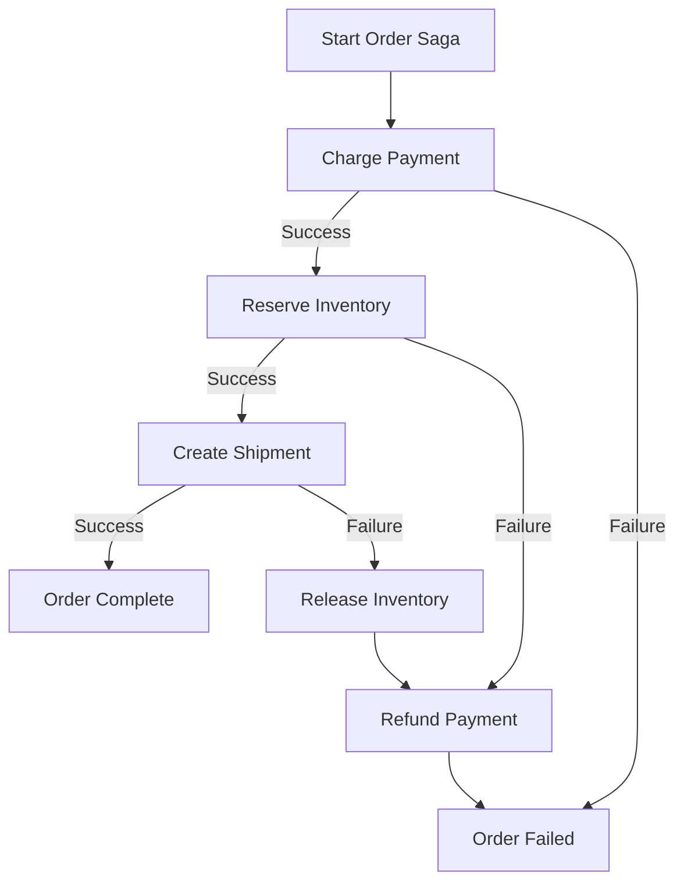

# How to Implement a Saga Pattern for Distributed Transactions Across GCP Microservices

Author: [nawazdhandala](https://www.github.com/nawazdhandala)

Tags: GCP, Microservices, Saga Pattern, Pub/Sub, Distributed Transactions, Cloud Run, Workflows

Description: Implement the saga pattern using Google Cloud Pub/Sub and Cloud Workflows to manage distributed transactions across microservices without two-phase commit on GCP.

---

When you split a monolith into microservices, you lose the ability to wrap multiple operations in a single database transaction. An order that used to be one atomic operation - charge the customer, reserve inventory, create the shipment - now spans three different services with three different databases. If the inventory reservation fails after the payment succeeds, you need a way to roll back the payment.

This is the problem the saga pattern solves. Instead of a distributed transaction, you execute a sequence of local transactions, each with a compensating action that can undo the work if a later step fails. Here is how to implement it on GCP.

## Saga Pattern Basics

There are two main flavors of the saga pattern:

**Choreography**: Each service publishes events, and other services react. There is no central coordinator. It is simple but gets hard to follow as the number of steps grows.

**Orchestration**: A central coordinator (the saga orchestrator) tells each service what to do and handles failures. It is easier to understand and debug, but adds a central component.

For most real-world use cases, I recommend orchestration. It is much easier to reason about failure scenarios. On GCP, Cloud Workflows is an excellent fit for the orchestrator.

## The Example: Order Processing Saga

Let us build a saga for processing an order with three steps:

1. **Payment Service**: Charge the customer
2. **Inventory Service**: Reserve the items
3. **Shipping Service**: Create the shipment

If any step fails, the previous steps must be compensated (reversed).



## Setting Up the Microservices

Each service runs on Cloud Run and exposes both an action endpoint and a compensation endpoint.

Here is the Payment Service:

```python
# payment_service/main.py - Handles charges and refunds
from flask import Flask, request, jsonify
from google.cloud import firestore
import uuid

app = Flask(__name__)
db = firestore.Client()

@app.route('/charge', methods=['POST'])
def charge_payment():
    """Execute the payment charge for an order."""
    data = request.json
    order_id = data['order_id']
    amount = data['amount']
    customer_id = data['customer_id']

    # Generate a unique transaction ID for idempotency
    transaction_id = str(uuid.uuid4())

    try:
        # Simulate calling a payment processor
        # In production, this would call Stripe, Braintree, etc.
        result = process_charge(customer_id, amount, transaction_id)

        # Record the transaction so we can refund it later if needed
        db.collection('transactions').document(transaction_id).set({
            'order_id': order_id,
            'customer_id': customer_id,
            'amount': amount,
            'status': 'charged',
            'created_at': firestore.SERVER_TIMESTAMP,
        })

        return jsonify({
            'status': 'success',
            'transaction_id': transaction_id,
        })

    except Exception as e:
        return jsonify({'status': 'failed', 'error': str(e)}), 400


@app.route('/refund', methods=['POST'])
def refund_payment():
    """Compensating action: refund a previous charge."""
    data = request.json
    transaction_id = data['transaction_id']

    # Fetch the original transaction
    doc = db.collection('transactions').document(transaction_id).get()
    if not doc.exists:
        return jsonify({'status': 'not_found'}), 404

    txn = doc.to_dict()
    if txn['status'] == 'refunded':
        # Already refunded - idempotent handling
        return jsonify({'status': 'already_refunded'})

    # Process the refund
    process_refund(txn['customer_id'], txn['amount'], transaction_id)

    # Update the transaction status
    db.collection('transactions').document(transaction_id).update({
        'status': 'refunded',
        'refunded_at': firestore.SERVER_TIMESTAMP,
    })

    return jsonify({'status': 'refunded'})
```

The Inventory Service follows the same pattern:

```python
# inventory_service/main.py - Handles reservations and releases
from flask import Flask, request, jsonify
from google.cloud import firestore

app = Flask(__name__)
db = firestore.Client()

@app.route('/reserve', methods=['POST'])
def reserve_inventory():
    """Reserve items for an order."""
    data = request.json
    order_id = data['order_id']
    items = data['items']  # List of {sku, quantity}

    reservation_id = f'res-{order_id}'

    try:
        # Use a Firestore transaction to atomically check and reserve
        @firestore.transactional
        def reserve_in_transaction(transaction):
            for item in items:
                sku_ref = db.collection('inventory').document(item['sku'])
                sku_doc = sku_ref.get(transaction=transaction)
                available = sku_doc.to_dict().get('available', 0)

                if available < item['quantity']:
                    raise ValueError(f'Insufficient stock for {item["sku"]}')

                transaction.update(sku_ref, {
                    'available': available - item['quantity'],
                    'reserved': firestore.Increment(item['quantity']),
                })

            # Record the reservation
            res_ref = db.collection('reservations').document(reservation_id)
            transaction.set(res_ref, {
                'order_id': order_id,
                'items': items,
                'status': 'reserved',
            })

        transaction = db.transaction()
        reserve_in_transaction(transaction)

        return jsonify({'status': 'reserved', 'reservation_id': reservation_id})

    except ValueError as e:
        return jsonify({'status': 'failed', 'error': str(e)}), 400


@app.route('/release', methods=['POST'])
def release_inventory():
    """Compensating action: release a previous reservation."""
    data = request.json
    reservation_id = data['reservation_id']

    doc = db.collection('reservations').document(reservation_id).get()
    if not doc.exists:
        return jsonify({'status': 'not_found'}), 404

    reservation = doc.to_dict()
    if reservation['status'] == 'released':
        return jsonify({'status': 'already_released'})

    # Return items to available inventory
    for item in reservation['items']:
        db.collection('inventory').document(item['sku']).update({
            'available': firestore.Increment(item['quantity']),
            'reserved': firestore.Increment(-item['quantity']),
        })

    db.collection('reservations').document(reservation_id).update({
        'status': 'released',
    })

    return jsonify({'status': 'released'})
```

## The Saga Orchestrator with Cloud Workflows

Cloud Workflows is a managed orchestration service that handles retries, error catching, and step sequencing. It is perfect for saga orchestration.

```yaml
# order-saga.yaml - Cloud Workflow that orchestrates the order saga
main:
  params: [input]
  steps:
    - init:
        assign:
          - order_id: ${input.order_id}
          - customer_id: ${input.customer_id}
          - amount: ${input.amount}
          - items: ${input.items}
          - transaction_id: ""
          - reservation_id: ""

    # Step 1: Charge payment
    - charge_payment:
        try:
          call: http.post
          args:
            url: https://payment-service-xxxxx.run.app/charge
            body:
              order_id: ${order_id}
              customer_id: ${customer_id}
              amount: ${amount}
            auth:
              type: OIDC
          result: payment_result
        except:
          as: e
          steps:
            - payment_failed:
                return:
                  status: "failed"
                  step: "payment"
                  error: ${e.message}

    - save_transaction_id:
        assign:
          - transaction_id: ${payment_result.body.transaction_id}

    # Step 2: Reserve inventory
    - reserve_inventory:
        try:
          call: http.post
          args:
            url: https://inventory-service-xxxxx.run.app/reserve
            body:
              order_id: ${order_id}
              items: ${items}
            auth:
              type: OIDC
          result: inventory_result
        except:
          as: e
          steps:
            # Compensate: refund the payment
            - compensate_payment_after_inventory:
                call: http.post
                args:
                  url: https://payment-service-xxxxx.run.app/refund
                  body:
                    transaction_id: ${transaction_id}
                  auth:
                    type: OIDC
            - inventory_failed:
                return:
                  status: "failed"
                  step: "inventory"
                  error: ${e.message}
                  compensations: ["payment_refunded"]

    - save_reservation_id:
        assign:
          - reservation_id: ${inventory_result.body.reservation_id}

    # Step 3: Create shipment
    - create_shipment:
        try:
          call: http.post
          args:
            url: https://shipping-service-xxxxx.run.app/create
            body:
              order_id: ${order_id}
              items: ${items}
            auth:
              type: OIDC
          result: shipping_result
        except:
          as: e
          steps:
            # Compensate: release inventory, then refund payment
            - compensate_inventory:
                call: http.post
                args:
                  url: https://inventory-service-xxxxx.run.app/release
                  body:
                    reservation_id: ${reservation_id}
                  auth:
                    type: OIDC
            - compensate_payment_after_shipping:
                call: http.post
                args:
                  url: https://payment-service-xxxxx.run.app/refund
                  body:
                    transaction_id: ${transaction_id}
                  auth:
                    type: OIDC
            - shipping_failed:
                return:
                  status: "failed"
                  step: "shipping"
                  error: ${e.message}
                  compensations: ["inventory_released", "payment_refunded"]

    # All steps succeeded
    - order_complete:
        return:
          status: "completed"
          order_id: ${order_id}
          transaction_id: ${transaction_id}
          reservation_id: ${reservation_id}
```

Deploy the workflow:

```bash
# Deploy the saga workflow
gcloud workflows deploy order-saga \
  --source=order-saga.yaml \
  --location=us-central1 \
  --service-account=saga-orchestrator@my-project.iam.gserviceaccount.com
```

Trigger it when a new order comes in:

```bash
# Execute the saga for a new order
gcloud workflows execute order-saga \
  --location=us-central1 \
  --data='{"order_id":"ord-123","customer_id":"cust-456","amount":99.99,"items":[{"sku":"WIDGET-A","quantity":2}]}'
```

## Making Compensations Reliable

Compensation actions must succeed. If a refund fails after an inventory release fails, you are in an inconsistent state. A few strategies help:

- **Retry with backoff**: Cloud Workflows supports automatic retries. Add retry policies to compensation steps.
- **Idempotent compensations**: Each compensation should be safe to call multiple times (as shown in the code above).
- **Dead letter tracking**: If a compensation still fails after retries, log it to a dead letter collection for manual resolution.

## Wrapping Up

The saga pattern is essential for maintaining data consistency across microservices. On GCP, Cloud Workflows provides a clean way to implement orchestration-based sagas with built-in retry handling and step coordination. The key principles are: every action needs a compensating action, compensations must be idempotent, and you need monitoring to catch cases where compensations themselves fail. Start with simple sagas and add complexity only as your service interactions demand it.
