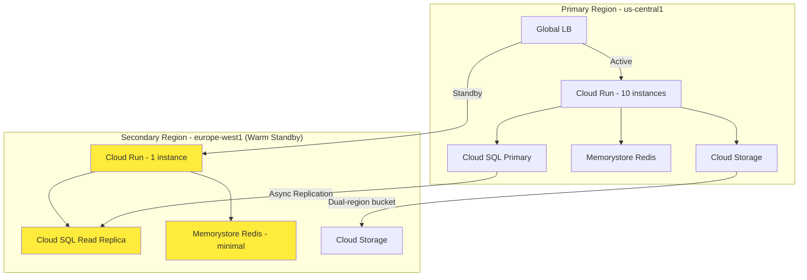

# How to Implement a Warm Standby Disaster Recovery Pattern for GCP Web Applications

Author: [nawazdhandala](https://www.github.com/nawazdhandala)

Tags: GCP, Disaster Recovery, Warm Standby, High Availability, Cloud Run, Cloud SQL

Description: Implement a warm standby disaster recovery pattern for web applications on Google Cloud with a scaled-down secondary region that can quickly take over during a primary region outage.

---

A warm standby sits between the extremes of backup-and-restore and full active-active. In a warm standby configuration, you run a scaled-down copy of your infrastructure in a secondary region. It receives data replication from the primary but does not serve production traffic. When disaster strikes, you scale it up and switch traffic over. The result is faster recovery than backup-and-restore (minutes instead of hours) without the cost of running a full second production environment.

In this post, I will walk through implementing a warm standby DR pattern for a web application on GCP, covering the infrastructure setup, data replication, traffic switching, and testing procedures.

## Architecture Overview

The primary region runs the full production workload. The secondary region runs minimal instances of each service with database replication active. During failover, the secondary scales up and receives production traffic.



## Setting Up the Primary Region

Deploy the full production infrastructure in the primary region.

```bash
# Create the primary Cloud SQL instance with HA
gcloud sql instances create primary-db \
  --database-version=POSTGRES_15 \
  --tier=db-custom-4-16384 \
  --region=us-central1 \
  --availability-type=REGIONAL \
  --enable-point-in-time-recovery

# Create a Memorystore Redis instance for caching
gcloud redis instances create primary-cache \
  --size=2 \
  --region=us-central1 \
  --redis-version=redis_7_0

# Deploy the application to Cloud Run
gcloud run deploy webapp \
  --image=gcr.io/my-project/webapp:latest \
  --region=us-central1 \
  --min-instances=2 \
  --max-instances=100 \
  --memory=1Gi \
  --set-env-vars="DB_INSTANCE=my-project:us-central1:primary-db,REDIS_HOST=10.0.0.5,REGION=us-central1"

# Use a dual-region or multi-region bucket for static assets
gcloud storage buckets create gs://my-project-assets \
  --location=nam4 \
  --uniform-bucket-level-access
```

## Setting Up the Warm Standby Region

Deploy minimal infrastructure in the secondary region.

```bash
# Create a read replica of the primary database
gcloud sql instances create standby-db \
  --master-instance-name=primary-db \
  --region=europe-west1 \
  --tier=db-custom-2-8192 \
  --availability-type=ZONAL

# Create a minimal Redis instance for the standby
gcloud redis instances create standby-cache \
  --size=1 \
  --region=europe-west1 \
  --redis-version=redis_7_0

# Deploy the application with minimum instances
gcloud run deploy webapp \
  --image=gcr.io/my-project/webapp:latest \
  --region=europe-west1 \
  --min-instances=1 \
  --max-instances=100 \
  --memory=1Gi \
  --set-env-vars="DB_INSTANCE=my-project:europe-west1:standby-db,REDIS_HOST=10.0.1.5,REGION=europe-west1,STANDBY_MODE=true"
```

## Configuring the Global Load Balancer

Set up the Global HTTP(S) Load Balancer with the primary region active and the secondary region as a backup.

```bash
# Create serverless NEGs for both regions
gcloud compute network-endpoint-groups create webapp-neg-primary \
  --region=us-central1 \
  --network-endpoint-type=serverless \
  --cloud-run-service=webapp

gcloud compute network-endpoint-groups create webapp-neg-standby \
  --region=europe-west1 \
  --network-endpoint-type=serverless \
  --cloud-run-service=webapp

# Create the backend service
gcloud compute backend-services create webapp-backend \
  --global \
  --load-balancing-scheme=EXTERNAL_MANAGED

# Add the primary backend with maximum capacity
gcloud compute backend-services add-backend webapp-backend \
  --global \
  --network-endpoint-group=webapp-neg-primary \
  --network-endpoint-group-region=us-central1 \
  --capacity-scaler=1.0

# Add the standby backend with zero capacity (will not receive traffic normally)
gcloud compute backend-services add-backend webapp-backend \
  --global \
  --network-endpoint-group=webapp-neg-standby \
  --network-endpoint-group-region=europe-west1 \
  --capacity-scaler=0.0

# Set up URL map, SSL cert, and forwarding rules
gcloud compute url-maps create webapp-urlmap --default-service=webapp-backend

gcloud compute ssl-certificates create webapp-cert \
  --domains=app.example.com --global

gcloud compute target-https-proxies create webapp-proxy \
  --ssl-certificates=webapp-cert --url-map=webapp-urlmap

gcloud compute forwarding-rules create webapp-rule \
  --global --target-https-proxy=webapp-proxy --ports=443

# Configure health checks
gcloud compute health-checks create http webapp-healthcheck \
  --port=8080 --request-path=/health \
  --check-interval=10s --timeout=5s \
  --healthy-threshold=2 --unhealthy-threshold=3

gcloud compute backend-services update webapp-backend \
  --global --health-checks=webapp-healthcheck
```

## Application Standby Mode

The application in the standby region runs in a special mode that keeps it warm but handles the read-only database gracefully.

```python
# main.py - Application with standby mode support
import os
from flask import Flask, request, jsonify
from google.cloud import firestore

app = Flask(__name__)
STANDBY_MODE = os.environ.get('STANDBY_MODE', 'false').lower() == 'true'

@app.route('/health', methods=['GET'])
def health():
    """Health check endpoint - returns healthy even in standby mode."""
    return jsonify({
        'status': 'healthy',
        'region': os.environ.get('REGION'),
        'mode': 'standby' if STANDBY_MODE else 'primary',
    }), 200

@app.route('/api/data', methods=['POST'])
def write_data():
    """Handle write requests - reject if in standby mode with read-only DB."""
    if STANDBY_MODE:
        return jsonify({
            'error': 'Service is in standby mode. Writes are not available.',
            'retry': True,
        }), 503

    # Normal write processing
    data = request.get_json()
    # ... process the write
    return jsonify({'status': 'created'}), 201

@app.route('/api/data/<data_id>', methods=['GET'])
def read_data(data_id):
    """Handle read requests - works in both primary and standby mode."""
    # Reads work fine against the replica
    # ... fetch the data
    return jsonify({'id': data_id, 'data': 'example'}), 200
```

## Failover Procedure

When the primary region fails, execute the failover.

```bash
#!/bin/bash
# failover.sh - Switch traffic to the standby region

set -e
echo "Starting failover to europe-west1..."

# Step 1: Promote the read replica to a standalone primary
echo "Promoting database replica..."
gcloud sql instances promote-replica standby-db

# Step 2: Update the Cloud Run service to disable standby mode
echo "Disabling standby mode on the application..."
gcloud run services update webapp \
  --region=europe-west1 \
  --update-env-vars="STANDBY_MODE=false,DB_INSTANCE=my-project:europe-west1:standby-db"

# Step 3: Scale up the standby region
echo "Scaling up standby region..."
gcloud run services update webapp \
  --region=europe-west1 \
  --min-instances=5

# Step 4: Switch traffic to the standby region
echo "Switching traffic..."
gcloud compute backend-services update-backend webapp-backend \
  --global \
  --network-endpoint-group=webapp-neg-standby \
  --network-endpoint-group-region=europe-west1 \
  --capacity-scaler=1.0

gcloud compute backend-services update-backend webapp-backend \
  --global \
  --network-endpoint-group=webapp-neg-primary \
  --network-endpoint-group-region=us-central1 \
  --capacity-scaler=0.0

# Step 5: Verify
echo "Verifying failover..."
curl -s https://app.example.com/health | python3 -m json.tool

echo "Failover complete!"
```

## Failback Procedure

After the primary region recovers, failback to restore normal operations.

```bash
#!/bin/bash
# failback.sh - Return traffic to the primary region

set -e
echo "Starting failback to us-central1..."

# Step 1: Recreate the primary database and restore from backup
echo "Restoring primary database..."
gcloud sql instances create primary-db-new \
  --database-version=POSTGRES_15 \
  --tier=db-custom-4-16384 \
  --region=us-central1 \
  --availability-type=REGIONAL

# Restore from the most recent backup or set up replication from the promoted standby
gcloud sql instances create primary-replica-temp \
  --master-instance-name=standby-db \
  --region=us-central1 \
  --tier=db-custom-4-16384

# Wait for replication to catch up
echo "Waiting for replication to sync..."
sleep 300  # Monitor replication lag during this period

# Step 2: Promote the new primary
gcloud sql instances promote-replica primary-replica-temp

# Step 3: Update the primary region application
gcloud run services update webapp \
  --region=us-central1 \
  --update-env-vars="DB_INSTANCE=my-project:us-central1:primary-replica-temp"

# Step 4: Gradually shift traffic back
echo "Shifting traffic back to primary..."
gcloud compute backend-services update-backend webapp-backend \
  --global \
  --network-endpoint-group=webapp-neg-primary \
  --network-endpoint-group-region=us-central1 \
  --capacity-scaler=0.5

# Wait and monitor
sleep 300

# Full cutover
gcloud compute backend-services update-backend webapp-backend \
  --global \
  --network-endpoint-group=webapp-neg-primary \
  --network-endpoint-group-region=us-central1 \
  --capacity-scaler=1.0

gcloud compute backend-services update-backend webapp-backend \
  --global \
  --network-endpoint-group=webapp-neg-standby \
  --network-endpoint-group-region=europe-west1 \
  --capacity-scaler=0.0

# Step 5: Restore standby configuration
gcloud run services update webapp \
  --region=europe-west1 \
  --min-instances=1 \
  --update-env-vars="STANDBY_MODE=true"

echo "Failback complete!"
```

## Automated Standby Health Monitoring

Continuously verify that the standby is actually ready to take over.

```python
# standby_monitor.py - Verify the warm standby is healthy
import requests
from google.cloud import sqladmin_v1beta4

def verify_standby_readiness(project_id):
    """Check all components of the warm standby are healthy."""
    checks = {}

    # Check the standby application is running
    try:
        response = requests.get('https://webapp-xxxx-europe-west1.run.app/health', timeout=10)
        checks['application'] = response.status_code == 200
    except Exception as e:
        checks['application'] = False
        checks['application_error'] = str(e)

    # Check the database replica is healthy and not too far behind
    sql_client = sqladmin_v1beta4.SqlAdminServiceClient()
    try:
        instance = sql_client.get(project=project_id, instance='standby-db')
        checks['database'] = instance.state == 'RUNNABLE'
        checks['replication_active'] = instance.replica_configuration is not None
    except Exception as e:
        checks['database'] = False
        checks['database_error'] = str(e)

    # Overall readiness
    checks['ready_for_failover'] = all([
        checks.get('application', False),
        checks.get('database', False),
    ])

    return checks
```

## Summary

A warm standby gives you a good balance between recovery speed and cost. You pay for minimal infrastructure in the secondary region during normal operations, but when you need to failover, you can be up and running in minutes instead of hours. The critical elements are maintaining data replication, keeping the standby application deployable, and testing the failover process regularly.

OneUptime plays a natural role in warm standby architectures by monitoring both regions, tracking the health of your standby components, and providing the status page that communicates outage and recovery information to your users during a failover event.
